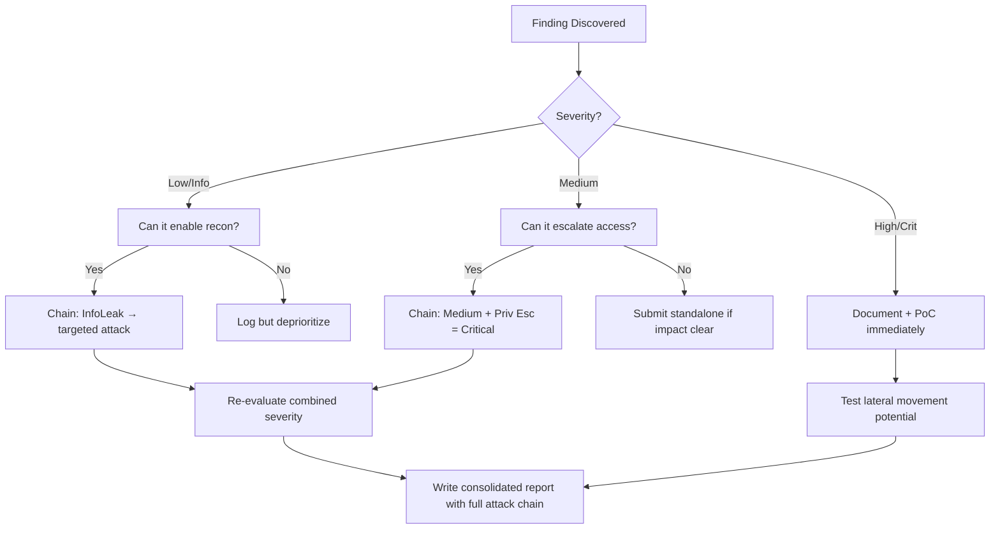

# 🏆 Elite Chaining Strategy (Top 1% Hunter Methodology)

> **Core Principle**: A single finding is a $500 report. A chained exploit is a $50,000 report.
> The top 1% of hunters spend 40+ hours on a single target, understanding it better than
> the developers who built it. They automate discovery, not exploitation.

## The "Architect" vs "Scanner" Mindset

- ❌ **Scanner Mindset**: Run nuclei on 10,000 subdomains, submit the first hit → duplicates
- ✅ **Architect Mindset**: Spend 2 weeks mapping ONE application's business logic, RBAC model,
  and integration seams → find what no scanner ever will

## Chaining Decision Tree

## Common High-Payout Chains

| Chain Pattern | Typical Bounty | Example |
|--|--|--|
| SSRF → Cloud Metadata → IAM Keys | $15,000-$50,000 | Webhook URL → AWS creds → S3 data |
| Open Redirect → OAuth Token Theft | $5,000-$15,000 | Login redirect → steal auth code |
| IDOR + GraphQL Introspection | $3,000-$10,000 | Enumerate users → access any account |
| Race Condition → Financial Impact | $10,000-$30,000 | Duplicate gift cards → unlimited funds |
| XSS → ATO via Cookie Theft | $2,000-$8,000 | Stored XSS on admin page → session hijack |
| Info Disclosure → API Key Reuse | $5,000-$20,000 | JS file → hardcoded API key → admin access |

## Key Principle: Automate Discovery, Not Exploitation

The most valuable chain doesn't come from scanning — it comes from deep understanding. Map the application's business logic, understand its authentication flows, and find the seams between components that developers overlooked.
