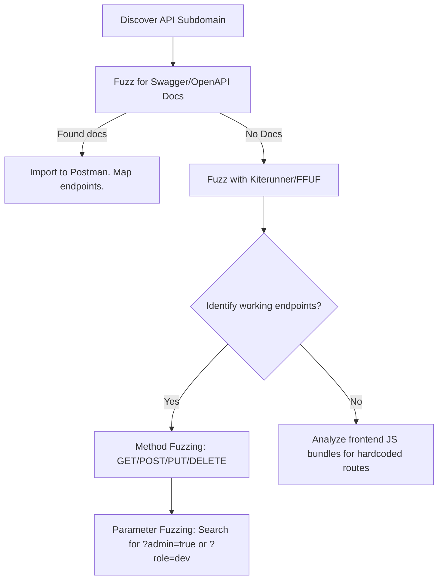

# API Enumeration & Discovery

## When to Use
- When initiating a web application pentest or bug bounty. You must find the APIs powering the frontend React/Vue apps.
- When searching for "Shadow APIs" (old `v1/` endpoints developers forgot to turn off).
- When seeking undocumented parameters (e.g., hidden `?admin=true` queries) on known endpoints.
- When trying to locate API documentation exposed accidentally (Swagger/OpenAPI).

## Workflow

### Phase 1: Passive Reconnaissance (API Spying)

```bash
# Concept: Watch the application talk to itself. Modern Single Page Applications (SPAs)
# constantly make XHR/AJAX requests to internal APIs.

# 1. Burp Suite Proxy History
# Browse the target site normally for 5 minutes. Filter Burp history for `/api/`.
# Document paths like: `api.target.com/v2/users/123/profile`

# 2. JavaScript Source Analysis (Crucial)
# Search the frontend webpack bundles for hidden API routes.
# Tool: x8 (or manually using Burp mapping)
cat subdomains.txt | waybackurls | grep "\.js" | xargs -n1 curl -s | grep -oE "api\/[a-zA-Z0-9\/_-]+"
```

### Phase 2: Active Endpoint Brute-Forcing (Fuzzing)

```bash
# Concept: Guess standard, unlinked API endpoints utilizing massive wordlists.

# 1. Brute-force directories with FFUF (using seclists/Discovery/Web-Content/api)
ffuf -w Web-Content/api/api-endpoints.txt -u https://api.target.com/v1/FUZZ -mc 200,401,403

# 2. Advanced Kiterunner Exploitation
# Kiterunner is purpose-built for API discovery, using datasets of actual Swagger routes instead of generic words.
kr scan https://api.target.com -w routes-large.kite

# 3. Find Version Downgrades (Shadow APIs)
# If `/v3/users` is secure, check `/v1/users` or `/v2/users`. Older APIs often lack modern authentication.
```

### Phase 3: Hunting for API Documentation (Swagger/OpenAPI)

```bash
# Concept: Developers on Swagger/OpenAPI to document endpoints. 
# They frequently forget to disable this in production exposing the entire attack surface.

# Fuzz for common documentation paths using FFUF:
ffuf -w swagger-wordlist.txt -u https://api.target.com/FUZZ
# Common hits:
# /api/docs
# /api/swagger/v1/swagger.json
# /openapi.yaml
# /graphql (GraphQL endpoints often support introspection, returning the whole schema)

# Action: If you find `swagger.json`, import it directly into Postman or Burp Suite.
# You now have the exact required parameters, headers, and methods for EVERY endpoint.
```

### Phase 4: Parameter & Method Fuzzing

```bash
# Concept: Identifying endpoints is half the battle. You must find undocumented "Hidden" 
# variables that trigger administrative functions.

# Endpoint identified: POST /api/v1/user/update
# Normal param: {"email": "user@test.com"}

# 1. Parameter Fuzzing via FFUF or Arjun
Arjun -u https://api.target.com/api/v1/user/update -m GET
# Result: Arjun found hidden parameter `is_admin`.

# 2. Method Fuzzing (Restful Abuse)
# If a GET requests the user, test what a PUT or DELETE does.
# A developer might leave a `DELETE /api/v1/users/500` active without authentication.

# 3. Content-Type Smuggling
# Send JSON to an endpoint expecting XML, or XML to one expecting JSON. The parser might crash, revealing stack traces.
```

#### Decision Point 🔀


## 🔵 Blue Team Detection & Defense
- **API Gateways**: Route all API traffic through centralized API Gateways (e.g., AWS API Gateway, Kong) enforcing strict rate limiting (defending against Kiterunner/FFUF brute-forcing).
- **Disable Swagger in Production**: Explicitly configure CI/CD pipelines to strip `/docs` and `swagger.json` generation endpoints from production environment builds.
- **Decommission Shadow APIs**: Ruthlessly mandate end-of-life dates for `v1/` and `v2/` APIs. Leaving heavily deprecated APIs accessible exposes systems to legacy logic flaws.

## Key Concepts
| Concept | Description |
|---------|-------------|
| Shadow API | An older, abandoned, or undocumented API endpoint that remains active on the server, often lacking modern security patches |
| Fuzzing | Automating the injection of massive amounts of invalid or unexpected data into an application to discover mapping or provoke a crash |
| Swagger/OpenAPI | A standard format (JSON or YAML) describing a REST API, mapping out all available endpoints, acceptable parameters, and expected responses |

## Output Format
```
Bug Bounty Report: Undocumented Shadow API exposure
===================================================
Vulnerability: Information Disclosure (API Documentation)
Severity: Medium (CVSS 5.3)
Target: GET /api/v1/swagger.json

Description:
The production API environment exposes its complete OpenAPI/Swagger JSON specification at `/api/v1/swagger.json`. This document provides a highly structured, comprehensive map of the entire API attack surface, including previously undocumented internal administration endpoints (e.g., `/api/v1/internal/admin/flush_cache`).

Reproduction Steps:
1. Navigate to `https://api.target.com/api/v1/swagger.json`.
2. Observe the download of the 450kb JSON specification.
3. Import this JSON into Postman.
4. The attacker now possesses exact queries and necessary parameter structures to exploit the 50 mapped backend endpoints.

Impact:
While not a direct exploit, this represents critical Information Disclosure that drastically accelerates an attacker's ability to discover High and Critical severity logical flaws such as Mass Assignment or BOLA.
```

## References
- OWASP: [API Security Top 10 - API9: Improper Inventory Management](https://owasp.org/API-Security/editions/2023/en/0x11-i9-improper-inventory-management/)
- Kiterunner: [Contextual API Discovery](https://github.com/assetnote/kiterunner)
- Arjun: [HTTP Parameter Discovery Suite](https://github.com/s0md3v/Arjun)
