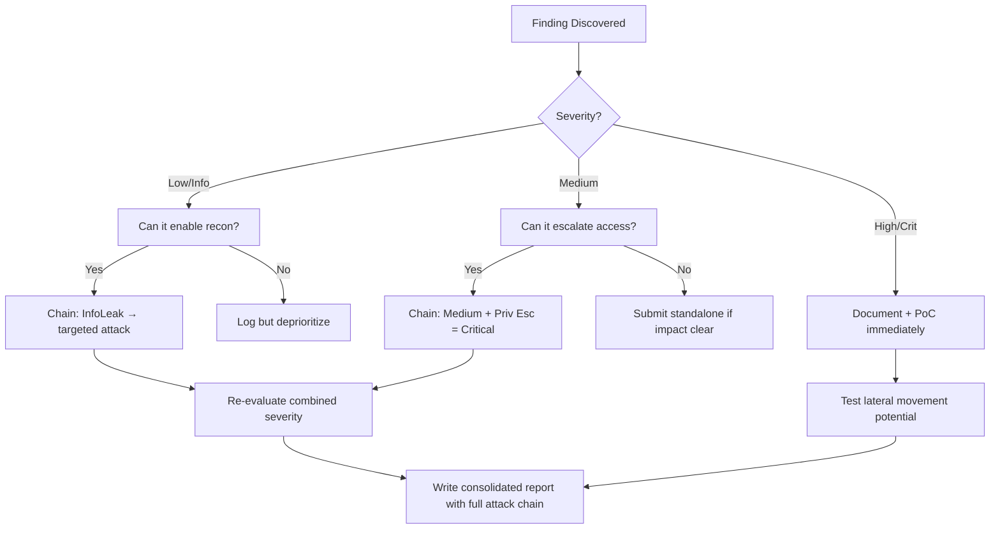

# GraphQL Introspection Abuse

## When to Use
- During the reconnaissance phase of evaluating web applications that utilize GraphQL.
- To rapidly map the API surface area without relying on brute-force directory or endpoint enumeration.
- To visualize the API schema and identify potentially vulnerable data relationships and administrative mutations.


## Prerequisites
- Authorized scope and target URLs from bug bounty program
- Burp Suite Professional (or Community) configured with browser proxy
- Familiarity with OWASP Top 10 and common web vulnerability classes
- SecLists wordlists for fuzzing and enumeration

## Workflow

### Phase 1: Identifying GraphQL Endpoints

Common endpoints include `/graphql`, `/api/graphql`, `/v1/graphql`, `/v2/graphql`, and sometimes `/gql`.

### Phase 2: Sending the Introspection Query

The standard GraphQL Introspection query requests the `__schema` field.

```json
// Concept: Request schema metadata {
  "query": "query IntrospectionQuery { __schema { queryType { name } mutationType { name } types { ...FullType } } } fragment FullType on __Type { kind name fields(includeDeprecated: true) { name args { ...InputValue } type { ...TypeRef } } } fragment InputValue on __InputValue { name type { ...TypeRef } defaultValue } fragment TypeRef on __Type { kind name ofType { kind name ofType { kind name } } }"
}
```

Send this POST request to the endpoint:
```bash
# curl -X POST -H "Content-Type: application/json" -d '{"query":"\n    query IntrospectionQuery {\n      __schema {\n        queryType { name }\n        mutationType { name }\n        subscriptionType { name }\n        types {\n          ...FullType\n        }\n      }\n    }\n\n    fragment FullType on __Type {\n      kind\n      name\n      description\n      fields(includeDeprecated: true) {\n        name\n        args {\n          ...InputValue\n        }\n      }\n    }\n    fragment InputValue on __InputValue {\n      name\n    }\n  "}' http://target.local/graphql
```

### Phase 3: Analyzing the Schema

If introspection is enabled, the server will return a massive JSON response containing the entire schema structure.
Use tools to visualize and parse this data:
- **GraphQL Voyager**: Paste the JSON response into GraphQL Voyager to graphically map the database relationships.
- **InQL (Burp Extension)**: Automatically detects introspection queries and generates a mock structure of all queries and mutations in your Repeater tab.

### Phase 4: Bypassing Disabled Introspection

If the server responds with a syntax error or "GraphQL introspection is not allowed", check for partial introspection or use dictionary attacks.
- **Field Suggestion (Clairvoyance)**: If you misspell a field, GraphQL might say `Did you mean "email"?`. Tools like `Clairvoyance` or `GraphW00f` can brute force and reconstruct the schema based on these error messages.

#### Decision Point 🔀
```mermaid
flowchart TD
    A[Discover /graphql Endpoint ] --> B{Introspection Enabled? ]}
    B -->|Yes| C[Send Full __schema Query ]
    B -->|No| D[Test Field Suggestion Errors ]
    C --> E[Map Queries/Mutations ]
    D -->|Errors exist| F[Brute-force Schema (Clairvoyance) ]
    D -->|No Errors| G[Manual Fuzzing ]
    E & F --> H[Hunt for IDOR / Logic Bugs ]
```


### 🏆 Elite Chaining Strategy (Top 1% Hunter Methodology)

> **Core Principle**: A single finding is a $500 report. A chained exploit is a $50,000 report.
> The top 1% of hunters spend 40+ hours on a single target, understanding it better than
> the developers who built it. They automate discovery, not exploitation.

**Chaining Decision Tree:**


**Common High-Payout Chains:**
| Chain Pattern | Typical Bounty | Example |
|--|--|--|
| SSRF → Cloud Metadata → IAM Keys | $15,000-$50,000 | Webhook URL → AWS creds → S3 data |
| Open Redirect → OAuth Token Theft | $5,000-$15,000 | Login redirect → steal auth code |
| IDOR + GraphQL Introspection | $3,000-$10,000 | Enumerate users → access any account |
| Race Condition → Financial Impact | $10,000-$30,000 | Duplicate gift cards → unlimited funds |
| XSS → ATO via Cookie Theft | $2,000-$8,000 | Stored XSS on admin page → session hijack |
| Info Disclosure → API Key Reuse | $5,000-$20,000 | JS file → hardcoded API key → admin access |

**The "Architect" vs "Scanner" Mindset:**
- ❌ **Scanner Mindset**: Run nuclei on 10,000 subdomains, submit the first hit → duplicates
- ✅ **Architect Mindset**: Spend 2 weeks mapping ONE application's business logic, RBAC model, 
  and integration seams → find what no scanner ever will

## 🔵 Blue Team Detection & Defense
- **Disable Introspection in Production**: **Disable Field Suggestions**: **Implement Rate Limiting and Depth Limits**: Key Concepts
| Concept | Description |
|---------|-------------|
| GQL Types | |
| Attack Surface Mapping | |


## Output Format
```
Graphql Introspection Abuse — Assessment Report
============================================================
Target: [Target identifier]
Assessor: [Operator name]
Date: [Assessment date]
Scope: [Authorized scope]
MITRE ATT&CK: [Relevant technique IDs]

Findings Summary:
  [Finding 1]: [Severity] — [Brief description]
  [Finding 2]: [Severity] — [Brief description]

Detailed Results:
  Phase 1: [Phase name]
    - Result: [Outcome]
    - Evidence: [Screenshot/log reference]
    - Impact: [Business impact assessment]

  Phase 2: [Phase name]
    - Result: [Outcome]
    - Evidence: [Screenshot/log reference]
    - Impact: [Business impact assessment]

Risk Rating: [Critical/High/Medium/Low/Informational]
Recommendations:
  1. [Immediate remediation step]
  2. [Long-term hardening measure]
  3. [Monitoring/detection improvement]
```


### 📝 Elite Report Writing (Top 1% Standard)

> **"The difference between a $500 and $50,000 report is the quality of the writeup."**
> — Vickie Li, Bug Bounty Bootcamp

**Title Format**: `[VulnType] in [Component] Allows [BusinessImpact]`
- ❌ "XSS Found" → This tells the triager nothing
- ✅ "Stored XSS in /admin/comments Allows Session Hijacking of All Moderators"

**Report Structure (HackerOne-Optimized):**
1. **Summary** (2-4 sentences — triager reads only this first): What broke, how, worst-case.
2. **CVSS 4.0 Vector** — Must be defensible; wrong CVSS destroys credibility.
3. **Attack Scenario** — 3-5 sentence narrative from attacker's perspective.
4. **Impact** — MUST include at least one real number: "Affects 4.2M users" not "affects many users".
5. **Steps to Reproduce** — Deterministic. A junior dev who has never seen this bug reproduces it exactly.
6. **PoC** — Copy-paste runnable. No placeholders. Match the exact HTTP method.
7. **Remediation** — Don't say "sanitize input." Give the exact code fix, before/after.
8. **CWE + References** — SSRF→CWE-918, IDOR→CWE-639, SQLi→CWE-89, XSS→CWE-79.

**Pre-Report Verification (5 Checks):**
1. 🔍 **Hallucination Detector** — Verify endpoints, CVEs, and code paths are real
2. 🤖 **AI Writing Pattern Check** — Remove "Certainly!", "It's worth noting", generic phrasing
3. 🧪 **PoC Reproducibility** — Payload syntax valid for context? Prerequisites stated?
4. 📋 **Duplicate Detection** — Is this a scanner-generic finding? Known public disclosure?
5. 📈 **Impact Plausibility** — Severity matches technical capability? No inflation?


## 💰 Real-World Disclosed Bounties (GraphQL)

| Company | Bounty | Researcher | Technique | Year |
|---------|--------|-----------|-----------|------|
| **Facebook/Instagram** | $30,000 | (Undisclosed) | GraphQL IDOR — brute-force media IDs → expose private content | 2023 |
| **Shopify** | $5,000 | (Undisclosed) | GraphQL `BillingDocumentDownload` — predictable invoice IDs | 2024 |
| **GitLab** | $1,160 | (Undisclosed) | GraphQL `Ml::Model` — incremental IDs → access all private ML models | 2024 |

**Key Lesson**: GraphQL APIs are consistently vulnerable to IDOR because developers expose 
introspection in production and use predictable IDs. The Facebook $30K payout proves GraphQL 
IDOR can be Critical-severity when it exposes private user content at scale.

**The GraphQL attack checklist that finds real bugs:**
```graphql
# 1. Always try introspection first
{ __schema { types { name fields { name type { name } } } } }

# 2. Look for mutations that accept user-controlled IDs
mutation { updateUser(id: "VICTIM_ID", role: "admin") { id role } }

# 3. Test batching for rate-limit bypass
[{"query": "mutation { login(email:\"a@b.com\", pass:\"pass1\") { token } }"},
 {"query": "mutation { login(email:\"a@b.com\", pass:\"pass2\") { token } }"}]
```

## 🔴 Red Team
- Extract assets and enumerate endpoints.
- Execute initial payloads leveraging documented vulnerabilities.

## References
- PortSwigger: [GraphQL API vulnerabilities](https://portswigger.net/web-security/graphql)
- GitHub: [InQL Scanner](https://github.com/doyensec/inql)
