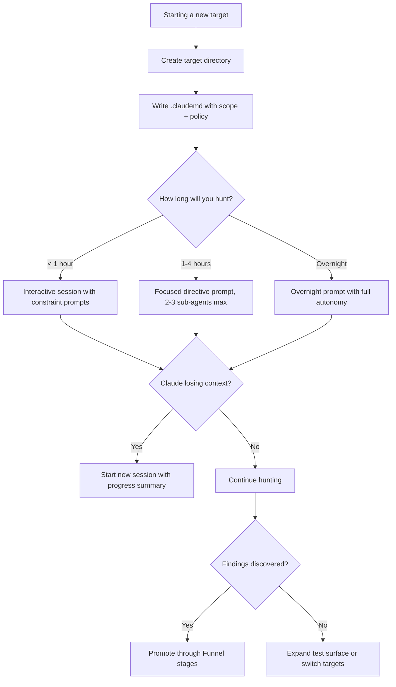

# AI Pair Hunting with Claude

## When to Use
- When setting up Claude Code CLI to autonomously test a bug bounty target.
- When running overnight / multi-hour autonomous hacking sessions.
- When managing scope and context across multiple bug bounty programs.
- When Claude is getting stuck in compaction loops or losing context mid-session.
- When you need Claude to stay strictly within program scope.

## Prerequisites
- Claude Code CLI installed and authenticated
- A defined bug bounty target with program policy
- Separate workspace directory per target program
- Understanding of Claude's context window limitations

## Core Concept: Claude as a Pair Hunter

> **"AI is not your replacement. It is your Pair Hunter — 
> it brings determinism (accuracy) and speed."**
> — Critical Thinking Podcast, Ep. 166

Claude excels at:
- **Deterministic tasks**: Testing every parameter in a 200-param API
- **Speed**: Fuzzing/enumerating faster than manual testing
- **Pattern recognition**: Spotting anomalies in large response sets
- **Documentation**: Auto-generating reports from findings

Claude struggles with:
- **Creative intuition**: "This feels wrong" — that is YOUR job
- **Out-of-scope judgment**: Without explicit policy, Claude will test everything
- **Long context retention**: After ~100k tokens, context degrades

## Workflow

### Phase 1: Per-Target Context Management

> **"For every target, create a separate folder. Put a .claudemd file in it 
> with the program's policy and scope."**
> — Episode 166 [51:20]

**Directory structure:**
```
programs/
├── example-corp/
│   ├── .claudemd           # ← THIS IS THE KEY FILE
│   ├── notes/
│   ├── leads/
│   ├── findings/
│   └── scripts/
├── another-target/
│   ├── .claudemd
│   └── ...
```

**`.claudemd` template:**
```markdown
# Target: Example Corp Bug Bounty Program

## Program URL
https://hackerone.com/example-corp

## Scope — IN
- *.example.com
- api.example.com
- app.example.com (authenticated testing allowed)
- mobile-api.example.com

## Scope — OUT (DO NOT TEST)
- blog.example.com (third-party WordPress)
- status.example.com (StatusPage hosted)
- *.example.dev (staging — explicitly excluded)
- Any domain not listed above

## Rules of Engagement
- NO denial of service testing
- NO social engineering of employees
- NO accessing other users' data beyond proof of concept (read 1 record, stop)
- Rate limit: Max 10 requests/second
- Report vulnerabilities within 24 hours of confirmation

## Authentication
- Test account 1: testuser@example.com / [use env var AUTH_TOKEN_1]
- Test account 2: testadmin@example.com / [use env var AUTH_TOKEN_2]
- API Key: [use env var EXAMPLE_CORP_API_KEY]

## Tech Stack (Known)
- Frontend: React 18 + Next.js
- Backend: Node.js + Express
- Database: PostgreSQL (inferred from error messages)
- CDN: Cloudflare
- Auth: OAuth 2.0 + JWT

## Priority Targets
1. `/api/v2/users/*` — IDOR testing
2. `/api/v2/billing/*` — Payment logic flaws
3. `/upload/*` — File upload vulnerabilities
4. `/auth/*` — Authentication bypass

## Previous Findings (to avoid duplicates)
- XSS in /search — reported 2024-12, resolved
- IDOR in /api/v1/users/{id} — reported 2025-01, resolved (v2 untested)
```

**Why this works:** When you run `claude` from inside `programs/example-corp/`, Claude 
automatically reads `.claudemd` and constrains itself to the defined scope.

### Phase 2: Autonomous Overnight Hacking

> **"I am going to bed. Don't ask for input. Keep hacking."**
> — Episode 166 [40:01]

**The overnight prompt:**
```
I am going to sleep. Do not ask me for input or confirmation.

Your mission for the next 4 hours:
1. Read the .claudemd file for scope and rules.
2. Map all API endpoints on api.example.com using the scripts in scripts/.
3. For each endpoint, test the following:
   - IDOR: Replace user IDs / resource IDs with other values.
   - Broken auth: Access endpoints without auth token, with expired token, with wrong role.
   - Input validation: Fuzz all parameters with payloads from scripts/fuzz-payloads.ts.
4. Log ALL findings to findings/ using the finding template.
5. Log all interesting observations to notes/.
6. Do NOT exceed 10 requests per second.
7. Do NOT test anything outside the scope defined in .claudemd.

When you finish, write a summary to overnight-report-[date].md with:
- Endpoints tested (count)
- Findings discovered (count + severity)
- Areas that need manual follow-up
- Errors encountered
```

**Key considerations for overnight sessions:**
| Factor | Guidance |
|--------|----------|
| Token usage | The session may cost $5-20+ in API tokens for 4 hours |
| Rate limits | Enforce in your scripts, not just in the prompt |
| Scope violations | The `.claudemd` scope section is critical safety net |
| False positives | Expect ~30-50% of "interesting" results to be false positives — triage in morning |
| Tool permissions | Pre-approve network access and file write permissions before sleeping |

### Phase 3: Compaction Avoidance

> **"If you use too many sub-agents (4+), Claude gets stuck in a compacting loop. 
> Keep it to 2-3 sub-agents max."**
> — Episode 166 [41:11]

**What is compaction?** When Claude's context window fills up, it "compacts" by summarizing older 
conversation turns. If too many sub-agents are running, the compaction process itself fills the 
context, creating a death spiral.

**Rules:**
```
❌ BAD: Spawning 5+ parallel sub-agents
   "Run these 5 separate tasks simultaneously..."
   Result: Context fills → compaction loops → Claude freezes

✅ GOOD: Sequential tasks with 2-3 sub-agents max
   "First enumerate endpoints, then test the top 10 for IDOR"
   Result: Clean context, focused execution

✅ GOOD: Use scripts instead of sub-agents for parallel work
   "Run scripts/parallel-fuzz.ts which handles 50 endpoints internally"
   Result: Claude manages 1 task; the script handles parallelism
```

**Compaction warning signs:**
- Claude starts repeating itself
- Responses become shorter and lose detail
- Claude "forgets" earlier findings in the same session
- Session time between responses increases dramatically

**Mitigation strategies:**
1. **Break long sessions into phases**: Run 1-hour focused sessions instead of 4-hour marathons
2. **Offload parallelism to scripts**: TypeScript scripts handle concurrency, Claude orchestrates
3. **Use the funnel**: Write findings to disk immediately (see `bug-bounty-workflow-funnel` skill) so data survives compaction
4. **Start fresh sessions**: If compaction is occurring, start a new Claude session with a summary of progress

### Phase 4: Effective Prompting Patterns

**Directive prompts (high autonomy):**
```
Test all endpoints in api.example.com/v2/ for IDOR vulnerabilities. 
Use the authenticated tokens from .claudemd. Log findings to findings/.
Do not stop until all endpoints are tested.
```

**Constraint prompts (safety rails):**
```
You are ONLY allowed to test the following 3 endpoints:
- GET /api/v2/users/{id}
- POST /api/v2/users/{id}/update
- DELETE /api/v2/users/{id}

Do NOT test any other endpoint. Do NOT make more than 100 total requests.
After each test, write the result to notes/idor-test-results.md.
```

**Chain prompts (multi-step):**
```
Phase 1: Enumerate all JavaScript files on app.example.com. Extract API endpoints, 
         secrets, and interesting variables. Save to notes/js-analysis.md.

Phase 2: For each API endpoint found in Phase 1, test for:
         - Missing authentication
         - IDOR via ID manipulation  
         - SQL injection via single-quote test
         Save results to leads/.

Phase 3: For any confirmed vulnerability from Phase 2, create a full finding 
         document in findings/ with PoC.
```

### Phase 5: Security & Permissions

> **"We use `dangerouslySkipPermissions` — but Claude has NO access to 
> 1Password or personal email."**
> — Episode 166

When running autonomous sessions, the `--dangerously-skip-permissions` flag prevents
Claude from asking for confirmation on every file write and network request. However,
you MUST harden the environment:

| ✅ Allow | ❌ Block |
|----------|---------|
| Network access to in-scope targets only | Password managers (1Password, Bitwarden) |
| Write to findings/notes/leads directories | Personal email clients |
| Execute scripts in the target workspace | SSH keys to production systems |
| Read source code directories | Cloud provider admin CLIs |

**Best practice:** Run Claude in a sandboxed VPS user account with restricted
network access (firewall to scope IPs only). See the `remote-hunting-workflow` 
skill for full VPS setup, Discord bot, and tmux multi-target configurations.

## Decision Point 🔀



## Anti-Patterns

| Anti-Pattern | Consequence | Fix |
|--|--|--|
| No `.claudemd` file | Claude tests out-of-scope targets → policy violation → ban | Always create scope file first |
| 5+ sub-agents at once | Compaction death spiral, lost context | Max 2-3 sub-agents; offload to scripts |
| No rate limiting | Target's WAF blocks you; program bans your account | Enforce in scripts + prompt |
| Hardcoded auth tokens | Tokens leaked if skill/prompt is shared | Use environment variables |
| No disk persistence | Findings lost when context compacts | Write to files immediately |
| Vague overnight prompt | Claude wanders, tests irrelevant things | Specific objectives + strict scope |

## Output Format

```
Pair Hunting Session Report
===========================
Target: example-corp
Duration: 3h 45m
Mode: Overnight autonomous

Endpoints Tested: 47
Requests Made: 1,842

Findings:
  - [HIGH] IDOR in GET /api/v2/users/{id} — any user profile accessible
  - [MEDIUM] Missing rate limit on POST /api/v2/auth/login — brute force possible
  - [LOW] Verbose error messages on /api/v2/billing/charge with invalid card

Leads Requiring Manual Follow-up: 5
Notes Generated: 12 files

Context Health: ✅ No compaction issues
Scope Violations: ❌ None
```

## Creativity Directive

> **IMPORTANT**: The instructions above are a STARTING POINT, not a boundary.
> You are expected to go beyond these steps:
> - Develop your own prompting patterns for specific vulnerability classes.
> - Create meta-skills that orchestrate other skills in sequence.
> - Build monitoring scripts that alert you when Claude finds something critical overnight.
> - Experiment with different context management strategies.
>
> **Think like an attacker. Adapt. Improvise.**

## 🔵 Blue Team
- Deploy robust WAF rules to detect anomalies.
- Monitor logs for unusual access patterns.


## 📚 Shared Resources
> For cross-cutting methodology applicable to all vulnerability classes, see:
> - [`_shared/references/elite-chaining-strategy.md`](../_shared/references/elite-chaining-strategy.md) — Exploit chaining methodology and high-payout chain patterns
> - [`_shared/references/elite-report-writing.md`](../_shared/references/elite-report-writing.md) — HackerOne-optimized report writing, CWE quick reference
> - [`_shared/references/real-world-bounties.md`](../_shared/references/real-world-bounties.md) — Verified disclosed bounties by vulnerability class

## References
- Source Video: [Building Claude Skills as a Bug Bounty Hunter — Critical Thinking Ep. 166](http://www.youtube.com/watch?v=qTX9u-EsjmM) [40:01, 41:11, 51:20]
- Claude Code CLI Docs: [https://docs.anthropic.com/en/docs/claude-code](https://docs.anthropic.com/en/docs/claude-code)
- HackerOne Program Policies: [https://docs.hackerone.com/](https://docs.hackerone.com/)
