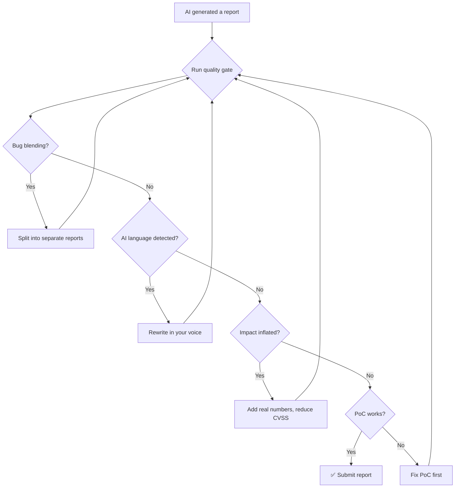

# AI Report Writing Guardrails

## When to Use
- When using Claude or any LLM to draft bug bounty vulnerability reports.
- When reviewing AI-generated reports before submission to HackerOne/Bugcrowd.
- When AI reports are getting marked as N/A, Informational, or Duplicate due to quality issues.
- When teaching Claude your personal writing style to produce better reports.

## Prerequisites
- 3-5 of your best past bug bounty reports (ones that got triaged quickly and paid well)
- Claude Code CLI configured for the target program
- Understanding of CVSS 4.0 scoring

## Core Problem: AI Reports Get You Banned

> **"AI blends 2-3 separate bugs into one report. Program managers HATE that. 
> And the threat modeling is weak — it calls a paywall bypass 'complete security degradation'."**
> — Critical Thinking Podcast, Ep. 166

### The 3 Deadly AI Report Sins

| Sin | What Happens | Example |
|-----|-------------|---------|
| **Bug Blending** | AI mixes 2-3 separate vulnerabilities into 1 report | "Found XSS, CSRF, and IDOR in the dashboard" → should be 3 separate reports |
| **Inflated Threat Model** | AI exaggerates impact beyond technical reality | Paywall bypass → "complete security degradation of all financial systems" |
| **AI Voice Detection** | Triage team recognizes LLM language and downgrades | "It's worth noting", "This vulnerability poses a significant risk", "Certainly" |

**Result:** Report gets N/A'd, your reputation score drops, you may get warned or banned.

## Workflow

### Phase 1: The Bug Blending Check

Before submitting any AI report, apply the **One Bug = One Report** rule:

```markdown
## Bug Blending Checklist
For each AI-generated report, ask:

1. How many DISTINCT attack flows are described?
   - If > 1 → SPLIT into separate reports
   
2. Does each CWE map to the same root cause?
   - Different CWEs = different reports (CWE-79 XSS ≠ CWE-352 CSRF)
   
3. Can each finding be independently reproduced?
   - If yes → separate reports
   - If chained (A enables B) → one report with clear chain

4. Remove sentences containing "Additionally", "Furthermore", "Moreover" 
   that introduce DIFFERENT vulnerability classes
```

**Before (AI Output — Bug Blended):**
```
## Vulnerability Report: Multiple Security Issues in User Dashboard

The user dashboard at /dashboard contains a stored XSS vulnerability 
via the bio field. Additionally, the same endpoint is vulnerable to 
CSRF attacks as it lacks anti-CSRF tokens. Furthermore, the API 
endpoint /api/v2/users/{id} has an IDOR vulnerability...
```

**After (Fixed — One Bug per Report):**
```
## Report 1: Stored XSS in /dashboard Bio Field Allows Session Hijack
[XSS details only — CWE-79]

## Report 2: CSRF on /dashboard/settings Enables Profile Takeover  
[CSRF details only — CWE-352]

## Report 3: IDOR in /api/v2/users/{id} Exposes All User Records
[IDOR details only — CWE-639]
```

### Phase 2: Threat Model Reality Check

AI tends to inflate impact. Run every AI report through this filter:

```markdown
## Threat Model Verification Checklist

1. ❓ "What EXACTLY can an attacker steal/modify/destroy?"
   - ❌ "Complete security degradation" → meaningless
   - ✅ "Read 4.2M user email addresses without auth" → specific

2. ❓ "What prerequisites does the attacker need?"
   - ❌ Assumes zero prerequisites → unrealistic
   - ✅ "Requires authenticated low-privilege account" → honest

3. ❓ "Is the CVSS score defensible?"
   - Test: Would you argue this score to a security engineer?
   - Common AI inflation: rating a cosmetic issue as High (7.0+)
   
4. ❓ "Does the 'Impact' section contain at LEAST one real number?"
   - ❌ "Affects many users" → useless
   - ✅ "Affects 12,847 active accounts on this endpoint" → credible

5. ❓ "Is the remediation generic or specific?"
   - ❌ "Implement proper input validation" → tells nothing
   - ✅ "Add parameterized query at line 42 of UserController.js" → actionable
```

**AI Output (inflated):**
```
Impact: This vulnerability poses a significant security risk,
potentially leading to complete compromise of the application
and its underlying infrastructure.
```

**Fixed (realistic):**
```
Impact: An unauthenticated attacker can read the email, name, 
and phone number of any registered user by incrementing the 
user ID parameter. Tested on 5 IDs — all returned data. 
Estimated affected users: ~12K based on response to ID=12847.
```

### Phase 3: Train Claude with Your Best Reports

> **"Give Claude your old best reports as examples. Tell it: strictly concise, 
> strictly technical."**
> — Episode 166

Create a report training file that Claude reads before writing:

```markdown
# .claude/report-style-guide.md

## My Report Writing Rules (Claude MUST follow these)

### Voice
- First person, active voice: "I discovered", "I tested", not "It was found"
- Zero marketing language. No "significant", "robust", "comprehensive"
- Max 3 sentences per section (Summary, Impact, Remediation)

### Structure (HackerOne format)
1. Title: [VulnType] in [Endpoint] Allows [Impact]
2. Severity: CVSS 4.0 with vector string
3. Summary: 2-3 sentences MAX
4. Steps to Reproduce: Numbered, deterministic, copy-paste
5. PoC: Working curl/script — ZERO placeholders
6. Impact: ONE paragraph with at least one real number
7. Remediation: Before/after code, not generic advice

### NEVER write:
- "It's worth noting..."
- "This vulnerability poses a significant..."
- "Certainly..."
- "In conclusion..."
- "The implications are far-reaching..."
- Any sentence > 25 words

### Example Reports (my style):
[Paste 2-3 of your best reports here for Claude to learn from]
```

**Prompt for Claude report generation:**
```
Read .claude/report-style-guide.md first.

Write a HackerOne report for the IDOR vulnerability I found in 
findings/idor-user-profiles.md.

Rules:
- ONE vulnerability per report. Do NOT blend bugs.
- Verify your CVSS score against the actual impact.
- Remove ALL AI-sounding language.
- Keep total report under 400 words.
- PoC must be a copy-paste curl command.
```

### Phase 4: Pre-Submission Quality Gate

Run every report through this automated check before hitting Submit:

```typescript
// scripts/report-quality-check.ts
#!/usr/bin/env npx tsx

import { readFileSync } from "fs";

const AI_PHRASES = [
  "it's worth noting", "it is worth noting",
  "significant risk", "significant security",
  "poses a significant", "far-reaching",
  "certainly", "furthermore", "moreover",
  "comprehensive compromise", "complete degradation",
  "robust security", "critical importance",
  "in conclusion", "to summarize",
  "it should be noted", "importantly",
];

const QUALITY_CHECKS = {
  hasSingleCWE: (text: string) => {
    const cweMatches = text.match(/CWE-\d+/g) || [];
    const uniqueCWEs = [...new Set(cweMatches)];
    return { pass: uniqueCWEs.length <= 1, detail: `Found CWEs: ${uniqueCWEs.join(", ") || "none"}` };
  },
  hasConcreteImpact: (text: string) => {
    const hasNumbers = /\d{2,}/.test(text.split("Impact")[1] || "");
    return { pass: hasNumbers, detail: hasNumbers ? "Impact has specific numbers" : "Impact lacks concrete numbers" };
  },
  noAILanguage: (text: string) => {
    const lower = text.toLowerCase();
    const found = AI_PHRASES.filter((p) => lower.includes(p));
    return { pass: found.length === 0, detail: found.length ? `AI phrases: ${found.join(", ")}` : "Clean" };
  },
  hasWorkingPoC: (text: string) => {
    const hasCurl = text.includes("curl ") || text.includes("fetch(") || text.includes("POST ");
    return { pass: hasCurl, detail: hasCurl ? "PoC command found" : "Missing executable PoC" };
  },
  noBugBlending: (text: string) => {
    const blendWords = ["additionally", "furthermore", "also discovered", "another vulnerability"];
    const lower = text.toLowerCase();
    const found = blendWords.filter((w) => lower.includes(w));
    return { pass: found.length === 0, detail: found.length ? `Possible blending: ${found.join(", ")}` : "Single focus" };
  },
};

const reportPath = process.argv[2];
if (!reportPath) { console.error("Usage: npx tsx report-quality-check.ts <report.md>"); process.exit(1); }

const content = readFileSync(reportPath, "utf-8");
console.log(`\nReport Quality Check: ${reportPath}\n${"=".repeat(50)}`);

let failures = 0;
for (const [name, check] of Object.entries(QUALITY_CHECKS)) {
  const result = check(content);
  const icon = result.pass ? "✅" : "❌";
  if (!result.pass) failures++;
  console.log(`${icon} ${name}: ${result.detail}`);
}

console.log(`\n${failures === 0 ? "✅ READY TO SUBMIT" : `❌ ${failures} issue(s) — fix before submitting`}`);
```

## Decision Point 🔀



## Creativity Directive

> **IMPORTANT**: Build a personal report template library from your
> successful submissions. Train Claude on YOUR voice, not generic templates.
> Automate the quality gate into your CI pipeline.
> **Think like an attacker. Adapt. Improvise.**

## 🔵 Blue Team
- Deploy robust WAF rules to detect anomalies.
- Monitor logs for unusual access patterns.


## 📚 Shared Resources
> For cross-cutting methodology applicable to all vulnerability classes, see:
> - [`_shared/references/elite-chaining-strategy.md`](../_shared/references/elite-chaining-strategy.md) — Exploit chaining methodology and high-payout chain patterns
> - [`_shared/references/elite-report-writing.md`](../_shared/references/elite-report-writing.md) — HackerOne-optimized report writing, CWE quick reference
> - [`_shared/references/real-world-bounties.md`](../_shared/references/real-world-bounties.md) — Verified disclosed bounties by vulnerability class

## References
- Source: [Critical Thinking Ep. 166](http://www.youtube.com/watch?v=qTX9u-EsjmM)
- HackerOne Report Guidelines: [https://docs.hackerone.com/](https://docs.hackerone.com/)
- CVSS 4.0 Calculator: [https://www.first.org/cvss/calculator/4.0](https://www.first.org/cvss/calculator/4.0)
