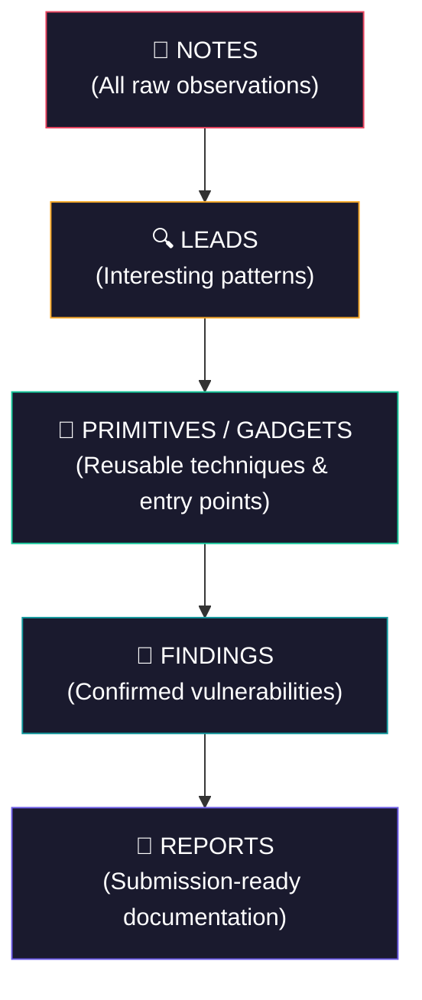

# Bug Bounty Workflow Funnel

## When to Use
- When starting a new bug bounty program and need a structured data management system.
- When drowning in raw notes and need to triage observations into actionable items.
- When preparing to convert confirmed bugs into polished submission reports.
- When working in a team and need a shared vocabulary for finding severity stages.

## Prerequisites
- A target program with defined scope (HackerOne / Bugcrowd / Intigriti / VDP)
- A note-taking system (Obsidian, Notion, plain Markdown files, or similar)
- Claude Code CLI for AI-assisted triage and report generation (optional but recommended)

## Core Concept: The 5-Stage Funnel

> **"Structure your hacking data like a sales funnel. Raw observations at the top, 
> polished reports at the bottom."**
> — Critical Thinking Podcast, Ep. 166 [37:42]



## Workflow

### Stage 1: Notes (Raw Observations)

Everything goes here. No filtering. No judgment. Write it down NOW, evaluate LATER.

**Directory structure:**
```
target-name/
├── notes/
│   ├── 2025-01-15-initial-recon.md
│   ├── 2025-01-15-auth-flow-analysis.md
│   ├── 2025-01-16-api-endpoint-mapping.md
│   └── 2025-01-16-js-source-review.md
```

**Note template:**
```markdown
# [Date] [Topic]

## Context
- Target: [subdomain/endpoint/feature]
- Tool used: [Burp/Browser DevTools/ffuf/etc]
- Time spent: [duration]

## Observations
- [Observation 1]
- [Observation 2]

## Raw Data
[Paste interesting requests/responses/code snippets here]

## Gut Feeling
- [ ] Worth investigating further
- [ ] Dead end
- [ ] Need more context
```

**What belongs in Notes:**
- HTTP request/response pairs that look unusual
- JavaScript variables or API endpoints found in source code
- Error messages, stack traces, verbose responses
- Authentication token formats observed
- Rate limit behaviour observations
- Any deviation from expected application behaviour

### Stage 2: Leads (Interesting Patterns)

Leads are notes that survived initial triage. Something here is worth deeper investigation.

**Promotion criteria (Notes → Leads):**
| Signal | Example |
|--------|---------|
| Reflected user input | Parameter value appears in response body/headers |
| Inconsistent authorization | Different responses for same endpoint with different user roles |
| Verbose error messages | Stack trace leaking framework version, file paths |
| Unprotected API endpoints | `/api/internal/` accessible without auth |
| Client-side security controls | JavaScript validation with no server-side enforcement |
| Unusual HTTP headers | `X-Debug: true`, `X-Powered-By: Express 4.17.1` |

**Lead template:**
```markdown
# LEAD: [Short Description]

## Source Note
- Link: [notes/2025-01-15-auth-flow-analysis.md]

## Hypothesis
[What vulnerability might this lead to?]

## Evidence
[Specific request/response or code snippet proving this is worth pursuing]

## Next Steps
1. [Action item 1]
2. [Action item 2]

## Priority: [HIGH / MEDIUM / LOW]
```

### Stage 3: Primitives / Gadgets (Reusable Techniques)

Primitives are common attack techniques or entry points you discover that can be reused across 
multiple targets. Think of them as building blocks for exploitation chains.

**Examples:**
| Primitive | Description | Reuse Potential |
|-----------|-------------|-----------------|
| Unsigned JWT | Application accepts `alg: none` JWTs | Any endpoint using this auth |
| GraphQL Introspection | `__schema` query returns full type system | Enumerate all mutations |
| Predictable ID sequence | User IDs are sequential integers | IDOR on any user-scoped endpoint |
| Open redirect on login | `/login?redirect=` accepts any URL | OAuth token theft chain |
| File upload → path traversal | Upload filename is used in storage path | Write to any directory |

**Primitive template:**
```markdown
# PRIMITIVE: [Technique Name]

## Description
[What is this technique and why does it work?]

## How to Detect
[Specific test to confirm this primitive exists on a target]

## Exploitation
[Step-by-step usage]

## Chain Potential
[What can this be combined with? SSRF + this = ? IDOR + this = ?]

## Seen On
- [Target 1] — [Date]
- [Target 2] — [Date]
```

### Stage 4: Findings (Confirmed Vulnerabilities)

A finding is a CONFIRMED bug with a working proof-of-concept. No speculation — only reproducible 
exploitation.

**Promotion criteria (Leads → Findings):**
- ✅ Reproducible exploit with specific steps
- ✅ Clear security impact (data leak, account takeover, RCE, etc.)
- ✅ Within program scope
- ✅ Not a known/acceptable risk documented in program policy
- ❌ NOT: "I think this might be exploitable" — that stays as a Lead

**Finding template:**
```markdown
# FINDING: [Vulnerability Type] in [Component]

## Severity: [Critical / High / Medium / Low]
## CVSS 4.0: [Score] — [Vector String]

## Summary
[2-3 sentences: what is broken, how it is exploited, worst-case impact]

## Proof of Concept
[Exact curl command / Burp request / script that reproduces the bug]

## Impact
[Specific business impact with numbers if possible]

## Root Cause
[Why does this vulnerability exist? Missing validation? Broken access control?]

## Remediation
[Specific code fix, not generic advice]

## Status: [CONFIRMED / SUBMITTED / TRIAGED / RESOLVED / DUPLICATE]
```

### Stage 5: Reports (Submission-Ready Documentation)

The final polished document submitted to the bug bounty platform. This is where money is made 
or lost.

**Report quality directly correlates with bounty amount.**

See the `elite-report-writing` skill for the full HackerOne-optimized report template.

**Quick Report Checklist:**
- [ ] Title uses format: `[VulnType] in [Component] Allows [BusinessImpact]`
- [ ] Summary is exactly 2-4 sentences
- [ ] CVSS 4.0 vector is defensible
- [ ] Steps to Reproduce are copy-paste deterministic
- [ ] PoC is a runnable script/command with zero placeholders
- [ ] Impact includes at least one real number
- [ ] Remediation gives exact code fix (before/after)
- [ ] CWE ID is correct

## Claude Integration

Use Claude to automate transitions between stages:

```
Prompt to Claude:
"Review all files in notes/ and identify any that should be promoted to leads/.
For each promotion, create a lead file with hypothesis, evidence, and priority.
Explain why each note was or was not promoted."
```

```
Prompt to Claude:
"Take the finding in findings/idor-user-profiles.md and generate a 
HackerOne-ready report in reports/. Use the elite report template. 
Validate the CVSS score against the described impact."
```

## Directory Structure for a Target

```
programs/
└── example-corp/
    ├── .claudemd           # Scope, policy, auth tokens (see ai-pair-hunting skill)
    ├── notes/              # Stage 1: Everything goes here
    ├── leads/              # Stage 2: Worth investigating
    ├── primitives/         # Stage 3: Reusable gadgets
    ├── findings/           # Stage 4: Confirmed bugs
    ├── reports/            # Stage 5: Submitted reports
    └── scripts/            # Custom automation for this target
```

## Creativity Directive

> **IMPORTANT**: The 5-stage funnel is a framework, not a cage.
> You are expected to adapt it:
> - Add sub-stages if a target is complex (e.g., Leads-High / Leads-Low).
> - Create cross-references between primitives and findings.
> - Auto-generate statistics (conversion rate: notes→findings).
> - Build a "dormant leads" watchlist for findings that need updated tool versions.
>
> **Think like an attacker. Adapt. Improvise.**

## 🔵 Blue Team
- Deploy robust WAF rules to detect anomalies.
- Monitor logs for unusual access patterns.


## 📚 Shared Resources
> For cross-cutting methodology applicable to all vulnerability classes, see:
> - [`_shared/references/elite-chaining-strategy.md`](../_shared/references/elite-chaining-strategy.md) — Exploit chaining methodology and high-payout chain patterns
> - [`_shared/references/elite-report-writing.md`](../_shared/references/elite-report-writing.md) — HackerOne-optimized report writing, CWE quick reference
> - [`_shared/references/real-world-bounties.md`](../_shared/references/real-world-bounties.md) — Verified disclosed bounties by vulnerability class

## References
- Source Video: [Building Claude Skills as a Bug Bounty Hunter — Critical Thinking Ep. 166](http://www.youtube.com/watch?v=qTX9u-EsjmM) [37:42]
- Bug Bounty Bootcamp by Vickie Li (No Starch Press)
- HackerOne Submission Guidelines: [https://docs.hackerone.com/](https://docs.hackerone.com/)
