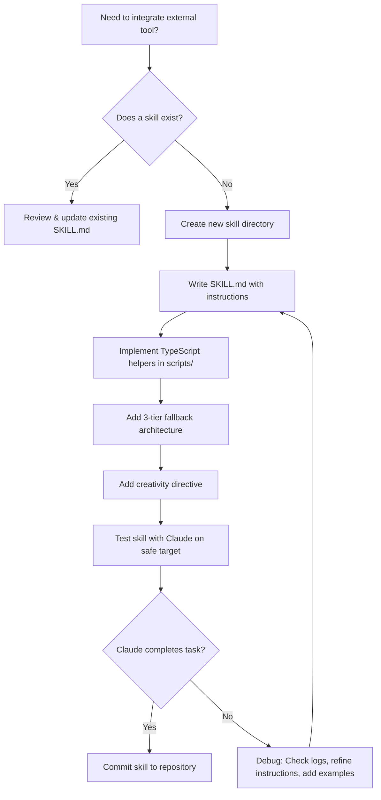

# Building Claude Skills for Bug Bounty Hunting

## When to Use
- When setting up Claude Code CLI for the first time in a bug bounty workflow.
- When creating custom skills to integrate external tools (Kaido, Burp, Nuclei) with Claude.
- When defining skill files that Claude will consume to perform autonomous security testing.
- When optimizing existing skill definitions for better agent performance and fewer hallucinations.

## Prerequisites
- Claude Code CLI installed and authenticated (`claude` command available in terminal)
- Node.js / TypeScript toolchain installed (Node 18+, `npx tsx`)
- Basic familiarity with Claude's `.claudemd` file format and skill directory structure
- Target scope defined by bug bounty program (HackerOne / Bugcrowd / Intigriti)

## Core Concept: Skills ≠ Training

> **"You are not training Claude. You are giving Claude context, prompts, and skills."**
> — Critical Thinking Podcast, Ep. 166 [09:40]

| Term | Meaning |
|------|---------|
| **Context** | Background information: target scope, program policy, authentication tokens |
| **Prompts** | Specific instructions for a task: "Find IDOR in `/api/v2/users`" |
| **Skills** | Reusable instruction sets + scripts that teach Claude how to use an external tool or execute a methodology |

Skills give Claude "powers" it does not have natively — access to your VPS, private APIs, proxies, and custom tooling.

## Workflow

### Phase 1: Skill File Structure

Every skill lives in a directory with a `SKILL.md` file and optional support scripts:

```
skills/
└── kaido-proxy/
    ├── SKILL.md          # Instructions Claude reads
    ├── scripts/
    │   ├── intercept.ts  # TypeScript helper Claude can execute
    │   └── replay.ts     # Request replay utility
    └── references/
        └── kaido-api.md  # API documentation for Kaido endpoints
```

**SKILL.md Anatomy:**
```yaml
---
name: kaido-proxy-interaction
description: >
  Intercept, modify, and replay HTTP requests through Kaido proxy.
  Use this skill when testing authenticated endpoints or fuzzing parameters.
tools: [kaido, burp-suite]
---
```

The body contains step-by-step instructions Claude follows. Be specific — Claude executes literally.

### Phase 2: Fallback Architecture (Critical)

> **"A good skill has a fallback. Try method A, if it fails try method B, 
> then fall back to a raw API call."** 
> — Episode 166 [14:44]

Every skill MUST implement a 3-tier fallback:

```typescript
// scripts/interact-with-target.ts
// Tier 1: Preferred method (fastest, most reliable)
async function primaryMethod(target: string): Promise<Result> {
  try {
    // Use the dedicated CLI tool
    const output = await execCommand(`kaido intercept --target ${target} --format json`);
    return parseKaidoOutput(output);
  } catch {
    console.warn("[FALLBACK] Primary method failed, trying secondary...");
    return secondaryMethod(target);
  }
}

// Tier 2: Flexible alternative
async function secondaryMethod(target: string): Promise<Result> {
  try {
    // Use curl with proxy settings
    const output = await execCommand(
      `curl -x http://127.0.0.1:8080 -sk "${target}" -D -`
    );
    return parseRawHTTP(output);
  } catch {
    console.warn("[FALLBACK] Secondary method failed, trying API...");
    return apiMethod(target);
  }
}

// Tier 3: Direct API call (always works if service is running)
async function apiMethod(target: string): Promise<Result> {
  const response = await fetch("http://127.0.0.1:8080/api/v1/intercept", {
    method: "POST",
    headers: { "Content-Type": "application/json" },
    body: JSON.stringify({ url: target }),
  });
  if (!response.ok) throw new Error(`API failed: ${response.status}`);
  return response.json();
}
```

**Why this matters:** Network conditions change, tools crash, APIs update. A skill with no fallback 
halts Claude entirely when one method breaks.

### Phase 3: Write Skills in TypeScript

> **"Claude is extremely good at writing TypeScript. Use .ts for your skills."**
> — Episode 166 [34:03]

**Why TypeScript over Python/Bash:**
| Factor | TypeScript | Python | Bash |
|--------|-----------|--------|------|
| Claude generation accuracy | ⭐⭐⭐⭐⭐ | ⭐⭐⭐⭐ | ⭐⭐⭐ |
| Type safety (catches errors) | ✅ Full | ⚠️ Optional | ❌ None |
| Async I/O (HTTP requests) | Native | asyncio needed | Fragile |
| Execution | `npx tsx script.ts` | `python script.py` | `bash script.sh` |

**Minimal TypeScript skill runner:**
```typescript
#!/usr/bin/env npx tsx
// scripts/fuzz-endpoint.ts

import { execSync } from "child_process";

interface FuzzResult {
  statusCode: number;
  payloadUsed: string;
  responseLength: number;
  interesting: boolean;
}

const PAYLOADS = [
  "{{constructor.constructor('return this')()}}",
  "${7*7}",
  "' OR 1=1--",
  "../../../etc/passwd",
  "%0d%0aInjected-Header: true",
];

async function fuzzParameter(baseUrl: string, paramName: string): Promise<FuzzResult[]> {
  const results: FuzzResult[] = [];

  for (const payload of PAYLOADS) {
    const url = new URL(baseUrl);
    url.searchParams.set(paramName, payload);

    try {
      const response = await fetch(url.toString(), {
        redirect: "manual",
        headers: { "User-Agent": "Mozilla/5.0 (compatible; BugBountyBot/1.0)" },
      });

      const body = await response.text();
      results.push({
        statusCode: response.status,
        payloadUsed: payload,
        responseLength: body.length,
        interesting: response.status !== 403 && body.length > 100,
      });
    } catch (error) {
      console.error(`Payload failed: ${payload} — ${error}`);
    }
  }

  return results;
}

// Entry point
const [baseUrl, paramName] = process.argv.slice(2);
if (!baseUrl || !paramName) {
  console.error("Usage: npx tsx fuzz-endpoint.ts <baseUrl> <paramName>");
  process.exit(1);
}

fuzzParameter(baseUrl, paramName).then((results) => {
  const interesting = results.filter((r) => r.interesting);
  console.log(JSON.stringify({ total: results.length, interesting }, null, 2));
});
```

### Phase 4: Creativity Directive (Do NOT Skip)

> **"Always tell the skill: Do not limit yourself to these instructions. 
> Use your creativity to find new bugs."**
> — Episode 166 [27:18]

At the end of every `SKILL.md`, include this block:

```markdown
## Creativity Directive

> **IMPORTANT**: The instructions above are a STARTING POINT, not a boundary.
> You are expected to go beyond these steps. Use your reasoning to:
> - Identify related attack surfaces not explicitly mentioned.
> - Chain findings with other vulnerabilities (SSRF → IDOR → RCE).
> - Modify payloads based on observed application behaviour.
> - Test edge cases: empty strings, negative numbers, unicode, null bytes, oversized inputs.
> - Attempt authentication bypasses if scope permits.
>
> **Think like an attacker. Adapt. Improvise.**
```

This prevents Claude from stopping after completing the scripted steps.

## Decision Point 🔀



## Anti-Patterns to Avoid

| Anti-Pattern | Why It Fails | Fix |
|--|--|--|
| Writing skills in natural language only | Claude has nothing executable to run; relies on internal knowledge which may hallucinate | Pair instructions with TypeScript scripts |
| No fallback in scripts | One broken dependency kills the entire workflow | Implement 3-tier fallback |
| Over-constraining instructions | Claude stops after step 5 even when there is more to explore | Add creativity directive |
| Python scripts for HTTP logic | Higher hallucination rate; worse async handling | Use TypeScript |
| Hardcoded credentials in skill files | Security risk; skills may be committed to public repos | Use environment variables |
| Monolithic SKILL.md (>500 lines) | Claude context window waste; slower processing | Split into focused, composable skills |

## Output Format

```
Skill Creation Report
=====================
Skill Name: kaido-proxy-interaction
Directory: skills/kaido-proxy/
Files Created:
  - SKILL.md (42 lines — instructions)
  - scripts/intercept.ts (85 lines — primary + fallback)
  - scripts/replay.ts (60 lines — request replayer)
  - references/kaido-api.md (API docs)

Fallback Tiers:
  1. kaido CLI → 2. curl via proxy → 3. Direct REST API

Creativity Directive: ✅ Included
Test Result: Claude successfully intercepted 3 requests and identified 
             1 parameter with reflected input.
```

## Creativity Directive

> **IMPORTANT**: The instructions above are a STARTING POINT, not a boundary.
> You are expected to go beyond these steps. Use your reasoning to:
> - Create skills for ANY tool in your bug bounty arsenal, not just the ones listed.
> - Build composite skills that orchestrate multiple tools in sequence.
> - Design skills that auto-generate reports from findings.
> - Invent entirely new skill patterns — there is no fixed template.
>
> **Think like an attacker. Adapt. Improvise.**

## 🔵 Blue Team
- Deploy robust WAF rules to detect anomalies.
- Monitor logs for unusual access patterns.

## 🛡️ Remediation & Mitigation Strategy
- **Input Validation:** Sanitize and strictly type-check all inputs.
- **Least Privilege:** Constrain component execution bounds.


## 📚 Shared Resources
> For cross-cutting methodology applicable to all vulnerability classes, see:
> - [`_shared/references/elite-chaining-strategy.md`](../_shared/references/elite-chaining-strategy.md) — Exploit chaining methodology and high-payout chain patterns
> - [`_shared/references/elite-report-writing.md`](../_shared/references/elite-report-writing.md) — HackerOne-optimized report writing, CWE quick reference
> - [`_shared/references/real-world-bounties.md`](../_shared/references/real-world-bounties.md) — Verified disclosed bounties by vulnerability class

## References
- Source Video: [Building Claude Skills as a Bug Bounty Hunter — Critical Thinking Ep. 166](http://www.youtube.com/watch?v=qTX9u-EsjmM)
- Claude Code CLI Docs: [https://docs.anthropic.com/en/docs/claude-code](https://docs.anthropic.com/en/docs/claude-code)
- Anthropic Skills Documentation: [https://docs.anthropic.com/en/docs/claude-code/skills](https://docs.anthropic.com/en/docs/claude-code/skills)
