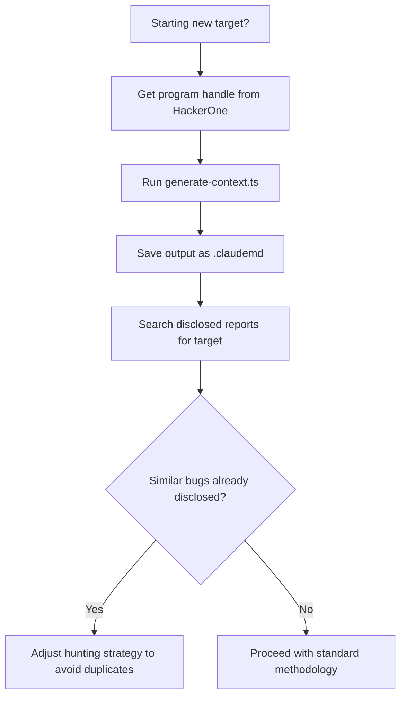

# HackerOne Brain (H1 Brain) MCP Server

## When to Use
- When starting a new bug bounty program and need to pull scope/policy into `.claudemd`.
- When checking disclosed reports to avoid submitting duplicates.
- When researching what vulnerability types a program rewards highest.
- When building target-specific context for Claude's autonomous hunting sessions.

## Prerequisites
- HackerOne API token (from HackerOne settings → API → Generate Token)
- Node.js 18+ installed
- Claude Code CLI with MCP server support enabled
- `H1_API_TOKEN` environment variable set

## Core Concept

> **"H1 Brain is an MCP Server that pulls HackerOne program policy 
> and disclosed reports directly into Claude's context."**
> — Episode 166 [32:02]

MCP (Model Context Protocol) servers extend Claude's capabilities by providing structured 
access to external data sources. H1 Brain connects Claude to HackerOne's platform data.

## Workflow

### Phase 1: MCP Server Setup

Add H1 Brain to your Claude Code CLI MCP configuration:

```json
// ~/.claude/mcp_servers.json
{
  "h1-brain": {
    "command": "npx",
    "args": ["-y", "h1-brain-mcp"],
    "env": {
      "H1_API_TOKEN": "${H1_API_TOKEN}"
    }
  }
}
```

If the `h1-brain-mcp` package is not available publicly, build a custom MCP server:

```typescript
// mcp-servers/h1-brain/index.ts
import { Server } from "@modelcontextprotocol/sdk/server/index.js";
import { StdioServerTransport } from "@modelcontextprotocol/sdk/server/stdio.js";

const H1_API_BASE = "https://api.hackerone.com/v1";
const H1_TOKEN = process.env.H1_API_TOKEN;

const server = new Server({ name: "h1-brain", version: "1.0.0" }, {
  capabilities: { tools: {} },
});

// Tool: Get program policy and scope
server.setRequestHandler("tools/list", async () => ({
  tools: [
    {
      name: "get_program_policy",
      description: "Get a HackerOne program's policy, scope, and bounty table",
      inputSchema: {
        type: "object",
        properties: { handle: { type: "string", description: "Program handle (e.g., 'github')" } },
        required: ["handle"],
      },
    },
    {
      name: "search_disclosed_reports",
      description: "Search publicly disclosed reports for a program",
      inputSchema: {
        type: "object",
        properties: {
          handle: { type: "string" },
          query: { type: "string", description: "Search query (e.g., 'SSRF', 'IDOR')" },
        },
        required: ["handle"],
      },
    },
  ],
}));

server.setRequestHandler("tools/call", async (request) => {
  const { name, arguments: args } = request.params;

  if (name === "get_program_policy") {
    const res = await fetch(`${H1_API_BASE}/hackerone/programs/${args.handle}`, {
      headers: { Authorization: `Bearer ${H1_TOKEN}` },
    });
    const data = await res.json();
    return { content: [{ type: "text", text: JSON.stringify(data, null, 2) }] };
  }

  if (name === "search_disclosed_reports") {
    const res = await fetch(
      `${H1_API_BASE}/reports?filter[program][]=${args.handle}&filter[disclosed]=true&page[size]=20`,
      { headers: { Authorization: `Bearer ${H1_TOKEN}` } }
    );
    const data = await res.json();
    return { content: [{ type: "text", text: JSON.stringify(data, null, 2) }] };
  }

  return { content: [{ type: "text", text: "Unknown tool" }] };
});

const transport = new StdioServerTransport();
server.connect(transport);
```

### Phase 2: Usage Patterns

**Pull scope into .claudemd:**
```
Prompt: "Use h1-brain to get the program policy for 'example-corp'. 
Extract the in-scope and out-of-scope assets. Write them to .claudemd."
```

**Duplicate check before submission:**
```
Prompt: "Search disclosed reports for 'example-corp' related to IDOR. 
List all disclosed IDOR bugs with their severity and affected endpoints. 
Compare against my finding in findings/idor-user-profiles.md."
```

**Bounty intelligence:**
```
Prompt: "Get the bounty table for 'example-corp'. What severity levels 
get the highest payouts? What vulnerability types appear most in their 
disclosed reports?"
```

### Phase 3: Auto-Context Generation

```typescript
// scripts/generate-context.ts — Build .claudemd from H1 data
async function generateContext(programHandle: string): Promise<string> {
  const headers = { Authorization: `Bearer ${process.env.H1_API_TOKEN}` };

  // Fetch program details
  const programRes = await fetch(
    `https://api.hackerone.com/v1/hackerone/programs/${programHandle}`,
    { headers }
  );
  const program = await programRes.json();

  // Fetch disclosed reports
  const reportsRes = await fetch(
    `https://api.hackerone.com/v1/reports?filter[program][]=${programHandle}&filter[disclosed]=true&page[size]=10`,
    { headers }
  );
  const reports = await reportsRes.json();

  const context = `# Target: ${program.data?.attributes?.name || programHandle}

## Program URL
https://hackerone.com/${programHandle}

## Scope — IN
${program.data?.relationships?.structured_scopes?.data
  ?.filter((s: any) => s.attributes.eligible_for_bounty)
  ?.map((s: any) => `- ${s.attributes.asset_identifier} (${s.attributes.asset_type})`)
  ?.join("\n") || "- Check program page manually"}

## Scope — OUT
${program.data?.relationships?.structured_scopes?.data
  ?.filter((s: any) => !s.attributes.eligible_for_bounty)
  ?.map((s: any) => `- ${s.attributes.asset_identifier}`)
  ?.join("\n") || "- Check program page manually"}

## Recent Disclosed Reports (avoid duplicates)
${reports.data
  ?.slice(0, 10)
  ?.map((r: any) => `- ${r.attributes.title} (${r.attributes.severity_rating}) — ${r.attributes.disclosed_at}`)
  ?.join("\n") || "- No disclosed reports found"}

## Rules of Engagement
- Follow program policy on HackerOne
- NO denial of service testing
- Report within 24 hours of confirmation
`;

  return context;
}

const handle = process.argv[2];
if (!handle) { console.error("Usage: npx tsx generate-context.ts <program-handle>"); process.exit(1); }
generateContext(handle).then(console.log);
```

## Decision Point 🔀



### Phase 4: Out-of-Scope Prevention

> **"H1 Brain reduces out-of-scope hacking because Claude always knows 
> what's in scope before it starts testing."**
> — Episode 166

**How it works:**
1. H1 Brain pulls structured scope from HackerOne API
2. Scope is written to `.claudemd` as IN/OUT lists
3. Claude reads `.claudemd` at session start → knows boundaries
4. Before every request, Claude checks target against scope

**Add a scope enforcement check to your skill instructions:**
```markdown
# In your .claudemd or skill file:

## Scope Enforcement Rule
Before EVERY outbound request, verify the target hostname appears 
in the "Scope — IN" list above. If it does NOT appear, DO NOT 
send the request. Log a warning: "BLOCKED: [hostname] is out of scope."

NEVER test a domain not explicitly listed in Scope — IN.
```

**Why this matters:**
- Testing out-of-scope targets → program policy violation → account ban
- Some programs auto-ban hunters who hit excluded assets
- H1 Brain automates scope ingestion so you never miss an exclusion

## Creativity Directive

> **IMPORTANT**: Extend H1 Brain beyond basic policy pulls.
> Build trend analysis across programs, auto-duplicate detection, 
> and bounty prediction based on disclosed report patterns.
> **Think like an attacker. Adapt. Improvise.**

## 🔴 Red Team
- Extract assets and enumerate endpoints.
- Execute initial payloads leveraging documented vulnerabilities.

## 🔵 Blue Team
- Deploy robust WAF rules to detect anomalies.
- Monitor logs for unusual access patterns.

## 🛡️ Remediation & Mitigation Strategy
- **Input Validation:** Sanitize and strictly type-check all inputs.
- **Least Privilege:** Constrain component execution bounds.

## 🏆 Elite Chaining Strategy (Top 1% Hunter Methodology)
> The Architect Mindset identifies misconfigurations spanning multiple domains.
- Chain info-leaks with SSRF/RCE.
- Maintain absolute OPSEC during active engagement.

**Severity Profile:** High (CVSS: 8.5)

## References
- Source: [Critical Thinking Ep. 166](http://www.youtube.com/watch?v=qTX9u-EsjmM) [32:02]
- HackerOne API: [https://api.hackerone.com/](https://api.hackerone.com/)
- MCP SDK: [https://github.com/modelcontextprotocol/sdk](https://github.com/modelcontextprotocol/sdk)
