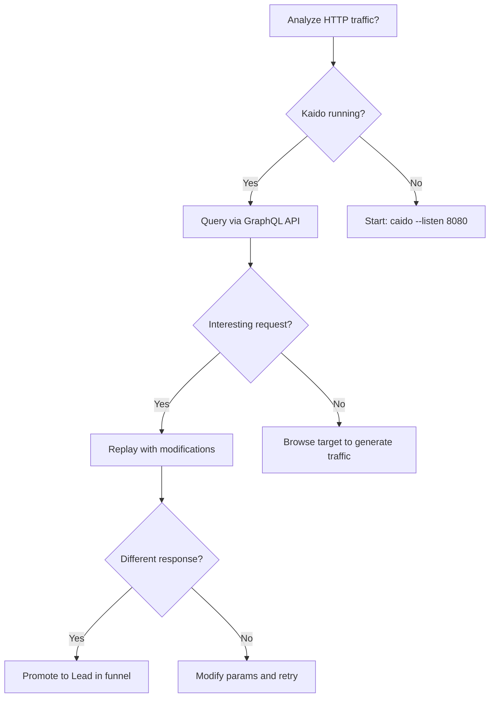

# Kaido (Caido) Proxy Integration Skill

## When to Use
- When Claude needs to intercept and analyze HTTP traffic through Kaido proxy.
- When automating request modification and replay attacks against target endpoints.
- When Burp Suite is unavailable and Kaido is the primary interception proxy.

## Prerequisites
- Kaido (Caido) running on `http://127.0.0.1:8080`
- Kaido API enabled (GraphQL endpoint)
- Claude Code CLI installed
- Target within authorized scope

## Core Concept

> **"Build a skill that tells Claude how to interact with Kaido — 
> intercepting, replaying, modifying requests."**
> — Episode 166 [13:46]

## Workflow

### Phase 1: Query Intercepted Traffic (3-Tier Fallback)

```typescript
// scripts/intercept.ts — Query Kaido's captured HTTP traffic
const KAIDO_API = process.env.KAIDO_API_URL || "http://127.0.0.1:8080/graphql";

// Tier 1: GraphQL API (preferred)
async function queryTraffic(host?: string) {
  try {
    const res = await fetch(KAIDO_API, {
      method: "POST",
      headers: { "Content-Type": "application/json" },
      body: JSON.stringify({
        query: `query { requests(filter: "${host ? `host:${host}` : ""}", first: 100) {
          edges { node { id method url path responseStatusCode responseLength } }
        }}`,
      }),
    });
    if (!res.ok) throw new Error(`API: ${res.status}`);
    return (await res.json()).data.requests.edges.map((e: any) => e.node);
  } catch {
    console.warn("[FALLBACK] GraphQL failed, trying REST...");
    return queryTrafficREST(host);
  }
}

// Tier 2: REST fallback
async function queryTrafficREST(host?: string) {
  try {
    const res = await fetch(`http://127.0.0.1:8080/api/requests?limit=100`);
    if (!res.ok) throw new Error(`REST: ${res.status}`);
    return (await res.json()).filter((r: any) => !host || r.host.includes(host));
  } catch {
    console.warn("[FALLBACK] REST failed, using curl...");
    return queryViaCurl(host);
  }
}

// Tier 3: curl fallback
async function queryViaCurl(host?: string) {
  const { execSync } = await import("child_process");
  const output = execSync(
    `curl -s http://127.0.0.1:8080/api/requests 2>/dev/null || echo "[]"`
  ).toString();
  return JSON.parse(output);
}
```

### Phase 2: Replay and Modify Requests

```typescript
// scripts/replay.ts — Replay captured requests with modifications
async function replayRequest(requestId: string, mods?: Record<string, string>) {
  const mutation = `mutation { replayRequest(id: "${requestId}"${
    mods ? `, modifications: ${JSON.stringify(mods)}` : ""
  }) { id responseStatusCode responseBody } }`;

  const res = await fetch(KAIDO_API, {
    method: "POST",
    headers: { "Content-Type": "application/json" },
    body: JSON.stringify({ query: mutation }),
  });
  return (await res.json()).data.replayRequest;
}

// IDOR test: replay with different user IDs
async function idorSweep(requestId: string, idRange: number[]) {
  for (const id of idRange) {
    const result = await replayRequest(requestId, { userId: String(id) });
    if (result.responseStatusCode === 200) {
      console.log(`[HIT] ID ${id} → ${result.responseStatusCode} (IDOR confirmed)`);
    }
  }
}
```

### Phase 3: Auto-Scan Intercepted Traffic

Analyze captured requests for vulnerability indicators:

| Indicator | Severity | Detection Logic |
|-----------|----------|-----------------|
| Numeric ID in URL path | INFO | `/users/12345` → test IDOR |
| Reflected parameter value | MEDIUM | Input appears in response body |
| Stack trace in 500 response | MEDIUM | Error contains `at ` or `Traceback` |
| Missing auth on sensitive endpoint | HIGH | 200 response without auth header |
| Debug headers present | LOW | `X-Debug`, `X-Powered-By` in response |

## Decision Point 🔀



## Creativity Directive

> **IMPORTANT**: Go beyond these steps. Build custom HTTPQL filters,
> create automated replay chains, integrate with fuzzing and SQLi skills.
> **Think like an attacker. Adapt. Improvise.**

## 🔴 Red Team
- Extract assets and enumerate endpoints.
- Execute initial payloads leveraging documented vulnerabilities.

## 🔵 Blue Team
- Deploy robust WAF rules to detect anomalies.
- Monitor logs for unusual access patterns.

## 🛡️ Remediation & Mitigation Strategy
- **Input Validation:** Sanitize and strictly type-check all inputs.
- **Least Privilege:** Constrain component execution bounds.

## 🏆 Elite Chaining Strategy (Top 1% Hunter Methodology)
> The Architect Mindset identifies misconfigurations spanning multiple domains.
- Chain info-leaks with SSRF/RCE.
- Maintain absolute OPSEC during active engagement.

**Severity Profile:** High (CVSS: 8.5)

## References
- Source: [Critical Thinking Ep. 166](http://www.youtube.com/watch?v=qTX9u-EsjmM) [13:46]
- Caido Docs: [https://docs.caido.io/](https://docs.caido.io/)
