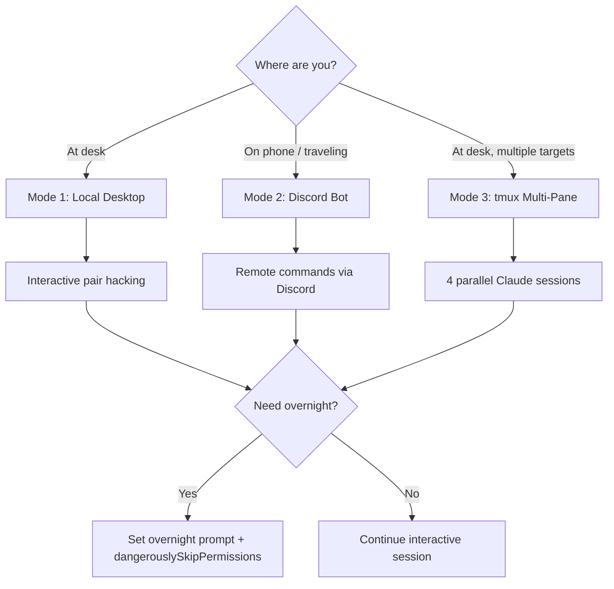

# Remote Hunting Workflow

## When to Use
- When you need to control Claude hunting sessions from mobile or remote locations.
- When testing multiple targets simultaneously and need organized workspace management.
- When setting up a VPS as a persistent hunting environment that runs 24/7.
- When configuring `dangerouslySkipPermissions` safely without exposing sensitive data.

## Prerequisites
- Claude Code CLI installed on local machine or VPS
- For Discord: Discord account + bot token + server with private channels
- For tmux: SSH access to VPS + tmux installed
- Understanding of Claude permission model

## Core Concept: 3 Modes of Hunting

> **The video describes 3 ways to use Claude Code CLI for hunting, each with 
> different trade-offs for control, mobility, and parallelism.**
> — Episode 166

| Mode | Usage | Best For |
|------|-------|----------|
| **Local Desktop (50%)** | iTerm / Windows Terminal | Interactive pair hacking sessions |
| **Discord Bot** | Send commands from phone → VPS executes | Remote control from anywhere |
| **tmux Multi-Pane** | 4 panes × 4 targets | Parallel multi-target hunting |

## Workflow

### Mode 1: Local Desktop (Primary — 50% usage)

The simplest setup. Run Claude Code CLI in your terminal alongside your browser and Burp/Kaido.

```
Terminal Layout:
┌─────────────────────┬─────────────────────┐
│                     │                     │
│   Claude Code CLI   │   Burp Suite /      │
│   (main session)    │   Kaido Proxy       │
│                     │                     │
├─────────────────────┴─────────────────────┤
│                                           │
│   Browser (target application)            │
│                                           │
└───────────────────────────────────────────┘
```

**Workflow:**
1. Browse target in browser → traffic flows through proxy
2. Spot interesting behavior → describe to Claude in CLI
3. Claude writes scripts, tests endpoints, logs findings
4. You review Claude's work, provide creative direction

### Mode 2: Discord Bot for Remote Hunting

Set up a Discord bot on your VPS that wraps Claude Code CLI. Send hacking commands from your phone.

```typescript
// discord-claude-bot/index.ts
#!/usr/bin/env npx tsx

import { Client, GatewayIntentBits, Message } from "discord.js";
import { execSync, spawn } from "child_process";

const DISCORD_TOKEN = process.env.DISCORD_BOT_TOKEN!;
const ALLOWED_USER_IDS = (process.env.ALLOWED_USERS || "").split(",");
const ALLOWED_CHANNEL_IDS = (process.env.ALLOWED_CHANNELS || "").split(",");
const MAX_OUTPUT_LENGTH = 1900; // Discord message limit

const client = new Client({
  intents: [
    GatewayIntentBits.Guilds,
    GatewayIntentBits.GuildMessages,
    GatewayIntentBits.MessageContent,
  ],
});

client.on("messageCreate", async (message: Message) => {
  // Security: Only respond to authorized users in authorized channels
  if (message.author.bot) return;
  if (!ALLOWED_USER_IDS.includes(message.author.id)) return;
  if (!ALLOWED_CHANNEL_IDS.includes(message.channel.id)) return;

  const content = message.content.trim();
  if (!content.startsWith("!hunt")) return;

  const command = content.replace("!hunt ", "").trim();
  
  // Security: Block dangerous commands
  const BLOCKED = ["rm -rf", "mkfs", "dd if=", "> /dev/", "passwd", "sudo"];
  if (BLOCKED.some((b) => command.toLowerCase().includes(b))) {
    await message.reply("⛔ Blocked: destructive command detected.");
    return;
  }

  await message.reply(`🔄 Executing: \`${command.substring(0, 100)}\``);

  try {
    // Run Claude CLI with the command
    const output = execSync(
      `claude --print "${command.replace(/"/g, '\\"')}"`,
      { timeout: 120_000, maxBuffer: 5 * 1024 * 1024, cwd: process.env.HUNT_DIR || "/home/hunter/targets" }
    ).toString();

    // Truncate output for Discord
    const truncated = output.length > MAX_OUTPUT_LENGTH
      ? output.substring(0, MAX_OUTPUT_LENGTH) + "\n... (truncated)"
      : output;

    await message.reply(`\`\`\`\n${truncated}\n\`\`\``);
  } catch (error: any) {
    await message.reply(`❌ Error: ${error.message?.substring(0, 500) || "Unknown error"}`);
  }
});

client.login(DISCORD_TOKEN);
console.log("🤖 Discord Claude Bot running...");
```

**Setup steps:**
1. Create Discord bot at [discord.dev](https://discord.com/developers/applications)
2. Create a private server with channel `#hunting`
3. Set environment variables on VPS:
   ```bash
   export DISCORD_BOT_TOKEN="your-bot-token"
   export ALLOWED_USERS="your-discord-user-id"
   export ALLOWED_CHANNELS="hunting-channel-id"
   export HUNT_DIR="/home/hunter/targets/current-target"
   ```
4. Run with: `npx tsx discord-claude-bot/index.ts`

**Usage from phone:**
```
!hunt check findings/ for any new files in the last hour
!hunt test /api/v2/users/999 for IDOR — compare response with user 1
!hunt what's the status of overnight scan?
!hunt summarize all leads discovered today
```

### Mode 3: tmux Multi-Target Hunting

```bash
#!/bin/bash
# scripts/tmux-hunting-setup.sh
# Creates a 4-pane tmux session, each pane targeting a different program

SESSION="hunting"
tmux new-session -d -s $SESSION

# Pane 1: Target A
tmux send-keys -t $SESSION "cd ~/targets/target-a && claude" Enter

# Pane 2: Target B
tmux split-window -h -t $SESSION
tmux send-keys -t $SESSION "cd ~/targets/target-b && claude" Enter

# Pane 3: Target C
tmux split-window -v -t $SESSION
tmux send-keys -t $SESSION "cd ~/targets/target-c && claude" Enter

# Pane 4: Target D
tmux select-pane -t 0
tmux split-window -v -t $SESSION
tmux send-keys -t $SESSION "cd ~/targets/target-d && claude" Enter

# Even layout
tmux select-layout -t $SESSION tiled

# Attach
tmux attach -t $SESSION
```

**Result:**
```
┌──────────────────┬──────────────────┐
│  Target A        │  Target B        │
│  (Claude CLI)    │  (Claude CLI)    │
│  .claudemd ✅    │  .claudemd ✅    │
├──────────────────┼──────────────────┤
│  Target C        │  Target D        │
│  (Claude CLI)    │  (Claude CLI)    │
│  .claudemd ✅    │  .claudemd ✅    │
└──────────────────┴──────────────────┘
```

Each pane has its own `.claudemd` with scope. Claude instances are independent.

### Security: dangerouslySkipPermissions

> **"We use `dangerouslySkipPermissions` so Claude doesn't ask for permission 
> every time. But we NEVER give Claude access to 1Password or personal email."**
> — Episode 166

```bash
# Enable (use with caution):
claude --dangerously-skip-permissions

# Or set in config:
# ~/.claude/settings.json
{
  "permissions": {
    "dangerouslySkipPermissions": true
  }
}
```

**Security hardening when using this flag:**

| Rule | Why |
|------|-----|
| ❌ No 1Password / credential manager access | Claude could read ALL passwords |
| ❌ No personal email access | Claude could send/read emails |
| ❌ No SSH key access to production systems | Prevent lateral movement |
| ❌ No cloud provider CLI with admin credentials | Prevent infrastructure damage |
| ✅ Sandbox in dedicated VPS user account | Limit blast radius |
| ✅ Network-only access to in-scope targets | Firewall outbound to scope only |
| ✅ Read-only access to source code directories | Prevent modification |
| ✅ Write access ONLY to findings/notes/leads | Controlled output |

**Recommended VPS user setup:**
```bash
# Create a sandboxed user for Claude hunting
useradd -m -s /bin/bash hunter
# Restrict network access (iptables example)
iptables -A OUTPUT -m owner --uid-owner hunter -d <target-ip-range> -j ACCEPT
iptables -A OUTPUT -m owner --uid-owner hunter -j DROP  # block everything else
```

## Decision Point 🔀



## Creativity Directive

> **IMPORTANT**: Build additional remote control interfaces — Slack bot,
> Telegram bot, web dashboard. Create alerting that pings you on Discord
> when a critical finding is logged. Automate target rotation in tmux.
> **Think like an attacker. Adapt. Improvise.**

## 🔵 Blue Team
- Deploy robust WAF rules to detect anomalies.
- Monitor logs for unusual access patterns.

## 🛡️ Remediation & Mitigation Strategy
- **Input Validation:** Sanitize and strictly type-check all inputs.
- **Least Privilege:** Constrain component execution bounds.


## 📚 Shared Resources
> For cross-cutting methodology applicable to all vulnerability classes, see:
> - [`_shared/references/elite-chaining-strategy.md`](../_shared/references/elite-chaining-strategy.md) — Exploit chaining methodology and high-payout chain patterns
> - [`_shared/references/elite-report-writing.md`](../_shared/references/elite-report-writing.md) — HackerOne-optimized report writing, CWE quick reference
> - [`_shared/references/real-world-bounties.md`](../_shared/references/real-world-bounties.md) — Verified disclosed bounties by vulnerability class

## References
- Source: [Critical Thinking Ep. 166](http://www.youtube.com/watch?v=qTX9u-EsjmM)
- tmux Cheat Sheet: [https://tmuxcheatsheet.com/](https://tmuxcheatsheet.com/)
- Discord.js Docs: [https://discord.js.org/](https://discord.js.org/)
- Claude CLI Permissions: [https://docs.anthropic.com/en/docs/claude-code](https://docs.anthropic.com/en/docs/claude-code)
