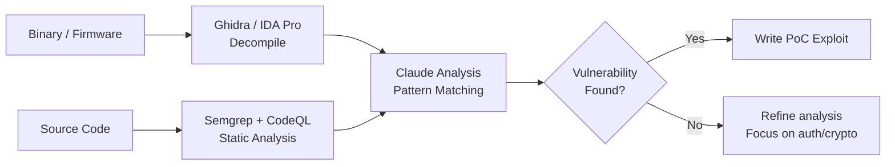

# Zero Day Research Skill

## When to Use
- When standard vulnerability scanning yields no results on a hardened target.
- When the target has open-source components or published source code.
- When you have access to compiled binaries/firmware that need reverse engineering.
- When hunting for vulnerabilities that are NOT in any public database or training data.
- When targeting custom frameworks, proprietary protocols, or internal APIs.

## Prerequisites
- Strong understanding of memory corruption, logic flaws, and authentication patterns
- Source code access (GitHub, GitLab, leaked repos) OR binary analysis tools
- Static analysis tools: Semgrep, CodeQL, Joern
- Binary analysis: Ghidra, IDA Pro, or Radare2
- Claude Code CLI for AI-augmented code review

## Core Concept

> **"We built a Zero Day Research skill using Eugene's book methodology —
> it finds vulnerabilities in source code and binaries that normal training
> data has never seen."**
> — Episode 166

### Why AI + Source Code = Zero Days

AI training data contains known vulnerability patterns. Source code of YOUR target contains
**unique business logic, custom parsers, and proprietary protocols** that no AI has ever analyzed.
When you feed that source code to Claude with the right instructions, Claude finds patterns
similar to known bugs but in never-before-audited code.

```
Known Vuln Pattern (training data): SQL injection via string concatenation
Your Target's Code:                 Custom query builder with template literals
Claude's Finding:                   Template literal injection → zero day
```

## Workflow

### Phase 1: Source Code Acquisition

| Source | How to Obtain | Legal Status |
|--------|---------------|-------------|
| Open-source dependencies | npm, pip, Maven — `package.json` → GitHub | ✅ Public |
| Client-side JavaScript | Browser DevTools → Sources tab → beautify | ✅ Public (delivered to you) |
| Mobile app decompilation | APKTool / jadx (Android), Hopper (iOS) | ⚠️ Check program terms |
| Server-side source maps | `//# sourceMappingURL=` in JS files | ✅ If accessible (misconfig = finding) |
| Git history exposure | `/.git/` directory on web server | ✅ If accessible (misconfig = finding) |
| Binary firmware | Firmware update files from vendor site | ⚠️ Check program terms |

### Phase 2: AI-Augmented Source Code Audit

**The Zero Day Hunting Prompt:**
```
You are a vulnerability researcher performing a source code security audit.

IMPORTANT: Do NOT rely on your training data for known CVEs. The goal is 
to find NEW vulnerabilities that have never been reported.

Analyze the following code for:

1. INJECTION SINKS
   - Any place user input reaches a dangerous function
   - SQL: query builders, raw queries, ORM bypasses
   - Command: exec(), system(), child_process
   - Template: render(), eval(), new Function()
   - Deserialization: JSON.parse() on untrusted data with prototype pollution

2. AUTHENTICATION/AUTHORIZATION FLAWS
   - Missing auth checks on sensitive endpoints
   - Role confusion (admin vs user permissions checked inconsistently)
   - JWT validation gaps (alg:none, key confusion, missing expiry check)
   - Session fixation or predictable session IDs

3. LOGIC FLAWS
   - Race conditions in state transitions (TOCTOU)
   - Integer overflow/underflow in payment or quantity logic
   - Business logic bypass (skip steps in multi-step processes)
   - Negative quantity / negative price attacks

4. INFORMATION DISCLOSURE
   - Hardcoded secrets, API keys, internal URLs
   - Verbose error handling that leaks implementation details
   - Debug endpoints left in production code

5. MEMORY SAFETY (for C/C++/Rust unsafe blocks)
   - Buffer overflow: unchecked array indexing, sprintf(), strcpy()
   - Use-after-free: dangling pointers after deallocation
   - Double-free: same memory freed twice
   - Format string: printf(user_input) without format specifier

For each finding, provide:
- File and line number
- The vulnerable code snippet
- Proof of concept exploitation
- Severity assessment with CVSS 4.0
- Recommended fix with before/after code
```

### Phase 3: Automated Static Analysis Pipeline

```typescript
// scripts/zero-day-scan.ts
#!/usr/bin/env npx tsx

import { execSync } from "child_process";
import { existsSync, readFileSync, writeFileSync } from "fs";

interface ScanResult {
  tool: string;
  file: string;
  line: number;
  rule: string;
  severity: string;
  message: string;
}

// Tier 1: Semgrep (fast, pattern-based)
function runSemgrep(targetDir: string): ScanResult[] {
  try {
    const output = execSync(
      `semgrep --config=auto --json --quiet "${targetDir}" 2>/dev/null`,
      { maxBuffer: 50 * 1024 * 1024 }
    ).toString();
    const data = JSON.parse(output);
    return (data.results || []).map((r: any) => ({
      tool: "semgrep",
      file: r.path,
      line: r.start?.line || 0,
      rule: r.check_id,
      severity: r.extra?.severity || "WARNING",
      message: r.extra?.message || r.check_id,
    }));
  } catch {
    console.warn("[SKIP] Semgrep not available or failed");
    return [];
  }
}

// Tier 2: Custom grep patterns for high-signal sinks
function runCustomPatterns(targetDir: string): ScanResult[] {
  const DANGEROUS_PATTERNS = [
    { pattern: "eval\\(", rule: "code-injection-eval", severity: "HIGH" },
    { pattern: "child_process", rule: "command-injection-sink", severity: "HIGH" },
    { pattern: "dangerouslySetInnerHTML", rule: "xss-react-dangerous", severity: "MEDIUM" },
    { pattern: "document\\.write", rule: "xss-dom-write", severity: "MEDIUM" },
    { pattern: "\\.query\\(.*\\+", rule: "sqli-concatenation", severity: "CRITICAL" },
    { pattern: "JSON\\.parse\\(.*req\\.", rule: "prototype-pollution-risk", severity: "MEDIUM" },
    { pattern: "jwt\\.decode", rule: "jwt-decode-no-verify", severity: "HIGH" },
    { pattern: "password.*=.*[\"']", rule: "hardcoded-credential", severity: "CRITICAL" },
    { pattern: "BEGIN (RSA |EC )?PRIVATE KEY", rule: "exposed-private-key", severity: "CRITICAL" },
    { pattern: "TODO.*hack|FIXME.*security|XXX.*vuln", rule: "dev-security-note", severity: "INFO" },
  ];

  const results: ScanResult[] = [];
  for (const { pattern, rule, severity } of DANGEROUS_PATTERNS) {
    try {
      const output = execSync(
        `rg -n --json "${pattern}" "${targetDir}" --type-add "code:*.{js,ts,py,java,go,rb,php,cs}" --type code 2>/dev/null || true`,
        { maxBuffer: 10 * 1024 * 1024 }
      ).toString();

      for (const line of output.split("\n").filter(Boolean)) {
        try {
          const match = JSON.parse(line);
          if (match.type === "match") {
            results.push({
              tool: "custom-grep",
              file: match.data.path.text,
              line: match.data.line_number,
              rule,
              severity,
              message: match.data.lines.text.trim().substring(0, 200),
            });
          }
        } catch { /* skip malformed lines */ }
      }
    } catch { /* pattern error — skip */ }
  }
  return results;
}

// Main
const targetDir = process.argv[2];
if (!targetDir) {
  console.error("Usage: npx tsx zero-day-scan.ts <source-code-directory>");
  process.exit(1);
}

console.log(`🔬 Zero Day Research Scan: ${targetDir}\n`);

const semgrepResults = runSemgrep(targetDir);
const customResults = runCustomPatterns(targetDir);
const allResults = [...semgrepResults, ...customResults];

// Deduplicate by file+line
const seen = new Set<string>();
const unique = allResults.filter((r) => {
  const key = `${r.file}:${r.line}`;
  if (seen.has(key)) return false;
  seen.add(key);
  return true;
});

// Group by severity
const bySeverity = { CRITICAL: [] as ScanResult[], HIGH: [] as ScanResult[], MEDIUM: [] as ScanResult[], LOW: [] as ScanResult[], INFO: [] as ScanResult[] };
for (const r of unique) {
  (bySeverity[r.severity as keyof typeof bySeverity] || bySeverity.INFO).push(r);
}

console.log(`Results: ${unique.length} potential findings`);
for (const [sev, results] of Object.entries(bySeverity)) {
  if (results.length === 0) continue;
  console.log(`\n--- ${sev} (${results.length}) ---`);
  for (const r of results.slice(0, 10)) {
    console.log(`  ${r.file}:${r.line} [${r.rule}] ${r.message.substring(0, 80)}`);
  }
}

// Save full results
const outputPath = `zero-day-scan-results-${Date.now()}.json`;
writeFileSync(outputPath, JSON.stringify(unique, null, 2));
console.log(`\nFull results saved to: ${outputPath}`);
```

### Phase 4: Binary Analysis Integration

For compiled binaries without source code:

```
Prompt for Claude:
"Analyze this decompiled function output from Ghidra. Look for:
- Buffer overflow via unbounded memcpy/strcpy
- Integer overflow in size calculations
- Use-after-free patterns  
- Format string vulnerabilities
- Weak cryptographic implementations

The function handles user authentication via a custom binary protocol.
[Paste decompiled pseudocode here]"
```

**Tool pipeline:**


## Key Patterns to Hunt

| Pattern | Why It's a Zero Day | Where to Look |
|---------|-------------------|---------------|
| Custom query builders | Not in SQLi training data — unique SQL construction | ORM wrappers, search functions |
| Homegrown auth | No CVE exists for custom auth code | Login, session, token generation |
| Protocol parsers | Custom binary protocols have no scanner signatures | Network handlers, file format parsers |
| State machines | Race conditions in custom workflows | Payment flows, approval chains |
| Crypto implementations | "Don't roll your own crypto" — but people do | Token generation, password hashing |

## Creativity Directive

> **IMPORTANT**: The instructions above are a STARTING POINT.
> Feed Claude entire codebases, not just snippets. Look for architectural
> flaws, not just individual lines. Build custom Semgrep rules for patterns
> unique to the target's tech stack. Chain static analysis findings into
> full exploit chains.
> **Think like an attacker. Adapt. Improvise.**

## 🔴 Red Team
- Extract assets and enumerate endpoints.
- Execute initial payloads leveraging documented vulnerabilities.

## 🔵 Blue Team
- Deploy robust WAF rules to detect anomalies.
- Monitor logs for unusual access patterns.

## 🛡️ Remediation & Mitigation Strategy
- **Input Validation:** Sanitize and strictly type-check all inputs.
- **Least Privilege:** Constrain component execution bounds.

## 🏆 Elite Chaining Strategy (Top 1% Hunter Methodology)
> The Architect Mindset identifies misconfigurations spanning multiple domains.
- Chain info-leaks with SSRF/RCE.
- Maintain absolute OPSEC during active engagement.

## References
- Source: [Critical Thinking Ep. 166](http://www.youtube.com/watch?v=qTX9u-EsjmM)
- Semgrep Rules: [https://semgrep.dev/r](https://semgrep.dev/r)
- CodeQL Queries: [https://codeql.github.com/](https://codeql.github.com/)
- The Web Application Hacker's Handbook (Stuttard & Pinto)
