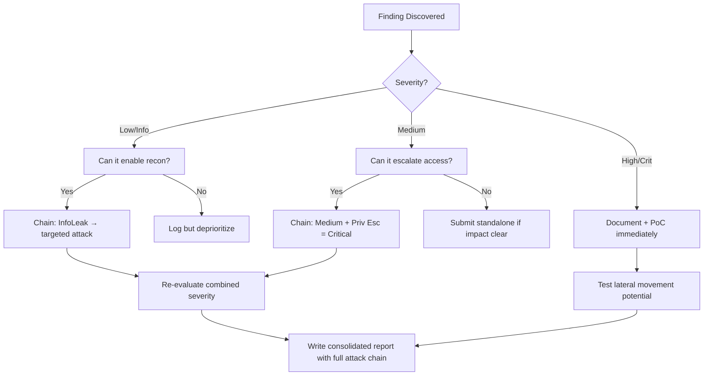

# DOM-Based XSS

## When to Use
- When auditing modern Single Page Applications (SPAs) built with frameworks like React, Angular, or purely complex vanilla JavaScript.
- When searching for client-side vulnerabilities where user input is processed directly in the browser (e.g., via `location.hash`, `window.name`, or `document.referrer`).


## Prerequisites
- Authorized scope and target URLs from bug bounty program
- Burp Suite Professional (or Community) configured with browser proxy
- Familiarity with OWASP Top 10 and common web vulnerability classes
- SecLists wordlists for fuzzing and enumeration

## Workflow

### Phase 1: Understanding DOM XSS

```text
# Concept: DOM XSS ```

### Phase 2: Identifying Sources and Sinks

```text
# Common Sources ```

### Phase 3: Exploitation Examples

```javascript
# Example 1: `document.write` // VULNERABLE CODE let query = new URLSearchParams(window.location.search).get('q');
document.write("Results for: " + query); // SINK

// EXPLOIT target.com/search?q=<script>alert(1)</script>


# Example 2: `innerHTML` VULNERABLE CODE let hash = window.location.hash.slice(1);
document.getElementById('profile').innerHTML = decodeURIComponent(hash); // SINK

// EXPLOIT intelligenty // target.com/#


# Example 3: `eval()` VULNERABLE CODE let data = window.name;
eval("var x = " + data); // SINK

// EXPLOIT superbly // window.name = "1; alert('XSS') //";
// window.location = "http://target.com/vuln";
```

#### Decision Point 🔀
```mermaid
flowchart TD
    A[Map Sources ] --> B{Valid Sink? ]}
    B -->|Yes| C[Craft Payload ]
    B -->|No| D[Find Others ]
    C --> E[Execute ]
```


### 🏆 Elite Chaining Strategy (Top 1% Hunter Methodology)

> **Core Principle**: A single finding is a $500 report. A chained exploit is a $50,000 report.
> The top 1% of hunters spend 40+ hours on a single target, understanding it better than
> the developers who built it. They automate discovery, not exploitation.

**Chaining Decision Tree:**


**Common High-Payout Chains:**
| Chain Pattern | Typical Bounty | Example |
|--|--|--|
| SSRF → Cloud Metadata → IAM Keys | $15,000-$50,000 | Webhook URL → AWS creds → S3 data |
| Open Redirect → OAuth Token Theft | $5,000-$15,000 | Login redirect → steal auth code |
| IDOR + GraphQL Introspection | $3,000-$10,000 | Enumerate users → access any account |
| Race Condition → Financial Impact | $10,000-$30,000 | Duplicate gift cards → unlimited funds |
| XSS → ATO via Cookie Theft | $2,000-$8,000 | Stored XSS on admin page → session hijack |
| Info Disclosure → API Key Reuse | $5,000-$20,000 | JS file → hardcoded API key → admin access |

**The "Architect" vs "Scanner" Mindset:**
- ❌ **Scanner Mindset**: Run nuclei on 10,000 subdomains, submit the first hit → duplicates
- ✅ **Architect Mindset**: Spend 2 weeks mapping ONE application's business logic, RBAC model, 
  and integration seams → find what no scanner ever will

## 🔵 Blue Team Detection & Defense
- **Context-Aware Encoding**: **Safe APIs**: Key Concepts
| Concept | Description |
|---------|-------------|
| DOM Source | |
| DOM Sink | |


## Output Format
```
Dom Based Xss — Assessment Report
============================================================
Target: [Target identifier]
Assessor: [Operator name]
Date: [Assessment date]
Scope: [Authorized scope]
MITRE ATT&CK: [Relevant technique IDs]

Findings Summary:
  [Finding 1]: [Severity] — [Brief description]
  [Finding 2]: [Severity] — [Brief description]

Detailed Results:
  Phase 1: [Phase name]
    - Result: [Outcome]
    - Evidence: [Screenshot/log reference]
    - Impact: [Business impact assessment]

  Phase 2: [Phase name]
    - Result: [Outcome]
    - Evidence: [Screenshot/log reference]
    - Impact: [Business impact assessment]

Risk Rating: [Critical/High/Medium/Low/Informational]
Recommendations:
  1. [Immediate remediation step]
  2. [Long-term hardening measure]
  3. [Monitoring/detection improvement]
```


### 📝 Elite Report Writing (Top 1% Standard)

> **"The difference between a $500 and $50,000 report is the quality of the writeup."**
> — Vickie Li, Bug Bounty Bootcamp

**Title Format**: `[VulnType] in [Component] Allows [BusinessImpact]`
- ❌ "XSS Found" → This tells the triager nothing
- ✅ "Stored XSS in /admin/comments Allows Session Hijacking of All Moderators"

**Report Structure (HackerOne-Optimized):**
1. **Summary** (2-4 sentences — triager reads only this first): What broke, how, worst-case.
2. **CVSS 4.0 Vector** — Must be defensible; wrong CVSS destroys credibility.
3. **Attack Scenario** — 3-5 sentence narrative from attacker's perspective.
4. **Impact** — MUST include at least one real number: "Affects 4.2M users" not "affects many users".
5. **Steps to Reproduce** — Deterministic. A junior dev who has never seen this bug reproduces it exactly.
6. **PoC** — Copy-paste runnable. No placeholders. Match the exact HTTP method.
7. **Remediation** — Don't say "sanitize input." Give the exact code fix, before/after.
8. **CWE + References** — SSRF→CWE-918, IDOR→CWE-639, SQLi→CWE-89, XSS→CWE-79.

**Pre-Report Verification (5 Checks):**
1. 🔍 **Hallucination Detector** — Verify endpoints, CVEs, and code paths are real
2. 🤖 **AI Writing Pattern Check** — Remove "Certainly!", "It's worth noting", generic phrasing
3. 🧪 **PoC Reproducibility** — Payload syntax valid for context? Prerequisites stated?
4. 📋 **Duplicate Detection** — Is this a scanner-generic finding? Known public disclosure?
5. 📈 **Impact Plausibility** — Severity matches technical capability? No inflation?


## 💰 Real-World Disclosed Bounties (XSS)

| Company | Bounty | Researcher | Technique | Year |
|---------|--------|-----------|-----------|------|
| **Google (IDX)** | $22,500 | Aditya Sunny | XSS in IDX Workstation via `postMessage` origin bypass → RCE | 2025 |
| **Uber** | $10,000 | (Undisclosed) | DOM XSS via `eval()` in third-party `analytics.js` — URL parameter injection | 2025 |
| **Uber** | $7,000 | (Undisclosed) | XSS via improper regex in third-party JavaScript | 2023 |
| **Google** | $5,000 | Patrik Fehrenbach | Sleeping Stored XSS — payload executed days after injection | 2023 |
| **Shopify** | $5,300 | Ashketchum | Stored XSS in admin panel Rich Text Editor — product descriptions | 2025 |
| **Shopify** | $500 | (Undisclosed) | Reflected XSS on `help.shopify.com` via `returnTo` parameter | 2023 |
| **HackerOne** | (Disclosed) | frans | Marketo Forms XSS — postMessage frame-jumping + jQuery-JSONP | 2023 |

**Key Lesson**: The Google IDX bug shows why XSS escalation matters — a "simple" XSS became
$22,500 because the researcher chained it with `postMessage` origin flaws to achieve RCE.
Shopify's $5,300 Stored XSS in admin RTE proves stored contexts on internal pages pay 10x more.

**What the triager wants to see:**
```
Title: Stored XSS in /admin/products Rich Text Editor Allows Session Hijacking of All Staff
NOT: "XSS Found"
```

## 🔴 Red Team
- Extract assets and enumerate endpoints.
- Execute initial payloads leveraging documented vulnerabilities.

## References
- PortSwigger: [DOM-based XSS](https://portswigger.net/web-security/cross-site-scripting/dom-based)
- OWASP: [DOM based XSS Prevention Cheat Sheet](https://cheatsheetseries.owasp.org/cheatsheets/DOM_based_XSS_Prevention_Cheat_Sheet.html)
