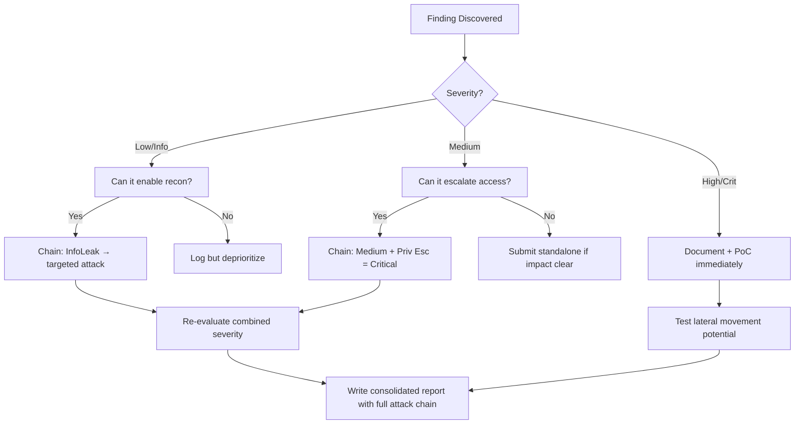

# GraphQL Introspection Abuse

## When to Use
- Whenever you encounter a GraphQL endpoint (often `/graphql`, `/api/graphql`, `/v1/graphql`) during a web penetration test or bug bounty.
- When you need to systematically map out a complex API backend, finding administrative mutations or hidden fields not exposed by the front-end application.


## Prerequisites
- Authorized scope and target URLs from bug bounty program
- Burp Suite Professional (or Community) configured with browser proxy
- Familiarity with OWASP Top 10 and common web vulnerability classes
- SecLists wordlists for fuzzing and enumeration

## Workflow

### Phase 1: Identifying GraphQL

```text
# Concept: 1. ```

### Phase 2: The Introspection Query

```graphql
# Concept: query IntrospectionQuery {
  __schema {
    queryType { name }
    mutationType { name }
    subscriptionType { name }
    types {
      ...FullType
    }
    directives {
      name
      description
      locations
      args {
        ...InputValue
      }
    }
  }
}

fragment FullType on __Type {
  kind
  name
  description
  fields(includeDeprecated: true) {
    name
    description
    args {
      ...InputValue
    }
    type {
      ...TypeRef
    }
    isDeprecated
    deprecationReason
  }
  inputFields {
    ...InputValue
  }
  interfaces {
    ...TypeRef
  }
  enumValues(includeDeprecated: true) {
    name
    description
    isDeprecated
    deprecationReason
  }
  possibleTypes {
    ...TypeRef
  }
}

fragment InputValue on __InputValue {
  name
  description
  type { ...TypeRef }
  defaultValue
}

fragment TypeRef on __Type {
  kind
  name
  ofType {
    kind
    name
    ofType {
      kind
      name
      ofType {
        kind
        name
        ofType {
          kind
          name
          ofType {
            kind
            name
            ofType {
              kind
              name
              ofType {
                kind
                name
              }
            }
          }
        }
      }
    }
  }
}
```

### Phase 3: Analyzing the Schema

```text
# 1. 2. 3. ```

#### Decision Point 🔀
```mermaid
flowchart TD
    A[Send Introspection superbly ] --> B{Data ]}
    B -->|Yes| C[Visualize ]
    B -->|No| D[Brute properly ]
    C --> E[Test ]
```


### 🏆 Elite Chaining Strategy (Top 1% Hunter Methodology)

> **Core Principle**: A single finding is a $500 report. A chained exploit is a $50,000 report.
> The top 1% of hunters spend 40+ hours on a single target, understanding it better than
> the developers who built it. They automate discovery, not exploitation.

**Chaining Decision Tree:**


**Common High-Payout Chains:**
| Chain Pattern | Typical Bounty | Example |
|--|--|--|
| SSRF → Cloud Metadata → IAM Keys | $15,000-$50,000 | Webhook URL → AWS creds → S3 data |
| Open Redirect → OAuth Token Theft | $5,000-$15,000 | Login redirect → steal auth code |
| IDOR + GraphQL Introspection | $3,000-$10,000 | Enumerate users → access any account |
| Race Condition → Financial Impact | $10,000-$30,000 | Duplicate gift cards → unlimited funds |
| XSS → ATO via Cookie Theft | $2,000-$8,000 | Stored XSS on admin page → session hijack |
| Info Disclosure → API Key Reuse | $5,000-$20,000 | JS file → hardcoded API key → admin access |

**The "Architect" vs "Scanner" Mindset:**
- ❌ **Scanner Mindset**: Run nuclei on 10,000 subdomains, submit the first hit → duplicates
- ✅ **Architect Mindset**: Spend 2 weeks mapping ONE application's business logic, RBAC model, 
  and integration seams → find what no scanner ever will

## 🔵 Blue Team Detection & Defense
- **Disable Introspection in Production**: **Rate Limiting and Query Cost Analysis**: Key Concepts
| Concept | Description |
|---------|-------------|
| GraphQL | |
| Schema | |


## Output Format
```
Graphql Introspection Abuse — Assessment Report
============================================================
Target: [Target identifier]
Assessor: [Operator name]
Date: [Assessment date]
Scope: [Authorized scope]
MITRE ATT&CK: [Relevant technique IDs]

Findings Summary:
  [Finding 1]: [Severity] — [Brief description]
  [Finding 2]: [Severity] — [Brief description]

Detailed Results:
  Phase 1: [Phase name]
    - Result: [Outcome]
    - Evidence: [Screenshot/log reference]
    - Impact: [Business impact assessment]

  Phase 2: [Phase name]
    - Result: [Outcome]
    - Evidence: [Screenshot/log reference]
    - Impact: [Business impact assessment]

Risk Rating: [Critical/High/Medium/Low/Informational]
Recommendations:
  1. [Immediate remediation step]
  2. [Long-term hardening measure]
  3. [Monitoring/detection improvement]
```


### 📝 Elite Report Writing (Top 1% Standard)

> **"The difference between a $500 and $50,000 report is the quality of the writeup."**
> — Vickie Li, Bug Bounty Bootcamp

**Title Format**: `[VulnType] in [Component] Allows [BusinessImpact]`
- ❌ "XSS Found" → This tells the triager nothing
- ✅ "Stored XSS in /admin/comments Allows Session Hijacking of All Moderators"

**Report Structure (HackerOne-Optimized):**
1. **Summary** (2-4 sentences — triager reads only this first): What broke, how, worst-case.
2. **CVSS 4.0 Vector** — Must be defensible; wrong CVSS destroys credibility.
3. **Attack Scenario** — 3-5 sentence narrative from attacker's perspective.
4. **Impact** — MUST include at least one real number: "Affects 4.2M users" not "affects many users".
5. **Steps to Reproduce** — Deterministic. A junior dev who has never seen this bug reproduces it exactly.
6. **PoC** — Copy-paste runnable. No placeholders. Match the exact HTTP method.
7. **Remediation** — Don't say "sanitize input." Give the exact code fix, before/after.
8. **CWE + References** — SSRF→CWE-918, IDOR→CWE-639, SQLi→CWE-89, XSS→CWE-79.

**Pre-Report Verification (5 Checks):**
1. 🔍 **Hallucination Detector** — Verify endpoints, CVEs, and code paths are real
2. 🤖 **AI Writing Pattern Check** — Remove "Certainly!", "It's worth noting", generic phrasing
3. 🧪 **PoC Reproducibility** — Payload syntax valid for context? Prerequisites stated?
4. 📋 **Duplicate Detection** — Is this a scanner-generic finding? Known public disclosure?
5. 📈 **Impact Plausibility** — Severity matches technical capability? No inflation?


## 💰 Real-World Disclosed Bounties (GraphQL)

| Company | Bounty | Researcher | Technique | Year |
|---------|--------|-----------|-----------|------|
| **Facebook/Instagram** | $30,000 | (Undisclosed) | GraphQL IDOR — brute-force media IDs → expose private content | 2023 |
| **Shopify** | $5,000 | (Undisclosed) | GraphQL `BillingDocumentDownload` — predictable invoice IDs | 2024 |
| **GitLab** | $1,160 | (Undisclosed) | GraphQL `Ml::Model` — incremental IDs → access all private ML models | 2024 |

**Key Lesson**: GraphQL APIs are consistently vulnerable to IDOR because developers expose 
introspection in production and use predictable IDs. The Facebook $30K payout proves GraphQL 
IDOR can be Critical-severity when it exposes private user content at scale.

**The GraphQL attack checklist that finds real bugs:**
```graphql
# 1. Always try introspection first
{ __schema { types { name fields { name type { name } } } } }

# 2. Look for mutations that accept user-controlled IDs
mutation { updateUser(id: "VICTIM_ID", role: "admin") { id role } }

# 3. Test batching for rate-limit bypass
[{"query": "mutation { login(email:\"a@b.com\", pass:\"pass1\") { token } }"},
 {"query": "mutation { login(email:\"a@b.com\", pass:\"pass2\") { token } }"}]
```

## 🔴 Red Team
- Extract assets and enumerate endpoints.
- Execute initial payloads leveraging documented vulnerabilities.

## References
- HackerOne: [How to exploit GraphQL](https://www.hackerone.com/ethical-hacker/how-exploit-graphql)
- PayloadAllTheThings: [GraphQL Injection](https://github.com/swisskyrepo/PayloadsAllTheThings/tree/master/GraphQL%20Injection)
- PortSwigger: [GraphQL API vulnerabilities](https://portswigger.net/web-security/graphql)
