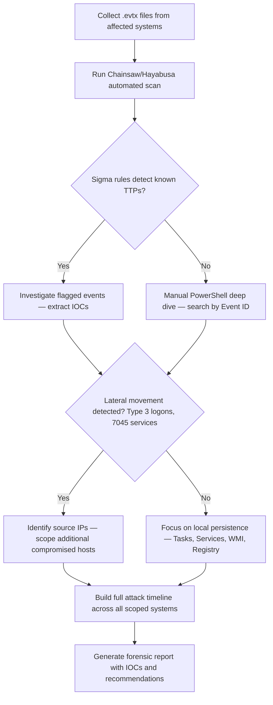

# Windows Event Logs Analysis

## When to Use
- When responding to a security incident involving compromised Windows systems.
- When performing threat hunting across Active Directory environments for signs of lateral movement.
- When conducting post-breach forensic analysis to reconstruct attacker activity timeline.
- When investigating suspected credential theft (Pass-the-Hash, Kerberoasting, DCSync).
- When analyzing persistence mechanisms (services, scheduled tasks, WMI subscriptions).

**When NOT to use**: For Linux/macOS log analysis, use appropriate syslog/auditd skills. For memory forensics, use `volatility-memory-forensics`.

## Prerequisites
- Access to Windows Event Log files (.evtx) — either live system or acquired forensic images
- Chainsaw, Hayabusa, or EvtxECmd for automated parsing
- Sigma rules repository for threat detection
- PowerShell 5.1+ for manual investigation
- Sysmon installed (recommended for enhanced logging)

## Workflow

### Phase 1: Understanding Critical Event IDs

```text
# === AUTHENTICATION EVENTS (Security.evtx) ===
Event ID 4624 — Successful Logon
  Logon Type 2:  Interactive (physical keyboard/KVM)
  Logon Type 3:  Network (SMB share access, PSExec, WMI)
  Logon Type 7:  Unlock (screen unlock)
  Logon Type 9:  NewCredentials (RunAs /netonly — creds used for remote access)
  Logon Type 10: RemoteInteractive (RDP)

Event ID 4625 — Failed Logon (brute force indicator)
  Watch for: Multiple 4625 followed by 4624 = successful brute force

Event ID 4648 — Explicit Credential Logon (RunAs, PassTheHash indicator)

Event ID 4672 — Special Privileges Assigned (admin/SYSTEM logon)
  Alert: When unexpected users receive SeDebugPrivilege, SeTcbPrivilege

Event ID 4776 — NTLM Authentication (local SAM validation)
  Watch for: "Error Code: 0xC0000064" = username doesn't exist
  Watch for: "Error Code: 0xC000006A" = bad password

# === KERBEROS EVENTS (Security.evtx) ===
Event ID 4768 — TGT Request (AS-REQ)
  AS-REProast indicator: Encryption type 0x17 (RC4) for accounts with SPN

Event ID 4769 — Service Ticket Request (TGS-REQ)
  Kerberoasting indicator: Encryption type 0x17 (RC4) targeting service accounts

Event ID 4771 — Kerberos Pre-Auth Failed
  Password spray indicator: Multiple failures across different accounts

# === PROCESS & EXECUTION EVENTS ===
Event ID 4688 — New Process Created (Security.evtx)
  Enable "Include command line in process creation events" GPO
  Watch for: powershell.exe -enc, cmd.exe /c, wmic, certutil, bitsadmin

Sysmon Event ID 1 — Process Creation (detailed command line + hashes)
  Gold standard for process tracking — includes ParentImage, Hashes, User

# === LATERAL MOVEMENT INDICATORS ===
Event ID 7045 — New Service Installed (System.evtx)
  PSExec indicator: Service name "PSEXESVC" with ImagePath pointing to remote executable
  Watch for: Services with random names, Base64 in service paths

Event ID 5140 — Network Share Accessed (Security.evtx)
  Watch for: \\*\ADMIN$, \\*\C$, \\*\IPC$ access from unexpected sources

Event ID 5145 — Network Share Object Access (detailed file-level access)

# === PERSISTENCE INDICATORS ===
Event ID 4698 — Scheduled Task Created (Security.evtx)
Event ID 4699 — Scheduled Task Deleted
Sysmon Event ID 19/20/21 — WMI Event Filter/Consumer/Binding created
Event ID 7040 — Service startup type changed (auto-start persistence)

# === POWERSHELL LOGGING ===
Event ID 4104 — Script Block Logging (PowerShell/Operational)
  Captures deobfuscated script content — PRIMARY forensic source
Event ID 4103 — Module Logging
Event ID 400/403 — PowerShell engine start/stop
```

### Phase 2: Rapid Triage with Automated Tools

```bash
# === CHAINSAW — Sigma-based hunting ===
# Concept: Rapidly scan thousands of .evtx files against community Sigma rules.

# 1. Download and run Chainsaw with Sigma rules
git clone https://github.com/WithSecureLabs/chainsaw.git
git clone https://github.com/SigmaHQ/sigma.git

# 2. Run full hunt across all collected .evtx files
chainsaw hunt C:\Forensics\EVTX\ \
  --sigma sigma/rules/ \
  --mapping sigma/tools/config/generic/windows-audit.yml \
  --csv output_chainsaw/ \
  --full

# 3. Search for specific IOCs
chainsaw search "mimikatz" -i C:\Forensics\EVTX\ --timestamp
chainsaw search "vssadmin" -i C:\Forensics\EVTX\ --timestamp
chainsaw search "PSEXESVC" -i C:\Forensics\EVTX\ --timestamp
chainsaw search "certutil" -i C:\Forensics\EVTX\ --timestamp

# === HAYABUSA — Timeline-based analysis ===
# Concept: Creates a forensic timeline from Windows event logs.

# 4. Generate CSV timeline
hayabusa csv-timeline \
  -d C:\Forensics\EVTX\ \
  -o timeline.csv \
  --RFC-3339

# 5. Generate summary metrics
hayabusa metrics -d C:\Forensics\EVTX\

# 6. Detect logon anomalies
hayabusa logon-summary -d C:\Forensics\EVTX\ -o logon_summary.csv

# === EVTXECMD (Eric Zimmerman) ===
# 7. Parse specific log files with custom maps
EvtxECmd.exe -d C:\Forensics\EVTX\ --csv C:\Forensics\output\ --csvf parsed_logs.csv
# Open parsed_logs.csv in Timeline Explorer for visual analysis
```

### Phase 3: Targeted PowerShell Deep Dive

```powershell
# === LATERAL MOVEMENT DETECTION ===

# 1. Find Network Logons (Type 3) — indicates SMB/WMI/PSExec lateral movement
Get-WinEvent -FilterHashtable @{LogName='Security'; Id=4624} |
  Where-Object { $_.Properties[8].Value -eq 3 } |
  Select-Object TimeCreated,
    @{N='TargetUser'; E={$_.Properties[5].Value}},
    @{N='SourceIP'; E={$_.Properties[18].Value}},
    @{N='SourceHost'; E={$_.Properties[11].Value}},
    @{N='LogonProcess'; E={$_.Properties[9].Value}} |
  Sort-Object TimeCreated |
  Format-Table -AutoSize

# 2. Find RDP Logons (Type 10) — remote desktop connections
Get-WinEvent -FilterHashtable @{LogName='Security'; Id=4624} |
  Where-Object { $_.Properties[8].Value -eq 10 } |
  Select-Object TimeCreated,
    @{N='TargetUser'; E={$_.Properties[5].Value}},
    @{N='SourceIP'; E={$_.Properties[18].Value}} |
  Format-Table -AutoSize

# === SERVICE INSTALLATION (PSExec / Persistence) ===

# 3. Find newly installed services — key lateral movement indicator
Get-WinEvent -FilterHashtable @{LogName='System'; Id=7045} |
  Select-Object TimeCreated,
    @{N='ServiceName'; E={$_.Properties[0].Value}},
    @{N='ImagePath'; E={$_.Properties[1].Value}},
    @{N='ServiceType'; E={$_.Properties[2].Value}},
    @{N='StartType'; E={$_.Properties[3].Value}},
    @{N='AccountName'; E={$_.Properties[4].Value}} |
  Format-Table -AutoSize

# === CREDENTIAL THEFT DETECTION ===

# 4. Find Kerberoasting (TGS requests with RC4 encryption)
Get-WinEvent -FilterHashtable @{LogName='Security'; Id=4769} |
  Where-Object { $_.Properties[5].Value -eq '0x17' } | # RC4 = Kerberoasting
  Select-Object TimeCreated,
    @{N='TargetUser'; E={$_.Properties[0].Value}},
    @{N='ServiceName'; E={$_.Properties[2].Value}},
    @{N='ClientIP'; E={$_.Properties[6].Value}} |
  Format-Table -AutoSize

# 5. Detect DCSync (Replication requests from non-DC sources)
Get-WinEvent -FilterHashtable @{LogName='Security'; Id=4662} |
  Where-Object {
    $_.Properties[8].Value -match '1131f6ad-9c07-11d1-f79f-00c04fc2dcd2' -or  # DS-Replication-Get-Changes-All
    $_.Properties[8].Value -match '1131f6aa-9c07-11d1-f79f-00c04fc2dcd2'       # DS-Replication-Get-Changes
  } |
  Select-Object TimeCreated,
    @{N='SubjectUser'; E={$_.Properties[1].Value}},
    @{N='ObjectName'; E={$_.Properties[6].Value}} |
  Format-Table -AutoSize

# === POWERSHELL FORENSICS ===

# 6. Extract all PowerShell Script Block Logging content
Get-WinEvent -FilterHashtable @{LogName='Microsoft-Windows-PowerShell/Operational'; Id=4104} |
  Select-Object TimeCreated,
    @{N='ScriptBlock'; E={$_.Properties[2].Value}} |
  Where-Object { $_.ScriptBlock -match 'Invoke-|IEX|DownloadString|EncodedCommand|-enc ' } |
  Format-List

# === SCHEDULED TASK FORENSICS ===

# 7. Find created scheduled tasks
Get-WinEvent -FilterHashtable @{LogName='Security'; Id=4698} |
  Select-Object TimeCreated,
    @{N='Creator'; E={$_.Properties[1].Value}},
    @{N='TaskName'; E={$_.Properties[4].Value}},
    @{N='TaskContent'; E={$_.Properties[5].Value}} |
  Format-Table -AutoSize
```

### Phase 4: Building the Attack Timeline

```powershell
# Concept: Correlate events across multiple log sources to reconstruct
# the attacker's full kill chain timeline.

# 1. Export all relevant events with timestamps to CSV
$LogSources = @(
    @{LogName='Security'; Id=@(4624,4625,4648,4672,4768,4769,4688,4698,5140,5145)},
    @{LogName='System'; Id=@(7045,7040)},
    @{LogName='Microsoft-Windows-PowerShell/Operational'; Id=@(4104,4103)}
)

$AllEvents = @()
foreach ($source in $LogSources) {
    $events = Get-WinEvent -FilterHashtable $source -ErrorAction SilentlyContinue
    $AllEvents += $events
}

$AllEvents |
  Sort-Object TimeCreated |
  Select-Object TimeCreated, LogName, Id, Message |
  Export-Csv -Path "C:\Forensics\attack_timeline.csv" -NoTypeInformation

# 2. Identify the initial compromise point (earliest suspicious event)
$AllEvents |
  Sort-Object TimeCreated |
  Select-Object -First 20 TimeCreated, LogName, Id, @{N='Summary';E={$_.Message.Substring(0,100)}} |
  Format-Table -AutoSize
```

#### Decision Point 🔀


## 🔵 Blue Team Detection & Defense

### Proactive Logging Configuration
- **Enable PowerShell Script Block Logging**: `GPO → Computer Configuration → Administrative Templates → Windows Components → Windows PowerShell → Turn on PowerShell Script Block Logging`
- **Enable Process Command Line Auditing**: `GPO → Computer Configuration → Administrative Templates → System → Audit Process Creation → Include command line in process creation events`
- **Deploy Sysmon**: Install with SwiftOnSecurity or Olaf Hartong config for comprehensive endpoint telemetry
- **Forward to SIEM**: Configure Windows Event Forwarding (WEF) or agent-based collection to centralize logs

### Critical Alerts to Configure
- Multiple 4625 (failed logons) followed by 4624 (success) from same source = brute force
- 4769 with encryption type 0x17 from non-service accounts = Kerberoasting
- 7045 with PSEXESVC or random service names = lateral movement
- 4672 for unexpected users receiving SeDebugPrivilege = privilege escalation attempt
- 4698 (scheduled task) with encoded commands or remote URLs = persistence

## Key Concepts
| Concept | Description |
|---------|-------------|
| Event ID 4624 | Successful logon event — LogonType field reveals HOW the logon occurred (interactive, network, RDP, etc.) |
| Event ID 7045 | New service installation — critical indicator for PSExec and other lateral movement tools that install services |
| Event ID 4769 | Kerberos TGS request — encryption type 0x17 (RC4) indicates potential Kerberoasting attack |
| Event ID 4104 | PowerShell Script Block Logging — captures the actual deobfuscated content of executed scripts |
| Sysmon | Microsoft Sysinternals tool providing enhanced process, network, and file system telemetry beyond native Windows logging |
| Sigma Rules | Vendor-agnostic detection format used by Chainsaw/Hayabusa to match known attack patterns in event logs |
| LogonType 3 | Network logon via SMB — primary indicator of lateral movement via PSExec, WMI, or mapped drives |
| DCSync | Active Directory attack replicating domain credentials by abusing DS-Replication permissions (Event ID 4662) |

## Output Format
```
Forensic Analysis Report — Windows Event Log Investigation
============================================================
Incident: Suspected Active Directory Compromise
Systems Analyzed: DC01, FS01, WS-ADMIN-PC (3 systems, 247 .evtx files)
Analysis Period: 2024-01-15 02:00 UTC — 2024-01-17 18:00 UTC

Timeline of Attacker Activity:
  2024-01-15 02:14 — Initial access via RDP (4624/Type 10) from 185.x.x.x → WS-ADMIN-PC
  2024-01-15 02:18 — Mimikatz execution detected (4104 Script Block + Sysmon ID 1)
  2024-01-15 02:22 — Credential dump: lsass.exe accessed (Sysmon ID 10)
  2024-01-15 03:01 — Lateral movement: Type 3 logon WS-ADMIN-PC → FS01 (NTLM auth)
  2024-01-15 03:02 — Service installed on FS01: "PSEXESVC" (7045)
  2024-01-15 03:15 — Kerberoasting detected: RC4 TGS requests (4769) for svc_backup
  2024-01-16 01:00 — DCSync replication (4662) from WS-ADMIN-PC (non-DC source)
  2024-01-16 01:05 — Golden Ticket likely created (no further 4768 TGT requests)

IOCs Extracted:
  Source IPs: 185.x.x.x (external), 10.0.1.50 (WS-ADMIN-PC internal)
  Compromised Accounts: admin_jsmith, svc_backup, krbtgt (DCSync)
  Tools Detected: Mimikatz, PSExec, SharpHound

Recommendations:
  1. Reset krbtgt password TWICE (Golden Ticket invalidation)
  2. Reset all compromised account passwords
  3. Block external RDP access, enforce MFA
  4. Deploy Sysmon with enhanced configuration
  5. Enable PowerShell Constrained Language Mode
```

## 🔴 Red Team
- Extract assets and enumerate endpoints.
- Execute initial payloads leveraging documented vulnerabilities.

## 🛡️ Remediation & Mitigation Strategy
- **Input Validation:** Sanitize and strictly type-check all inputs.
- **Least Privilege:** Constrain component execution bounds.

## 🏆 Elite Chaining Strategy (Top 1% Hunter Methodology)
> The Architect Mindset identifies misconfigurations spanning multiple domains.
- Chain info-leaks with SSRF/RCE.
- Maintain absolute OPSEC during active engagement.

## 🏁 Execution Phase (Steps to Reproduce)
1. Perform target reconnaissance.
2. Formulate payload based on endpoints.
3. Execute the exploit and capture exfiltrated data.

**Severity Profile:** High (CVSS: 8.5)

## References
- SANS: [Windows Logon Forensics Cheat Sheet (PDF)](https://www.sans.org/posters/windows-forensic-analysis/)
- Microsoft: [Security Audit Events Reference](https://learn.microsoft.com/en-us/windows/security/threat-protection/auditing/advanced-security-audit-policy-settings)
- Chainsaw: [Rapid Event Log Parsing](https://github.com/WithSecureLabs/chainsaw)
- Hayabusa: [Windows Event Log Timeline Generator](https://github.com/Yamato-Security/hayabusa)
- SwiftOnSecurity: [Sysmon Configuration](https://github.com/SwiftOnSecurity/sysmon-config)
- JPCERT/CC: [LogonTracer — AD Log Visualizer](https://github.com/JPCERTCC/LogonTracer)
