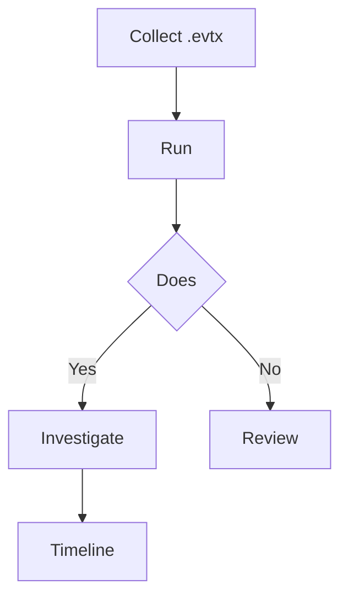

# Windows Event Logs Analysis

## When to Use
- When responding To To Workflow

### Phase 1: Understanding Crucial Event IDs (The Blueprint)

```text
# Concept: Windows Authentication 4624 (Security): Type 2: Type 3: Type 9: 4625 (Security): 4769 (Security): Privilege 4672 (Security): 4720 (Security): Execution 4688 (Security): Event ID 1 (Sysmon): Lateral 7045 (System): 5140/5145 (Security): ```

### Phase 2: Rapid Triage using Chainsaw

```bash
# Concept: 1. chainsaw hunt C:\Forensics\EVTX\ -s sigma\rules\ -m sigma\mapping_files\windows_event_log_mapping.yml --csv output_chainsaw

# 2. chainsaw search "vssadmin" -i C:\Forensics\EVTX\
```

### Phase 3: Targeted PowerShell Deep Dive

```powershell
# Concept: 1. Get-WinEvent -FilterHashtable @{LogName='Security';Id=4624} | Where-Object {$_.Properties[8].Value -eq 3} | Select-Object TimeCreated, @{N='User';E={$_.Properties[5].Value}}, @{N='Source';E={$_.Properties[18].Value}}

# 2. Get-WinEvent -FilterHashtable @{LogName='System';Id=7045} | Select-Object TimeCreated, @{N='ServiceName';E={$_.Properties[0].Value}}, @{N='ServiceFile';E={$_.Properties[1].Value}}
```

#### Decision Point 🔀


## References
- SANS: [Windows Logon Forensics (PDF)](https://www.sans.org/reading-room/whitepapers/forensics/windows-logon-forensics-34132)
- Microsoft: [Security Audit Events](https://learn.microsoft.com/en-us/windows/security/threat-protection/auditing/advanced-security-audit-policy-settings)
- Chainsaw: [Rapid Event Log Parsing](https://github.com/WithSecureLabs/chainsaw)
