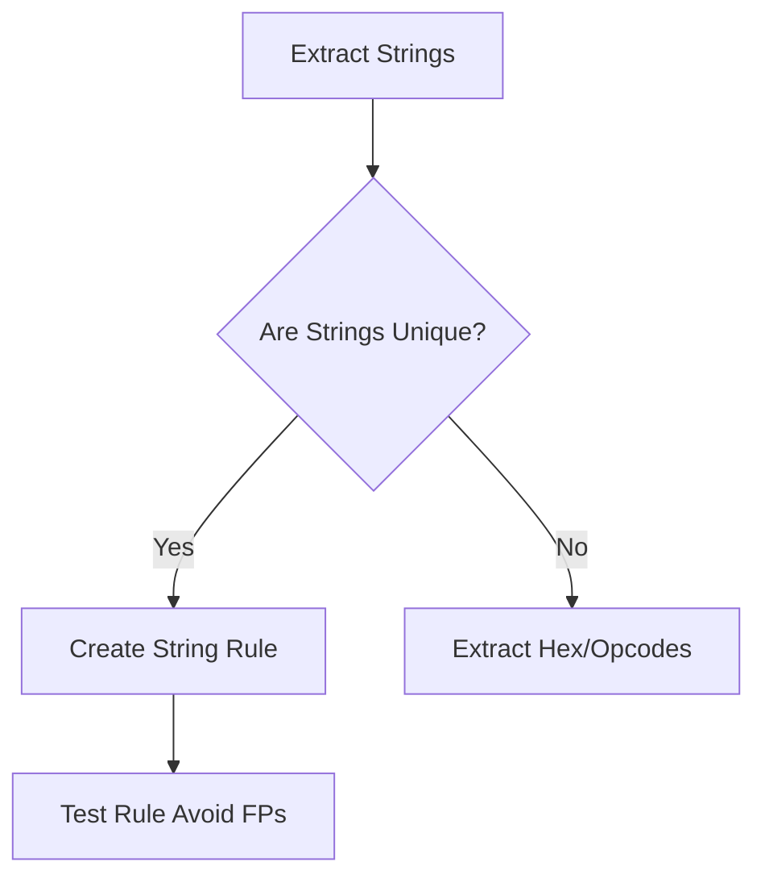

# YARA Rule Writing for Malware Detection

## When to Use
- When performing incident response and you need to scan the entire environment for indicators of compromise (IoCs) related to a specific malware family.
- After extracting unique string patterns, mutexes, paths, or code blocks from a malware sample during static/dynamic analysis.


## Prerequisites
- Authorized scope and rules of engagement for the target environment
- Appropriate tools installed on the attack/analysis platform
- Understanding of the target technology stack and architecture
- Documentation template ready for findings and evidence capture

## Workflow

### Phase 1: Understanding Basic YARA Structure

```yara
# Concept: Rule syntax rule Basic_Ransomware_Detection {
    meta:
        description = "Detects generic ransomware strings"
        author = "CyberSkills"
        date = "2024-05-10"
    
    strings:
        $s1 = "Your files have been encrypted" ascii wide nocase
        $s2 = "比特币" // Bitcoin in Chinese (UTF-8)
        $s3 = "vssadmin.exe Delete Shadows /All /Quiet" ascii wide
        
    condition:
        2 of them
}
```

### Phase 2: Utilizing Hexadecimal Signatures

```yara
# rule Emotet_Hex_Pattern {
    meta:
        description = "Detects Emotet unpacking loop pattern"

    strings:
        // 8B 45 ?? 03 45 ?? 50 FF 15
        $hex_pattern = { 8B 45 ?? 03 45 ?? 50 FF 15 [4] }
        
    condition:
        $hex_pattern
}
```

### Phase 3: Leveraging the PE Module (Windows Executables)

```yara
# import module import "pe"

rule Suspicious_Document_Icon {
    meta:
        description = "Executable disguised as PDF/Word doc"
        
    condition:
        uint16(0) == 0x5a4d and // MZ header
        pe.number_of_resources > 0 and 
        (
            pe.version_info["OriginalFilename"] contains ".pdf" or
            pe.version_info["OriginalFilename"] contains ".docx"
        )
}
```

### Phase 4: Validating and Executing the Scan

```bash
# yara -r my_rules.yar /path/to/suspicious/files/
```

#### Decision Point 🔀


## 🔵 Blue Team Detection & Defense
- **Continuous Integration for Rules**: **Avoid False Positives**: **Performance Tuning**: Key Concepts
| Concept | Description |
|---------|-------------|
| Wildcards & Jumps in Hex | |
| Condition Logic | |


## Output Format
```
Yara Rule Writing Malware — Assessment Report
============================================================
Target: [Target identifier]
Assessor: [Operator name]
Date: [Assessment date]
Scope: [Authorized scope]
MITRE ATT&CK: [Relevant technique IDs]

Findings Summary:
  [Finding 1]: [Severity] — [Brief description]
  [Finding 2]: [Severity] — [Brief description]

Detailed Results:
  Phase 1: [Phase name]
    - Result: [Outcome]
    - Evidence: [Screenshot/log reference]
    - Impact: [Business impact assessment]

  Phase 2: [Phase name]
    - Result: [Outcome]
    - Evidence: [Screenshot/log reference]
    - Impact: [Business impact assessment]

Risk Rating: [Critical/High/Medium/Low/Informational]
Recommendations:
  1. [Immediate remediation step]
  2. [Long-term hardening measure]
  3. [Monitoring/detection improvement]
```

## 🔴 Red Team
- Extract assets and enumerate endpoints.
- Execute initial payloads leveraging documented vulnerabilities.

## 🏆 Elite Chaining Strategy (Top 1% Hunter Methodology)
> The Architect Mindset identifies misconfigurations spanning multiple domains.
- Chain info-leaks with SSRF/RCE.
- Maintain absolute OPSEC during active engagement.

## 🏁 Execution Phase (Steps to Reproduce)
1. Perform target reconnaissance.
2. Formulate payload based on endpoints.
3. Execute the exploit and capture exfiltrated data.

**Severity Profile:** High (CVSS: 8.5)

## References
- YARA Documentation: [Writing YARA rules](https://yara.readthedocs.io/en/stable/writingrules.html)
- Kaspersky: [YARA Rule Writing Tips](https://securelist.com/yara-rules/86170/)
